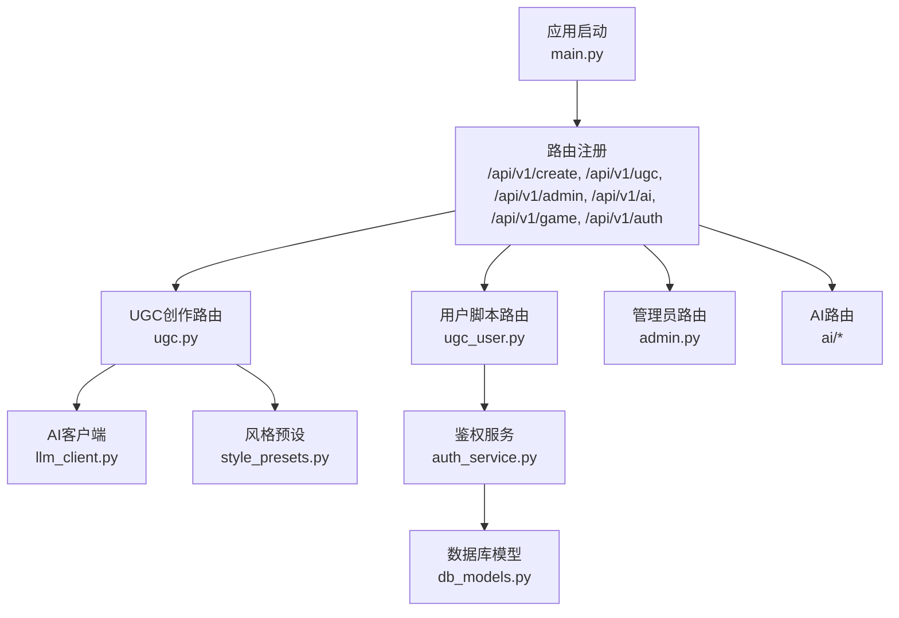
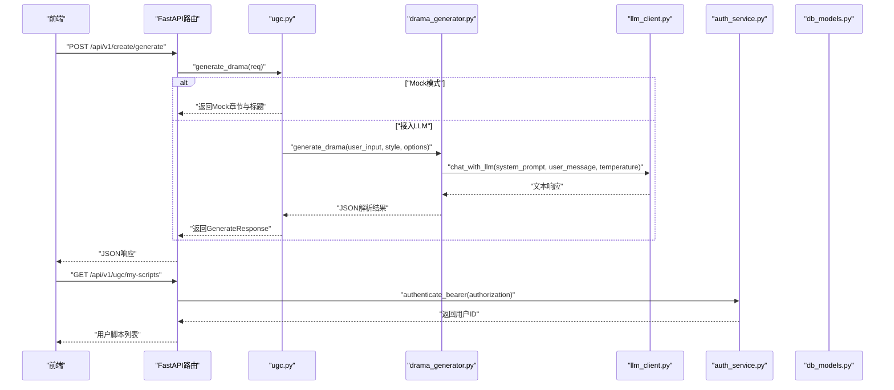
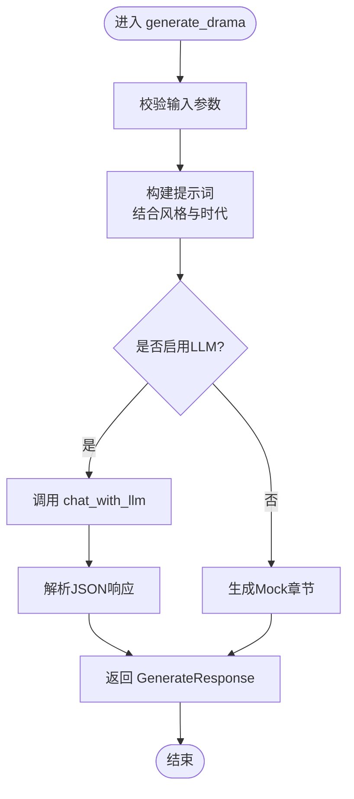
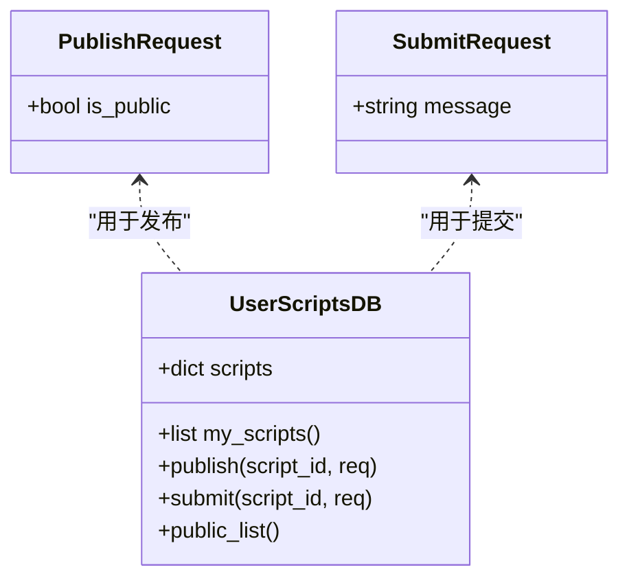
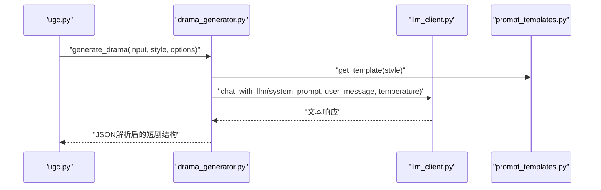
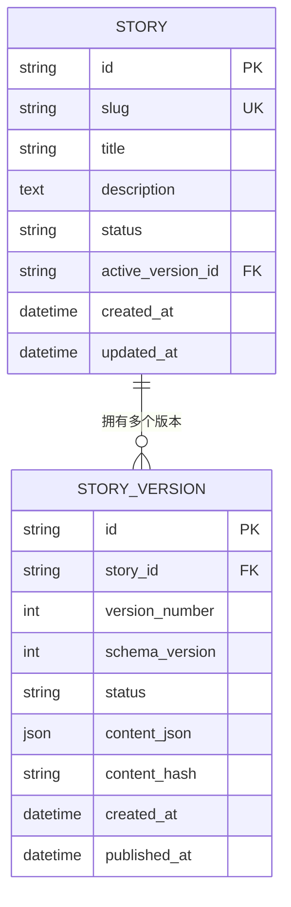
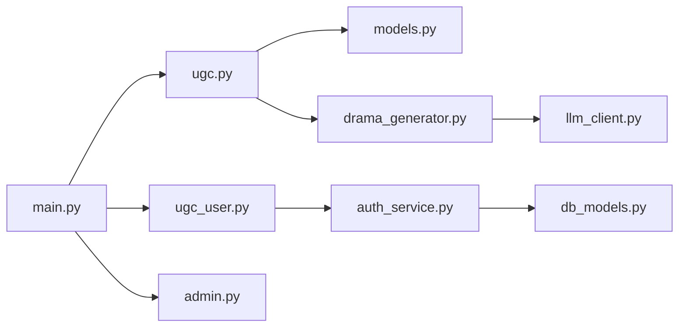

# UGC创作API模块

<cite>
**本文引用的文件**   
- [main.py](file://backend/app/main.py)
- [ugc.py](file://backend/app/api/ugc.py)
- [ugc_user.py](file://backend/app/api/ugc_user.py)
- [drama_generator.py](file://backend/app/ugc/drama_generator.py)
- [style_presets.py](file://backend/app/ugc/style_presets.py)
- [llm_client.py](file://backend/app/ai/llm_client.py)
- [prompt_templates.py](file://backend/app/ai/prompt_templates.py)
- [models.py](file://backend/app/models.py)
- [auth_service.py](file://backend/app/auth_service.py)
- [db_models.py](file://backend/app/db_models.py)
- [admin.py](file://backend/app/api/admin.py)
- [api.ts](file://frontend/src/lib/api.ts)
</cite>

## 目录
1. [简介](#简介)
2. [项目结构](#项目结构)
3. [核心组件](#核心组件)
4. [架构总览](#架构总览)
5. [详细组件分析](#详细组件分析)
6. [依赖关系分析](#依赖关系分析)
7. [性能考虑](#性能考虑)
8. [故障排查指南](#故障排查指南)
9. [结论](#结论)
10. [附录](#附录)

## 简介
本模块为澳秘 Macau Mystery 的UGC（用户生成内容）创作API，提供“一句话生成短剧”、AI辅助创作、风格预设与时代设定、发布与提交审核、公开列表等能力。当前实现以Mock为主，预留接入LLM（DeepSeek via SiliconFlow）的接口与模板机制，并包含鉴权、版本化故事模型与数据库结构，便于后续扩展真实AI生成、质量评估与安全审核流程。

## 项目结构
后端采用FastAPI模块化路由组织：
- /api/v1/create：UGC创作入口（生成、重生成）
- /api/v1/ugc：用户脚本管理（我的剧本、发布、提交官方、公开列表）
- /api/v1/admin：管理员后台（脚本管理、统计、投稿审核）
- /api/v1/ai：AI相关（NPC对话、TTS等）
- /api/v1/game：游戏运行期接口
- /api/v1/auth：认证与授权

**图表来源** 
- [main.py:84-96](file://backend/app/main.py#L84-L96)
- [ugc.py:1-35](file://backend/app/api/ugc.py#L1-L35)
- [ugc_user.py:1-96](file://backend/app/api/ugc_user.py#L1-L96)
- [admin.py:127-194](file://backend/app/api/admin.py#L127-L194)
- [llm_client.py:1-32](file://backend/app/ai/llm_client.py#L1-L32)
- [style_presets.py:1-15](file://backend/app/ugc/style_presets.py#L1-L15)
- [auth_service.py:100-124](file://backend/app/auth_service.py#L100-L124)
- [db_models.py:24-71](file://backend/app/db_models.py#L24-L71)

**章节来源**
- [main.py:84-96](file://backend/app/main.py#L84-L96)

## 核心组件
- UGC创作接口
  - POST /api/v1/create/generate：接收输入、风格与选项，返回生成的短剧结构（当前Mock）
  - POST /api/v1/create/regenerate/{script_id}：重生成占位接口
- 用户脚本管理
  - GET /api/v1/ugc/my-scripts：列出当前用户的脚本（需Bearer鉴权）
  - POST /api/v1/ugc/publish/{script_id}：设置公开/私有并发布
  - POST /api/v1/ugc/submit/{script_id}：提交至官方审核（需先公开）
  - GET /api/v1/ugc/public：公开脚本列表
- AI创作引擎
  - drama_generator.generate_drama：基于模板与LLM生成JSON结构（当前未直接暴露HTTP）
  - llm_client.chat_with_llm：调用SiliconFlow/DeepSeek
- 风格与时代预设
  - style_presets：悬疑、爱情、喜剧、悲剧；清代、民国、现代、架空；幕数选择
- 数据模型与版本控制
  - models.GenerateRequest/GenerateResponse：生成请求与响应
  - db_models.Story/StoryVersion：故事与版本化存储结构（为后续持久化准备）
- 鉴权与权限
  - auth_service.authenticate_bearer：Bearer令牌校验与用户解析
  - admin路由对敏感操作进行管理员校验

**章节来源**
- [ugc.py:8-34](file://backend/app/api/ugc.py#L8-L34)
- [ugc_user.py:37-95](file://backend/app/api/ugc_user.py#L37-L95)
- [drama_generator.py:5-21](file://backend/app/ugc/drama_generator.py#L5-L21)
- [llm_client.py:12-25](file://backend/app/ai/llm_client.py#L12-L25)
- [style_presets.py:2-14](file://backend/app/ugc/style_presets.py#L2-L14)
- [models.py:111-123](file://backend/app/models.py#L111-L123)
- [db_models.py:24-71](file://backend/app/db_models.py#L24-L71)
- [auth_service.py:100-124](file://backend/app/auth_service.py#L100-L124)

## 架构总览
UGC创作工作流从前端发起，经后端路由到生成器或Mock，必要时调用LLM，最终返回结构化短剧数据。用户可发布、提交审核，管理员可审核与统计。

**图表来源** 
- [ugc.py:8-29](file://backend/app/api/ugc.py#L8-L29)
- [drama_generator.py:5-21](file://backend/app/ugc/drama_generator.py#L5-L21)
- [llm_client.py:12-25](file://backend/app/ai/llm_client.py#L12-L25)
- [auth_service.py:100-124](file://backend/app/auth_service.py#L100-L124)

## 详细组件分析

### UGC创作接口（/api/v1/create）
- 生成短剧
  - 路径：POST /api/v1/create/generate
  - 请求体：GenerateRequest（input, style, options）
  - 响应：GenerateResponse（script_id, title, chapters, style, era）
  - 行为：当前返回Mock三幕结构，预留接入LLM
- 重生成
  - 路径：POST /api/v1/create/regenerate/{script_id}
  - 行为：占位返回，待完善

**图表来源** 
- [ugc.py:8-29](file://backend/app/api/ugc.py#L8-L29)
- [drama_generator.py:5-21](file://backend/app/ugc/drama_generator.py#L5-L21)
- [llm_client.py:12-25](file://backend/app/ai/llm_client.py#L12-L25)

**章节来源**
- [ugc.py:8-34](file://backend/app/api/ugc.py#L8-L34)
- [models.py:111-123](file://backend/app/models.py#L111-L123)

### 用户脚本管理（/api/v1/ugc）
- 我的脚本：GET /api/v1/ugc/my-scripts
  - 鉴权：Bearer Token
  - 返回：当前用户的所有脚本
- 发布：POST /api/v1/ugc/publish/{script_id}
  - 鉴权：Bearer Token
  - 行为：切换 is_public 与 status
- 提交官方：POST /api/v1/ugc/submit/{script_id}
  - 鉴权：Bearer Token
  - 前置条件：is_public=true
  - 行为：创建提交记录，状态pending
- 公开列表：GET /api/v1/ugc/public
  - 返回：所有公开脚本摘要

**图表来源** 
- [ugc_user.py:22-28](file://backend/app/api/ugc_user.py#L22-L28)
- [ugc_user.py:37-95](file://backend/app/api/ugc_user.py#L37-L95)

**章节来源**
- [ugc_user.py:37-95](file://backend/app/api/ugc_user.py#L37-L95)

### AI创作引擎集成
- 模板驱动
  - drama_generator.generate_drama：根据风格模板与时代、幕数构造提示词，支持自定义额外要求
- LLM客户端
  - llm_client.chat_with_llm：通过OpenAI兼容接口调用SiliconFlow/DeepSeek，返回文本
- NPC对话模板
  - prompt_templates.get_npc_prompt：为不同NPC角色生成系统提示词（用于后续互动剧情）

**图表来源** 
- [drama_generator.py:5-21](file://backend/app/ugc/drama_generator.py#L5-L21)
- [llm_client.py:12-25](file://backend/app/ai/llm_client.py#L12-L25)
- [prompt_templates.py:32-37](file://backend/app/ai/prompt_templates.py#L32-L37)

**章节来源**
- [drama_generator.py:5-21](file://backend/app/ugc/drama_generator.py#L5-L21)
- [llm_client.py:12-25](file://backend/app/ai/llm_client.py#L12-L25)
- [prompt_templates.py:32-37](file://backend/app/ai/prompt_templates.py#L32-L37)

### 风格预设与时代设定
- 风格：悬疑推理、爱情故事、喜剧冒险、悲剧史诗
- 时代：清代、民国、现代、架空
- 幕数：3幕、5幕、7幕

这些预设将影响提示词构建与生成结果的叙事风格与结构。

**章节来源**
- [style_presets.py:2-14](file://backend/app/ugc/style_presets.py#L2-L14)

### 内容安全与版权保护（建议与现状）
- 现状：当前UGC接口未内置内容安全检查与版权检测逻辑
- 建议：
  - 在生成前后增加敏感词过滤、暴力/色情检测
  - 引入版权相似度比对（如向量检索或指纹哈希）
  - 对提交官方的内容进行人工审核与自动化质检双轨制
  - 输出前进行格式校验与长度限制，避免注入攻击

[本节为通用建议，不直接分析具体文件]

### 版本管理与发布流程
- 版本模型
  - Story：故事元信息、活跃版本ID、时间戳
  - StoryVersion：版本号、schema版本、内容JSON、内容哈希、发布时间
- 发布流程
  - 用户脚本：标记公开后提交官方审核
  - 管理员：审核通过后，可将内容纳入正式资源池（当前为Mock）

**图表来源** 
- [db_models.py:24-71](file://backend/app/db_models.py#L24-L71)

**章节来源**
- [db_models.py:24-71](file://backend/app/db_models.py#L24-L71)

### 用户创作历史、分享与社区互动
- 创作历史：通过 /api/v1/ugc/my-scripts 获取用户脚本列表
- 分享：通过 /api/v1/ugc/public 获取公开脚本摘要
- 社区互动：当前未实现评论、点赞、收藏等接口，可在后续扩展

**章节来源**
- [ugc_user.py:37-95](file://backend/app/api/ugc_user.py#L37-L95)

### 代码示例（路径引用）
- 生成短剧：[ugc.py:8-29](file://backend/app/api/ugc.py#L8-L29)
- 用户发布与提交：[ugc_user.py:43-77](file://backend/app/api/ugc_user.py#L43-L77)
- AI生成器：[drama_generator.py:5-21](file://backend/app/ugc/drama_generator.py#L5-L21)
- LLM调用：[llm_client.py:12-25](file://backend/app/ai/llm_client.py#L12-L25)
- 前端调用示例：[api.ts:147-154](file://frontend/src/lib/api.ts#L147-L154)

## 依赖关系分析
- 路由层：main.py统一注册各子路由
- UGC路由依赖：
  - models.GenerateRequest/GenerateResponse
  - auth_service.authenticate_bearer（用户脚本接口）
  - drama_generator（可选接入LLM）
  - llm_client（LLM调用）
- 数据层：
  - db_models定义故事与版本结构（为后续持久化）
  - 当前UGC脚本使用内存字典存储（user_scripts_db），便于快速迭代

**图表来源** 
- [main.py:84-96](file://backend/app/main.py#L84-L96)
- [ugc.py:1-35](file://backend/app/api/ugc.py#L1-L35)
- [ugc_user.py:1-96](file://backend/app/api/ugc_user.py#L1-L96)
- [models.py:111-123](file://backend/app/models.py#L111-L123)
- [drama_generator.py:5-21](file://backend/app/ugc/drama_generator.py#L5-L21)
- [llm_client.py:12-25](file://backend/app/ai/llm_client.py#L12-L25)
- [auth_service.py:100-124](file://backend/app/auth_service.py#L100-L124)
- [db_models.py:24-71](file://backend/app/db_models.py#L24-L71)

**章节来源**
- [main.py:84-96](file://backend/app/main.py#L84-L96)

## 性能考虑
- 生成接口当前为Mock，延迟低；接入LLM后需注意：
  - 异步调用与超时控制
  - 缓存热门风格与时代组合的提示词
  - 限流与重试策略
- 用户脚本列表与公开列表为内存查询，适合小规模；生产环境应迁移至数据库并加索引
- 鉴权每次请求均查库，建议引入短期Token缓存或Redis

[本节为通用建议，不直接分析具体文件]

## 故障排查指南
- 鉴权失败（401）
  - 检查Authorization头是否为Bearer Token
  - 确认Token未过期且用户处于激活状态
- 生成失败
  - 若接入LLM，检查SILICONFLOW_API_KEY与BASE_URL配置
  - 查看LLM返回文本是否能解析为JSON
- 发布/提交错误
  - 确保脚本存在且属于当前用户
  - 提交官方前必须设置为公开

**章节来源**
- [auth_service.py:100-124](file://backend/app/auth_service.py#L100-L124)
- [llm_client.py:12-25](file://backend/app/ai/llm_client.py#L12-L25)
- [ugc_user.py:43-77](file://backend/app/api/ugc_user.py#L43-L77)

## 结论
本UGC模块已具备基础创作、发布与提交审核的API骨架，并通过模板与LLM客户端预留了AI增强能力。下一步建议：
- 完成LLM接入与JSON结构化校验
- 实现内容安全与版权检测
- 将内存存储迁移至数据库，结合Story/StoryVersion实现版本化管理
- 扩展社区互动功能（评论、点赞、收藏）

[本节为总结性内容，不直接分析具体文件]

## 附录
- 前端调用示例路径：[api.ts:147-154](file://frontend/src/lib/api.ts#L147-L154)
- 管理员审核与统计接口路径：[admin.py:171-194](file://backend/app/api/admin.py#L171-L194)

**章节来源**
- [api.ts:147-154](file://frontend/src/lib/api.ts#L147-L154)
- [admin.py:171-194](file://backend/app/api/admin.py#L171-L194)