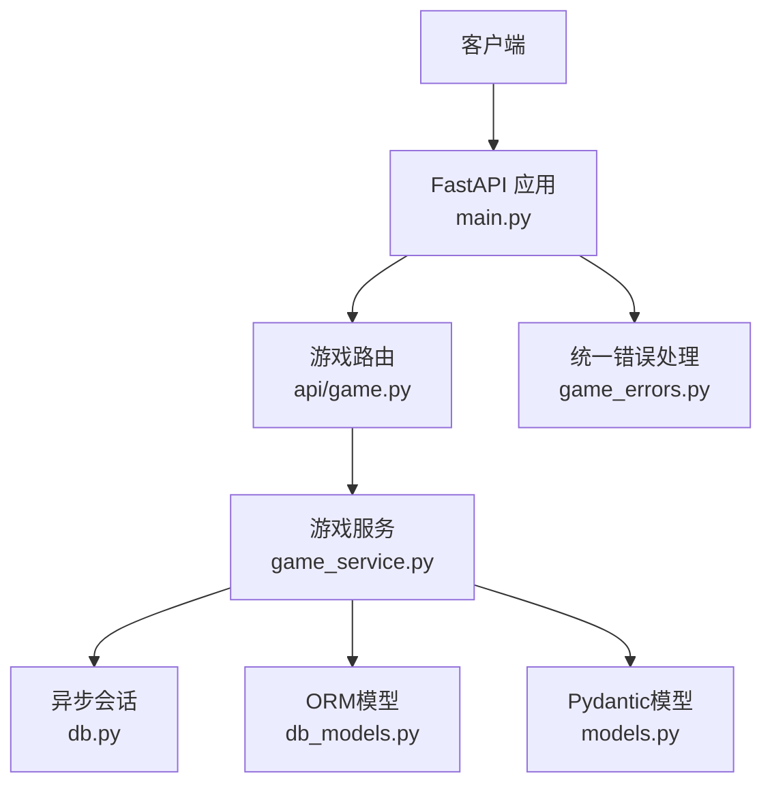
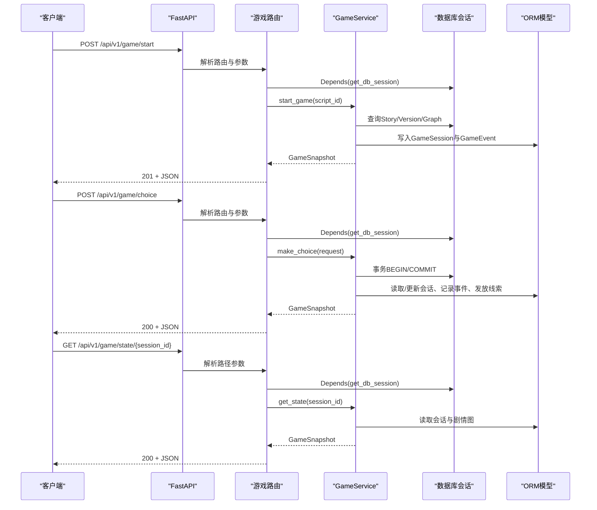
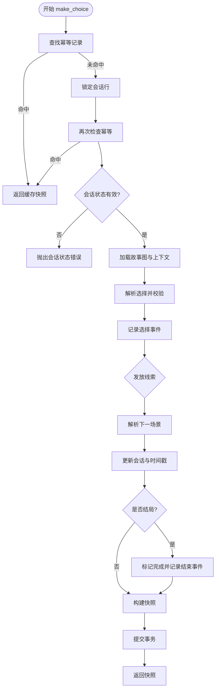
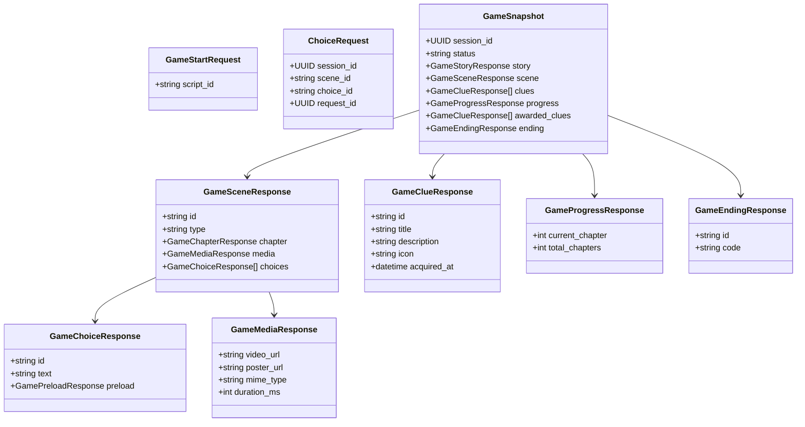
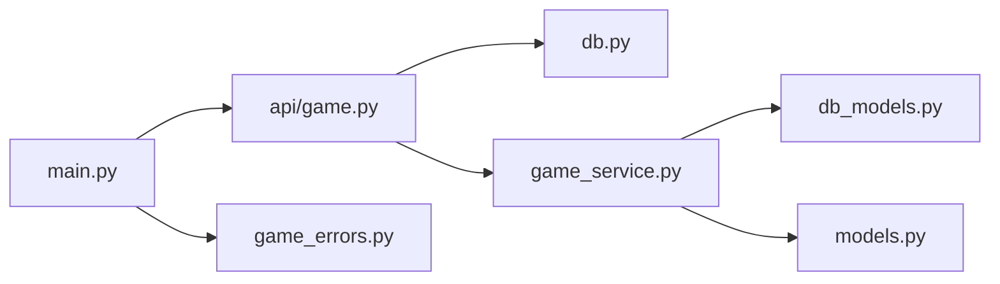
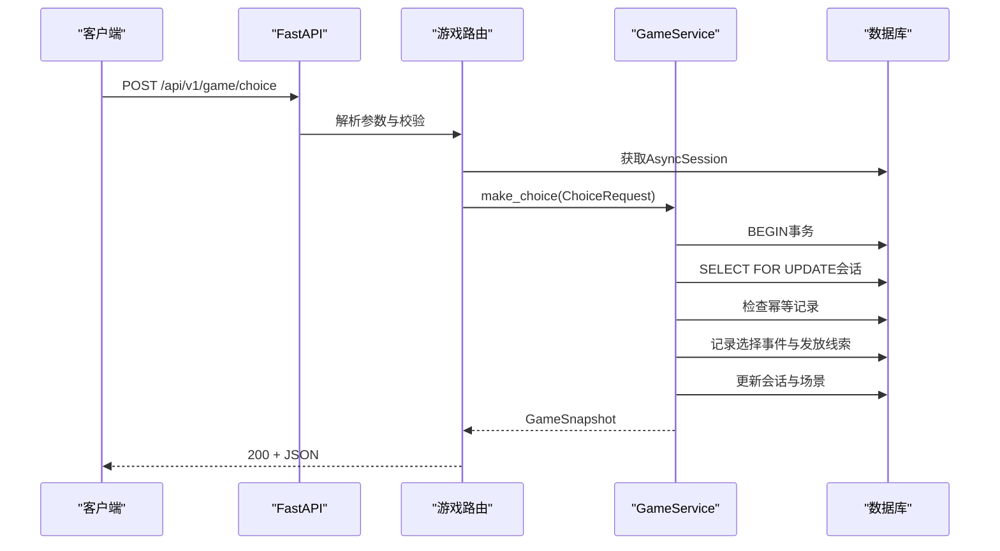

# 游戏API模块

<cite>
**本文引用的文件**   
- [backend/app/api/game.py](file://backend/app/api/game.py)
- [backend/app/game_service.py](file://backend/app/game_service.py)
- [backend/app/models.py](file://backend/app/models.py)
- [backend/app/main.py](file://backend/app/main.py)
- [backend/app/db.py](file://backend/app/db.py)
- [backend/app/db_models.py](file://backend/app/db_models.py)
- [backend/app/game_errors.py](file://backend/app/game_errors.py)
- [backend/tests/test_game_api.py](file://backend/tests/test_game_api.py)
</cite>

## 目录
1. [简介](#简介)
2. [项目结构](#项目结构)
3. [核心组件](#核心组件)
4. [架构总览](#架构总览)
5. [详细组件分析](#详细组件分析)
6. [依赖关系分析](#依赖关系分析)
7. [性能与并发特性](#性能与并发特性)
8. [故障排查指南](#故障排查指南)
9. [结论](#结论)
10. [附录：接口规范与示例](#附录接口规范与示例)

## 简介
本模块为澳秘 Macau Mystery 的“匿名玩家”游戏API，提供基于RESTful风格的核心接口：
- 启动游戏：POST /api/v1/game/start
- 选择处理：POST /api/v1/game/choice
- 状态查询：GET /api/v1/game/state/{session_id}

该模块采用FastAPI构建，使用SQLAlchemy异步会话进行数据库访问，并通过依赖注入将数据库会话注入到路由处理器中。业务逻辑集中在GameService中，负责事务控制、剧情图遍历、线索发放、幂等性保证以及快照生成。数据模型通过Pydantic定义并用于请求校验与响应序列化。

## 项目结构
后端采用分层组织：
- API层：路由定义与参数校验（app/api/game.py）
- 服务层：业务编排与事务控制（app/game_service.py）
- 数据模型：Pydantic请求/响应模型（app/models.py）
- 持久化模型：SQLAlchemy ORM映射（app/db_models.py）
- 数据库连接与会话管理（app/db.py）
- 应用入口与异常统一处理（app/main.py）
- 错误契约（app/game_errors.py）
- 端到端测试（backend/tests/test_game_api.py）



**图表来源** 
- [backend/app/main.py:17-106](file://backend/app/main.py#L17-L106)
- [backend/app/api/game.py:12-37](file://backend/app/api/game.py#L12-L37)
- [backend/app/game_service.py:31-193](file://backend/app/game_service.py#L31-L193)
- [backend/app/db.py:26-42](file://backend/app/db.py#L26-L42)
- [backend/app/db_models.py:74-126](file://backend/app/db_models.py#L74-L126)
- [backend/app/models.py:12-92](file://backend/app/models.py#L12-L92)
- [backend/app/game_errors.py:7-20](file://backend/app/game_errors.py#L7-L20)

**章节来源**
- [backend/app/main.py:17-106](file://backend/app/main.py#L17-L106)
- [backend/app/api/game.py:12-37](file://backend/app/api/game.py#L12-L37)

## 核心组件
- 路由与依赖注入
  - 三个端点分别对应启动、选择与状态查询，均通过Depends(get_db_session)注入AsyncSession。
  - 响应模型使用response_model与exclude_none=True精简输出。
- 游戏服务
  - start_game：校验故事版本与媒体准备情况，创建会话与初始事件，返回快照。
  - make_choice：事务内执行，支持SQLite特殊锁；实现幂等重放、并发安全、线索发放、场景推进与结局标记。
  - get_state：按会话ID恢复当前快照。
- 数据模型
  - GameStartRequest、ChoiceRequest用于输入校验。
  - GameSnapshot及其子模型用于统一响应结构。
- 错误契约
  - GameError封装HTTP状态码、错误码、消息与详情，被主应用统一捕获并序列化为标准错误信封。

**章节来源**
- [backend/app/api/game.py:15-36](file://backend/app/api/game.py#L15-L36)
- [backend/app/game_service.py:35-193](file://backend/app/game_service.py#L35-L193)
- [backend/app/models.py:12-92](file://backend/app/models.py#L12-L92)
- [backend/app/game_errors.py:7-20](file://backend/app/game_errors.py#L7-L20)

## 架构总览
整体调用链从FastAPI路由进入，经依赖注入获取数据库会话，再委托给GameService完成业务逻辑，最终返回Pydantic模型序列化的JSON。



**图表来源** 
- [backend/app/main.py:84-96](file://backend/app/main.py#L84-L96)
- [backend/app/api/game.py:15-36](file://backend/app/api/game.py#L15-L36)
- [backend/app/game_service.py:35-193](file://backend/app/game_service.py#L35-L193)
- [backend/app/db.py:30-33](file://backend/app/db.py#L30-L33)

## 详细组件分析

### 路由与依赖注入（api/game.py）
- 路由注册于前缀/api/v1/game下，包含start、choice、state/{session_id}三个端点。
- 所有端点通过Depends(get_db_session)注入AsyncSession，确保每个请求拥有独立会话生命周期。
- 响应模型使用response_model与exclude_none=True，避免空字段污染响应体。

```mermaid
classDiagram
class GameRouter {
+post("/start")
+post("/choice")
+get("/state/{session_id}")
}
class GameService {
+start_game(script_id)
+make_choice(request)
+get_state(session_id)
}
class AsyncSession {
+begin()
+add(obj)
+flush()
+commit()
+rollback()
}
GameRouter --> GameService : "调用"
GameRouter --> AsyncSession : "依赖注入"
```

**图表来源** 
- [backend/app/api/game.py:12-37](file://backend/app/api/game.py#L12-L37)
- [backend/app/game_service.py:31-193](file://backend/app/game_service.py#L31-L193)
- [backend/app/db.py:30-33](file://backend/app/db.py#L30-L33)

**章节来源**
- [backend/app/api/game.py:15-36](file://backend/app/api/game.py#L15-L36)

### 游戏服务（game_service.py）
- 事务与并发
  - SQLite下显式BEGIN IMMEDIATE以规避并发写冲突；其他数据库使用with session.begin()。
  - 选择处理在事务内锁定会话行（with_for_update），二次查找幂等记录，防止重复提交。
- 幂等性与重放
  - 通过request_id唯一约束与payload_json比较，实现幂等重放；若冲突则抛出IDEMPOTENCY_CONFLICT。
- 线索发放与场景推进
  - 根据选择的grant_clues列表去重后发放，记录clue_granted事件与SessionClue。
  - 目标场景解析后更新current_scene_key与last_active_at；若为EndingScene则标记completed并记录game_completed事件。
- 快照生成
  - _snapshot组装当前场景、章节进度、线索列表与可选awarded_clues；对active/completed状态进行一致性校验。



**图表来源** 
- [backend/app/game_service.py:70-193](file://backend/app/game_service.py#L70-L193)

**章节来源**
- [backend/app/game_service.py:70-193](file://backend/app/game_service.py#L70-L193)

### 数据模型（models.py）
- 输入模型
  - GameStartRequest：script_id需满足长度与格式限制。
  - ChoiceRequest：session_id为UUID，scene_id与choice_id需满足长度与格式限制，request_id为UUID。
- 输出模型
  - GameSnapshot：包含会话ID、状态、故事信息、当前场景、线索、进度、可选awarded_clues与ending。
  - 子模型涵盖章节、媒体、选择、线索、进度与结局等结构化字段。



**图表来源** 
- [backend/app/models.py:12-92](file://backend/app/models.py#L12-L92)

**章节来源**
- [backend/app/models.py:12-92](file://backend/app/models.py#L12-L92)

### 数据库会话管理（db.py）
- 引擎创建与连接配置：针对SQLite启用外键与忙超时。
- 会话工厂：expire_on_commit=False避免已加载对象失效。
- 依赖注入函数get_db_session：每次请求yield一个AsyncSession，自动关闭。

**章节来源**
- [backend/app/db.py:12-42](file://backend/app/db.py#L12-L42)

### 持久化模型（db_models.py）
- Story与StoryVersion：故事元数据与版本内容JSON，支持发布状态与哈希去重。
- GameSession：会话状态、当前场景、结局场景与时间戳。
- GameEvent：事件流水号、类型、场景与选择键、请求ID与负载JSON，具备会话+序列号与会话+请求ID唯一约束。
- SessionClue：会话级线索集合，关联来源事件与获取时间。

**章节来源**
- [backend/app/db_models.py:24-126](file://backend/app/db_models.py#L24-L126)

### 统一错误处理（main.py与game_errors.py）
- GameError：封装HTTP状态码、错误码、消息与详情。
- 主应用注册GameError与RequestValidationError处理器，统一返回error信封格式，便于前端一致处理。

**章节来源**
- [backend/app/main.py:38-74](file://backend/app/main.py#L38-L74)
- [backend/app/game_errors.py:7-20](file://backend/app/game_errors.py#L7-L20)

## 依赖关系分析
- 路由依赖
  - api/game.py依赖db.get_db_session注入AsyncSession，依赖game_service.GameService执行业务。
- 服务依赖
  - game_service.py依赖db_models中的ORM实体进行读写，依赖models中的Pydantic模型进行序列化。
- 应用依赖
  - main.py聚合各路由与前缀，注册全局异常处理器与CORS中间件。



**图表来源** 
- [backend/app/api/game.py:1-10](file://backend/app/api/game.py#L1-L10)
- [backend/app/game_service.py:1-29](file://backend/app/game_service.py#L1-L29)
- [backend/app/main.py:84-96](file://backend/app/main.py#L84-L96)

**章节来源**
- [backend/app/api/game.py:1-10](file://backend/app/api/game.py#L1-L10)
- [backend/app/game_service.py:1-29](file://backend/app/game_service.py#L1-L29)
- [backend/app/main.py:84-96](file://backend/app/main.py#L84-L96)

## 性能与并发特性
- 事务与锁
  - SQLite使用BEGIN IMMEDIATE提升并发写安全性；PostgreSQL使用SELECT ... FOR UPDATE锁定会话行。
- 幂等性
  - 通过request_id与payload_json比对实现幂等重放，避免重复提交导致的状态不一致。
- 预取与最小化响应
  - response_model_exclude_none=True减少冗余字段；选择项的preload仅包含必要媒体信息。
- 资源就绪检查
  - 生产环境确保视频媒体ready后再允许启动，避免运行时缺失。

[本节为通用指导，不直接分析具体文件]

## 故障排查指南
- 常见错误码与含义
  - STORY_NOT_FOUND：故事不存在或未发布。
  - SESSION_NOT_FOUND：会话不存在。
  - SESSION_COMPLETED/SESSION_NOT_ACTIVE：会话已结束或不可继续。
  - STALE_SCENE：提交的场景不是当前场景。
  - CHOICE_NOT_AVAILABLE：选项不属于当前场景。
  - IDENTITY_CONFLICT/IDEMPOTENCY_CONFLICT：request_id冲突或幂等记录损坏。
  - VALIDATION_ERROR：请求字段、类型或格式不合法。
- 定位步骤
  - 检查请求参数是否符合模型校验规则（长度、格式、UUID）。
  - 确认会话状态与当前场景匹配。
  - 验证request_id的唯一性与幂等记录是否存在。
  - 查看数据库事件流水与负载JSON，定位问题发生点。

**章节来源**
- [backend/app/game_errors.py:7-20](file://backend/app/game_errors.py#L7-L20)
- [backend/app/main.py:38-74](file://backend/app/main.py#L38-L74)
- [backend/tests/test_game_api.py:172-184](file://backend/tests/test_game_api.py#L172-L184)

## 结论
本模块通过清晰的RESTful设计、严格的模型校验与统一的错误契约，提供了稳定可靠的游戏核心接口。GameService集中处理事务、并发、幂等与剧情推进，配合SQLAlchemy异步会话与Pydantic模型，实现了高性能与可维护性的平衡。测试覆盖关键流程与边界条件，确保行为符合预期。

[本节为总结，不直接分析具体文件]

## 附录：接口规范与示例

### 接口总览
- 启动游戏
  - 方法：POST
  - URL：/api/v1/game/start
  - 请求体：GameStartRequest（script_id）
  - 响应：GameSnapshot（201 Created）
- 选择处理
  - 方法：POST
  - URL：/api/v1/game/choice
  - 请求体：ChoiceRequest（session_id、scene_id、choice_id、request_id）
  - 响应：GameSnapshot（200 OK）
- 状态查询
  - 方法：GET
  - URL：/api/v1/game/state/{session_id}
  - 路径参数：session_id（UUID）
  - 响应：GameSnapshot（200 OK）

**章节来源**
- [backend/app/api/game.py:15-36](file://backend/app/api/game.py#L15-L36)
- [backend/app/models.py:12-92](file://backend/app/models.py#L12-L92)

### 请求与响应示例（路径引用）
- 启动游戏示例
  - 参考测试用例中的构造与断言：[test_start_choice_merge_ending_and_replay:90-127](file://backend/tests/test_game_api.py#L90-L127)
- 选择处理示例
  - 参考choose辅助函数与多次选择流程：[choose与断言:78-88](file://backend/tests/test_game_api.py#L78-L88)
- 状态查询示例
  - 参考恢复状态与场景一致性断言：[test_state_recovery_stale_scene_and_idempotency_conflict:129-149](file://backend/tests/test_game_api.py#L129-L149)

### 调用流程时序图（选择处理）


**图表来源** 
- [backend/app/api/game.py:23-28](file://backend/app/api/game.py#L23-L28)
- [backend/app/game_service.py:70-193](file://backend/app/game_service.py#L70-L193)
- [backend/app/db.py:30-33](file://backend/app/db.py#L30-L33)