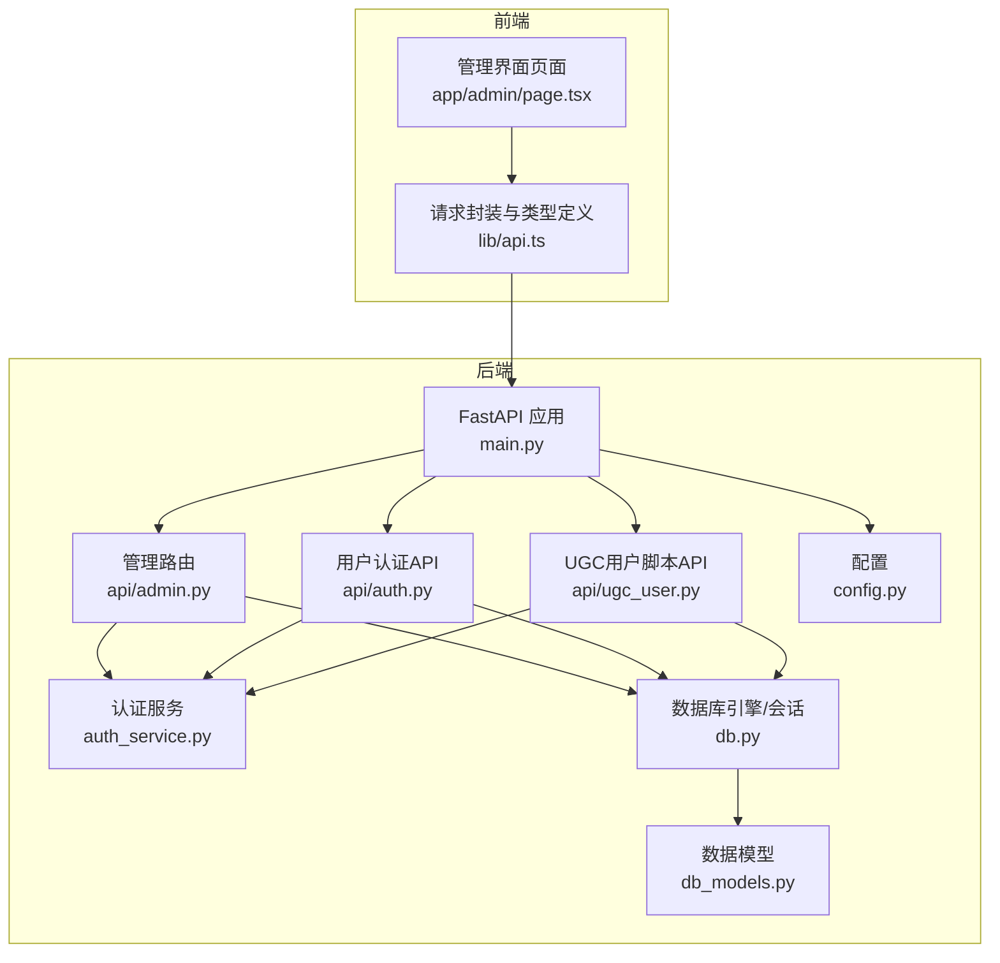
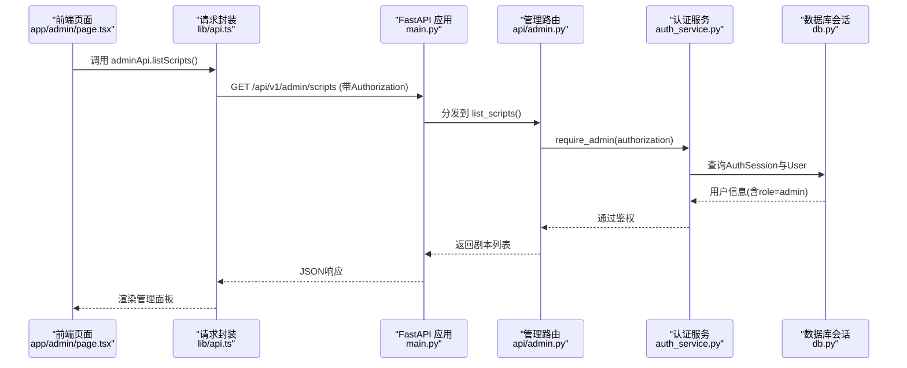
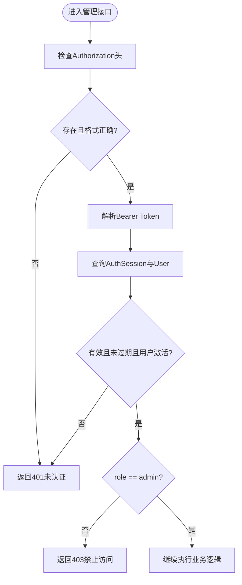
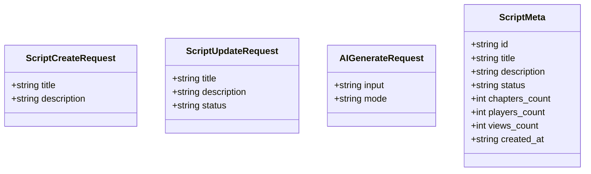
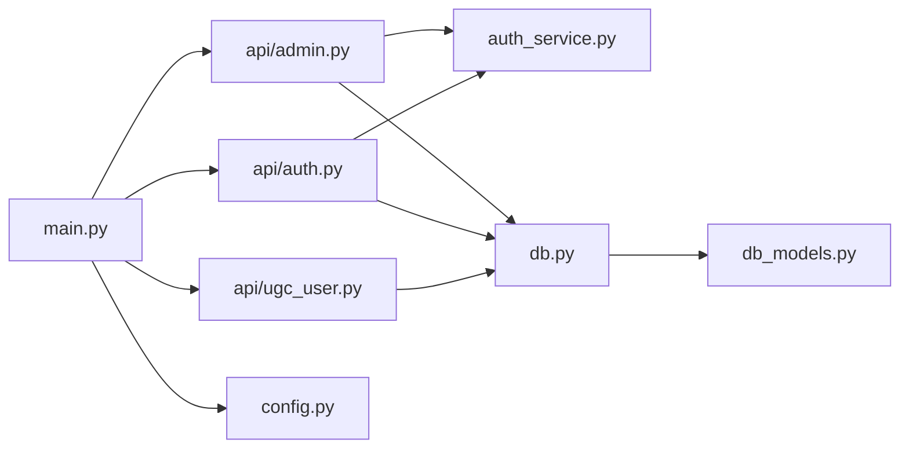

# 管理API模块

<cite>
**本文引用的文件**   
- [backend/app/api/admin.py](file://backend/app/api/admin.py)
- [backend/app/admin/auth.py](file://backend/app/admin/auth.py)
- [backend/app/main.py](file://backend/app/main.py)
- [backend/app/config.py](file://backend/app/config.py)
- [backend/app/db_models.py](file://backend/app/db_models.py)
- [backend/app/auth_service.py](file://backend/app/auth_service.py)
- [backend/app/api/auth.py](file://backend/app/api/auth.py)
- [backend/app/db.py](file://backend/app/db.py)
- [backend/app/api/ugc_user.py](file://backend/app/api/ugc_user.py)
- [frontend/src/lib/api.ts](file://frontend/src/lib/api.ts)
- [frontend/src/app/admin/page.tsx](file://frontend/src/app/admin/page.tsx)
</cite>

## 目录
1. [简介](#简介)
2. [项目结构](#项目结构)
3. [核心组件](#核心组件)
4. [架构总览](#架构总览)
5. [详细组件分析](#详细组件分析)
6. [依赖关系分析](#依赖关系分析)
7. [性能考虑](#性能考虑)
8. [故障排查指南](#故障排查指南)
9. [结论](#结论)
10. [附录：接口清单与示例](#附录接口清单与示例)

## 简介
本文件为澳秘 Macau Mystery 的管理API模块提供系统化、可操作的文档。内容覆盖管理员身份验证、权限控制、剧本管理、UGC提交审核、统计分析、路由配置等能力，并给出前后端交互示例与安全最佳实践。当前实现以内存存储为主，便于快速演示；同时预留了数据库模型与认证服务，便于后续迁移到持久化方案。

## 项目结构
后端采用 FastAPI 模块化设计，管理相关的路由集中在 /api/v1/admin 前缀下，并通过统一的生命周期与异常处理进行装配。前端通过统一的请求封装自动注入 Authorization 头，调用管理接口。

图表来源
- [backend/app/main.py:17-107](file://backend/app/main.py#L17-L107)
- [backend/app/api/admin.py:12-218](file://backend/app/api/admin.py#L12-L218)
- [backend/app/auth_service.py:100-131](file://backend/app/auth_service.py#L100-L131)
- [backend/app/api/auth.py:24-97](file://backend/app/api/auth.py#L24-L97)
- [backend/app/api/ugc_user.py:12-96](file://backend/app/api/ugc_user.py#L12-L96)
- [backend/app/db.py:12-42](file://backend/app/db.py#L12-L42)
- [backend/app/db_models.py:24-160](file://backend/app/db_models.py#L24-L160)
- [backend/app/config.py:38-77](file://backend/app/config.py#L38-L77)
- [frontend/src/lib/api.ts:160-195](file://frontend/src/lib/api.ts#L160-L195)
- [frontend/src/app/admin/page.tsx:1-214](file://frontend/src/app/admin/page.tsx#L1-L214)

章节来源
- [backend/app/main.py:17-107](file://backend/app/main.py#L17-L107)
- [backend/app/api/admin.py:12-218](file://backend/app/api/admin.py#L12-L218)
- [frontend/src/lib/api.ts:160-195](file://frontend/src/lib/api.ts#L160-L195)

## 核心组件
- 管理路由（/api/v1/admin）：提供剧本CRUD、AI生成、统计、UGC提交审核、路线配置等接口。
- 认证与授权：基于Bearer Token的鉴权，结合角色“admin”进行权限控制。
- 数据库与会话：异步SQLAlchemy引擎与SessionLocal，支持SQLite与PostgreSQL等。
- 配置系统：环境变量驱动的配置项，包括CORS、数据库URL、Token TTL、演示账号等。
- 前端API封装：统一request函数自动注入Authorization头，暴露adminApi方法集。

章节来源
- [backend/app/api/admin.py:12-218](file://backend/app/api/admin.py#L12-L218)
- [backend/app/auth_service.py:100-131](file://backend/app/auth_service.py#L100-L131)
- [backend/app/db.py:12-42](file://backend/app/db.py#L12-L42)
- [backend/app/config.py:38-77](file://backend/app/config.py#L38-L77)
- [frontend/src/lib/api.ts:1-15](file://frontend/src/lib/api.ts#L1-L15)

## 架构总览
管理API整体流程如下：
- 前端通过 lib/api.ts 发起请求，自动附加 Authorization: Bearer <token>。
- 后端 main.py 注册路由，将 /api/v1/admin 指向 admin.py。
- 管理接口在入口处调用 require_admin 完成鉴权与角色校验。
- 业务逻辑读取或更新内存中的剧本集合，或访问UGC提交集合。
- 统计接口汇总内存数据返回给前端展示。

图表来源
- [frontend/src/app/admin/page.tsx:32-45](file://frontend/src/app/admin/page.tsx#L32-L45)
- [frontend/src/lib/api.ts:160-167](file://frontend/src/lib/api.ts#L160-L167)
- [backend/app/main.py:84-96](file://backend/app/main.py#L84-L96)
- [backend/app/api/admin.py:71-73](file://backend/app/api/admin.py#L71-L73)
- [backend/app/auth_service.py:100-131](file://backend/app/auth_service.py#L100-L131)
- [backend/app/db.py:30-33](file://backend/app/db.py#L30-L33)

## 详细组件分析

### 管理员身份验证与权限控制
- 认证方式：Bearer Token，服务端解析后查询 AuthSession，校验过期与用户状态。
- 权限控制：require_admin 检查用户 role 是否为 admin，否则返回403。
- 开发环境兼容：admin/auth.py 中 verify_token 在 development 环境下直接放行，便于本地调试。

图表来源
- [backend/app/auth_service.py:100-131](file://backend/app/auth_service.py#L100-L131)
- [backend/app/admin/auth.py:8-16](file://backend/app/admin/auth.py#L8-L16)

章节来源
- [backend/app/auth_service.py:100-131](file://backend/app/auth_service.py#L100-L131)
- [backend/app/admin/auth.py:8-16](file://backend/app/admin/auth.py#L8-L16)

### 剧本管理（CRUD与发布）
- 列出剧本：GET /api/v1/admin/scripts，返回内存中的剧本集合。
- 创建剧本：POST /api/v1/admin/scripts，需admin权限，新建草稿状态剧本。
- 更新剧本：PUT /api/v1/admin/scripts/{id}，支持标题、描述、状态部分更新。
- 删除剧本：DELETE /api/v1/admin/scripts/{id}，需admin权限。
- 发布切换：POST /api/v1/admin/scripts/{id}/publish，切换 draft/published。

图表来源
- [backend/app/api/admin.py:42-64](file://backend/app/api/admin.py#L42-L64)

章节来源
- [backend/app/api/admin.py:71-123](file://backend/app/api/admin.py#L71-L123)

### AI 生成剧本
- 接口：POST /api/v1/admin/scripts/ai-generate
- 模式：quick 与 polish，分别生成多章节模板或精修单章模板。
- 行为：生成临时ID与基础结构，写入内存脚本库，返回完整剧本对象。

章节来源
- [backend/app/api/admin.py:125-168](file://backend/app/api/admin.py#L125-L168)

### 统计与路线配置
- 统计接口：GET /api/v1/admin/stats，汇总剧本数量、玩家数、浏览量、已发布/草稿数量。
- 路线配置：GET /api/v1/admin/route，优先返回已发布剧本的route字段，否则返回默认路线。

章节来源
- [backend/app/api/admin.py:171-182](file://backend/app/api/admin.py#L171-L182)
- [backend/app/api/admin.py:212-218](file://backend/app/api/admin.py#L212-L218)

### UGC 提交审核
- 列表：GET /api/v1/admin/submissions，从UGC模块读取待审提交。
- 批准：POST /api/v1/admin/submissions/{id}/approve，将状态改为 approved。
- 拒绝：POST /api/v1/admin/submissions/{id}/reject，将状态改为 rejected。

章节来源
- [backend/app/api/admin.py:185-209](file://backend/app/api/admin.py#L185-L209)
- [backend/app/api/ugc_user.py:16-20](file://backend/app/api/ugc_user.py#L16-L20)

### 用户认证与令牌获取
- 登录：POST /api/v1/auth/login，返回 token 与用户信息。
- 注册：POST /api/v1/auth/register，创建用户并返回 token。
- 当前用户：GET /api/v1/auth/me，携带Authorization返回用户信息。

章节来源
- [backend/app/api/auth.py:64-97](file://backend/app/api/auth.py#L64-L97)

## 依赖关系分析
- 路由装配：main.py 将各子路由挂载到 /api/v1/* 命名空间。
- 认证依赖：admin.py 通过 auth_service.require_admin 完成鉴权。
- 数据依赖：admin.py 使用内存字典 scripts_db 与 ugc_user.submissions_db。
- 数据库依赖：db.py 提供 SessionLocal 与 get_db_session，供认证与未来持久化使用。
- 配置依赖：config.py 提供 Settings，影响CORS、数据库URL、演示账号等。

图表来源
- [backend/app/main.py:84-96](file://backend/app/main.py#L84-L96)
- [backend/app/api/admin.py:9-10](file://backend/app/api/admin.py#L9-L10)
- [backend/app/api/auth.py:11-21](file://backend/app/api/auth.py#L11-L21)
- [backend/app/api/ugc_user.py:9-10](file://backend/app/api/ugc_user.py#L9-L10)
- [backend/app/db.py:26-33](file://backend/app/db.py#L26-L33)
- [backend/app/db_models.py:24-160](file://backend/app/db_models.py#L24-L160)
- [backend/app/config.py:56-77](file://backend/app/config.py#L56-L77)

章节来源
- [backend/app/main.py:84-96](file://backend/app/main.py#L84-L96)
- [backend/app/api/admin.py:9-10](file://backend/app/api/admin.py#L9-L10)
- [backend/app/db.py:26-33](file://backend/app/db.py#L26-L33)

## 性能考虑
- 内存存储：当前剧本与提交数据存储在内存字典中，适合演示与低并发场景；生产环境应迁移至数据库并增加索引与分页。
- 鉴权开销：每次管理接口均执行一次数据库查询，建议对热点数据进行缓存（如统计结果）。
- CORS与中间件：合理限制允许的源与方法，减少不必要的跨域请求。
- 批量操作：当前无批量接口，建议在管理侧增加批量导入/导出与批量审核接口以提升效率。

[本节为通用指导，不直接分析具体文件]

## 故障排查指南
- 401 未认证：检查Authorization头是否包含正确的Bearer Token，确认Token未过期且用户处于激活状态。
- 403 禁止访问：确认用户角色为 admin；若使用开发环境，确保环境变量 ENV=development 时允许跳过严格校验。
- 404 资源不存在：检查剧本ID或提交ID是否正确。
- 422 参数校验失败：检查请求体字段是否符合Pydantic模型要求。
- 健康检查：GET /api/v1/health 返回数据库状态与应用版本，用于监控服务可用性。

章节来源
- [backend/app/main.py:98-106](file://backend/app/main.py#L98-L106)
- [backend/app/auth_service.py:100-131](file://backend/app/auth_service.py#L100-L131)
- [backend/app/admin/auth.py:8-16](file://backend/app/admin/auth.py#L8-L16)

## 结论
管理API模块提供了完整的剧本管理与UGC审核能力，配合严格的Bearer Token鉴权与角色控制，满足管理员日常运维需求。当前实现以内存存储为主，便于快速迭代；建议在生产环境中引入持久化、审计日志、限流与更细粒度的权限策略，以提升安全性与可扩展性。

[本节为总结性内容，不直接分析具体文件]

## 附录：接口清单与示例

### 管理接口清单
- GET /api/v1/admin/scripts：列出所有剧本
- POST /api/v1/admin/scripts：创建新剧本（需admin）
- PUT /api/v1/admin/scripts/{id}：更新剧本（需admin）
- DELETE /api/v1/admin/scripts/{id}：删除剧本（需admin）
- POST /api/v1/admin/scripts/{id}/publish：切换发布状态（需admin）
- POST /api/v1/admin/scripts/ai-generate：AI生成剧本（需admin）
- GET /api/v1/admin/stats：统计数据
- GET /api/v1/admin/submissions：UGC提交列表（需admin）
- POST /api/v1/admin/submissions/{id}/approve：批准提交（需admin）
- POST /api/v1/admin/submissions/{id}/reject：拒绝提交（需admin）
- GET /api/v1/admin/route：获取路线配置

章节来源
- [backend/app/api/admin.py:71-218](file://backend/app/api/admin.py#L71-L218)

### 前端调用示例（路径引用）
- 列表与创建：adminApi.listScripts(), adminApi.createScript(data)
- 更新与删除：adminApi.updateScript(id, data), adminApi.deleteScript(id)
- 发布切换：adminApi.publishScript(id)
- AI生成：adminApi.aiGenerateScript(input, mode)
- 提交审核：adminApi.listSubmissions(), adminApi.reviewSubmission(id, action)
- 统计与路线：adminApi.getStats(), adminApi.getRoute()

章节来源
- [frontend/src/lib/api.ts:160-195](file://frontend/src/lib/api.ts#L160-L195)

### 安全最佳实践与访问控制策略
- 强制HTTPS：生产环境启用TLS，避免Token泄露。
- 最小权限原则：仅授予必要权限，区分admin与普通用户。
- Token生命周期：设置合理的TTL，定期轮换；记录last_used_at以便审计。
- 输入校验：使用Pydantic模型严格校验请求体，防止非法输入。
- 审计日志：记录关键操作（创建、删除、发布、审核），便于追溯。
- 限流与防护：对敏感接口实施速率限制与防重放机制。
- CORS白名单：仅允许可信前端域名访问。

[本节为通用指导，不直接分析具体文件]