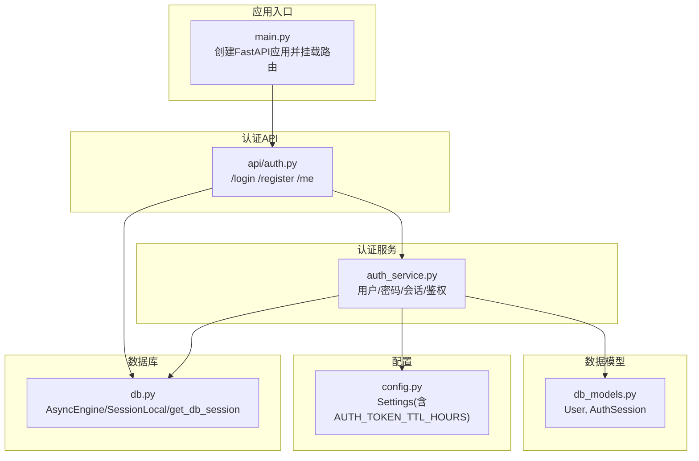
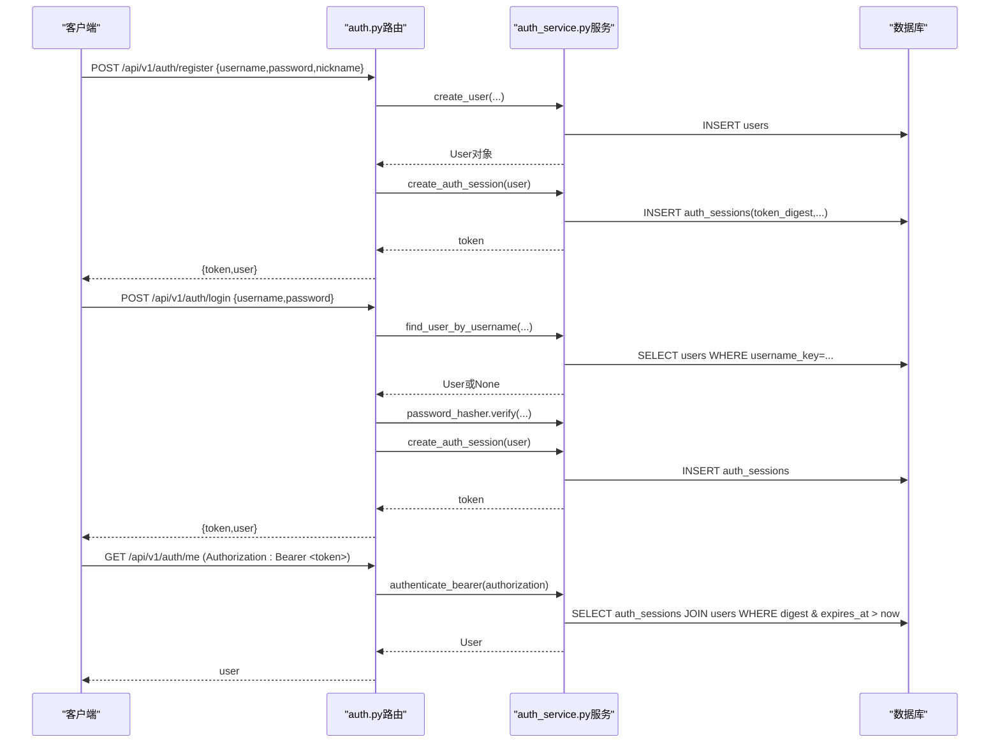
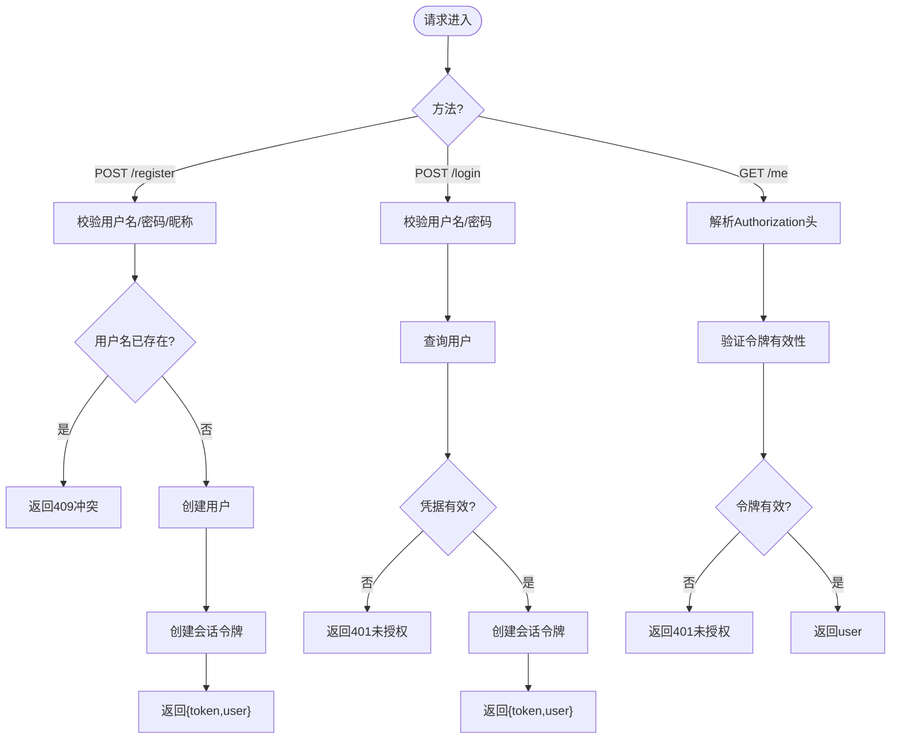
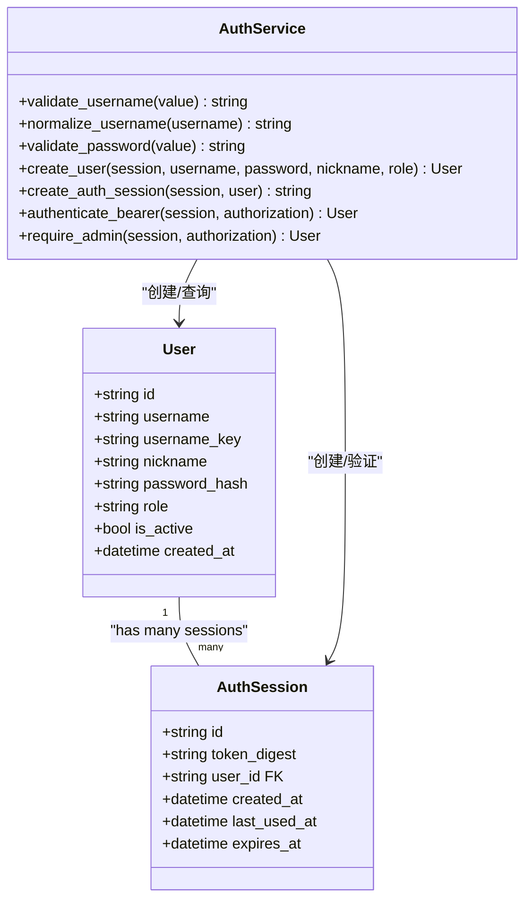
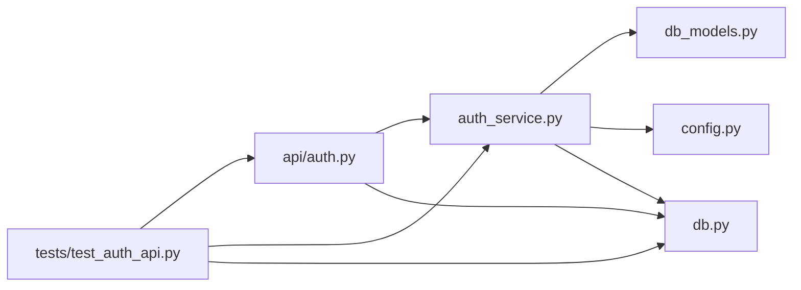

# 认证API模块

<cite>
**本文引用的文件**   
- [backend/app/api/auth.py](file://backend/app/api/auth.py)
- [backend/app/auth_service.py](file://backend/app/auth_service.py)
- [backend/app/db_models.py](file://backend/app/db_models.py)
- [backend/app/config.py](file://backend/app/config.py)
- [backend/app/main.py](file://backend/app/main.py)
- [backend/app/db.py](file://backend/app/db.py)
- [backend/tests/test_auth_api.py](file://backend/tests/test_auth_api.py)
- [backend/app/admin/auth.py](file://backend/app/admin/auth.py)
</cite>

## 目录
1. [简介](#简介)
2. [项目结构](#项目结构)
3. [核心组件](#核心组件)
4. [架构总览](#架构总览)
5. [详细组件分析](#详细组件分析)
6. [依赖关系分析](#依赖关系分析)
7. [性能与安全考量](#性能与安全考量)
8. [故障排查指南](#故障排查指南)
9. [结论](#结论)
10. [附录：接口与集成示例](#附录接口与集成示例)

## 简介
本文件为澳秘 Macau Mystery 后端认证API模块的权威文档。内容覆盖用户注册、登录、令牌管理与权限控制等核心能力，详细说明基于持久化会话的Bearer令牌机制（非JWT），密码加密存储策略、角色访问控制与会话生命周期管理。同时提供认证中间件与路由保护机制说明，以及如何在FastAPI应用中集成该认证流程的最佳实践与错误处理建议。

## 项目结构
认证相关代码主要分布在以下位置：
- API层：定义HTTP路由与请求/响应模型
- 服务层：实现用户、密码、会话与鉴权逻辑
- 数据模型：定义用户与会话表结构
- 配置：环境变量驱动的配置项（如令牌有效期）
- 应用入口：挂载路由、全局异常处理与CORS
- 数据库：异步引擎与会话工厂
- 测试：端到端用例验证注册、登录、鉴权与过期行为

图表来源
- [backend/app/main.py:84-96](file://backend/app/main.py#L84-L96)
- [backend/app/api/auth.py:24-97](file://backend/app/api/auth.py#L24-L97)
- [backend/app/auth_service.py:1-153](file://backend/app/auth_service.py#L1-L153)
- [backend/app/db_models.py:128-160](file://backend/app/db_models.py#L128-L160)
- [backend/app/config.py:38-77](file://backend/app/config.py#L38-L77)
- [backend/app/db.py:26-32](file://backend/app/db.py#L26-L32)

章节来源
- [backend/app/main.py:84-96](file://backend/app/main.py#L84-L96)
- [backend/app/api/auth.py:24-97](file://backend/app/api/auth.py#L24-L97)
- [backend/app/auth_service.py:1-153](file://backend/app/auth_service.py#L1-L153)
- [backend/app/db_models.py:128-160](file://backend/app/db_models.py#L128-L160)
- [backend/app/config.py:38-77](file://backend/app/config.py#L38-L77)
- [backend/app/db.py:26-32](file://backend/app/db.py#L26-L32)

## 核心组件
- 认证API路由：提供注册、登录、获取当前用户信息接口
- 认证服务：用户名/密码校验、密码哈希、会话生成与验证、管理员权限检查
- 数据模型：用户与会话实体，包含唯一约束与外键关系
- 配置：令牌有效期、演示账号开关等
- 数据库：异步会话注入与连接配置

章节来源
- [backend/app/api/auth.py:24-97](file://backend/app/api/auth.py#L24-L97)
- [backend/app/auth_service.py:27-130](file://backend/app/auth_service.py#L27-L130)
- [backend/app/db_models.py:128-160](file://backend/app/db_models.py#L128-L160)
- [backend/app/config.py:38-77](file://backend/app/config.py#L38-L77)
- [backend/app/db.py:30-32](file://backend/app/db.py#L30-L32)

## 架构总览
认证流程采用“服务端持久化会话 + Bearer令牌”模式：
- 注册：校验输入 -> 创建用户 -> 生成会话令牌 -> 返回用户信息与令牌
- 登录：校验用户名与密码 -> 生成新会话令牌 -> 返回用户信息与令牌
- 鉴权：解析Authorization头 -> 查找有效且未过期的会话 -> 更新最后使用时间 -> 返回用户
- 权限控制：通过角色字段区分admin/user，在需要管理员的接口处进行角色校验

图表来源
- [backend/app/api/auth.py:64-97](file://backend/app/api/auth.py#L64-L97)
- [backend/app/auth_service.py:63-123](file://backend/app/auth_service.py#L63-L123)
- [backend/app/db_models.py:128-160](file://backend/app/db_models.py#L128-L160)

## 详细组件分析

### 认证API路由（/api/v1/auth）
- 注册接口
  - 输入：username、password、nickname（可选）
  - 校验：用户名格式、密码长度、昵称长度
  - 业务：去重检查、创建用户、创建会话、事务提交
  - 输出：{token, user}
- 登录接口
  - 输入：username、password
  - 校验：用户名存在、用户激活状态、密码匹配
  - 业务：创建新会话
  - 输出：{token, user}
- 获取当前用户
  - 鉴权：从Authorization头提取Bearer令牌并验证
  - 输出：user

图表来源
- [backend/app/api/auth.py:28-97](file://backend/app/api/auth.py#L28-L97)
- [backend/app/auth_service.py:63-123](file://backend/app/auth_service.py#L63-L123)

章节来源
- [backend/app/api/auth.py:28-97](file://backend/app/api/auth.py#L28-L97)

### 认证服务（用户、密码、会话、鉴权）
- 用户名校验与规范化
  - 正则限制：字母开头，3-32位字母数字下划线
  - 规范化：统一小写用于比较与索引
- 密码校验与哈希
  - 长度限制：6-128位
  - 使用pwdlib的推荐算法进行安全哈希存储
- 会话令牌
  - 生成：随机URL安全字符串
  - 存储：仅存摘要（SHA-256），避免明文泄露
  - 有效期：由配置项AUTH_TOKEN_TTL_HOURS决定
  - 更新：每次成功鉴权时刷新last_used_at
- 鉴权流程
  - 要求Authorization头以“Bearer ”开头
  - 查询auth_sessions并关联users，检查expires_at与is_active
  - 失败则抛出401；成功则返回用户
- 管理员权限
  - require_admin：先鉴权再校验role=admin，否则403

图表来源
- [backend/app/db_models.py:128-160](file://backend/app/db_models.py#L128-L160)
- [backend/app/auth_service.py:27-130](file://backend/app/auth_service.py#L27-L130)

章节来源
- [backend/app/auth_service.py:27-130](file://backend/app/auth_service.py#L27-L130)
- [backend/app/db_models.py:128-160](file://backend/app/db_models.py#L128-L160)

### 数据模型（用户与会话）
- User
  - 主键：id（UUID）
  - 用户名：username与username_key（唯一索引）
  - 昵称：nickname
  - 密码哈希：password_hash
  - 角色：role（admin/user）
  - 激活状态：is_active
- AuthSession
  - 主键：id（UUID）
  - 令牌摘要：token_digest（唯一索引）
  - 用户外键：user_id
  - 时间戳：created_at、last_used_at、expires_at

章节来源
- [backend/app/db_models.py:128-160](file://backend/app/db_models.py#L128-L160)

### 配置与环境变量
- 关键配置项
  - AUTH_TOKEN_TTL_HOURS：令牌有效期（小时），默认168
  - BOOTSTRAP_DEMO_USERS：是否初始化演示用户
  - DEMO_*：演示账号的用户名与密码
- 其他
  - DATABASE_URL：数据库连接串
  - CORS_ORIGINS：跨域白名单

章节来源
- [backend/app/config.py:38-77](file://backend/app/config.py#L38-L77)

### 数据库与会话注入
- 异步引擎与会话工厂
  - 使用SQLAlchemy异步引擎与async_sessionmaker
  - SQLite场景开启外键与超时设置
- get_db_session
  - FastAPI依赖注入，提供AsyncSession上下文

章节来源
- [backend/app/db.py:12-32](file://backend/app/db.py#L12-L32)

### 应用入口与路由挂载
- lifespan钩子：启动时可选择性导入演示故事与演示用户
- 全局异常处理：自定义GameError与请求校验错误格式
- 路由挂载：将auth_router挂载到/api/v1/auth前缀

章节来源
- [backend/app/main.py:17-96](file://backend/app/main.py#L17-L96)

### 管理员认证（独立中间件）
- admin/auth.py提供verify_token函数，用于管理员接口的额外鉴权
- development环境可跳过校验，生产环境需匹配ADMIN_TOKEN

章节来源
- [backend/app/admin/auth.py:1-17](file://backend/app/admin/auth.py#L1-L17)

## 依赖关系分析
- API层依赖服务层完成业务逻辑
- 服务层依赖数据模型与配置
- 所有层通过数据库会话进行数据交互
- 测试通过TestClient与依赖注入覆盖端到端路径

图表来源
- [backend/app/api/auth.py:24-97](file://backend/app/api/auth.py#L24-L97)
- [backend/app/auth_service.py:1-153](file://backend/app/auth_service.py#L1-L153)
- [backend/app/db_models.py:128-160](file://backend/app/db_models.py#L128-L160)
- [backend/app/config.py:38-77](file://backend/app/config.py#L38-L77)
- [backend/app/db.py:26-32](file://backend/app/db.py#L26-L32)
- [backend/tests/test_auth_api.py:1-208](file://backend/tests/test_auth_api.py#L1-L208)

章节来源
- [backend/app/api/auth.py:24-97](file://backend/app/api/auth.py#L24-L97)
- [backend/app/auth_service.py:1-153](file://backend/app/auth_service.py#L1-L153)
- [backend/app/db_models.py:128-160](file://backend/app/db_models.py#L128-L160)
- [backend/app/config.py:38-77](file://backend/app/config.py#L38-L77)
- [backend/app/db.py:26-32](file://backend/app/db.py#L26-L32)
- [backend/tests/test_auth_api.py:1-208](file://backend/tests/test_auth_api.py#L1-L208)

## 性能与安全考量
- 性能
  - 令牌验证使用索引字段token_digest与expires_at，查询高效
  - joinedload一次性加载用户，减少N+1查询
  - 每次鉴权更新last_used_at，便于审计与清理
- 安全
  - 密码使用pwdlib推荐算法哈希存储，不保存明文
  - 令牌仅存储摘要，降低泄露风险
  - 支持用户激活状态控制，禁用账户立即失效
  - 管理员权限通过角色字段严格校验
- 可扩展性
  - 令牌有效期通过配置集中管理
  - 如需引入JWT，可在服务层替换令牌生成与验证逻辑，保持API契约不变

[本节为通用指导，不直接分析具体文件]

## 故障排查指南
- 常见错误码
  - 401：凭证无效、令牌缺失或无效、令牌过期
  - 403：缺少管理员权限
  - 409：用户名重复
  - 422：请求体校验失败（用户名/密码/昵称格式不符）
- 排查步骤
  - 确认Authorization头格式为“Bearer <token>”
  - 检查令牌是否过期（对比expires_at）
  - 检查用户是否被禁用（is_active）
  - 核对用户名大小写与规范化（username_key）
  - 查看数据库是否存在对应记录与索引
- 日志与调试
  - 在开发环境可通过打印异常详情定位问题
  - 使用测试用例复现问题路径

章节来源
- [backend/app/api/auth.py:64-97](file://backend/app/api/auth.py#L64-L97)
- [backend/app/auth_service.py:100-130](file://backend/app/auth_service.py#L100-L130)
- [backend/tests/test_auth_api.py:66-174](file://backend/tests/test_auth_api.py#L66-L174)

## 结论
本认证模块采用服务端持久化会话与Bearer令牌机制，结合严格的输入校验、安全的密码哈希与角色权限控制，提供了稳定可靠的认证能力。通过清晰的层次划分与依赖注入，易于扩展与维护。建议在后续迭代中根据业务需求评估是否引入JWT，并保持现有API契约兼容。

[本节为总结性内容，不直接分析具体文件]

## 附录：接口与集成示例

### 接口定义概览
- POST /api/v1/auth/register
  - 请求体：{username, password, nickname?}
  - 响应：{token, user}
  - 错误：409（用户名重复）、422（校验失败）
- POST /api/v1/auth/login
  - 请求体：{username, password}
  - 响应：{token, user}
  - 错误：401（凭证无效）
- GET /api/v1/auth/me
  - 头部：Authorization: Bearer <token>
  - 响应：user
  - 错误：401（未认证/令牌无效/过期）

章节来源
- [backend/app/api/auth.py:28-97](file://backend/app/api/auth.py#L28-L97)

### 集成到FastAPI应用的步骤
- 确保数据库迁移已完成
- 在应用启动时按需启用演示用户初始化
- 使用get_db_session作为依赖注入数据库会话
- 在需要保护的接口中调用authenticate_bearer或require_admin进行鉴权

章节来源
- [backend/app/main.py:17-96](file://backend/app/main.py#L17-L96)
- [backend/app/db.py:30-32](file://backend/app/db.py#L30-L32)
- [backend/app/auth_service.py:100-130](file://backend/app/auth_service.py#L100-L130)

### 前端调用示例（概念性流程）
- 注册成功后保存返回的token
- 登录成功后刷新本地token
- 后续请求在Authorization头携带Bearer token
- 处理401/403错误，引导用户重新登录或提示权限不足

[本节为概念性说明，不直接分析具体文件]