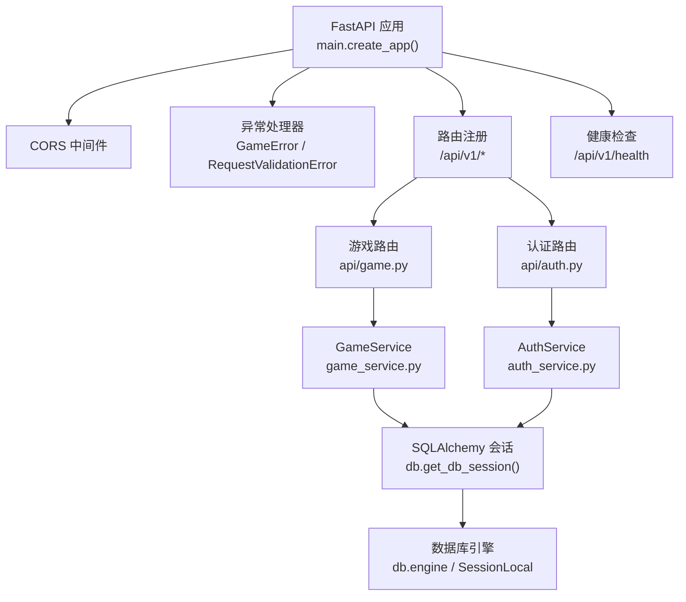
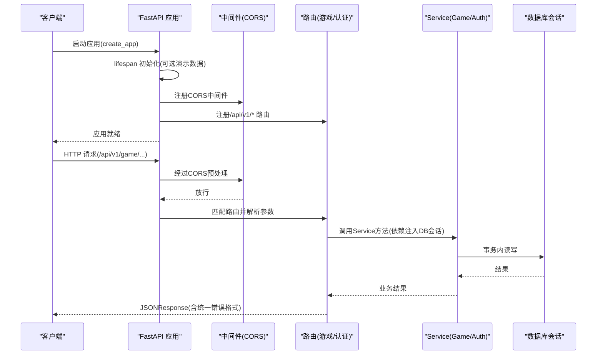
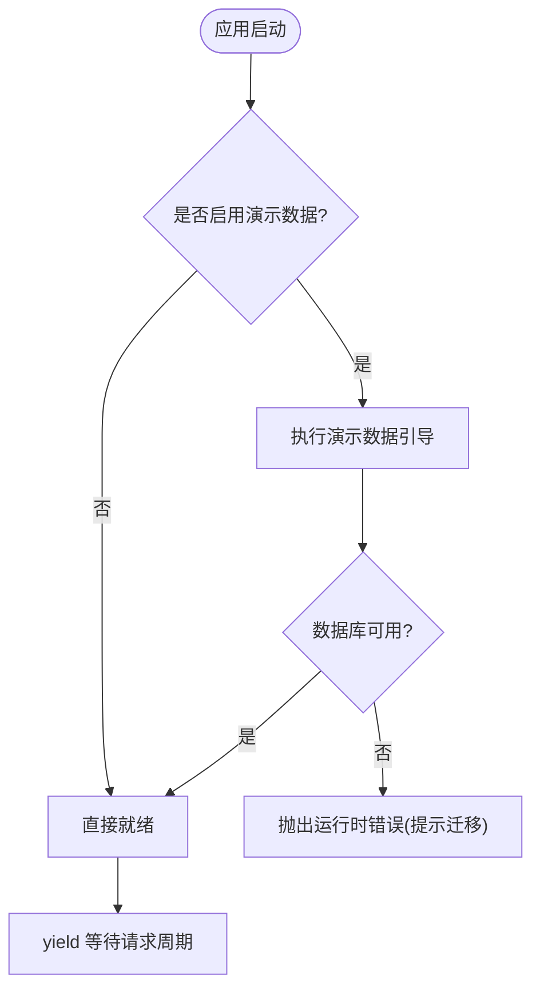
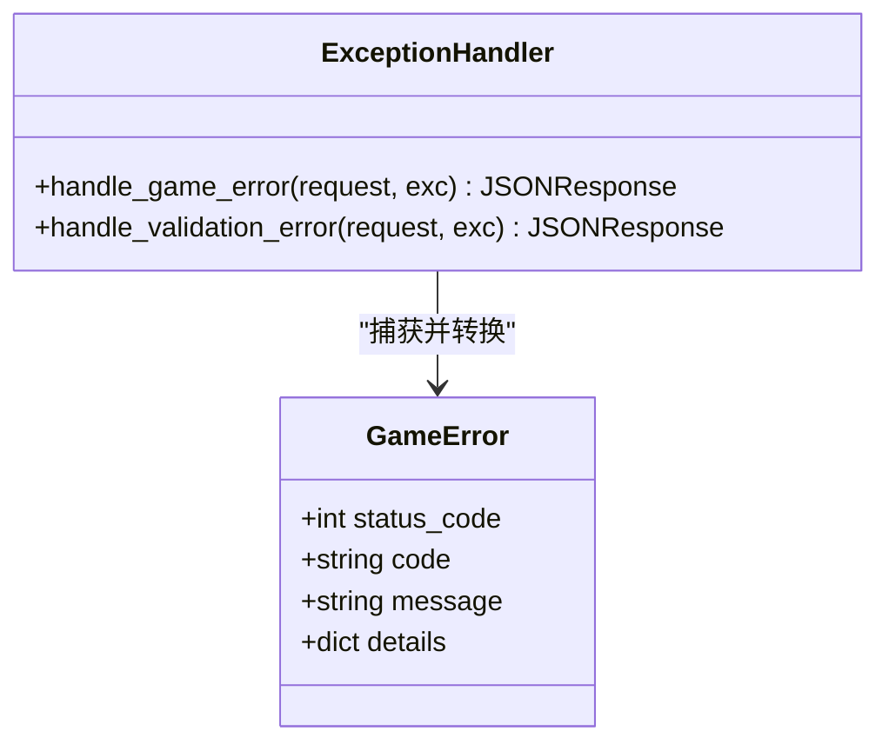
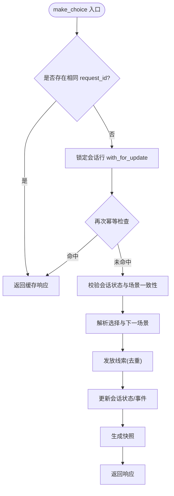
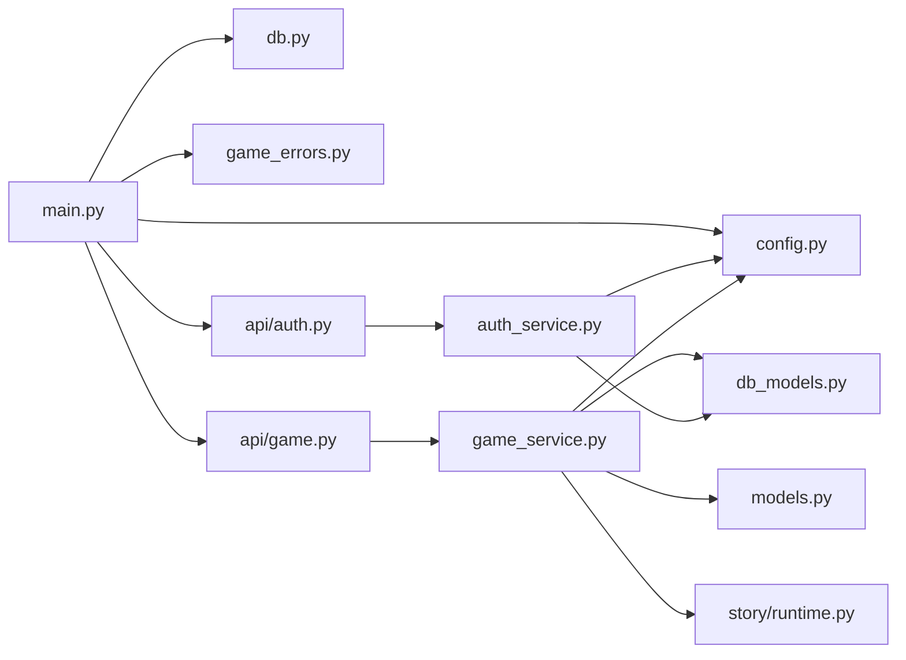

# FastAPI应用核心

<cite>
**本文引用的文件**   
- [backend/app/main.py](file://backend/app/main.py)
- [backend/app/config.py](file://backend/app/config.py)
- [backend/app/db.py](file://backend/app/db.py)
- [backend/app/game_errors.py](file://backend/app/game_errors.py)
- [backend/app/auth_service.py](file://backend/app/auth_service.py)
- [backend/app/models.py](file://backend/app/models.py)
- [backend/app/db_models.py](file://backend/app/db_models.py)
- [backend/app/api/game.py](file://backend/app/api/game.py)
- [backend/app/api/auth.py](file://backend/app/api/auth.py)
- [backend/app/game_service.py](file://backend/app/game_service.py)
- [backend/app/story/runtime.py](file://backend/app/story/runtime.py)
</cite>

## 目录
1. [简介](#简介)
2. [项目结构](#项目结构)
3. [核心组件](#核心组件)
4. [架构总览](#架构总览)
5. [详细组件分析](#详细组件分析)
6. [依赖关系分析](#依赖关系分析)
7. [性能考量](#性能考量)
8. [故障排查指南](#故障排查指南)
9. [结论](#结论)
10. [附录](#附录)

## 简介
本文件面向澳秘 Macau Mystery 的 FastAPI 后端核心，系统性阐述应用启动流程、生命周期管理（lifespan）、中间件配置与异常处理机制；深入说明 CORS 跨域配置、自定义异常处理器（GameError 与 RequestValidationError）的实现原理；覆盖路由注册策略、API 版本管理与健康检查端点设计；并给出依赖注入模式的应用、环境变量配置与安全设置。文末提供扩展中间件、新增异常处理器与配置应用行为的具体示例路径，便于二次开发。

## 项目结构
后端采用模块化分层组织：
- 应用入口与装配：main.py
- 配置与环境变量：config.py
- 数据库引擎与会话：db.py
- 领域模型与持久化模型：models.py、db_models.py
- 业务服务层：game_service.py、auth_service.py
- API 路由层：api/*
- 故事运行时：story/runtime.py

图表来源
- [backend/app/main.py:17-107](file://backend/app/main.py#L17-L107)
- [backend/app/api/game.py:12-37](file://backend/app/api/game.py#L12-L37)
- [backend/app/api/auth.py:24-97](file://backend/app/api/auth.py#L24-L97)
- [backend/app/game_service.py:31-386](file://backend/app/game_service.py#L31-L386)
- [backend/app/auth_service.py:1-153](file://backend/app/auth_service.py#L1-L153)
- [backend/app/db.py:12-42](file://backend/app/db.py#L12-L42)

章节来源
- [backend/app/main.py:17-107](file://backend/app/main.py#L17-L107)
- [backend/app/config.py:1-77](file://backend/app/config.py#L1-L77)

## 核心组件
- 应用工厂 create_app：集中创建 FastAPI 实例、注册 lifespan、中间件、异常处理器与路由，并暴露健康检查端点。
- 配置 Settings：基于环境变量构建不可变配置对象，提供 is_production 等便捷属性。
- 数据库层：异步引擎与会话工厂，SQLite 特殊连接事件配置，健康检查查询。
- 异常体系：GameError 统一业务错误；RequestValidationError 针对 /api/v1/game 的路径定制校验错误响应。
- 认证服务：用户名密码校验、令牌生成与验证、管理员权限校验、演示数据初始化。
- 游戏服务：事务性游戏推进、幂等选择、线索发放、状态快照生成、故事图遍历与校验。
- 模型与持久化：Pydantic 契约模型与 SQLAlchemy ORM 模型分离，确保 API 稳定与存储演进解耦。

章节来源
- [backend/app/main.py:17-107](file://backend/app/main.py#L17-L107)
- [backend/app/config.py:38-77](file://backend/app/config.py#L38-L77)
- [backend/app/db.py:12-42](file://backend/app/db.py#L12-L42)
- [backend/app/game_errors.py:7-20](file://backend/app/game_errors.py#L7-L20)
- [backend/app/auth_service.py:27-153](file://backend/app/auth_service.py#L27-L153)
- [backend/app/game_service.py:31-386](file://backend/app/game_service.py#L31-L386)
- [backend/app/models.py:8-146](file://backend/app/models.py#L8-L146)
- [backend/app/db_models.py:20-160](file://backend/app/db_models.py#L20-L160)

## 架构总览
应用启动时通过 lifespan 执行可选的演示数据引导；随后注册全局中间件与异常处理器；按模块导入并挂载 v1 路由；最后暴露健康检查端点。请求进入后由 FastAPI 路由分发到对应控制器，控制器通过依赖注入获取数据库会话，调用 Service 完成业务逻辑，返回 Pydantic 模型。

图表来源
- [backend/app/main.py:17-107](file://backend/app/main.py#L17-L107)
- [backend/app/api/game.py:12-37](file://backend/app/api/game.py#L12-L37)
- [backend/app/api/auth.py:24-97](file://backend/app/api/auth.py#L24-L97)
- [backend/app/game_service.py:31-386](file://backend/app/game_service.py#L31-L386)
- [backend/app/auth_service.py:1-153](file://backend/app/auth_service.py#L1-L153)
- [backend/app/db.py:30-42](file://backend/app/db.py#L30-L42)

## 详细组件分析

### 应用启动与生命周期管理（lifespan）
- 使用 asynccontextmanager 定义 lifespan，在应用启动阶段根据配置决定是否引导演示故事与演示用户。
- 若数据库未迁移，捕获 SQLAlchemyError 并抛出 RuntimeError 提示执行迁移命令。
- 将 lifespan 注入 FastAPI 实例，确保资源初始化与清理可控。

图表来源
- [backend/app/main.py:20-36](file://backend/app/main.py#L20-L36)
- [backend/app/config.py:56-77](file://backend/app/config.py#L56-L77)

章节来源
- [backend/app/main.py:20-36](file://backend/app/main.py#L20-L36)
- [backend/app/config.py:56-77](file://backend/app/config.py#L56-L77)

### 中间件配置（CORS）
- 通过 CORSMiddleware 配置允许的来源、凭据、方法与头。
- 来源列表来自配置项 cors_origins，默认包含本地开发地址。
- allow_credentials=True 配合前端携带 Cookie/Authorization 场景。

章节来源
- [backend/app/main.py:76-82](file://backend/app/main.py#L76-L82)
- [backend/app/config.py:19-24](file://backend/app/config.py#L19-L24)

### 异常处理机制
- GameError：业务异常统一封装，包含 status_code、code、message、details。
- GameError 处理器：将异常转为统一的 JSON 响应体，保持前后端一致的错误协议。
- RequestValidationError：对 /api/v1/game 路径下的校验错误进行格式化，返回包含 errors 数组的结构；其他路径走默认处理器。

图表来源
- [backend/app/game_errors.py:7-20](file://backend/app/game_errors.py#L7-L20)
- [backend/app/main.py:38-74](file://backend/app/main.py#L38-L74)

章节来源
- [backend/app/game_errors.py:7-20](file://backend/app/game_errors.py#L7-L20)
- [backend/app/main.py:38-74](file://backend/app/main.py#L38-L74)

### 路由注册策略与 API 版本管理
- 所有业务路由以 /api/v1 为前缀，按功能划分模块：
  - /api/v1/game：匿名游戏接口
  - /api/v1/ai：AI 相关接口
  - /api/v1/create：UGC 创作接口
  - /api/v1/admin：管理后台接口
  - /api/v1/auth：认证接口
  - /api/v1/ugc：UGC 用户相关接口
- 每个模块独立 router，便于扩展与维护。

章节来源
- [backend/app/main.py:84-96](file://backend/app/main.py#L84-L96)
- [backend/app/api/game.py:12-37](file://backend/app/api/game.py#L12-L37)
- [backend/app/api/auth.py:24-97](file://backend/app/api/auth.py#L24-L97)

### 健康检查端点设计
- GET /api/v1/health：尝试连接数据库，成功返回 ok 状态与版本信息；失败返回 503 degraded 状态。
- 用于负载均衡与健康探针。

章节来源
- [backend/app/main.py:98-105](file://backend/app/main.py#L98-L105)
- [backend/app/db.py:35-42](file://backend/app/db.py#L35-L42)

### 依赖注入模式
- 数据库会话通过 get_db_session 作为 Depends 注入到路由函数，自动管理会话生命周期。
- 认证鉴权通过 Header(authorization) 与 authenticate_bearer 组合实现。

章节来源
- [backend/app/db.py:30-33](file://backend/app/db.py#L30-L33)
- [backend/app/api/game.py:15-36](file://backend/app/api/game.py#L15-L36)
- [backend/app/api/auth.py:90-97](file://backend/app/api/auth.py#L90-L97)
- [backend/app/auth_service.py:100-131](file://backend/app/auth_service.py#L100-L131)

### 环境变量配置与安全设置
- 关键环境变量：
  - APP_ENV：运行环境（development/production）
  - DATABASE_URL：数据库连接串
  - CORS_ORIGINS：允许的跨域来源
  - BOOTSTRAP_DEMO_STORY / BOOTSTRAP_DEMO_USERS：是否引导演示数据
  - AUTH_TOKEN_TTL_HOURS：令牌有效期（小时）
  - DEMO_*：演示账号用户名与密码
- 安全要点：
  - 生产环境关闭演示数据引导
  - 严格校验输入（Pydantic + 自定义校验器）
  - 令牌哈希存储与过期时间控制

章节来源
- [backend/app/config.py:56-77](file://backend/app/config.py#L56-L77)
- [backend/app/auth_service.py:27-48](file://backend/app/auth_service.py#L27-L48)
- [backend/app/auth_service.py:83-98](file://backend/app/auth_service.py#L83-L98)

### 游戏服务与事务性推进
- start_game：校验活跃故事与媒体准备，创建会话与初始事件，返回初始快照。
- make_choice：支持 SQLite 与 PostgreSQL 的事务差异；实现幂等（request_id）与并发锁（with_for_update）。
- _snapshot：组装当前场景、线索、进度与结局信息。
- 错误处理：StoryRuntimeError 转换为 GameError，保证对外一致性。

图表来源
- [backend/app/game_service.py:70-193](file://backend/app/game_service.py#L70-L193)
- [backend/app/game_service.py:353-376](file://backend/app/game_service.py#L353-L376)

章节来源
- [backend/app/game_service.py:31-386](file://backend/app/game_service.py#L31-L386)
- [backend/app/story/runtime.py:22-80](file://backend/app/story/runtime.py#L22-L80)

### 认证服务与令牌管理
- 用户名与密码校验：正则与长度限制，昵称规范化。
- 令牌生成：随机 token 与 SHA256 摘要存储，带过期时间。
- 鉴权流程：Bearer 校验、过期检查、用户激活状态检查。
- 管理员权限：require_admin 强制角色检查。

章节来源
- [backend/app/auth_service.py:27-48](file://backend/app/auth_service.py#L27-L48)
- [backend/app/auth_service.py:83-98](file://backend/app/auth_service.py#L83-L98)
- [backend/app/auth_service.py:100-131](file://backend/app/auth_service.py#L100-L131)

## 依赖关系分析
- main.py 依赖 config、db、game_errors，并聚合各 api 路由。
- game_service 依赖 db_models、models、story.runtime、config。
- auth_service 依赖 db_models、config、db。
- 数据库层通过 engine 与 SessionLocal 统一管理连接与会话。

图表来源
- [backend/app/main.py:84-96](file://backend/app/main.py#L84-L96)
- [backend/app/game_service.py:1-29](file://backend/app/game_service.py#L1-L29)
- [backend/app/auth_service.py:1-18](file://backend/app/auth_service.py#L1-L18)
- [backend/app/db.py:1-10](file://backend/app/db.py#L1-L10)

章节来源
- [backend/app/main.py:84-96](file://backend/app/main.py#L84-L96)
- [backend/app/game_service.py:1-29](file://backend/app/game_service.py#L1-L29)
- [backend/app/auth_service.py:1-18](file://backend/app/auth_service.py#L1-L18)

## 性能考量
- 数据库连接池：engine 使用 pool_pre_ping 提升连接健壮性。
- SQLite 优化：开启外键约束与 busy_timeout，避免并发写入冲突。
- 事务边界：make_choice 针对不同方言采用不同事务策略，减少锁竞争。
- 幂等性：通过 request_id 避免重复处理，降低重试风暴影响。
- 预取与只读：get_state 仅读取必要字段，减少序列化开销。

[本节为通用指导，不直接分析具体文件]

## 故障排查指南
- 启动时报“数据库尚未迁移”：检查 alembic 迁移是否执行，确认 DATABASE_URL 正确。
- 健康检查返回 503：检查数据库连通性与权限，确认连接字符串与网络可达。
- 校验错误 422：查看 /api/v1/game 的请求体是否符合 Pydantic 模型定义，关注 path、message、type 字段。
- 认证失败 401：检查 Authorization 头是否为 Bearer 且令牌未过期，确认用户处于激活状态。
- 并发选择冲突：确认 request_id 唯一性，避免重复提交导致幂等冲突。

章节来源
- [backend/app/main.py:32-34](file://backend/app/main.py#L32-L34)
- [backend/app/main.py:98-105](file://backend/app/main.py#L98-L105)
- [backend/app/main.py:51-74](file://backend/app/main.py#L51-L74)
- [backend/app/auth_service.py:100-131](file://backend/app/auth_service.py#L100-L131)
- [backend/app/game_service.py:353-376](file://backend/app/game_service.py#L353-L376)

## 结论
该 FastAPI 核心通过清晰的启动流程、可插拔的中间件与异常处理器、严格的 API 版本管理与健康检查，构建了稳定可扩展的后端基础。依赖注入与事务性服务层保证了数据一致性与并发安全。遵循本文档的配置与扩展建议，可快速集成新的中间件、异常处理器与业务路由。

[本节为总结，不直接分析具体文件]

## 附录

### 扩展中间件示例
- 目标：在请求处理前后记录耗时与追踪 ID。
- 步骤：
  - 定义一个中间件类或函数，包装 app.middleware("http")。
  - 在请求进入时生成追踪 ID，请求结束后计算耗时并输出日志。
  - 将中间件插入到 CORS 之后、路由之前。
- 参考位置：
  - 中间件注册位置：[backend/app/main.py:76-82](file://backend/app/main.py#L76-L82)

章节来源
- [backend/app/main.py:76-82](file://backend/app/main.py#L76-L82)

### 新增异常处理器示例
- 目标：新增业务异常类型并统一响应格式。
- 步骤：
  - 在 game_errors.py 中定义新异常类，继承自 GameError 或 Exception。
  - 在 main.py 中使用 @application.exception_handler 注册处理器，返回 JSONResponse。
- 参考位置：
  - 自定义异常定义：[backend/app/game_errors.py:7-20](file://backend/app/game_errors.py#L7-L20)
  - 异常处理器注册：[backend/app/main.py:38-49](file://backend/app/main.py#L38-L49)

章节来源
- [backend/app/game_errors.py:7-20](file://backend/app/game_errors.py#L7-L20)
- [backend/app/main.py:38-49](file://backend/app/main.py#L38-L49)

### 配置应用行为示例
- 目标：动态调整 CORS 来源与演示数据开关。
- 步骤：
  - 设置环境变量 CORS_ORIGINS、BOOTSTRAP_DEMO_STORY、BOOTSTRAP_DEMO_USERS。
  - 重启应用以加载新配置。
- 参考位置：
  - 配置读取与默认值：[backend/app/config.py:56-77](file://backend/app/config.py#L56-L77)
  - 应用启动时使用配置：[backend/app/main.py:17-36](file://backend/app/main.py#L17-L36)

章节来源
- [backend/app/config.py:56-77](file://backend/app/config.py#L56-L77)
- [backend/app/main.py:17-36](file://backend/app/main.py#L17-L36)