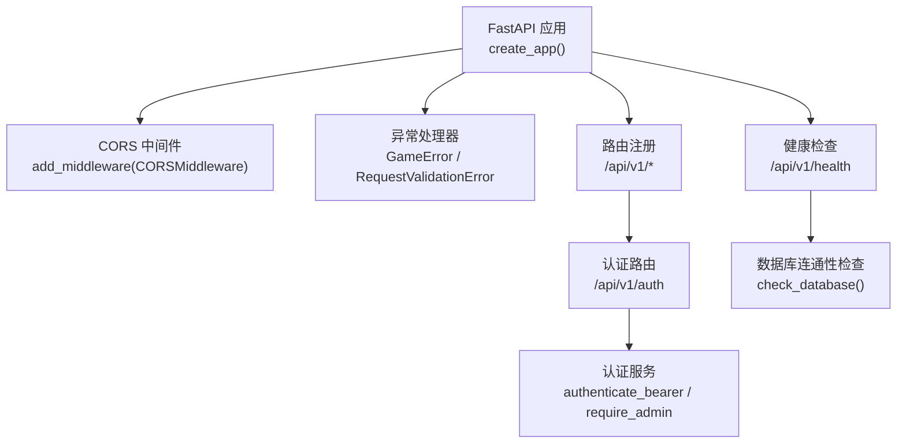
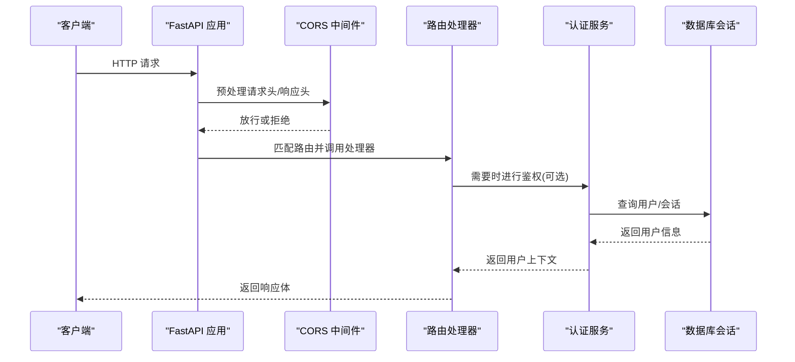
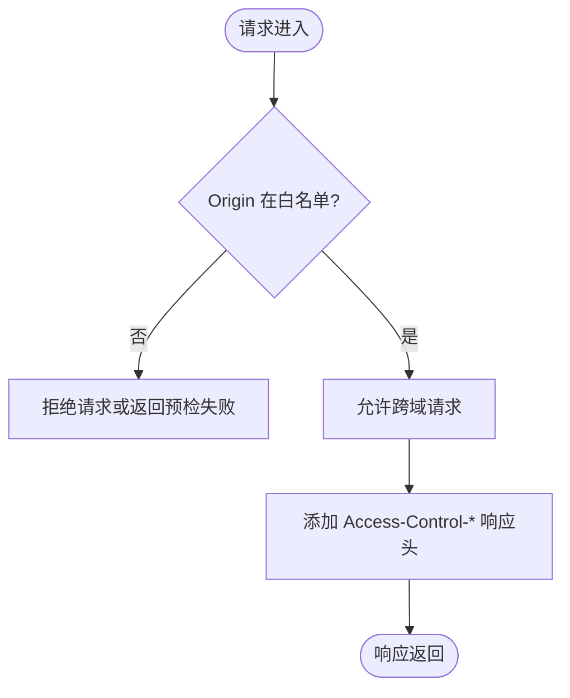
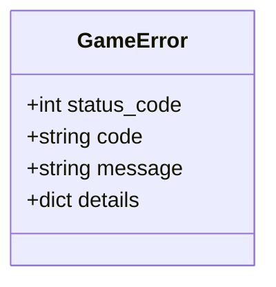
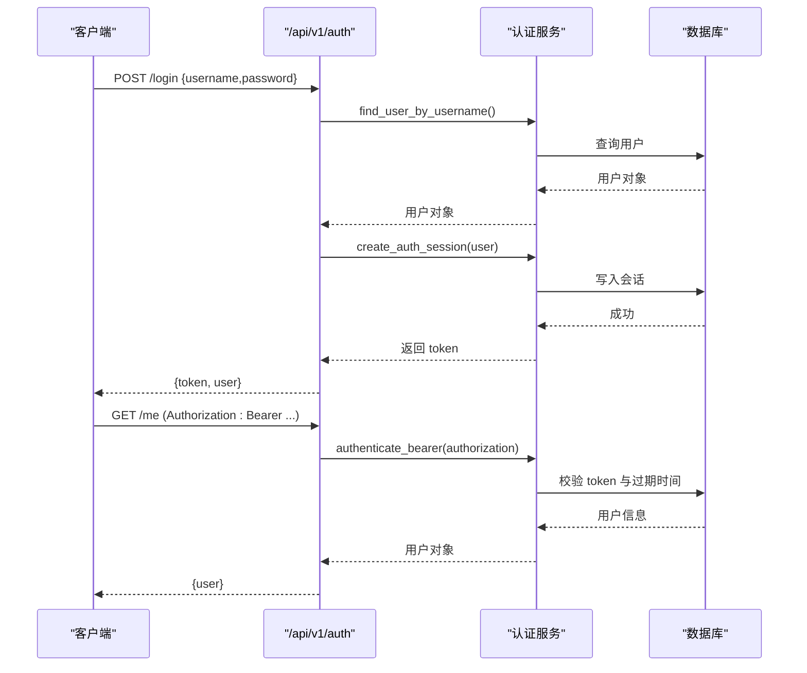
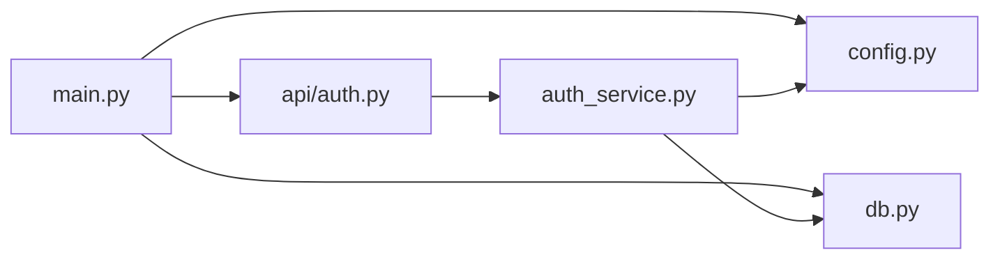
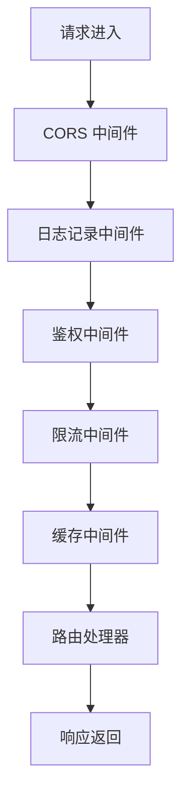

# 中间件系统

<cite>
**本文引用的文件**   
- [main.py](file://backend/app/main.py)
- [config.py](file://backend/app/config.py)
- [auth_service.py](file://backend/app/auth_service.py)
- [db.py](file://backend/app/db.py)
- [game_errors.py](file://backend/app/game_errors.py)
- [auth.py](file://backend/app/api/auth.py)
</cite>

## 目录
1. [简介](#简介)
2. [项目结构](#项目结构)
3. [核心组件](#核心组件)
4. [架构总览](#架构总览)
5. [详细组件分析](#详细组件分析)
6. [依赖关系分析](#依赖关系分析)
7. [性能考量](#性能考量)
8. [故障排查指南](#故障排查指南)
9. [结论](#结论)
10. [附录](#附录)

## 简介
本文件面向澳秘 Macau Mystery 后端的 FastAPI 中间件系统，系统性阐述请求处理管道、响应修改机制与扩展点。重点覆盖：
- FastAPI 中间件的执行顺序与生命周期
- CORS 中间件的配置与安全头部策略
- 自定义中间件实现模式（日志记录、性能监控、请求拦截、响应缓存、身份验证、限流控制）
- 错误处理与调试技巧
- 异步操作优化与最佳实践

## 项目结构
后端应用通过一个工厂函数创建 FastAPI 实例，集中注册异常处理器、CORS 中间件与路由。配置项从环境变量加载，支持跨域白名单等关键设置。认证逻辑以服务层形式提供，供 API 路由按需调用。数据库连接与会话管理采用异步 SQLAlchemy。

**图表来源** 
- [main.py:17-107](file://backend/app/main.py#L17-L107)
- [config.py:56-77](file://backend/app/config.py#L56-L77)
- [auth.py:64-97](file://backend/app/api/auth.py#L64-L97)
- [auth_service.py:100-131](file://backend/app/auth_service.py#L100-L131)
- [db.py:35-42](file://backend/app/db.py#L35-L42)

**章节来源**
- [main.py:17-107](file://backend/app/main.py#L17-L107)
- [config.py:1-77](file://backend/app/config.py#L1-77)

## 核心组件
- 应用工厂 create_app：构建 FastAPI 实例、注册异常处理器、添加 CORS 中间件、挂载路由与健康端点。
- 配置模块 Settings：集中读取环境变量，提供 cors_origins、数据库 URL、演示数据开关、令牌 TTL 等。
- 认证服务 auth_service：提供用户名/密码校验、会话创建、Bearer Token 校验与管理员权限校验。
- 数据库工具 db：异步引擎与 SessionLocal、会话依赖 get_db_session、健康检查 check_database。
- 游戏错误 game_errors：统一业务异常 GameError，配合全局异常处理器输出稳定错误体。

**章节来源**
- [main.py:17-107](file://backend/app/main.py#L17-L107)
- [config.py:38-77](file://backend/app/config.py#L38-L77)
- [auth_service.py:27-131](file://backend/app/auth_service.py#L27-L131)
- [db.py:12-42](file://backend/app/db.py#L12-L42)
- [game_errors.py:7-20](file://backend/app/game_errors.py#L7-L20)

## 架构总览
FastAPI 的请求处理管道由“中间件 -> 路由 -> 依赖注入 -> 业务逻辑”组成。当前已内置的中间件为 CORS；其余如日志、鉴权、限流、缓存等可按需以自定义中间件或依赖注入方式扩展。

**图表来源** 
- [main.py:76-82](file://backend/app/main.py#L76-L82)
- [auth.py:90-97](file://backend/app/api/auth.py#L90-L97)
- [auth_service.py:100-131](file://backend/app/auth_service.py#L100-L131)
- [db.py:30-33](file://backend/app/db.py#L30-L33)

## 详细组件分析

### CORS 中间件与跨域策略
- 配置来源：Settings.cors_origins 来自环境变量 CORS_ORIGINS，默认包含本地开发地址。
- 行为要点：allow_credentials=True 允许携带 Cookie/授权头；allow_methods/allow_headers 使用通配符简化开发环境配置。
- 安全建议：生产环境应精确限定 allow_origins，避免使用 *；必要时细化 allow_methods 与 allow_headers。

**图表来源** 
- [main.py:76-82](file://backend/app/main.py#L76-L82)
- [config.py:19-24](file://backend/app/config.py#L19-L24)
- [config.py:56-77](file://backend/app/config.py#L56-L77)

**章节来源**
- [main.py:76-82](file://backend/app/main.py#L76-L82)
- [config.py:10-24](file://backend/app/config.py#L10-L24)
- [config.py:56-77](file://backend/app/config.py#L56-L77)

### 异常处理与错误体规范
- GameError：业务异常统一封装状态码、错误码、消息与详情，便于前端稳定解析。
- 请求校验异常：对 /api/v1/game 路径下的校验错误进行格式化，返回统一的 error 结构。
- 健康检查：根据数据库连通性返回不同状态码与内容。

**图表来源** 
- [game_errors.py:7-20](file://backend/app/game_errors.py#L7-L20)
- [main.py:38-74](file://backend/app/main.py#L38-L74)

**章节来源**
- [game_errors.py:7-20](file://backend/app/game_errors.py#L7-L20)
- [main.py:38-74](file://backend/app/main.py#L38-L74)
- [main.py:98-105](file://backend/app/main.py#L98-L105)

### 认证流程与依赖注入
- 登录/注册：基于 Pydantic 模型与字段校验器完成输入校验，持久化用户与会话，返回 token 与用户信息。
- 鉴权：在受保护接口中通过 Header("authorization") 获取 Bearer Token，调用 authenticate_bearer 校验有效性并更新 last_used_at。
- 管理员权限：require_admin 在基础鉴权基础上增加角色检查。

**图表来源** 
- [auth.py:64-97](file://backend/app/api/auth.py#L64-L97)
- [auth_service.py:83-131](file://backend/app/auth_service.py#L83-L131)
- [db.py:30-33](file://backend/app/db.py#L30-L33)

**章节来源**
- [auth.py:28-97](file://backend/app/api/auth.py#L28-L97)
- [auth_service.py:59-131](file://backend/app/auth_service.py#L59-L131)

### 数据库与连接健康检查
- 引擎与会话：使用 async_sessionmaker 创建 AsyncSession，SQLite 下启用外键与 busy_timeout。
- 健康检查：check_database 尝试 SELECT 1 判断连通性，用于健康端点。

**章节来源**
- [db.py:12-42](file://backend/app/db.py#L12-L42)

## 依赖关系分析
- main.py 依赖 config.py 获取 CORS 与启动参数，依赖 db.py 进行健康检查，依赖各 API 路由。
- auth.py 依赖 auth_service.py 进行认证与权限校验，依赖 db.py 的会话依赖。
- auth_service.py 依赖 config.py 获取令牌 TTL，依赖 db_models 与 sqlalchemy 进行数据访问。

**图表来源** 
- [main.py:17-107](file://backend/app/main.py#L17-L107)
- [config.py:56-77](file://backend/app/config.py#L56-L77)
- [auth.py:1-97](file://backend/app/api/auth.py#L1-L97)
- [auth_service.py:1-153](file://backend/app/auth_service.py#L1-L153)
- [db.py:1-42](file://backend/app/db.py#L1-L42)

**章节来源**
- [main.py:17-107](file://backend/app/main.py#L17-L107)
- [auth.py:1-97](file://backend/app/api/auth.py#L1-L97)
- [auth_service.py:1-153](file://backend/app/auth_service.py#L1-L153)
- [db.py:1-42](file://backend/app/db.py#L1-L42)
- [config.py:1-77](file://backend/app/config.py#L1-77)

## 性能考量
- 中间件顺序：CORS 位于最外层，确保所有请求均能正确设置跨域头；后续可扩展日志、鉴权、限流、缓存等中间件，注意顺序对性能与正确性的影响。
- 异步 I/O：数据库与会话均为异步，避免阻塞事件循环；外部调用（如 LLM/TTS）建议使用异步客户端或线程池隔离 CPU 密集任务。
- 连接池与超时：SQLite 已开启 PRAGMA 外键与 busy_timeout；MySQL/PostgreSQL 场景建议合理设置 pool_size、max_overflow、connect_timeout。
- 缓存策略：对读多写少的接口可引入响应缓存（如 Redis），结合 ETag/Last-Modified 减少重复计算。
- 限流控制：在高并发场景下，可在鉴权前加入速率限制中间件，按 IP/用户维度限制请求频率。

[本节为通用指导，不直接分析具体文件]

## 故障排查指南
- CORS 问题：确认 Origin 是否在 cors_origins 列表中；检查 allow_credentials 与敏感头是否被允许；浏览器控制台查看预检请求与响应头。
- 认证失败：检查 Authorization 头格式是否为 "Bearer <token>"；确认 token 未过期且用户处于激活状态；核对数据库会话记录。
- 健康检查失败：检查 DATABASE_URL 是否正确；确认数据库服务可用；查看 Alembic 迁移是否已执行。
- 校验错误：关注 /api/v1/game 路径下的 VALIDATION_ERROR 结构，定位 path、message、type 字段。

**章节来源**
- [main.py:76-82](file://backend/app/main.py#L76-L82)
- [main.py:51-74](file://backend/app/main.py#L51-L74)
- [auth_service.py:100-131](file://backend/app/auth_service.py#L100-L131)
- [db.py:35-42](file://backend/app/db.py#L35-L42)

## 结论
当前后端已具备稳定的 FastAPI 应用骨架与 CORS 中间件，认证逻辑清晰、错误体规范统一。建议在现有基础上逐步引入日志、鉴权、限流、缓存等中间件，形成可观测、可扩展、高可用的请求处理管道。

[本节为总结性内容，不直接分析具体文件]

## 附录

### 中间件执行顺序与扩展建议
- 推荐顺序：CORS -> 日志记录 -> 鉴权 -> 限流 -> 缓存 -> 业务路由
- 日志记录中间件：记录请求方法、路径、耗时、状态码与异常堆栈；区分访问日志与错误日志。
- 鉴权中间件：统一解析 Authorization 头，注入当前用户到请求上下文，支持角色/权限校验。
- 限流中间件：支持滑动窗口或令牌桶算法，按 IP/用户维度限制 QPS。
- 缓存中间件：对 GET 请求进行响应缓存，支持条件缓存与失效策略。

[本图为概念性流程图，不映射具体源码文件]

### 自定义中间件实现模式（示例说明）
- 日志记录中间件：在请求进入与离开时分别记录开始时间与结束时间，计算耗时并输出结构化日志。
- 鉴权中间件：解析 Authorization 头，调用认证服务校验 token，将用户上下文注入到请求对象或依赖注入中。
- 限流中间件：维护每个客户端的请求计数与时间窗口，超出阈值返回 429。
- 缓存中间件：对 GET 请求生成缓存键（路径+查询串），命中则直接返回缓存响应，否则执行业务逻辑并回填缓存。

[本节为通用实现指导，不直接分析具体文件]