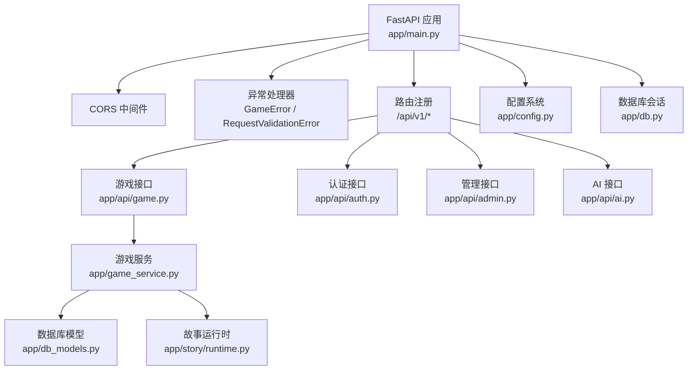
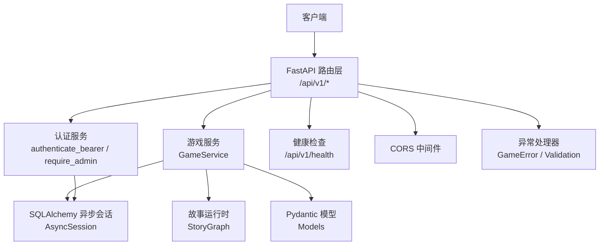
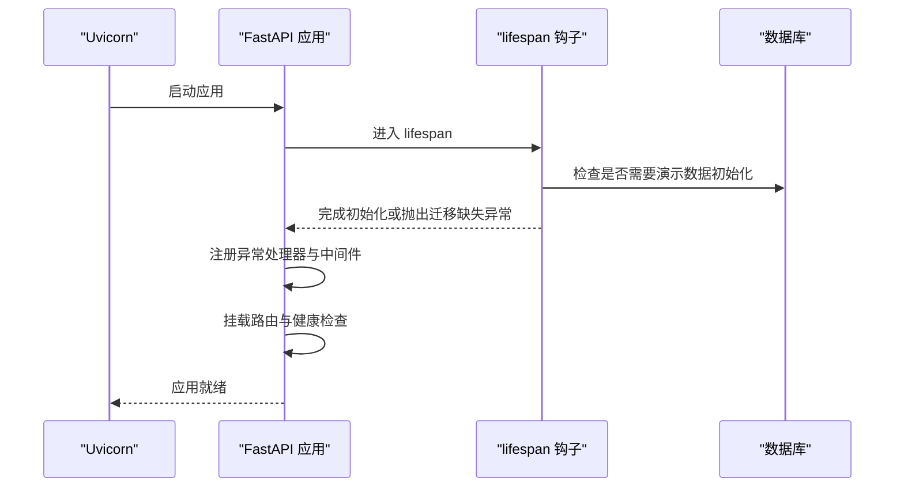
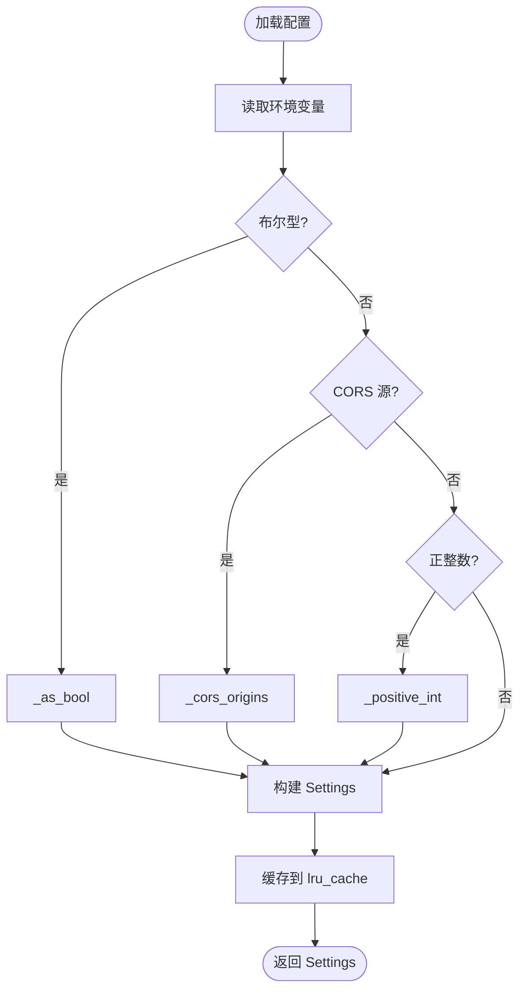
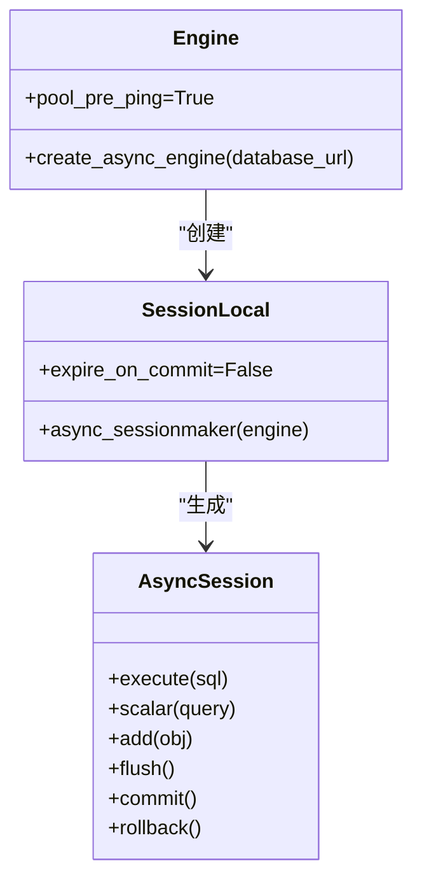
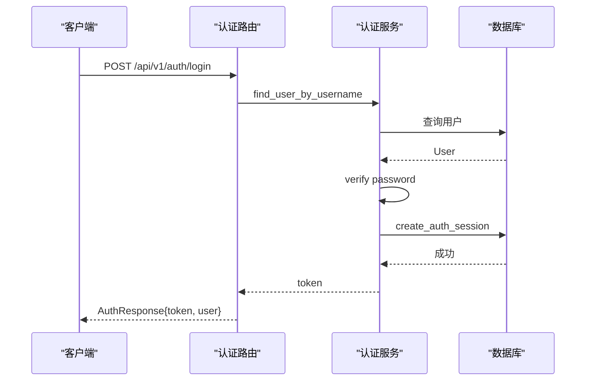
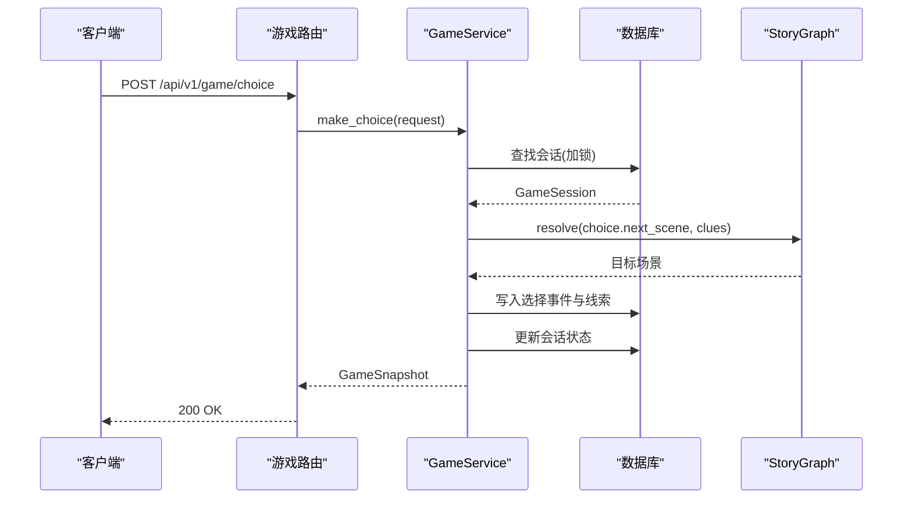
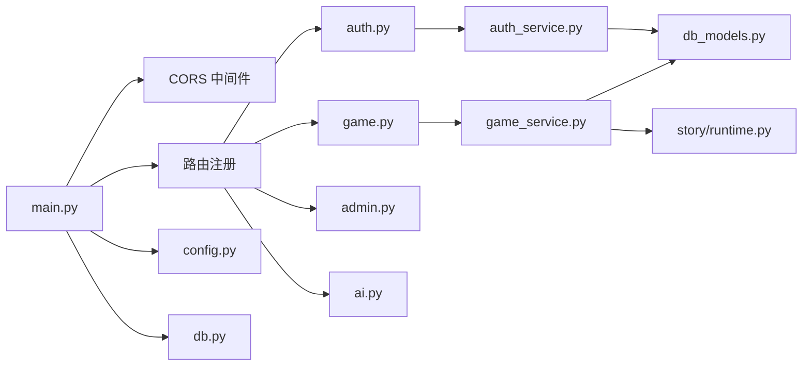

# 后端架构

<cite>
**本文引用的文件**   
- [main.py](file://backend/app/main.py)
- [config.py](file://backend/app/config.py)
- [db.py](file://backend/app/db.py)
- [auth_service.py](file://backend/app/auth_service.py)
- [game_errors.py](file://backend/app/game_errors.py)
- [models.py](file://backend/app/models.py)
- [game.py](file://backend/app/api/game.py)
- [auth.py](file://backend/app/api/auth.py)
- [admin.py](file://backend/app/api/admin.py)
- [ai.py](file://backend/app/api/ai.py)
- [db_models.py](file://backend/app/db_models.py)
- [runtime.py](file://backend/app/story/runtime.py)
- [Dockerfile](file://backend/Dockerfile)
- [docker-compose.yml](file://docker-compose.yml)
</cite>

## 目录
1. [简介](#简介)
2. [项目结构](#项目结构)
3. [核心组件](#核心组件)
4. [架构总览](#架构总览)
5. [详细组件分析](#详细组件分析)
6. [依赖关系分析](#依赖关系分析)
7. [性能考量](#性能考量)
8. [故障排查指南](#故障排查指南)
9. [结论](#结论)
10. [附录](#附录)

## 简介
本文件为澳秘 Macau Mystery 后端服务的全面架构文档，聚焦 FastAPI 应用的模块化设计、启动流程、中间件与异常处理、依赖注入、路由组织、请求生命周期、CORS 跨域、数据库连接池与异步操作、错误统一封装、配置与环境变量安全、部署方案，以及微服务拆分原则、模块间通信模式与扩展点设计。目标是帮助后端开发者快速理解系统并高效扩展。

## 项目结构
后端采用按功能域划分的模块化结构：
- 应用入口与生命周期：app/main.py
- 配置与环境：app/config.py
- 数据库引擎与会话：app/db.py、app/db_models.py
- 认证与会话管理：app/auth_service.py
- API 路由层：app/api/*（game、auth、admin、ai、ugc、ugc_user）
- 游戏业务与服务：app/game_service.py、app/models.py、app/game_errors.py
- 故事运行时与图遍历：app/story/runtime.py
- 容器化与编排：backend/Dockerfile、docker-compose.yml

图表来源
- [main.py:17-107](file://backend/app/main.py#L17-L107)
- [game.py:12-37](file://backend/app/api/game.py#L12-L37)
- [auth.py:24-97](file://backend/app/api/auth.py#L24-L97)
- [admin.py:12-218](file://backend/app/api/admin.py#L12-L218)
- [ai.py:1-29](file://backend/app/api/ai.py#L1-L29)
- [game_service.py:31-386](file://backend/app/game_service.py#L31-L386)
- [db_models.py:20-160](file://backend/app/db_models.py#L20-L160)
- [runtime.py:22-80](file://backend/app/story/runtime.py#L22-L80)
- [config.py:38-77](file://backend/app/config.py#L38-L77)
- [db.py:12-42](file://backend/app/db.py#L12-L42)

章节来源
- [main.py:17-107](file://backend/app/main.py#L17-L107)
- [config.py:38-77](file://backend/app/config.py#L38-L77)
- [db.py:12-42](file://backend/app/db.py#L12-L42)

## 核心组件
- 应用工厂与生命周期：create_app 构建 FastAPI 实例，定义 lifespan 钩子用于演示数据初始化；注册全局异常处理器与 CORS 中间件；挂载各功能域路由与健康检查端点。
- 配置系统：Settings dataclass 通过环境变量加载配置，提供布尔、元组、正整数等类型转换与校验，缓存单例。
- 数据库层：异步引擎创建、SQLite 外键与忙超时设置、SessionLocal 会话工厂、get_db_session 依赖注入、check_database 健康检查。
- 认证服务：用户名/密码校验、昵称规范化、密码哈希、Bearer Token 鉴权与会话持久化、管理员权限校验、演示账户引导。
- 游戏服务：事务性游戏推进、幂等选择、线索发放、状态快照生成、故事版本与媒体就绪校验、并发锁与重放保护。
- 模型与契约：Pydantic 模型定义 API 契约，严格字段校验与额外字段禁止。
- 故事运行时：StoryGraph 负责场景解析、路由跳转、选择验证与预取预览。

章节来源
- [main.py:17-107](file://backend/app/main.py#L17-L107)
- [config.py:38-77](file://backend/app/config.py#L38-L77)
- [db.py:12-42](file://backend/app/db.py#L12-L42)
- [auth_service.py:59-153](file://backend/app/auth_service.py#L59-L153)
- [game_service.py:31-386](file://backend/app/game_service.py#L31-L386)
- [models.py:8-92](file://backend/app/models.py#L8-L92)
- [runtime.py:22-80](file://backend/app/story/runtime.py#L22-L80)

## 架构总览
整体采用“路由层 -> 服务层 -> 数据层”的分层架构，配合 FastAPI 的依赖注入与中间件机制，实现清晰的职责边界与可测试性。

图表来源
- [main.py:76-96](file://backend/app/main.py#L76-L96)
- [game.py:15-37](file://backend/app/api/game.py#L15-L37)
- [auth.py:64-97](file://backend/app/api/auth.py#L64-L97)
- [game_service.py:31-386](file://backend/app/game_service.py#L31-L386)
- [db.py:30-42](file://backend/app/db.py#L30-L42)
- [runtime.py:22-80](file://backend/app/story/runtime.py#L22-L80)
- [models.py:8-92](file://backend/app/models.py#L8-L92)

## 详细组件分析

### 应用启动与生命周期
- create_app 中通过 lifespan 在启动时根据配置执行演示数据初始化（故事与用户），捕获数据库迁移缺失异常并提示执行 alembic upgrade head。
- 注册全局异常处理器：GameError 统一返回结构化错误体；RequestValidationError 针对游戏接口返回统一的 VALIDATION_ERROR 格式。
- 添加 CORS 中间件，允许指定来源、凭据与通配方法/头。
- 挂载各功能域路由，前缀分别为 /api/v1/game、/api/v1/ai、/api/v1/create、/api/v1/admin、/api/v1/auth、/api/v1/ugc。
- 健康检查端点 /api/v1/health 调用 check_database 判断数据库可用性并返回状态。

图表来源
- [main.py:20-36](file://backend/app/main.py#L20-L36)
- [main.py:38-82](file://backend/app/main.py#L38-L82)
- [main.py:84-107](file://backend/app/main.py#L84-L107)
- [db.py:35-42](file://backend/app/db.py#L35-L42)

章节来源
- [main.py:17-107](file://backend/app/main.py#L17-L107)

### 配置管理与环境变量安全
- Settings 使用 dataclass 冻结不可变对象，提供 is_production 属性。
- get_settings 使用 lru_cache 缓存配置实例，避免重复读取环境变量。
- 支持的环境变量包括 DATABASE_URL、CORS_ORIGINS、APP_ENV、BOOTSTRAP_DEMO_STORY、BOOTSTRAP_DEMO_USERS、AUTH_TOKEN_TTL_HOURS、DEMO_* 系列账号。
- 类型转换函数 _as_bool、_cors_origins、_positive_int 提供严格的输入校验与默认值策略。

图表来源
- [config.py:13-36](file://backend/app/config.py#L13-L36)
- [config.py:56-77](file://backend/app/config.py#L56-L77)

章节来源
- [config.py:38-77](file://backend/app/config.py#L38-L77)

### 数据库连接池与异步会话
- create_async_engine 创建异步引擎，启用 pool_pre_ping 确保连接健康。
- SQLite 特殊处理：通过事件监听器开启外键约束与 busy_timeout。
- SessionLocal 使用 async_sessionmaker 创建 AsyncSession，expire_on_commit=False 提升复用效率。
- get_db_session 作为 FastAPI 依赖注入，自动管理会话生命周期。
- check_database 通过 SELECT 1 检测数据库连通性。

图表来源
- [db.py:12-27](file://backend/app/db.py#L12-L27)
- [db.py:30-42](file://backend/app/db.py#L30-L42)

章节来源
- [db.py:12-42](file://backend/app/db.py#L12-L42)

### 认证与授权
- 用户名/密码校验：validate_username、validate_password、normalize_nickname。
- 密码哈希：pwdlib PasswordHash.recommended()。
- 登录与注册：login 验证凭据并创建会话；register 原子创建用户与会话，处理唯一性冲突。
- Bearer 令牌鉴权：authenticate_bearer 校验 token 摘要、过期时间与用户活跃状态；require_admin 强制管理员角色。
- 演示账户引导：bootstrap_demo_users 在非生产环境创建默认管理员与访客账户。

图表来源
- [auth.py:64-87](file://backend/app/api/auth.py#L64-L87)
- [auth_service.py:59-97](file://backend/app/auth_service.py#L59-L97)

章节来源
- [auth.py:24-97](file://backend/app/api/auth.py#L24-L97)
- [auth_service.py:59-153](file://backend/app/auth_service.py#L59-L153)

### 游戏 API 与事务性推进
- 路由：start_game、make_choice、get_state，均通过 Depends(get_db_session) 注入会话。
- 服务：GameService.start_game 创建会话与初始事件；make_choice 进行幂等检查、并发锁、状态校验、线索发放、下一场景解析与快照生成；get_state 返回当前快照。
- 幂等性：基于 request_id 与 payload 匹配，避免重复提交导致的状态不一致。
- 并发控制：PostgreSQL 使用 with_for_update 锁定行；SQLite 使用 BEGIN IMMEDIATE 与显式事务。
- 错误统一：通过 GameError 抛出结构化错误码与详情。

图表来源
- [game.py:15-37](file://backend/app/api/game.py#L15-L37)
- [game_service.py:70-193](file://backend/app/game_service.py#L70-L193)
- [runtime.py:37-61](file://backend/app/story/runtime.py#L37-L61)

章节来源
- [game.py:12-37](file://backend/app/api/game.py#L12-L37)
- [game_service.py:31-386](file://backend/app/game_service.py#L31-L386)

### 模型与契约
- Pydantic 模型定义严格契约：GameContractModel 禁止额外字段；ChoiceRequest、GameStartRequest 等包含长度、正则与必填校验。
- 响应模型：GameSnapshot、GameSceneResponse、GameMediaResponse、GameClueResponse 等描述完整的游戏状态与媒体信息。
- AI 与 TTS 模型：ChatRequest、ChatResponse、TtsResponse 等预留扩展点。

章节来源
- [models.py:8-146](file://backend/app/models.py#L8-L146)

### 故事运行时
- StoryGraph 维护场景索引，支持 RouterScene 的条件路由与最大跳数限制，防止循环与无限跳转。
- choice、preview_choice 提供选择验证与预取能力，结合线索集合决定可达场景。
- 错误 StoryRuntimeError 用于运行时数据不一致或路由失败。

章节来源
- [runtime.py:22-80](file://backend/app/story/runtime.py#L22-L80)

### 管理接口与 UGC/AI
- 管理接口 admin.py 提供脚本 CRUD、发布/草稿切换、统计、提交审核、路线配置等，受管理员权限保护。
- AI 接口 ai.py 提供 NPC 对话与 TTS 合成，当前为 Mock，预留接入 LLM 与 edge-tts 的扩展点。

章节来源
- [admin.py:12-218](file://backend/app/api/admin.py#L12-L218)
- [ai.py:1-29](file://backend/app/api/ai.py#L1-L29)

## 依赖关系分析
- 路由层依赖服务层与数据库会话，服务层依赖模型与运行时，运行时依赖故事契约与数据一致性。
- 认证服务依赖数据库模型与会话工厂，管理接口依赖认证服务进行权限控制。
- 配置系统被多处引用，保证一致的环境行为。

图表来源
- [main.py:84-96](file://backend/app/main.py#L84-L96)
- [game.py:12-37](file://backend/app/api/game.py#L12-L37)
- [auth.py:24-97](file://backend/app/api/auth.py#L24-L97)
- [admin.py:12-218](file://backend/app/api/admin.py#L12-L218)
- [ai.py:1-29](file://backend/app/api/ai.py#L1-L29)
- [game_service.py:31-386](file://backend/app/game_service.py#L31-L386)
- [db_models.py:20-160](file://backend/app/db_models.py#L20-L160)
- [runtime.py:22-80](file://backend/app/story/runtime.py#L22-L80)
- [config.py:38-77](file://backend/app/config.py#L38-L77)
- [db.py:12-42](file://backend/app/db.py#L12-L42)

章节来源
- [main.py:84-96](file://backend/app/main.py#L84-L96)
- [game_service.py:31-386](file://backend/app/game_service.py#L31-L386)

## 性能考量
- 数据库连接池：启用 pool_pre_ping 减少无效连接；SQLite 外键与忙超时优化并发访问。
- 会话复用：expire_on_commit=False 避免每次提交后失效，提高复用率。
- 事务与锁：PostgreSQL 使用 with_for_update 行级锁；SQLite 使用 BEGIN IMMEDIATE 避免写竞争。
- 幂等性：request_id 去重与响应回放降低重复提交开销。
- 预取与快照：选择预取减少往返次数，快照一次性返回完整状态。
- 健康检查：check_database 快速探测数据库可用性，便于负载均衡与健康探针。

[本节为通用指导，不直接分析具体文件]

## 故障排查指南
- 数据库未迁移：lifespan 初始化阶段抛出 RuntimeError，需执行 alembic upgrade head。
- 请求校验失败：游戏接口返回 VALIDATION_ERROR，包含 path、message、type 等详细信息。
- 会话不存在或状态异常：GameError 返回 SESSION_NOT_FOUND、SESSION_COMPLETED、SESSION_NOT_ACTIVE、STALE_SCENE 等。
- 故事数据损坏：STORY_DATA_CORRUPTED 表示已发布剧情数据异常，需检查版本内容与约束。
- 幂等冲突：IDEMPOTENCY_CONFLICT 表示 request_id 已被不同请求使用，需客户端重试或更换 ID。
- 健康检查降级：/api/v1/health 返回 degraded 状态，检查 DATABASE_URL 与连接池配置。

章节来源
- [main.py:20-36](file://backend/app/main.py#L20-L36)
- [main.py:51-74](file://backend/app/main.py#L51-L74)
- [game_service.py:195-234](file://backend/app/game_service.py#L195-L234)
- [game_service.py:353-386](file://backend/app/game_service.py#L353-L386)
- [db.py:35-42](file://backend/app/db.py#L35-L42)

## 结论
本架构以 FastAPI 为核心，结合 SQLAlchemy 异步会话、Pydantic 契约与模块化路由，实现了清晰的分层与可扩展性。通过统一的异常处理、幂等性与并发控制，保障了游戏推进的一致性与可靠性。配置与环境变量管理确保了多环境安全与灵活性。未来可通过微服务拆分（如 AI、UGC、知识检索）与消息队列增强解耦与水平扩展。

[本节为总结，不直接分析具体文件]

## 附录

### 部署与运行
- Docker 镜像基于 python:3.11-slim，安装依赖并暴露 8000 端口。
- docker-compose 提供开发环境，自动执行 alembic upgrade head 并启动 uvicorn --reload。
- 环境变量建议：DATABASE_URL、APP_ENV、CORS_ORIGINS、AUTH_TOKEN_TTL_HOURS、DEMO_*。

章节来源
- [Dockerfile:1-13](file://backend/Dockerfile#L1-L13)
- [docker-compose.yml:1-21](file://docker-compose.yml#L1-L21)

### 微服务拆分原则与扩展点
- 拆分原则：按领域边界（游戏、认证、AI、UGC、知识检索）独立服务，通过 HTTP/gRPC 或消息队列通信。
- 扩展点：AI NPC 对话与 TTS 预留接口；UGC 生成与风格预设可扩展；知识检索（Chroma）可独立为向量服务。
- 模块间通信：RESTful API 为主，异步任务使用 Celery/RabbitMQ；配置中心统一管理环境变量与密钥。

[本节为概念性内容，不直接分析具体文件]