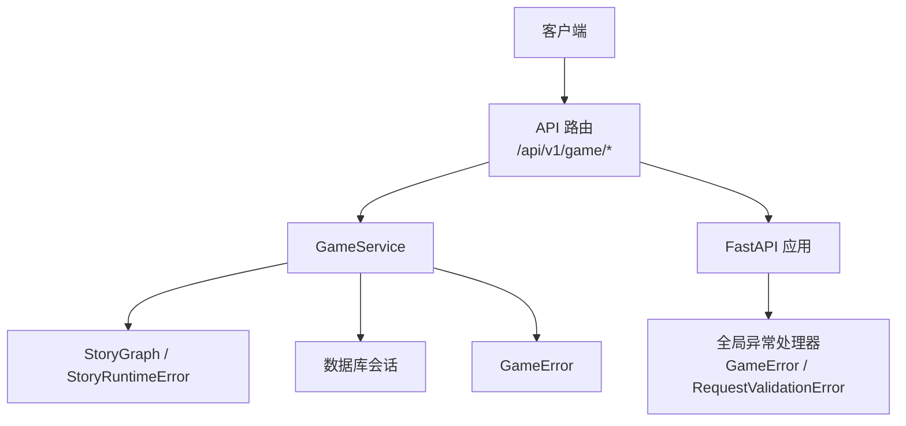
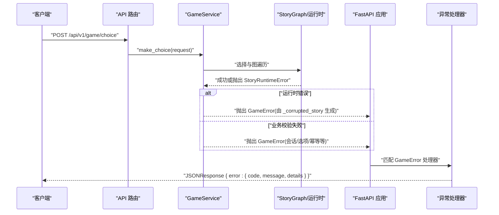
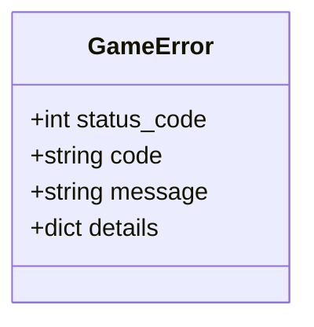
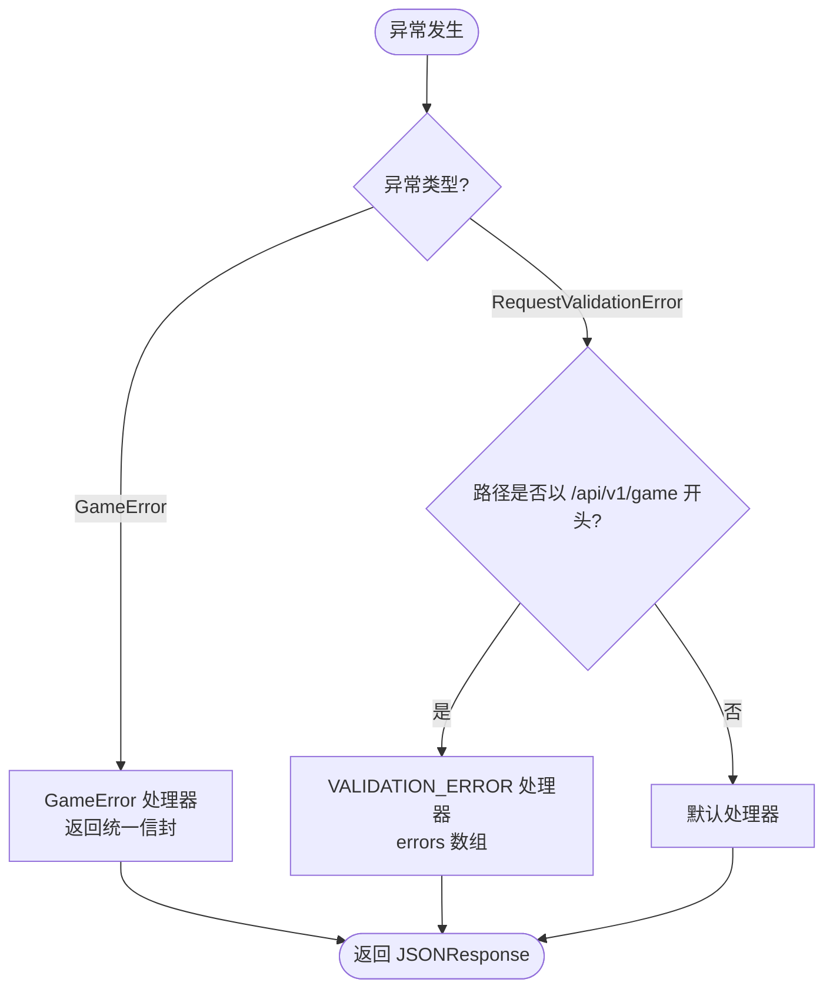
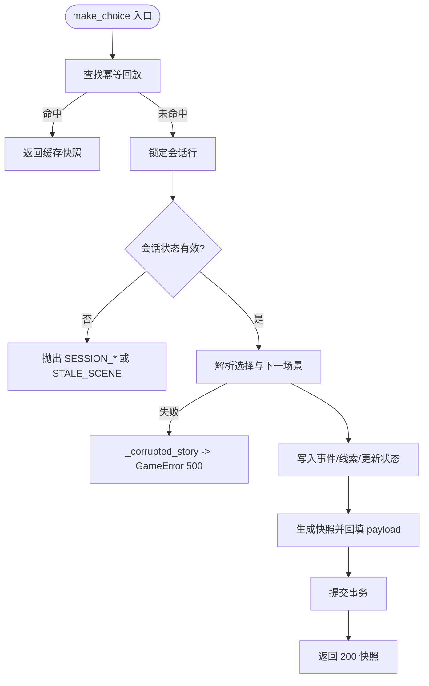
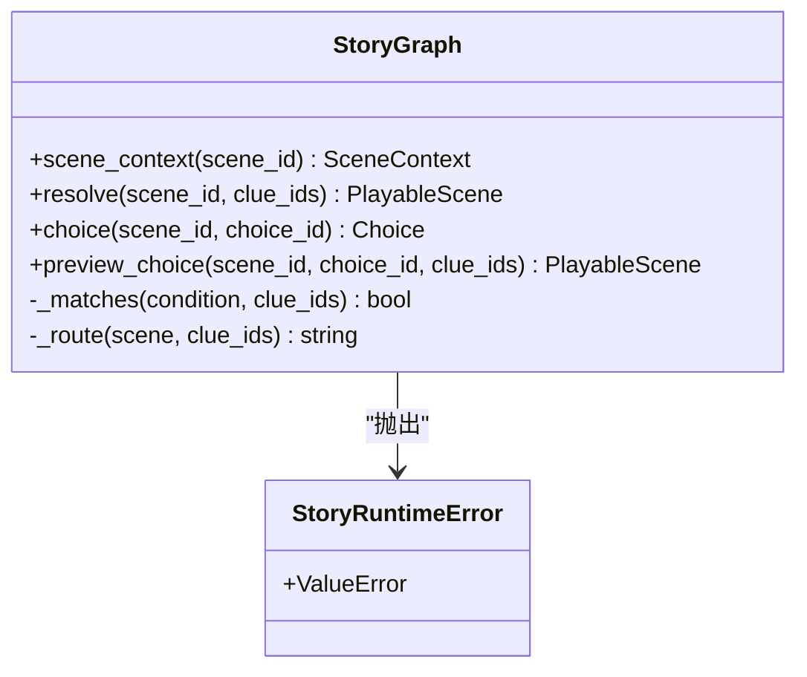
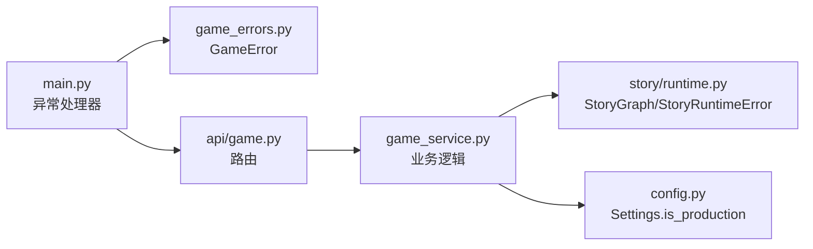

# 异常处理机制

<cite>
**本文引用的文件**   
- [backend/app/game_errors.py](file://backend/app/game_errors.py)
- [backend/app/main.py](file://backend/app/main.py)
- [backend/app/game_service.py](file://backend/app/game_service.py)
- [backend/app/api/game.py](file://backend/app/api/game.py)
- [backend/app/story/runtime.py](file://backend/app/story/runtime.py)
- [backend/app/config.py](file://backend/app/config.py)
- [backend/tests/test_game_api.py](file://backend/tests/test_game_api.py)
</cite>

## 目录
1. [简介](#简介)
2. [项目结构](#项目结构)
3. [核心组件](#核心组件)
4. [架构总览](#架构总览)
5. [详细组件分析](#详细组件分析)
6. [依赖关系分析](#依赖关系分析)
7. [性能考量](#性能考量)
8. [故障排查指南](#故障排查指南)
9. [结论](#结论)
10. [附录](#附录)

## 简介
本文件系统化梳理澳秘 Macau Mystery 后端的异常处理机制，围绕自定义异常类 GameError、FastAPI 全局与路由级异常处理器、请求验证异常的定制化处理、错误响应格式标准化、调试信息控制、异常分类体系、错误日志记录与监控告警集成等维度展开。文档同时提供生产环境与开发环境的差异化策略说明，并给出如何定义新异常类型、实现自定义异常处理器和构建友好错误响应的实践指引。

## 项目结构
后端采用 FastAPI 应用组织方式：
- 应用入口与全局异常处理器集中在应用创建函数中
- 业务异常通过领域服务层抛出统一的 GameError
- 运行时校验错误由 story 运行时抛出 StoryRuntimeError，并在服务层转换为 GameError
- API 路由仅负责参数绑定与调用服务层，不直接抛出 HTTPException

**图示来源** 
- [backend/app/main.py:17-107](file://backend/app/main.py#L17-L107)
- [backend/app/api/game.py:12-37](file://backend/app/api/game.py#L12-L37)
- [backend/app/game_service.py:31-386](file://backend/app/game_service.py#L31-L386)
- [backend/app/story/runtime.py:9-80](file://backend/app/story/runtime.py#L9-L80)

**章节来源**
- [backend/app/main.py:17-107](file://backend/app/main.py#L17-L107)
- [backend/app/api/game.py:12-37](file://backend/app/api/game.py#L12-L37)

## 核心组件
- 自定义异常类 GameError：承载状态码、错误码、消息与可选详情，作为领域内统一异常载体
- FastAPI 全局异常处理器：
  - GameError 处理器：将异常映射为统一 JSON 错误信封
  - RequestValidationError 处理器：对游戏接口路径进行特殊处理，返回标准化的 VALIDATION_ERROR 信封
- 领域服务 GameService：在业务逻辑中抛出 GameError，封装故事数据损坏、会话状态不一致、幂等冲突等场景
- 运行时 StoryRuntimeError：纯运行时解析错误，被服务层捕获并转为 GameError

**章节来源**
- [backend/app/game_errors.py:7-20](file://backend/app/game_errors.py#L7-L20)
- [backend/app/main.py:38-74](file://backend/app/main.py#L38-L74)
- [backend/app/game_service.py:31-386](file://backend/app/game_service.py#L31-L386)
- [backend/app/story/runtime.py:9-10](file://backend/app/story/runtime.py#L9-L10)

## 架构总览
下图展示从请求进入 FastAPI 到异常被统一处理的完整链路，以及不同异常类型的流转与转换。

**图示来源** 
- [backend/app/api/game.py:23-28](file://backend/app/api/game.py#L23-L28)
- [backend/app/game_service.py:84-193](file://backend/app/game_service.py#L84-L193)
- [backend/app/story/runtime.py:37-61](file://backend/app/story/runtime.py#L37-L61)
- [backend/app/main.py:38-49](file://backend/app/main.py#L38-L49)

## 详细组件分析

### 自定义异常类 GameError
- 设计要点
  - 字段：status_code（HTTP 状态码）、code（错误码字符串）、message（人类可读消息）、details（结构化详情）
  - 用途：贯穿服务层与路由层，确保所有业务异常以统一契约返回
- 复杂度
  - 构造 O(1)，序列化由 FastAPI jsonable_encoder 处理
- 使用模式
  - 在服务层集中抛出，避免在各处重复拼装错误响应
  - 结合 _corrupted_story 等方法统一包装“数据损坏”类错误

**图示来源** 
- [backend/app/game_errors.py:7-20](file://backend/app/game_errors.py#L7-L20)

**章节来源**
- [backend/app/game_errors.py:7-20](file://backend/app/game_errors.py#L7-L20)

### FastAPI 异常处理器与全局捕获
- GameError 处理器
  - 将 GameError 的字段映射为统一信封：{ error: { code, message, details } }
  - 保持原始 status_code，便于前端按状态码分流
- RequestValidationError 处理器
  - 针对 /api/v1/game 路径，返回 VALIDATION_ERROR 信封，包含 errors 数组（path、message、type）
  - 非游戏路径回退到默认处理器，保证其他模块行为一致
- 全局 CORS 中间件与路由注册
  - 不影响异常处理，但需确保跨域配置正确，避免前端无法读取错误响应体

**图示来源** 
- [backend/app/main.py:38-74](file://backend/app/main.py#L38-L74)

**章节来源**
- [backend/app/main.py:38-74](file://backend/app/main.py#L38-L74)

### 领域服务 GameService 的异常分类与转换
- 异常分类
  - 资源不存在：SESSION_NOT_FOUND、STORY_NOT_FOUND（404）
  - 状态冲突：SESSION_COMPLETED、SESSION_NOT_ACTIVE、CHOICE_NOT_AVAILABLE、STALE_SCENE、IDEMPOTENCY_CONFLICT（409）
  - 服务不可用/准备不足：STORY_NOT_READY（503）
  - 数据损坏/内部错误：STORY_DATA_CORRUPTED、IDEMPOTENCY_RECORD_CORRUPTED（500）
- 运行时错误转换
  - StoryRuntimeError 被捕获并通过 _corrupted_story 转为 GameError，附带版本 ID 以便定位
- 幂等性与并发
  - 基于 request_id 的幂等记录，冲突时返回 IDEMPOTENCY_CONFLICT
  - SQLite 下显式 BEGIN IMMEDIATE 事务，确保并发选择最多推进一次

**图示来源** 
- [backend/app/game_service.py:84-193](file://backend/app/game_service.py#L84-L193)
- [backend/app/game_service.py:379-385](file://backend/app/game_service.py#L379-L385)

**章节来源**
- [backend/app/game_service.py:63-193](file://backend/app/game_service.py#L63-L193)
- [backend/app/game_service.py:379-385](file://backend/app/game_service.py#L379-L385)

### 运行时 StoryRuntimeError 与图遍历
- 职责
  - 场景上下文查找、路由跳转、选择有效性检查、预览选择
  - 遇到未知场景、循环路由、超出最大跳数、无匹配路由等情况抛出 StoryRuntimeError
- 与服务层协作
  - 服务层捕获 StoryRuntimeError，统一转换为 STORY_DATA_CORRUPTED 的 GameError，附带版本信息

**图示来源** 
- [backend/app/story/runtime.py:9-10](file://backend/app/story/runtime.py#L9-L10)
- [backend/app/story/runtime.py:31-79](file://backend/app/story/runtime.py#L31-L79)

**章节来源**
- [backend/app/story/runtime.py:9-80](file://backend/app/story/runtime.py#L9-L80)

### 请求验证异常的定制化处理
- 规则
  - 仅对 /api/v1/game 路径启用 VALIDATION_ERROR 信封
  - 错误数组包含 path（点分路径）、message、type 三字段
- 目的
  - 统一前端错误解析逻辑，屏蔽 FastAPI 默认差异

**章节来源**
- [backend/app/main.py:51-74](file://backend/app/main.py#L51-L74)

### 错误响应格式标准化
- 统一信封结构
  - error.code：稳定错误码，便于前端与监控分类
  - error.message：面向用户的提示
  - error.details：结构化附加信息（如版本 ID、冲突场景、请求负载摘要等）
- 适用范围
  - GameError 与 VALIDATION_ERROR 均遵循该结构

**章节来源**
- [backend/app/main.py:38-74](file://backend/app/main.py#L38-L74)

### 调试信息与生产环境控制
- 生产环境媒体就绪检查
  - is_production 为真时，若视频/海报未就绪则返回 STORY_NOT_READY（503），避免前端加载失败
- 开发环境
  - 允许 placeholder media，便于快速迭代
- 建议
  - 在生产开启结构化日志与追踪，将 error.details 上报至监控系统

**章节来源**
- [backend/app/config.py:51-53](file://backend/app/config.py#L51-L53)
- [backend/app/game_service.py:227-233](file://backend/app/game_service.py#L227-L233)

## 依赖关系分析
- 耦合与内聚
  - GameService 高内聚地管理会话、事件、线索与快照，异常集中在服务层抛出，降低路由层复杂度
  - StoryGraph 与 StoryRuntimeError 解耦于持久化，专注运行时解析
- 外部依赖
  - FastAPI 异常处理链路与 JSONResponse
  - SQLAlchemy 异步会话与事务
- 潜在循环依赖
  - 当前未发现循环导入；路由仅依赖服务，服务依赖运行时与模型

**图示来源** 
- [backend/app/main.py:38-74](file://backend/app/main.py#L38-L74)
- [backend/app/api/game.py:12-37](file://backend/app/api/game.py#L12-L37)
- [backend/app/game_service.py:31-386](file://backend/app/game_service.py#L31-L386)
- [backend/app/story/runtime.py:9-80](file://backend/app/story/runtime.py#L9-L80)
- [backend/app/config.py:51-53](file://backend/app/config.py#L51-L53)

**章节来源**
- [backend/app/main.py:38-74](file://backend/app/main.py#L38-L74)
- [backend/app/game_service.py:31-386](file://backend/app/game_service.py#L31-L386)

## 性能考量
- 事务与锁
  - SQLite 使用 BEGIN IMMEDIATE 防止并发写竞争；PostgreSQL 使用行级锁 with_for_update
- 幂等性
  - 基于 request_id 的回放机制减少重复计算与网络重试成本
- 运行时限制
  - 路由最大跳数防止无限循环，避免 CPU 耗尽
- 序列化开销
  - 错误详情使用 jsonable_encoder 安全序列化，注意避免过大 payload

[本节为通用指导，不直接分析具体文件]

## 故障排查指南
- 常见问题定位
  - 404 会话/故事不存在：检查 script_id 与 session_id 是否正确传入
  - 409 状态冲突：确认 scene_id 与 current_scene_key 一致；检查 request_id 是否重复且负载不同
  - 503 故事未就绪：检查媒体是否已上传完成；生产环境会严格校验
  - 500 数据损坏：查看 error.details 中的 story_version_id，核对已发布版本内容
- 验证错误
  - 422 请求校验失败：根据 errors[].path 定位字段，修正类型或必填项
- 测试用例参考
  - 覆盖会话结束、幂等回放、版本固定、错误信封一致性等场景

**章节来源**
- [backend/tests/test_game_api.py:172-184](file://backend/tests/test_game_api.py#L172-L184)
- [backend/tests/test_game_api.py:124-149](file://backend/tests/test_game_api.py#L124-L149)

## 结论
本项目通过 GameError 统一业务异常表达，配合 FastAPI 的全局与路由级异常处理器，实现了稳定的错误响应契约。服务层集中抛出异常，运行时错误被转换为领域错误，既保证了可观测性，也提升了前端的容错体验。生产环境通过 is_production 控制媒体就绪校验，结合幂等与事务保障一致性。建议在后续迭代中补充结构化日志与监控告警，将 error.code 与 error.details 纳入指标与告警规则，进一步提升稳定性与可运维性。

[本节为总结性内容，不直接分析具体文件]

## 附录

### 异常分类与状态码映射
- 4xx 客户端错误
  - 404：SESSION_NOT_FOUND、STORY_NOT_FOUND
  - 409：SESSION_COMPLETED、SESSION_NOT_ACTIVE、CHOICE_NOT_AVAILABLE、STALE_SCENE、IDEMPOTENCY_CONFLICT
- 5xx 服务端错误
  - 500：STORY_DATA_CORRUPTED、IDEMPOTENCY_RECORD_CORRUPTED
  - 503：STORY_NOT_READY

**章节来源**
- [backend/app/game_service.py:63-193](file://backend/app/game_service.py#L63-L193)
- [backend/app/game_service.py:379-385](file://backend/app/game_service.py#L379-L385)

### 新增异常类型与处理器示例（步骤）
- 定义新的 GameError 子类或复用现有 GameError，指定 code、message、details
- 在业务方法中抛出该异常，避免在路由层拼装响应
- 如需特殊处理，可在 main.py 中添加新的 @application.exception_handler(...)
- 在前端按 error.code 分支处理，error.details 用于诊断

**章节来源**
- [backend/app/game_errors.py:7-20](file://backend/app/game_errors.py#L7-L20)
- [backend/app/main.py:38-74](file://backend/app/main.py#L38-L74)

### 监控与告警建议
- 指标
  - 按 error.code 统计错误率与 P95/P99 延迟
  - 区分 4xx/5xx 与关键业务错误（如 STORY_DATA_CORRUPTED）
- 日志
  - 记录 error.details 中的关键键（如 story_version_id、session_id、request_id）
- 告警
  - 当 STORY_DATA_CORRUPTED 或 IDEMPOTENCY_RECORD_CORRUPTED 突增时触发告警
  - STORY_NOT_READY 持续升高时检查媒体流水线

[本节为通用指导，不直接分析具体文件]