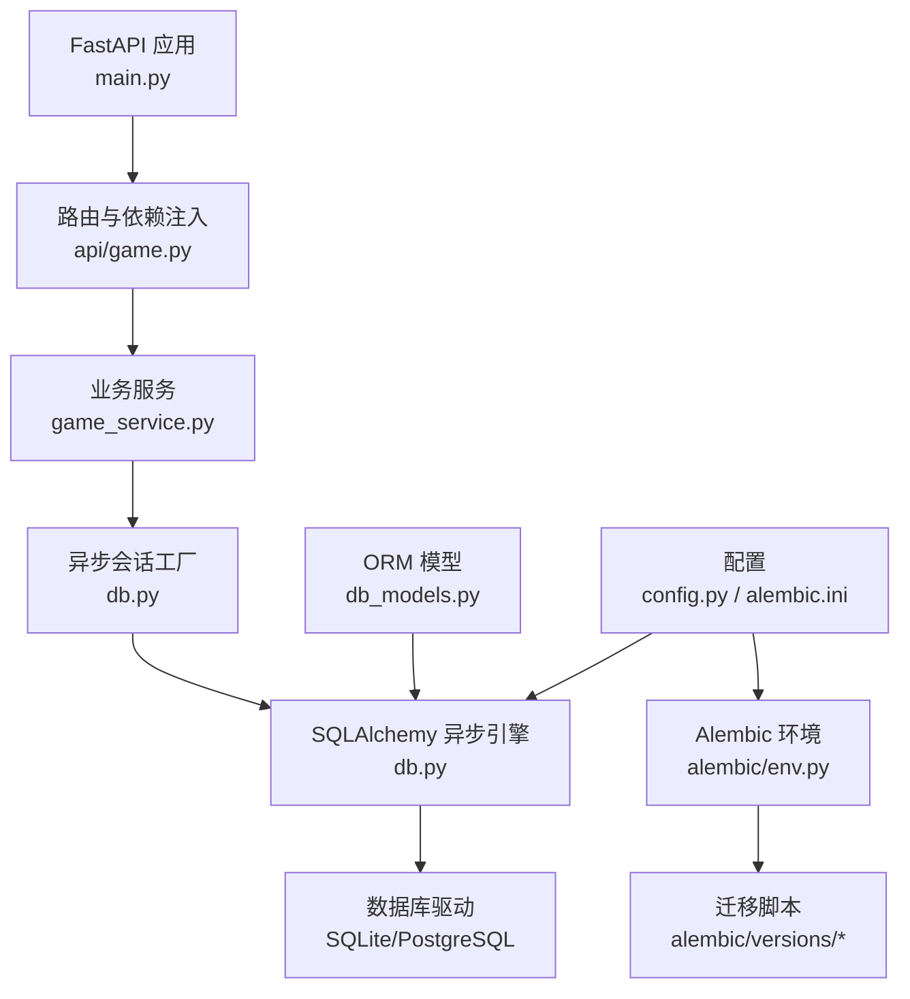
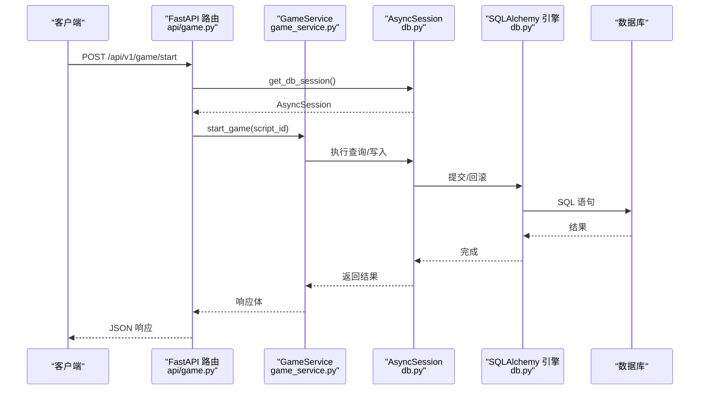
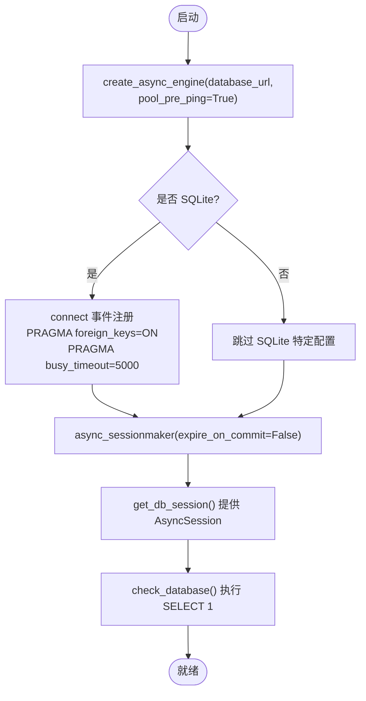
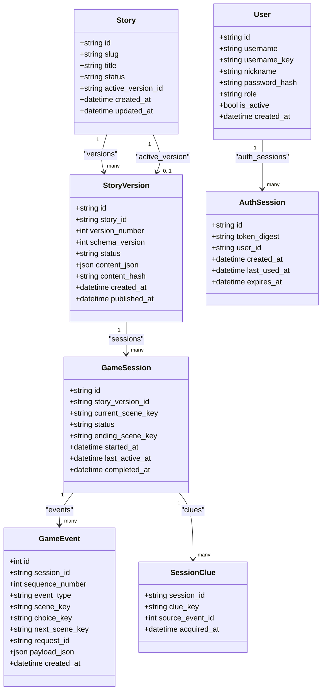
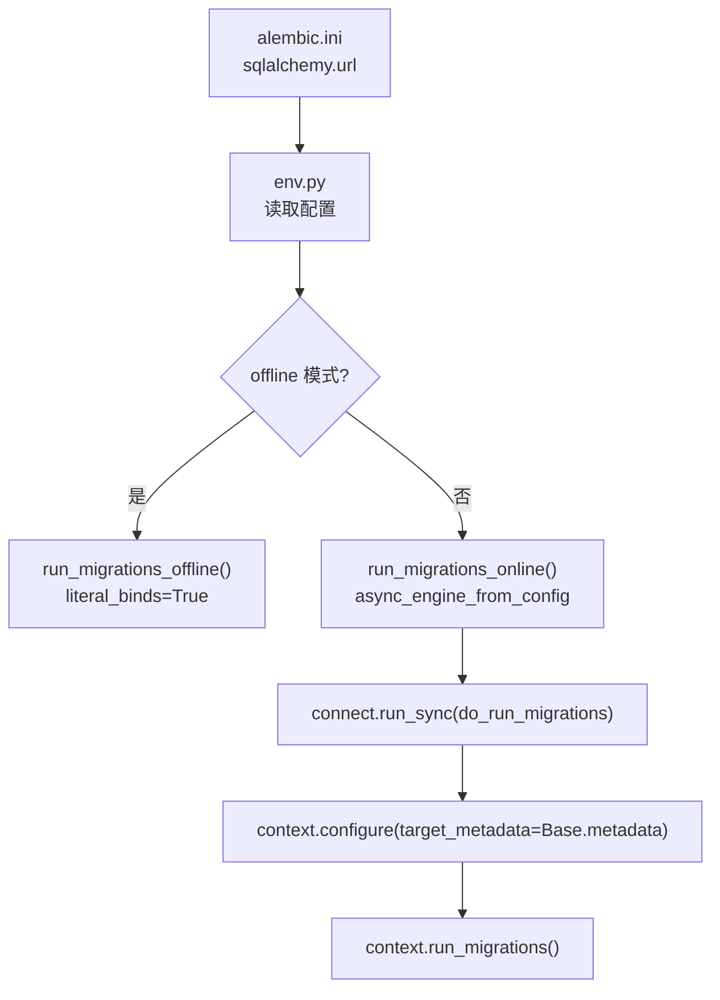
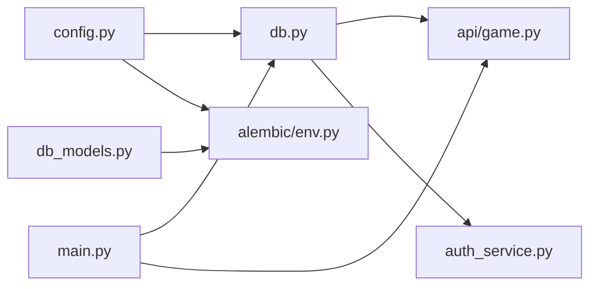
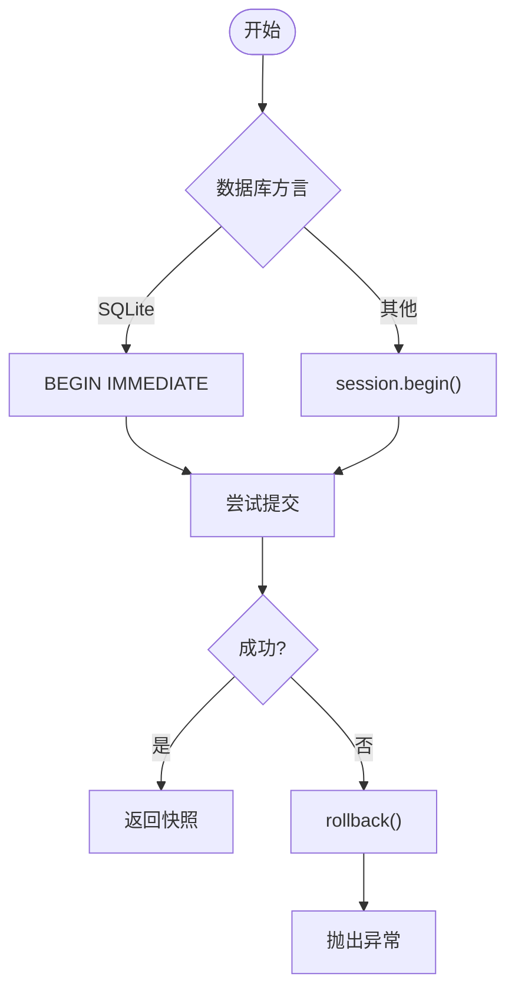

# 数据访问层

<cite>
**本文引用的文件**   
- [backend/app/db.py](file://backend/app/db.py)
- [backend/app/db_models.py](file://backend/app/db_models.py)
- [backend/alembic/env.py](file://backend/alembic/env.py)
- [backend/alembic.ini](file://backend/alembic.ini)
- [backend/alembic/versions/20260803_0001_game_persistence.py](file://backend/alembic/versions/20260803_0001_game_persistence.py)
- [backend/alembic/versions/20260804_0002_auth_persistence.py](file://backend/alembic/versions/20260804_0002_auth_persistence.py)
- [backend/app/config.py](file://backend/app/config.py)
- [backend/app/main.py](file://backend/app/main.py)
- [backend/app/api/game.py](file://backend/app/api/game.py)
- [backend/app/auth_service.py](file://backend/app/auth_service.py)
- [backend/tests/test_migrations.py](file://backend/tests/test_migrations.py)
</cite>

## 目录
1. [简介](#简介)
2. [项目结构](#项目结构)
3. [核心组件](#核心组件)
4. [架构总览](#架构总览)
5. [详细组件分析](#详细组件分析)
6. [依赖关系分析](#依赖关系分析)
7. [性能与连接池优化](#性能与连接池优化)
8. [事务管理与并发控制](#事务管理与并发控制)
9. [迁移系统与版本管理](#迁移系统与版本管理)
10. [数据库初始化流程](#数据库初始化流程)
11. [复杂查询与示例](#复杂查询与示例)
12. [SQLite 与 PostgreSQL 兼容性](#sqlite-与-postgresql-兼容性)
13. [故障排查指南](#故障排查指南)
14. [结论](#结论)

## 简介
本文件面向澳秘 Macau Mystery 的数据访问层，系统性说明 SQLAlchemy ORM 配置、异步会话与引擎、数据库模型定义、关系映射与校验约束、Alembic 迁移体系、数据库初始化与版本管理策略，以及连接池、事务、并发与性能调优要点。同时给出 SQLite 与 PostgreSQL 的兼容配置建议，并提供复杂查询、并发处理与备份恢复的实践指引（以代码路径引用为主，不直接粘贴源码）。

## 项目结构
数据访问相关的关键位置：
- 引擎与会话：backend/app/db.py
- ORM 模型：backend/app/db_models.py
- 配置与环境：backend/app/config.py、backend/alembic.ini
- Alembic 环境脚本：backend/alembic/env.py
- 迁移脚本：backend/alembic/versions/*
- API 依赖注入使用：backend/app/api/game.py
- 认证服务中的会话使用：backend/app/auth_service.py
- 应用生命周期与健康检查：backend/app/main.py
- 迁移测试：backend/tests/test_migrations.py

图表来源
- [backend/app/main.py:17-111](file://backend/app/main.py#L17-L111)
- [backend/app/api/game.py:12-37](file://backend/app/api/game.py#L12-L37)
- [backend/app/db.py:12-42](file://backend/app/db.py#L12-L42)
- [backend/alembic/env.py:1-51](file://backend/alembic/env.py#L1-L51)
- [backend/alembic/versions/20260803_0001_game_persistence.py:17-129](file://backend/alembic/versions/20260803_0001_game_persistence.py#L17-L129)
- [backend/alembic/versions/20260804_0002_auth_persistence.py:17-55](file://backend/alembic/versions/20260804_0002_auth_persistence.py#L17-L55)
- [backend/app/db_models.py:20-160](file://backend/app/db_models.py#L20-L160)
- [backend/app/config.py:38-77](file://backend/app/config.py#L38-L77)
- [backend/alembic.ini:1-37](file://backend/alembic.ini#L1-L37)

章节来源
- [backend/app/main.py:17-111](file://backend/app/main.py#L17-L111)
- [backend/app/api/game.py:12-37](file://backend/app/api/game.py#L12-L37)
- [backend/app/db.py:12-42](file://backend/app/db.py#L12-L42)
- [backend/alembic/env.py:1-51](file://backend/alembic/env.py#L1-L51)
- [backend/alembic/versions/20260803_0001_game_persistence.py:17-129](file://backend/alembic/versions/20260803_0001_game_persistence.py#L17-L129)
- [backend/alembic/versions/20260804_0002_auth_persistence.py:17-55](file://backend/alembic/versions/20260804_0002_auth_persistence.py#L17-L55)
- [backend/app/db_models.py:20-160](file://backend/app/db_models.py#L20-L160)
- [backend/app/config.py:38-77](file://backend/app/config.py#L38-L77)
- [backend/alembic.ini:1-37](file://backend/alembic.ini#L1-L37)

## 核心组件
- 异步引擎与会话工厂：创建异步引擎、启用连接前探测、为 SQLite 设置外键与忙超时；提供 AsyncSession 工厂与依赖注入函数。
- ORM 模型：故事、版本、游戏会话、事件、线索、用户与认证会话等实体，包含字段类型、默认值、索引、唯一约束与检查约束。
- Alembic 环境：支持离线与在线迁移，自动读取配置并绑定目标元数据。
- 配置系统：集中化环境变量解析，默认 SQLite URL，生产/开发开关与令牌 TTL 等。
- API 集成：通过 FastAPI Depends 注入 AsyncSession，统一事务边界与错误处理。

章节来源
- [backend/app/db.py:12-42](file://backend/app/db.py#L12-L42)
- [backend/app/db_models.py:20-160](file://backend/app/db_models.py#L20-L160)
- [backend/alembic/env.py:1-51](file://backend/alembic/env.py#L1-L51)
- [backend/app/config.py:38-77](file://backend/app/config.py#L38-L77)
- [backend/app/api/game.py:12-37](file://backend/app/api/game.py#L12-L37)

## 架构总览
数据访问层采用“FastAPI + SQLAlchemy 异步 + Alembic”的组合：
- 请求进入路由后，通过 Depends(get_db_session) 获取一个 AsyncSession。
- 业务逻辑在 Service 层组织，按数据库方言选择合适的事务边界（SQLite 显式 BEGIN IMMEDIATE，其他数据库使用 session.begin()）。
- 模型变更通过 Alembic 迁移脚本管理，env.py 负责加载配置与元数据。

图表来源
- [backend/app/api/game.py:15-37](file://backend/app/api/game.py#L15-L37)
- [backend/app/db.py:30-42](file://backend/app/db.py#L30-L42)
- [backend/app/game_service.py:70-93](file://backend/app/game_service.py#L70-L93)

## 详细组件分析

### 引擎与会话（db.py）
- 引擎创建：使用 create_async_engine，开启 pool_pre_ping 确保连接健康。
- SQLite 适配：监听 connect 事件，启用外键 PRAGMA foreign_keys=ON 与 busy_timeout=5000，避免并发写冲突。
- 会话工厂：async_sessionmaker 生成 expire_on_commit=False 的 AsyncSession，减少重复查询。
- 依赖注入：get_db_session 作为异步上下文管理器，自动管理会话生命周期。
- 健康检查：check_database 通过 SELECT 1 验证连通性。

图表来源
- [backend/app/db.py:12-42](file://backend/app/db.py#L12-L42)

章节来源
- [backend/app/db.py:12-42](file://backend/app/db.py#L12-L42)

### ORM 模型与关系（db_models.py）
- Base：DeclarativeBase 基类。
- Story/StoryVersion：一对多关系，active_version_id 指向当前活跃版本，含状态检查约束。
- GameSession/GameEvent/SessionClue：会话-事件-线索的层级关系，事件序列号与请求 ID 唯一约束保证幂等与顺序。
- User/AuthSession：用户与令牌会话，角色与激活状态约束，令牌摘要索引。
- 时间戳：UTC 时区，created_at/updated_at 自动维护。
- 索引与约束：slug、username_key、token_digest、session_id 等常用查询列建立索引；多处 CheckConstraint 限制枚举值。

图表来源
- [backend/app/db_models.py:24-160](file://backend/app/db_models.py#L24-L160)

章节来源
- [backend/app/db_models.py:24-160](file://backend/app/db_models.py#L24-L160)

### Alembic 环境与迁移（env.py 与 versions/*）
- env.py：读取配置 sqlalchemy.url，设置 target_metadata 为 Base.metadata；支持 offline/online 模式；在线模式使用 NullPool 快速连接执行迁移。
- 迁移脚本：
  - 20260803_0001_game_persistence.py：创建 stories、story_versions、game_sessions、game_events、session_clues，含外键、唯一与检查约束；SQLite 特殊的外键创建方式。
  - 20260804_0002_auth_persistence.py：创建 users、auth_sessions，含索引与约束。

图表来源
- [backend/alembic/env.py:1-51](file://backend/alembic/env.py#L1-L51)
- [backend/alembic.ini:1-37](file://backend/alembic.ini#L1-L37)
- [backend/alembic/versions/20260803_0001_game_persistence.py:17-129](file://backend/alembic/versions/20260803_0001_game_persistence.py#L17-L129)
- [backend/alembic/versions/20260804_0002_auth_persistence.py:17-55](file://backend/alembic/versions/20260804_0002_auth_persistence.py#L17-L55)

章节来源
- [backend/alembic/env.py:1-51](file://backend/alembic/env.py#L1-L51)
- [backend/alembic/versions/20260803_0001_game_persistence.py:17-129](file://backend/alembic/versions/20260803_0001_game_persistence.py#L17-L129)
- [backend/alembic/versions/20260804_0002_auth_persistence.py:17-55](file://backend/alembic/versions/20260804_0002_auth_persistence.py#L17-L55)

### 配置系统（config.py）
- Settings 数据类集中管理 database_url、CORS、环境标志、演示数据开关、令牌 TTL 与演示账号。
- get_settings 使用 lru_cache 缓存实例，避免重复解析环境变量。
- 默认 DATABASE_URL 为 SQLite+aiosqlite，便于本地开发。

章节来源
- [backend/app/config.py:38-77](file://backend/app/config.py#L38-L77)

### API 依赖注入（api/game.py）
- 路由通过 Depends(get_db_session) 注入 AsyncSession，调用 GameService 方法完成业务逻辑。
- 统一的响应模型与排除 None 字段，简化输出。

章节来源
- [backend/app/api/game.py:12-37](file://backend/app/api/game.py#L12-L37)

### 认证服务（auth_service.py）
- 用户名/密码/昵称校验与规范化。
- 基于 pwdlib 的密码哈希与随机令牌生成。
- 通过 select/joinedload 进行高效查询，更新 last_used_at 实现活跃追踪。
- bootstrap_demo_users 使用 SessionLocal.begin() 批量创建演示账户。

章节来源
- [backend/app/auth_service.py:1-153](file://backend/app/auth_service.py#L1-L153)

## 依赖关系分析
- db.py 依赖 config.py 获取数据库 URL。
- alembic/env.py 依赖 config.py 与 db_models.Base.metadata。
- api/game.py 依赖 db.get_db_session 与 game_service。
- auth_service.py 依赖 db.SessionLocal 与 db_models。
- main.py 依赖 check_database 用于健康检查，并在生命周期中触发演示数据初始化。

图表来源
- [backend/app/config.py:38-77](file://backend/app/config.py#L38-L77)
- [backend/app/db.py:12-42](file://backend/app/db.py#L12-L42)
- [backend/alembic/env.py:1-51](file://backend/alembic/env.py#L1-L51)
- [backend/app/api/game.py:12-37](file://backend/app/api/game.py#L12-L37)
- [backend/app/auth_service.py:1-153](file://backend/app/auth_service.py#L1-L153)
- [backend/app/main.py:17-111](file://backend/app/main.py#L17-L111)

章节来源
- [backend/app/config.py:38-77](file://backend/app/config.py#L38-L77)
- [backend/app/db.py:12-42](file://backend/app/db.py#L12-L42)
- [backend/alembic/env.py:1-51](file://backend/alembic/env.py#L1-L51)
- [backend/app/api/game.py:12-37](file://backend/app/api/game.py#L12-L37)
- [backend/app/auth_service.py:1-153](file://backend/app/auth_service.py#L1-L153)
- [backend/app/main.py:17-111](file://backend/app/main.py#L17-L111)

## 性能与连接池优化
- 连接健康检测：engine 创建时启用 pool_pre_ping，降低死连接风险。
- SQLite 并发：busy_timeout=5000 缓解写锁竞争；必要时在关键路径使用 BEGIN IMMEDIATE（见 make_choice 分支）。
- 会话复用：expire_on_commit=False 减少同一会话内重复加载开销。
- 查询优化：
  - 使用 with_for_update() 对热点行加锁，避免竞态（如 make_choice 中对 GameSession 的锁定）。
  - joinedload 预加载关联对象，减少 N+1 查询。
  - 为高频查询列添加索引（slug、username_key、token_digest、session_id 等）。
- 连接池参数（通用建议，需根据部署环境调整）：
  - max_overflow：允许超出池大小的临时连接数。
  - pool_size：常驻连接数。
  - pool_recycle：连接回收周期，避免长连接失效。
  - pool_timeout：获取连接的等待超时。
  - echo：调试阶段可开启 SQL 日志，生产关闭。

章节来源
- [backend/app/db.py:12-42](file://backend/app/db.py#L12-L42)
- [backend/app/game_service.py:70-93](file://backend/app/game_service.py#L70-L93)
- [backend/app/auth_service.py:100-124](file://backend/app/auth_service.py#L100-L124)
- [backend/app/db_models.py:24-160](file://backend/app/db_models.py#L24-L160)

## 事务管理与并发控制
- SQLite 专用事务：在 make_choice 中显式 BEGIN IMMEDIATE，失败时 rollback，确保写操作原子性与一致性。
- 其他数据库：使用 async with self.session.begin() 包裹事务，自动提交或回滚。
- 行级锁：with_for_update() 对 GameSession 加锁，防止并发修改导致的状态不一致。
- 幂等性：game_events.request_id 唯一约束保障重复请求不会产生重复事件。

图表来源
- [backend/app/game_service.py:70-93](file://backend/app/game_service.py#L70-L93)

章节来源
- [backend/app/game_service.py:70-93](file://backend/app/game_service.py#L70-L93)

## 迁移系统与版本管理
- 运行迁移：
  - 离线模式：适用于无连接环境生成 SQL。
  - 在线模式：实际执行迁移，使用 NullPool 快速连接。
- 版本策略：
  - 每个迁移文件对应一次 schema 变更，包含 upgrade/downgrade。
  - 通过 revision 与 down_revision 串联版本链。
- 测试覆盖：test_migrations.py 验证迁移后表结构与约束存在。

章节来源
- [backend/alembic/env.py:1-51](file://backend/alembic/env.py#L1-L51)
- [backend/alembic/versions/20260803_0001_game_persistence.py:17-129](file://backend/alembic/versions/20260803_0001_game_persistence.py#L17-L129)
- [backend/alembic/versions/20260804_0002_auth_persistence.py:17-55](file://backend/alembic/versions/20260804_0002_auth_persistence.py#L17-L55)
- [backend/tests/test_migrations.py:15-61](file://backend/tests/test_migrations.py#L15-L61)

## 数据库初始化流程
- 应用启动：lifespan 中根据配置决定是否初始化演示数据。
- 演示数据：
  - 故事导入：bootstrap_demo_story（由 importer 模块负责）。
  - 用户初始化：bootstrap_demo_users 使用 SessionLocal.begin() 批量插入。
- 健康检查：/api/v1/health 调用 check_database 验证数据库可用性。

章节来源
- [backend/app/main.py:20-34](file://backend/app/main.py#L20-L34)
- [backend/app/auth_service.py:133-153](file://backend/app/auth_service.py#L133-L153)
- [backend/app/db.py:35-42](file://backend/app/db.py#L35-L42)

## 复杂查询与示例
以下示例以代码路径引用形式呈现，便于读者在仓库中定位具体实现：
- 带条件与关联的查询：
  - 查找用户并按用户名键匹配：[find_user_by_username:59-60](file://backend/app/auth_service.py#L59-L60)
  - 预加载关联对象：[authenticate_bearer 中使用 joinedload:109-118](file://backend/app/auth_service.py#L109-L118)
- 事务内并发安全：
  - 选择分支与事务边界：[make_choice 事务处理:70-93](file://backend/app/game_service.py#L70-L93)
  - 行级锁防竞态：[with_for_update() 使用:89-91](file://backend/app/game_service.py#L89-L91)
- 幂等写入：
  - 基于 request_id 的唯一约束避免重复事件：[uq_game_events_session_request:99-101](file://backend/alembic/versions/20260803_0001_game_persistence.py#L99-L101)

章节来源
- [backend/app/auth_service.py:59-118](file://backend/app/auth_service.py#L59-L118)
- [backend/app/game_service.py:70-93](file://backend/app/game_service.py#L70-L93)
- [backend/alembic/versions/20260803_0001_game_persistence.py:99-101](file://backend/alembic/versions/20260803_0001_game_persistence.py#L99-L101)

## SQLite 与 PostgreSQL 兼容性
- SQLite 特性：
  - 外键需在连接时启用 PRAGMA foreign_keys=ON（已在 connect 事件中设置）。
  - 迁移脚本中对 SQLite 使用 batch_alter_table 创建外键（因 SQLite 不支持在线 ALTER）。
  - 写锁敏感，建议使用 BEGIN IMMEDIATE 提升并发安全性。
- PostgreSQL 特性：
  - 原生支持外键与在线 ALTER，迁移脚本在非 SQLite 分支直接创建外键。
  - 可使用更丰富的索引类型与并行查询能力。
- 配置切换：
  - 通过 DATABASE_URL 切换驱动与连接串（例如 sqlite+aiosqlite:///... 或 postgresql+asyncpg://...）。
  - alembic.ini 默认使用 SQLite，可通过环境变量覆盖。

章节来源
- [backend/app/db.py:14-22](file://backend/app/db.py#L14-L22)
- [backend/alembic/versions/20260803_0001_game_persistence.py:51-68](file://backend/alembic/versions/20260803_0001_game_persistence.py#L51-L68)
- [backend/alembic.ini:4](file://backend/alembic.ini#L4)
- [backend/app/config.py:9](file://backend/app/config.py#L9)

## 故障排查指南
- 数据库不可用：
  - 健康检查返回 degraded：检查 DATABASE_URL、网络、权限与迁移是否已执行。
  - 参考：[check_database:35-42](file://backend/app/db.py#L35-L42)、[/api/v1/health:98-105](file://backend/app/main.py#L98-L105)
- 迁移失败：
  - 确认 alembic.ini 的 sqlalchemy.url 正确，env.py 能读取到配置。
  - 查看迁移脚本的 downgrade 是否完整。
  - 参考：[alembic/env.py:1-51](file://backend/alembic/env.py#L1-L51)、[迁移脚本:17-129](file://backend/alembic/versions/20260803_0001_game_persistence.py#L17-L129)
- SQLite 写冲突：
  - 增加 busy_timeout 或使用 BEGIN IMMEDIATE。
  - 参考：[SQLite 配置:14-22](file://backend/app/db.py#L14-L22)、[make_choice 事务:70-93](file://backend/app/game_service.py#L70-L93)
- 认证失败：
  - 检查 Authorization 头格式与令牌有效期。
  - 参考：[authenticate_bearer:100-124](file://backend/app/auth_service.py#L100-L124)

章节来源
- [backend/app/db.py:35-42](file://backend/app/db.py#L35-L42)
- [backend/app/main.py:98-105](file://backend/app/main.py#L98-L105)
- [backend/alembic/env.py:1-51](file://backend/alembic/env.py#L1-L51)
- [backend/alembic/versions/20260803_0001_game_persistence.py:17-129](file://backend/alembic/versions/20260803_0001_game_persistence.py#L17-L129)
- [backend/app/db.py:14-22](file://backend/app/db.py#L14-L22)
- [backend/app/game_service.py:70-93](file://backend/app/game_service.py#L70-L93)
- [backend/app/auth_service.py:100-124](file://backend/app/auth_service.py#L100-L124)

## 结论
本数据访问层以 SQLAlchemy 异步为核心，结合 Alembic 进行版本化管理，通过严谨的模型约束与事务策略保障数据一致性与并发安全。SQLite 与 PostgreSQL 的差异化处理确保了跨平台兼容。建议在部署时依据负载调整连接池参数，并结合健康检查与监控完善运维能力。