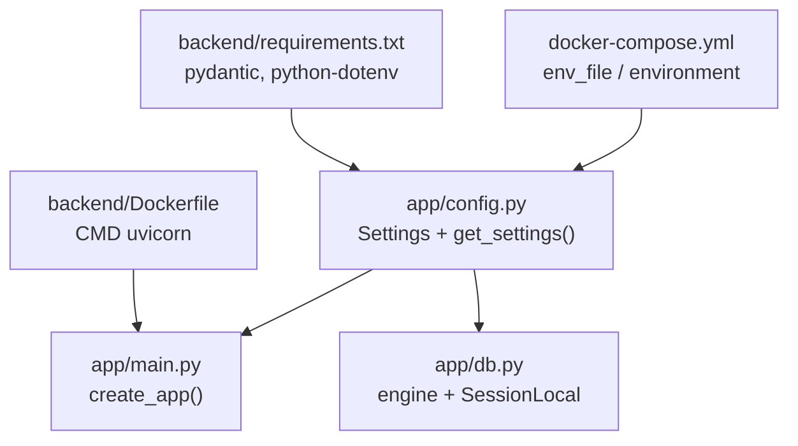
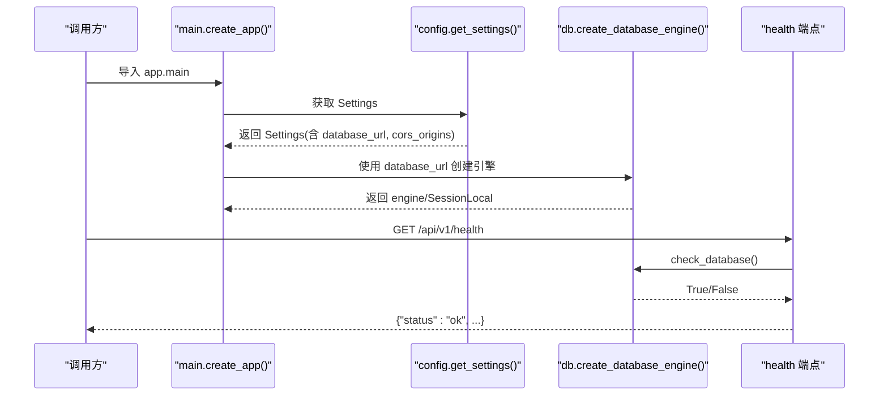
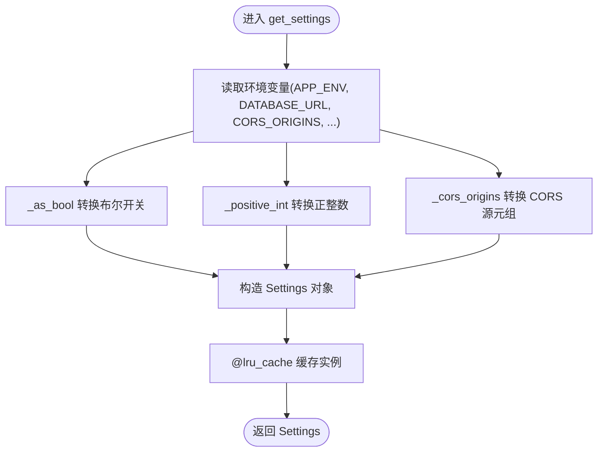
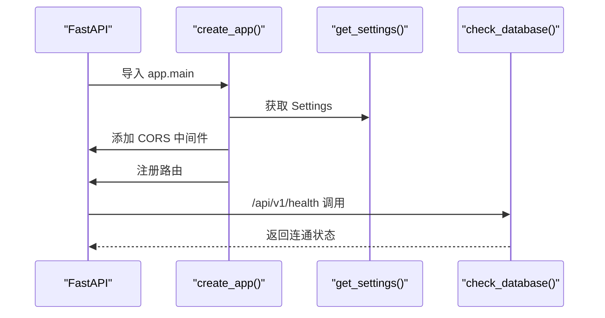
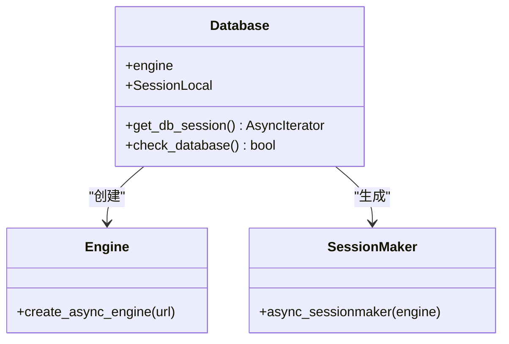
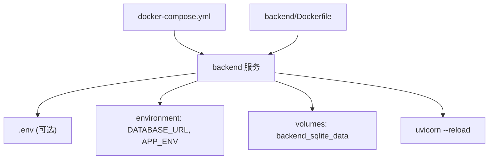
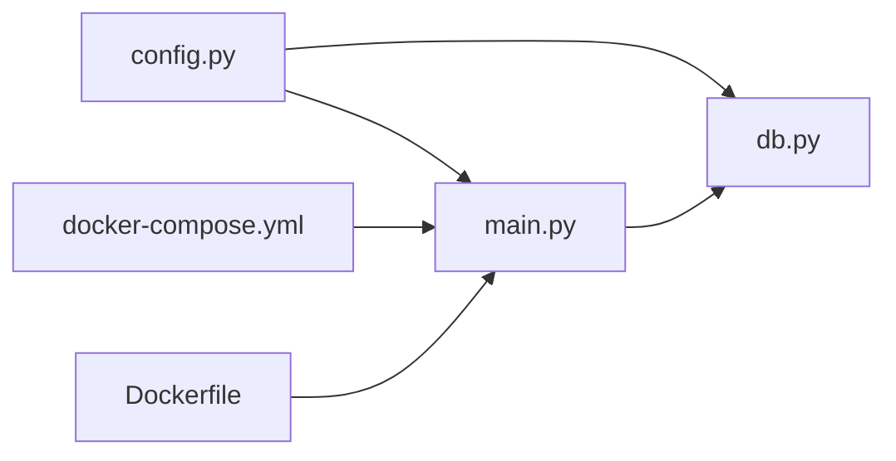

# 配置管理系统

<cite>
**本文引用的文件**   
- [backend/app/config.py](file://backend/app/config.py)
- [backend/app/main.py](file://backend/app/main.py)
- [backend/app/db.py](file://backend/app/db.py)
- [docker-compose.yml](file://docker-compose.yml)
- [backend/Dockerfile](file://backend/Dockerfile)
- [backend/requirements.txt](file://backend/requirements.txt)
- [backend/tests/test_health.py](file://backend/tests/test_health.py)
</cite>

## 目录
1. [简介](#简介)
2. [项目结构](#项目结构)
3. [核心组件](#核心组件)
4. [架构总览](#架构总览)
5. [详细组件分析](#详细组件分析)
6. [依赖关系分析](#依赖关系分析)
7. [性能考虑](#性能考虑)
8. [故障排查指南](#故障排查指南)
9. [结论](#结论)
10. [附录](#附录)

## 简介
本文件为澳秘 Macau Mystery 后端配置管理系统的权威文档。当前实现基于 Python dataclass + os.getenv 的轻量级配置加载，未使用 Pydantic Settings；但项目已引入 pydantic，可用于后续增强配置校验与类型安全。本文重点说明：
- 环境变量加载优先级与默认值策略
- 配置项的类型转换与验证机制（布尔、正整数、元组等）
- 不同环境（开发、测试、生产）的配置分离策略
- 敏感信息的安全存储建议
- 数据库连接配置与初始化流程
- 第三方服务 API 密钥管理与功能开关控制
- Docker 环境下的配置注入与最佳实践
- 如何扩展新配置项、实现强校验与动态重载方案

## 项目结构
后端配置相关的关键文件与职责如下：
- backend/app/config.py：定义 Settings 数据类与 get_settings() 工厂函数，负责从环境变量读取并转换为强类型配置对象
- backend/app/main.py：FastAPI 应用入口，创建应用时读取配置，注册 CORS、路由与健康检查端点
- backend/app/db.py：异步数据库引擎与 Session 管理，依赖配置中的 database_url
- docker-compose.yml：容器编排与环境变量注入示例
- backend/Dockerfile：镜像构建与运行命令
- backend/requirements.txt：依赖清单（包含 pydantic、python-dotenv 等）
- backend/tests/test_health.py：健康检查测试，演示通过 monkeypatch 修改环境变量并清理缓存以生效

**图表来源** 
- [backend/app/config.py:1-77](file://backend/app/config.py#L1-L77)
- [backend/app/main.py:1-111](file://backend/app/main.py#L1-L111)
- [backend/app/db.py:1-42](file://backend/app/db.py#L1-L42)
- [docker-compose.yml:1-21](file://docker-compose.yml#L1-L21)
- [backend/Dockerfile:1-13](file://backend/Dockerfile#L1-L13)
- [backend/requirements.txt:1-17](file://backend/requirements.txt#L1-L17)

**章节来源**
- [backend/app/config.py:1-77](file://backend/app/config.py#L1-L77)
- [backend/app/main.py:1-111](file://backend/app/main.py#L1-L111)
- [backend/app/db.py:1-42](file://backend/app/db.py#L1-L42)
- [docker-compose.yml:1-21](file://docker-compose.yml#L1-L21)
- [backend/Dockerfile:1-13](file://backend/Dockerfile#L1-L13)
- [backend/requirements.txt:1-17](file://backend/requirements.txt#L1-L17)

## 核心组件
- Settings(dataclass)：不可变配置对象，包含数据库 URL、CORS 源、应用环境、引导开关、令牌 TTL、演示账号等字段，并提供 is_production 属性判断运行环境
- get_settings()：使用 lru_cache 缓存配置实例，避免重复解析环境变量；内部对布尔、正整数、元组进行严格转换与校验
- 辅助转换器：_as_bool、_cors_origins、_positive_int，提供统一的类型转换与错误提示

关键行为要点：
- 环境变量缺失时使用默认值（如 SQLite 本地路径、默认 CORS 源、默认 TTL 等）
- 布尔值支持多种字符串表示（"1"/"true"/"yes"/"on"）
- 正整数校验失败会抛出 ValueError，便于快速定位配置错误
- CORS 源支持逗号分隔字符串，自动去空白并转为元组

**章节来源**
- [backend/app/config.py:13-36](file://backend/app/config.py#L13-L36)
- [backend/app/config.py:38-54](file://backend/app/config.py#L38-L54)
- [backend/app/config.py:56-77](file://backend/app/config.py#L56-L77)

## 架构总览
配置在应用生命周期中的使用流程如下：
- 启动时 create_app() 调用 get_settings() 获取 Settings
- main.py 将 settings.cors_origins 用于 CORS 中间件
- db.py 使用 settings.database_url 创建异步引擎和会话工厂
- health 端点通过 check_database() 验证数据库连通性

**图表来源** 
- [backend/app/main.py:17-107](file://backend/app/main.py#L17-L107)
- [backend/app/config.py:56-77](file://backend/app/config.py#L56-L77)
- [backend/app/db.py:12-27](file://backend/app/db.py#L12-L27)
- [backend/app/db.py:35-42](file://backend/app/db.py#L35-L42)

**章节来源**
- [backend/app/main.py:17-107](file://backend/app/main.py#L17-L107)
- [backend/app/db.py:12-27](file://backend/app/db.py#L12-L27)
- [backend/app/db.py:35-42](file://backend/app/db.py#L35-L42)

## 详细组件分析

### 配置模型与加载器（Settings + get_settings）
- 数据结构：dataclass(frozen=True)，保证运行时不可变，避免意外修改
- 加载策略：仅从环境变量读取，未集成 .env 文件；可通过 python-dotenv 在进程启动前加载
- 缓存策略：@lru_cache 缓存 Settings 实例，提升性能；测试中需显式 cache_clear() 使新环境变量生效
- 类型转换与校验：
  - 布尔：_as_bool 支持多字符串形式，默认值由 app_env 决定
  - 正整数：_positive_int 校验范围与格式，失败抛错
  - 元组：_cors_origins 拆分逗号分隔字符串，过滤空项

**图表来源** 
- [backend/app/config.py:13-36](file://backend/app/config.py#L13-L36)
- [backend/app/config.py:56-77](file://backend/app/config.py#L56-L77)

**章节来源**
- [backend/app/config.py:13-36](file://backend/app/config.py#L13-L36)
- [backend/app/config.py:56-77](file://backend/app/config.py#L56-L77)

### FastAPI 应用集成（main.py）
- 启动阶段：create_app() 读取 Settings，设置 lifespan 钩子用于演示数据引导
- CORS：使用 settings.cors_origins 作为 allow_origins
- 路由注册：按模块划分路由前缀
- 健康检查：GET /api/v1/health 调用 check_database() 返回数据库状态

**图表来源** 
- [backend/app/main.py:17-107](file://backend/app/main.py#L17-L107)
- [backend/app/config.py:56-77](file://backend/app/config.py#L56-L77)
- [backend/app/db.py:35-42](file://backend/app/db.py#L35-L42)

**章节来源**
- [backend/app/main.py:17-107](file://backend/app/main.py#L17-L107)

### 数据库连接与引擎（db.py）
- 引擎创建：create_async_engine(database_url, pool_pre_ping=True)
- SQLite 特殊处理：启用外键约束与 busy_timeout
- 会话工厂：async_sessionmaker(expire_on_commit=False)
- 健康检查：SELECT 1 验证连通性

**图表来源** 
- [backend/app/db.py:12-27](file://backend/app/db.py#L12-L27)
- [backend/app/db.py:30-42](file://backend/app/db.py#L30-L42)

**章节来源**
- [backend/app/db.py:12-27](file://backend/app/db.py#L12-L27)
- [backend/app/db.py:30-42](file://backend/app/db.py#L30-L42)

### Docker 与容器化配置
- docker-compose.yml：
  - env_file 指向 ./backend/.env（可选）
  - environment 直接注入 DATABASE_URL、APP_ENV
  - volumes 持久化 SQLite 数据到 backend_sqlite_data
  - command 执行 alembic 迁移后启动 uvicorn --reload
- Dockerfile：
  - 基础镜像 python:3.11-slim
  - 安装依赖、复制代码、暴露端口
  - CMD 启动 uvicorn

**图表来源** 
- [docker-compose.yml:1-21](file://docker-compose.yml#L1-L21)
- [backend/Dockerfile:1-13](file://backend/Dockerfile#L1-L13)

**章节来源**
- [docker-compose.yml:1-21](file://docker-compose.yml#L1-L21)
- [backend/Dockerfile:1-13](file://backend/Dockerfile#L1-L13)

### 测试中的配置覆盖与缓存清理
- test_health.py 使用 monkeypatch 设置环境变量，并在前后调用 get_settings.cache_clear() 确保新配置生效
- 该模式适用于需要动态切换配置的单元测试场景

**章节来源**
- [backend/tests/test_health.py:9-23](file://backend/tests/test_health.py#L9-L23)

## 依赖关系分析
- 配置模块不依赖其他业务模块，仅依赖标准库 os 与 functools.lru_cache
- main.py 依赖 config 与 db，用于初始化应用与中间件
- db.py 依赖 config 获取 database_url
- docker-compose 与 Dockerfile 负责运行期环境变量注入与进程启动

**图表来源** 
- [backend/app/config.py:1-77](file://backend/app/config.py#L1-L77)
- [backend/app/main.py:1-111](file://backend/app/main.py#L1-L111)
- [backend/app/db.py:1-42](file://backend/app/db.py#L1-L42)
- [docker-compose.yml:1-21](file://docker-compose.yml#L1-L21)
- [backend/Dockerfile:1-13](file://backend/Dockerfile#L1-L13)

**章节来源**
- [backend/app/config.py:1-77](file://backend/app/config.py#L1-L77)
- [backend/app/main.py:1-111](file://backend/app/main.py#L1-L111)
- [backend/app/db.py:1-42](file://backend/app/db.py#L1-L42)
- [docker-compose.yml:1-21](file://docker-compose.yml#L1-L21)
- [backend/Dockerfile:1-13](file://backend/Dockerfile#L1-L13)

## 性能考虑
- 配置缓存：get_settings() 使用 @lru_cache，避免重复解析环境变量
- 数据库连接池：pool_pre_ping=True 提高连接健壮性
- 启动开销：alembic upgrade head 在容器启动时执行，生产环境建议预迁移或按需迁移

[本节为通用指导，无需特定文件引用]

## 故障排查指南
- 数据库未迁移：若 bootstrap_demo_* 为真且数据库表不存在，启动时会抛出 RuntimeError，提示先执行 alembic upgrade head
- 环境变量无效：由于 get_settings() 被缓存，测试或热更新时需调用 cache_clear()
- CORS 配置错误：CORS_ORIGINS 必须为逗号分隔的有效 URL，否则回退默认值
- 正整数校验失败：AUTH_TOKEN_TTL_HOURS 必须为正整数，否则抛出 ValueError

**章节来源**
- [backend/app/main.py:22-34](file://backend/app/main.py#L22-L34)
- [backend/tests/test_health.py:9-23](file://backend/tests/test_health.py#L9-L23)
- [backend/app/config.py:26-35](file://backend/app/config.py#L26-L35)

## 结论
当前配置系统简洁可靠，通过 dataclass + 环境变量 + 类型转换实现了强类型与可维护性。结合 Docker 的环境变量注入与 python-dotenv，可满足多环境部署需求。未来可引入 Pydantic Settings 进一步统一配置模型、增强校验与 IDE 友好性，同时保持向后兼容。

[本节为总结性内容，无需特定文件引用]

## 附录

### 环境变量清单与默认值
- APP_ENV：应用环境，默认 development
- DATABASE_URL：数据库连接串，默认 sqlite+aiosqlite:///./macau_mystery.db
- CORS_ORIGINS：CORS 允许源，逗号分隔，默认 ["http://localhost:3000","http://127.0.0.1:3000"]
- BOOTSTRAP_DEMO_STORY：是否引导演示剧本，默认非 production 时为 true
- BOOTSTRAP_DEMO_USERS：是否引导演示用户，默认非 production 时为 true
- AUTH_TOKEN_TTL_HOURS：认证令牌有效期（小时），默认 168，必须为正整数
- DEMO_ADMIN_USERNAME / DEMO_ADMIN_PASSWORD：演示管理员账号密码
- DEMO_GUEST_USERNAME / DEMO_GUEST_PASSWORD：演示访客账号密码

**章节来源**
- [backend/app/config.py:9-10](file://backend/app/config.py#L9-L10)
- [backend/app/config.py:56-77](file://backend/app/config.py#L56-L77)

### 不同环境的配置分离策略
- 开发环境：APP_ENV=development，启用演示数据引导，SQLite 本地文件
- 测试环境：通过 pytest 的 monkeypatch 覆盖环境变量，必要时清理缓存
- 生产环境：APP_ENV=production，禁用演示数据引导，建议使用外部数据库与密钥管理服务

**章节来源**
- [backend/app/config.py:56-77](file://backend/app/config.py#L56-L77)
- [backend/tests/test_health.py:9-23](file://backend/tests/test_health.py#L9-L23)

### 敏感信息的安全存储建议
- 使用环境变量或容器编排平台的 Secret 管理（如 Docker secrets、Kubernetes Secrets）
- 避免将密码硬编码进代码或 .env 文件提交至版本库
- 在生产环境中使用独立的密钥管理服务（如 HashiCorp Vault、云厂商 KMS）

[本节为通用指导，无需特定文件引用]

### 第三方服务 API 密钥管理
- 当前未直接使用第三方 API 密钥于配置模块，可在 Settings 中新增对应字段并通过环境变量注入
- 建议在运行时校验必填密钥，缺失则抛出明确错误

[本节为通用指导，无需特定文件引用]

### 功能开关控制
- 使用 BOOTSTRAP_DEMO_STORY、BOOTSTRAP_DEMO_USERS 控制演示数据引导
- 可通过新增布尔型配置项实现特性开关（Feature Flags）

**章节来源**
- [backend/app/config.py:56-77](file://backend/app/config.py#L56-L77)

### 配置文件格式与继承机制
- 当前未使用配置文件（如 JSON/YAML），全部通过环境变量注入
- 如需继承机制，可在 get_settings() 中引入分层默认值（base -> env -> override）

[本节为通用指导，无需特定文件引用]

### 动态配置更新（热重载）
- 当前 get_settings() 使用 @lru_cache，重启进程或调用 cache_clear() 才能刷新
- 推荐方案：
  - 进程内：监听文件系统或配置中心变更，触发 cache_clear()
  - 进程外：通过容器编排平台滚动更新或重新注入环境变量

**章节来源**
- [backend/tests/test_health.py:9-23](file://backend/tests/test_health.py#L9-L23)

### 如何添加新的配置项（示例步骤）
- 在 Settings 中添加新字段（例如：llm_api_key: str）
- 在 get_settings() 中通过 os.getenv("LLM_API_KEY") 读取并赋值
- 在需要的模块中通过 get_settings().llm_api_key 访问
- 在 docker-compose.yml 或环境变量中注入 LLM_API_KEY

**章节来源**
- [backend/app/config.py:38-54](file://backend/app/config.py#L38-L54)
- [backend/app/config.py:56-77](file://backend/app/config.py#L56-L77)

### 实现配置验证（示例思路）
- 使用 _positive_int/_as_bool/_cors_origins 等转换器进行类型与范围校验
- 对于复杂规则，可在 Settings 上增加 model_validator（若改用 Pydantic Settings）

**章节来源**
- [backend/app/config.py:13-36](file://backend/app/config.py#L13-L36)

### Docker 环境下的配置管理最佳实践
- 使用 env_file 注入 .env 文件（不包含敏感信息）
- 使用 environment 注入必要的环境变量（如 DATABASE_URL、APP_ENV）
- 使用 volumes 持久化数据（SQLite 文件）
- 启动命令中包含迁移步骤（alembic upgrade head）

**章节来源**
- [docker-compose.yml:1-21](file://docker-compose.yml#L1-L21)
- [backend/Dockerfile:1-13](file://backend/Dockerfile#L1-L13)