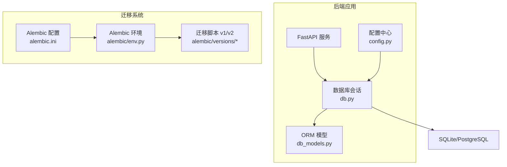
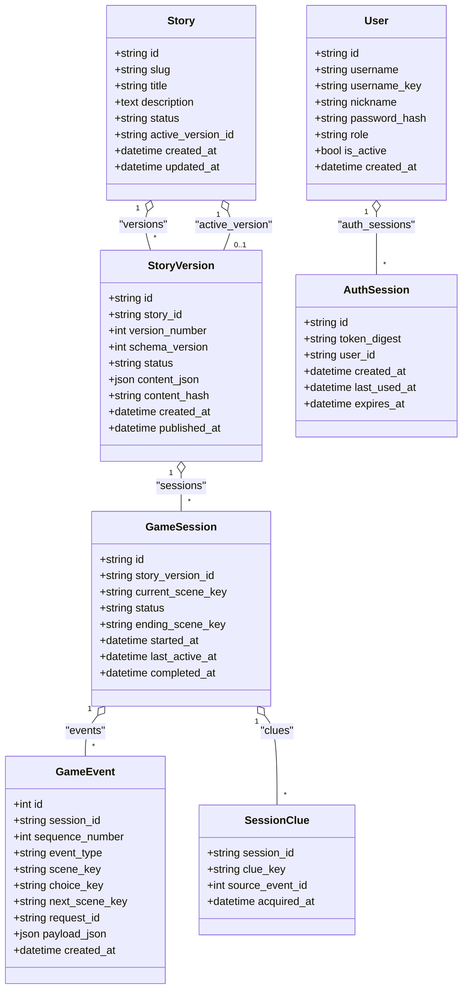
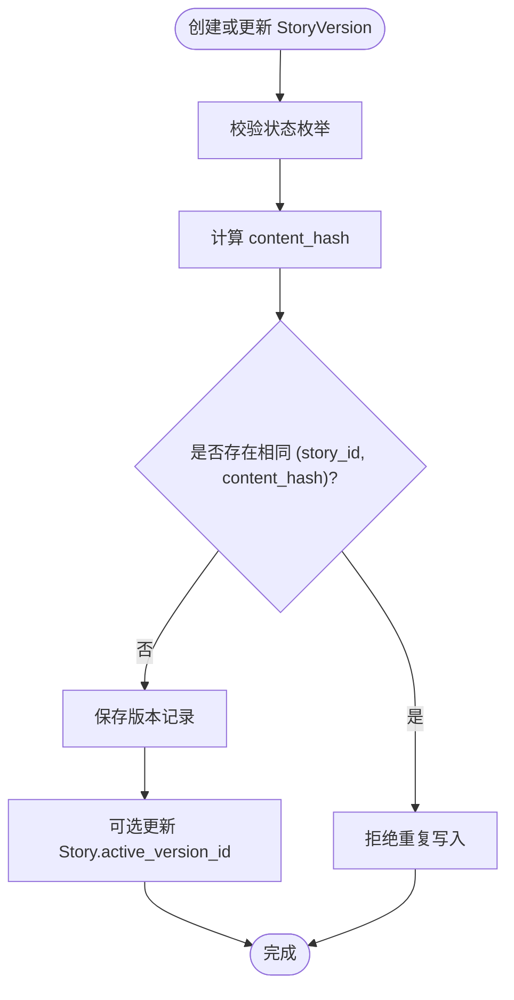
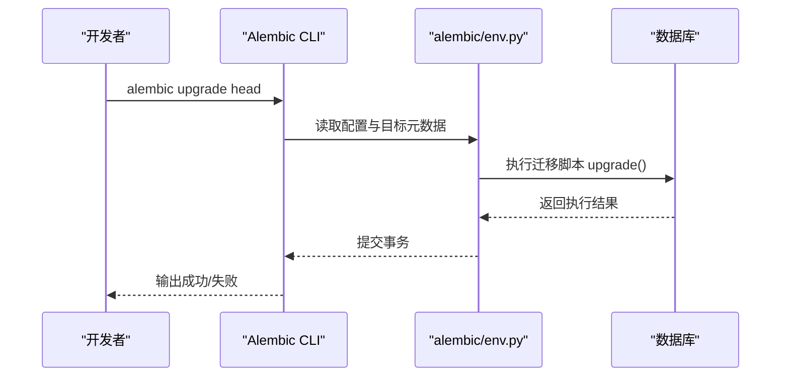

# 关系型数据库设计

<cite>
**本文引用的文件**   
- [db_models.py](file://backend/app/db_models.py)
- [db.py](file://backend/app/db.py)
- [config.py](file://backend/app/config.py)
- [alembic.ini](file://backend/alembic.ini)
- [env.py](file://backend/alembic/env.py)
- [20260803_0001_game_persistence.py](file://backend/alembic/versions/20260803_0001_game_persistence.py)
- [20260804_0002_auth_persistence.py](file://backend/alembic/versions/20260804_0002_auth_persistence.py)
- [test_migrations.py](file://backend/tests/test_migrations.py)
</cite>

## 目录
1. [引言](#引言)
2. [项目结构](#项目结构)
3. [核心组件](#核心组件)
4. [架构总览](#架构总览)
5. [详细组件分析](#详细组件分析)
6. [依赖关系分析](#依赖关系分析)
7. [性能与索引策略](#性能与索引策略)
8. [JSON字段使用与验证](#json字段使用与验证)
9. [数据迁移管理、版本控制与回滚](#数据迁移管理版本控制与回滚)
10. [故障排查指南](#故障排查指南)
11. [结论](#结论)

## 引言
本文件为澳秘 Macau Mystery 的关系型数据库设计权威文档，聚焦 SQLAlchemy ORM 模型定义与 Alembic 迁移体系。内容覆盖 Story、StoryVersion、GameSession、GameEvent、SessionClue、User、AuthSession 等核心实体的表结构设计、字段类型选择、主外键关系与约束条件；阐述索引策略与唯一性约束对查询性能与数据完整性的保障；解释 JSON 字段的使用场景与校验规则；并提供完整的 ER 图、迁移管理与回滚策略，帮助开发者快速理解并正确扩展数据库设计。

## 项目结构
后端采用 FastAPI + SQLAlchemy 异步引擎 + Alembic 的架构：
- ORM 模型集中在 db_models.py，统一继承 Base（DeclarativeBase）
- 数据库连接与会话在 db.py 中创建与管理，针对 SQLite 开启外键与超时配置
- 配置通过 config.py 提供 Settings，默认使用 aiosqlite 本地 SQLite 文件
- Alembic 环境 env.py 将 alembic 与 ORM metadata 绑定，支持离线/在线模式
- 迁移脚本位于 alembic/versions，按时间戳命名，包含 upgrade/downgrade
- 测试用例 test_migrations.py 验证迁移后表结构与约束存在

图表来源
- [db.py:12-27](file://backend/app/db.py#L12-L27)
- [db_models.py:20-22](file://backend/app/db_models.py#L20-L22)
- [config.py:56-76](file://backend/app/config.py#L56-L76)
- [alembic.ini:1-4](file://backend/alembic.ini#L1-L4)
- [env.py:15-17](file://backend/alembic/env.py#L15-L17)

章节来源
- [db.py:1-42](file://backend/app/db.py#L1-L42)
- [config.py:1-77](file://backend/app/config.py#L1-L77)
- [alembic.ini:1-37](file://backend/alembic.ini#L1-L37)
- [env.py:1-51](file://backend/alembic/env.py#L1-L51)

## 核心组件
本节概述各实体表的职责与关键字段：
- Story：剧本元信息，维护 slug、标题、描述、状态与当前活跃版本引用
- StoryVersion：剧本版本化存储，含版本号、schema 版本、状态、JSON 内容与哈希
- GameSession：玩家游戏会话，关联具体剧本版本，记录当前场景、状态与时间戳
- GameEvent：会话事件流水，记录事件类型、场景跳转、选择与请求去重
- SessionClue：会话线索集合，多值属性以复合主键表示
- User：用户账户，角色、激活状态、用户名键与密码哈希
- AuthSession：认证会话，令牌摘要、用户关联、有效期与最后使用时间

章节来源
- [db_models.py:24-49](file://backend/app/db_models.py#L24-L49)
- [db_models.py:52-71](file://backend/app/db_models.py#L52-L71)
- [db_models.py:74-90](file://backend/app/db_models.py#L74-L90)
- [db_models.py:93-112](file://backend/app/db_models.py#L93-L112)
- [db_models.py:115-126](file://backend/app/db_models.py#L115-L126)
- [db_models.py:128-144](file://backend/app/db_models.py#L128-L144)
- [db_models.py:147-159](file://backend/app/db_models.py#L147-L159)

## 架构总览
下图展示 ORM 模型之间的类关系与外键依赖，体现“故事-版本-会话-事件-线索”以及“用户-认证会话”两条主线。

图表来源
- [db_models.py:24-49](file://backend/app/db_models.py#L24-L49)
- [db_models.py:52-71](file://backend/app/db_models.py#L52-L71)
- [db_models.py:74-90](file://backend/app/db_models.py#L74-L90)
- [db_models.py:93-112](file://backend/app/db_models.py#L93-L112)
- [db_models.py:115-126](file://backend/app/db_models.py#L115-L126)
- [db_models.py:128-144](file://backend/app/db_models.py#L128-L144)
- [db_models.py:147-159](file://backend/app/db_models.py#L147-L159)

## 详细组件分析

### Story 与 StoryVersion（版本化剧本）
- 主键与标识
  - Story.id：UUID 字符串，作为主键
  - Story.slug：唯一且带索引，用于路由与识别
- 版本关系
  - Story.active_version_id：指向 StoryVersion.id，允许 SET NULL
  - StoryVersion.story_id：外键到 Story.id，RESTRICT 删除保护
  - Story.versions 与 StoryVersion.story 双向关系
- 约束与校验
  - CheckConstraint：status ∈ {draft, published, retired}
  - UniqueConstraint：(story_id, version_number) 唯一；(story_id, content_hash) 唯一
- 字段类型与语义
  - content_json：存储剧本结构化内容（场景、媒体、选项等）
  - content_hash：内容指纹，用于去重与一致性校验
  - 时间戳：created_at、published_at（UTC 时区）

图表来源
- [db_models.py:24-49](file://backend/app/db_models.py#L24-L49)
- [db_models.py:52-71](file://backend/app/db_models.py#L52-L71)

章节来源
- [db_models.py:24-49](file://backend/app/db_models.py#L24-L49)
- [db_models.py:52-71](file://backend/app/db_models.py#L52-L71)

### GameSession（游戏会话）
- 主键与会话标识
  - GameSession.id：UUID 主键
  - story_version_id：外键到 StoryVersion.id，RESTRICT 删除
- 状态机
  - status ∈ {active, completed, abandoned}
- 关键追踪字段
  - current_scene_key：当前场景键
  - ending_scene_key：结局场景键（可选）
  - started_at、last_active_at、completed_at：生命周期时间戳

章节来源
- [db_models.py:74-90](file://backend/app/db_models.py#L74-L90)

### GameEvent（事件流水）
- 主键与序列
  - id：自增整数主键
  - sequence_number：会话内事件序号，与 session_id 联合唯一
- 事件语义
  - event_type：事件类型（如 scene_enter、choice_made 等）
  - scene_key、choice_key、next_scene_key：场景与选择相关键
  - request_id：请求去重键，与 session_id 联合唯一
  - payload_json：事件负载（可选）
- 外键与级联
  - session_id 外键到 GameSession.id，CASCADE 删除

章节来源
- [db_models.py:93-112](file://backend/app/db_models.py#L93-L112)

### SessionClue（会话线索）
- 复合主键：(session_id, clue_key)
- 来源事件：source_event_id 可选外键到 GameEvent.id，SET NULL
- 获取时间：acquired_at 记录获得时间

章节来源
- [db_models.py:115-126](file://backend/app/db_models.py#L115-L126)

### User（用户）
- 主键与身份
  - id：UUID 主键
  - username：显示名
  - username_key：唯一键，带索引，用于登录与鉴权
- 安全与权限
  - password_hash：密码哈希
  - role ∈ {admin, user}，CheckConstraint 校验
  - is_active：账户激活状态
- 时间戳：created_at

章节来源
- [db_models.py:128-144](file://backend/app/db_models.py#L128-L144)

### AuthSession（认证会话）
- 主键与令牌
  - id：UUID 主键
  - token_digest：令牌摘要，唯一且带索引
- 用户关联
  - user_id：外键到 User.id，CASCADE 删除
- 生命周期
  - created_at、last_used_at、expires_at：会话时间与过期控制

章节来源
- [db_models.py:147-159](file://backend/app/db_models.py#L147-L159)

## 依赖关系分析
- 外键与删除行为
  - Story.active_version_id → StoryVersion.id：SET NULL
  - StoryVersion.story_id → Story.id：RESTRICT
  - GameSession.story_version_id → StoryVersion.id：RESTRICT
  - GameEvent.session_id → GameSession.id：CASCADE
  - SessionClue.session_id → GameSession.id：CASCADE
  - SessionClue.source_event_id → GameEvent.id：SET NULL
  - AuthSession.user_id → User.id：CASCADE
- 唯一性与检查约束
  - stories.slug 唯一
  - story_versions.(story_id, version_number) 唯一
  - story_versions.(story_id, content_hash) 唯一
  - game_events.(session_id, sequence_number) 唯一
  - game_events.(session_id, request_id) 唯一
  - users.username_key 唯一
  - auth_sessions.token_digest 唯一
  - 各表 status/role 的 CheckConstraint

章节来源
- [db_models.py:24-49](file://backend/app/db_models.py#L24-L49)
- [db_models.py:52-71](file://backend/app/db_models.py#L52-L71)
- [db_models.py:74-90](file://backend/app/db_models.py#L74-L90)
- [db_models.py:93-112](file://backend/app/db_models.py#L93-L112)
- [db_models.py:115-126](file://backend/app/db_models.py#L115-L126)
- [db_models.py:128-144](file://backend/app/db_models.py#L128-L144)
- [db_models.py:147-159](file://backend/app/db_models.py#L147-L159)

## 性能与索引策略
- 显式索引
  - stories.slug：提升按 slug 查找与路由性能
  - game_sessions.story_version_id：加速按版本筛选会话
  - game_events.session_id：加速会话事件查询
  - users.username_key：加速登录与鉴权查找
  - auth_sessions.token_digest、user_id：加速令牌校验与用户会话检索
- 唯一约束
  - 避免重复版本与重复事件请求，保证幂等与一致性
- 外键与级联
  - 合理设置 RESTRICT/CASCADE/SET NULL，减少脏数据与维护成本
- 连接池与 SQLite 优化
  - pool_pre_ping=True 确保连接健康
  - SQLite 启用 PRAGMA foreign_keys=ON 与 busy_timeout 降低锁冲突

章节来源
- [db_models.py:24-49](file://backend/app/db_models.py#L24-L49)
- [db_models.py:74-90](file://backend/app/db_models.py#L74-L90)
- [db_models.py:93-112](file://backend/app/db_models.py#L93-L112)
- [db_models.py:128-144](file://backend/app/db_models.py#L128-L144)
- [db_models.py:147-159](file://backend/app/db_models.py#L147-L159)
- [db.py:12-23](file://backend/app/db.py#L12-L23)

## JSON字段使用与验证
- 使用场景
  - StoryVersion.content_json：存储剧本的结构化内容（场景、媒体、选项等），便于灵活演进
  - GameEvent.payload_json：记录事件负载，支持扩展字段而不破坏表结构
- 数据验证建议
  - 在 ORM 层或 Pydantic 层对 JSON 进行 schema 校验（例如必填字段、枚举值、长度限制）
  - 利用 StoryVersion.content_hash 做内容一致性校验与去重
- 注意事项
  - JSON 字段不适合复杂关联查询，必要时拆分出辅助列或建立衍生表
  - 对大对象读写注意序列化开销，必要时分页或分片

章节来源
- [db_models.py:52-71](file://backend/app/db_models.py#L52-L71)
- [db_models.py:93-112](file://backend/app/db_models.py#L93-L112)

## 数据迁移管理、版本控制与回滚
- 迁移脚本
  - v1（game_persistence）：创建 stories、story_versions、game_sessions、game_events、session_clues 及索引与约束
  - v2（auth_persistence）：创建 users、auth_sessions 及索引与约束
- 运行方式
  - 离线模式：直接生成 SQL 执行
  - 在线模式：通过 async_engine_from_config 连接数据库执行
- 回滚策略
  - 每个迁移均实现 downgrade()，支持逐步回退
  - 建议在测试环境先执行 upgrade 再 downgrade 验证可逆性
- 环境配置
  - alembic.ini 指定脚本位置与数据库 URL
  - env.py 绑定 Base.metadata，确保迁移与 ORM 一致

图表来源
- [env.py:38-44](file://backend/alembic/env.py#L38-L44)
- [20260803_0001_game_persistence.py:17-112](file://backend/alembic/versions/20260803_0001_game_persistence.py#L17-L112)
- [20260804_0002_auth_persistence.py:17-46](file://backend/alembic/versions/20260804_0002_auth_persistence.py#L17-L46)

章节来源
- [alembic.ini:1-4](file://backend/alembic.ini#L1-L4)
- [env.py:15-17](file://backend/alembic/env.py#L15-L17)
- [20260803_0001_game_persistence.py:17-129](file://backend/alembic/versions/20260803_0001_game_persistence.py#L17-L129)
- [20260804_0002_auth_persistence.py:17-55](file://backend/alembic/versions/20260804_0002_auth_persistence.py#L17-L55)

## 故障排查指南
- 迁移失败
  - 检查 alembic.ini 的 sqlalchemy.url 是否正确
  - 确认 env.py 已绑定正确的 Base.metadata
  - 查看日志级别与输出，定位具体错误语句
- SQLite 外键未生效
  - 确认连接初始化时已启用 PRAGMA foreign_keys=ON
  - 检查 busy_timeout 是否足够以避免锁等待
- 唯一约束冲突
  - 检查 slug、username_key、token_digest、content_hash 等唯一字段是否重复
- 外键约束失败
  - 检查被引用记录是否存在，或 ondelete 策略是否符合预期
- 性能问题
  - 确认必要索引是否存在
  - 评估 JSON 字段大小与查询复杂度，考虑拆分或衍生列

章节来源
- [db.py:12-23](file://backend/app/db.py#L12-L23)
- [alembic.ini:1-4](file://backend/alembic.ini#L1-L4)
- [env.py:38-44](file://backend/alembic/env.py#L38-L44)
- [test_migrations.py:15-61](file://backend/tests/test_migrations.py#L15-L61)

## 结论
本设计通过清晰的 ORM 模型与严格的约束体系，实现了剧本版本化、会话事件流水、线索收集与用户认证的核心能力。结合 Alembic 迁移与环境配置，保证了数据库结构的版本化与可回滚。合理的索引与唯一约束提升了查询性能与数据完整性。未来可扩展方向包括：对 JSON 字段引入更严格的 schema 校验、按需拆分热点字段、增加审计与软删除机制等。