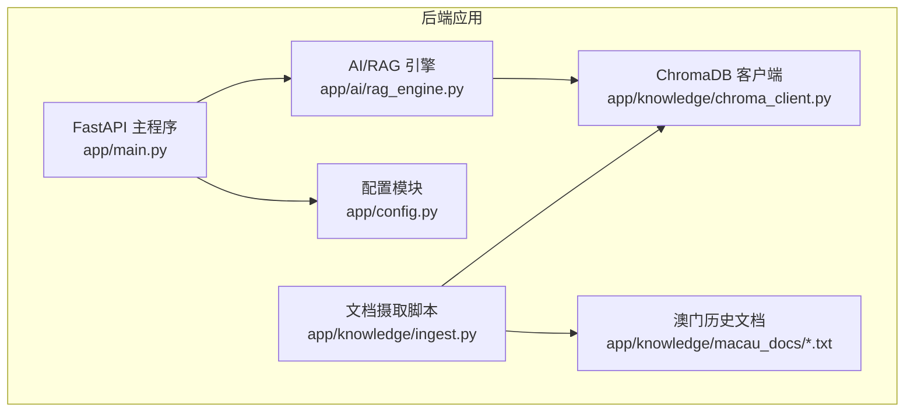
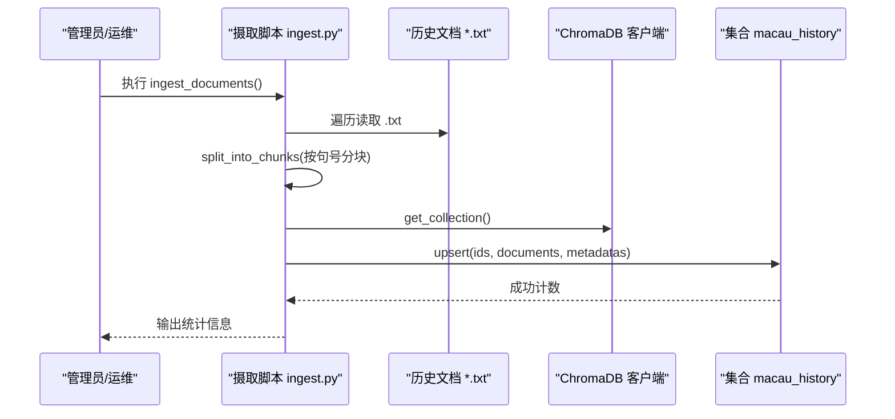
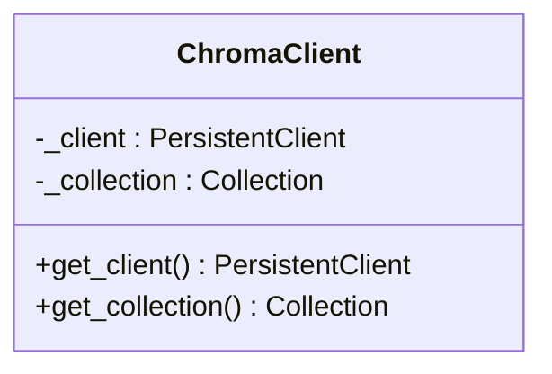
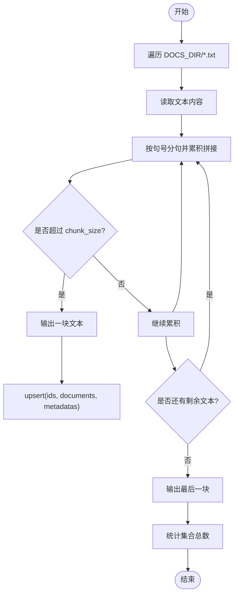
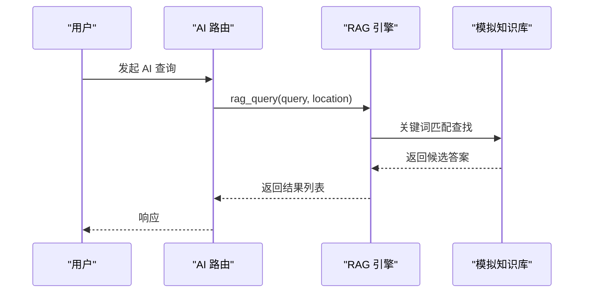
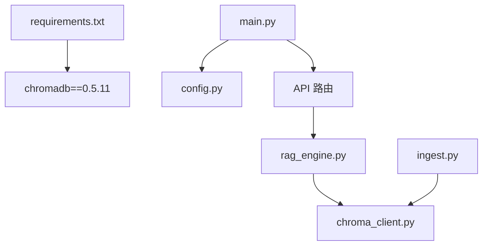

# 向量数据库集成

<cite>
**本文引用的文件**   
- [backend/app/knowledge/chroma_client.py](file://backend/app/knowledge/chroma_client.py)
- [backend/app/knowledge/ingest.py](file://backend/app/knowledge/ingest.py)
- [backend/app/ai/rag_engine.py](file://backend/app/ai/rag_engine.py)
- [backend/app/config.py](file://backend/app/config.py)
- [backend/app/main.py](file://backend/app/main.py)
- [backend/requirements.txt](file://backend/requirements.txt)
- [docker-compose.yml](file://docker-compose.yml)
- [backend/app/knowledge/macau_docs/a_ma_temple.txt](file://backend/app/knowledge/macau_docs/a_ma_temple.txt)
- [backend/app/knowledge/macau_docs/dom_pedro_theatre.txt](file://backend/app/knowledge/macau_docs/dom_pedro_theatre.txt)
</cite>

## 目录
1. [简介](#简介)
2. [项目结构](#项目结构)
3. [核心组件](#核心组件)
4. [架构总览](#架构总览)
5. [详细组件分析](#详细组件分析)
6. [依赖关系分析](#依赖关系分析)
7. [性能与优化](#性能与优化)
8. [故障排除指南](#故障排除指南)
9. [结论](#结论)
10. [附录](#附录)

## 简介
本文件面向澳秘 Macau Mystery 项目的向量数据库集成，重点说明 ChromaDB 的集成架构、配置方式、文档向量化流程、语义索引构建与检索策略，以及澳门历史文档导入的最佳实践。当前代码库已实现 ChromaDB 客户端与集合管理、文本分块与批量 upsert 入库；RAG 引擎仍为模拟实现，预留接入点以便后续对接真实嵌入模型与相似度检索。

## 项目结构
与向量数据库相关的核心目录与文件：
- backend/app/knowledge：ChromaDB 客户端封装、文档摄取（ingest）脚本、澳门历史原始文本
- backend/app/ai：RAG 引擎（当前为占位实现）
- backend/app/config.py：运行时配置（可扩展用于向量库相关设置）
- backend/requirements.txt：包含 chromadb 依赖
- docker-compose.yml：后端服务编排与环境变量注入

图表来源
- [backend/app/main.py:17-111](file://backend/app/main.py#L17-L111)
- [backend/app/config.py:38-77](file://backend/app/config.py#L38-L77)
- [backend/app/ai/rag_engine.py:1-13](file://backend/app/ai/rag_engine.py#L1-L13)
- [backend/app/knowledge/chroma_client.py:1-19](file://backend/app/knowledge/chroma_client.py#L1-L19)
- [backend/app/knowledge/ingest.py:1-36](file://backend/app/knowledge/ingest.py#L1-L36)

章节来源
- [backend/app/main.py:17-111](file://backend/app/main.py#L17-L111)
- [backend/app/config.py:38-77](file://backend/app/config.py#L38-L77)
- [backend/app/ai/rag_engine.py:1-13](file://backend/app/ai/rag_engine.py#L1-L13)
- [backend/app/knowledge/chroma_client.py:1-19](file://backend/app/knowledge/chroma_client.py#L1-L19)
- [backend/app/knowledge/ingest.py:1-36](file://backend/app/knowledge/ingest.py#L1-L36)

## 核心组件
- ChromaDB 客户端与集合管理：提供单例化的持久化客户端与集合获取方法，确保连接复用与集合按需创建。
- 文档摄取（Ingest）：读取 .txt 文件，按中文句号进行分块，生成唯一 ID，并批量 upsert 到 ChromaDB 集合，附带元数据（来源文件名、分块序号）。
- RAG 引擎：当前为模拟实现，返回预置答案；预留接口以接入真实向量检索与 LLM 生成。

章节来源
- [backend/app/knowledge/chroma_client.py:1-19](file://backend/app/knowledge/chroma_client.py#L1-L19)
- [backend/app/knowledge/ingest.py:1-36](file://backend/app/knowledge/ingest.py#L1-L36)
- [backend/app/ai/rag_engine.py:1-13](file://backend/app/ai/rag_engine.py#L1-L13)

## 架构总览
整体数据流分为“入库”和“检索”两条路径：
- 入库路径：读取 .txt → 分块 → 生成 ID 与元数据 → ChromaDB upsert
- 检索路径：用户查询 → RAG 引擎（当前模拟）→ 未来对接 ChromaDB 相似度检索 → 结果返回

图表来源
- [backend/app/knowledge/ingest.py:17-32](file://backend/app/knowledge/ingest.py#L17-L32)
- [backend/app/knowledge/chroma_client.py:7-18](file://backend/app/knowledge/chroma_client.py#L7-L18)

章节来源
- [backend/app/knowledge/ingest.py:17-32](file://backend/app/knowledge/ingest.py#L17-L32)
- [backend/app/knowledge/chroma_client.py:7-18](file://backend/app/knowledge/chroma_client.py#L7-L18)

## 详细组件分析

### ChromaDB 客户端与集合管理
- 单例模式：全局缓存 _client 与 _collection，避免重复初始化开销。
- 持久化存储：使用 PersistentClient 将向量数据落盘至本地路径 ./chroma_db。
- 集合命名与元数据：集合名为 macau_history，附带描述性 metadata。

图表来源
- [backend/app/knowledge/chroma_client.py:1-19](file://backend/app/knowledge/chroma_client.py#L1-L19)

章节来源
- [backend/app/knowledge/chroma_client.py:1-19](file://backend/app/knowledge/chroma_client.py#L1-L19)

### 文档摄取与分块策略
- 输入格式：仅支持 .txt 文本文件，UTF-8 编码。
- 分块算法：按中文句号“。”切分句子，累积拼接直到超过 chunk_size（默认 500），再作为一块输出。
- ID 生成：基于文件名与分块序号组合，保证唯一性。
- 元数据：source 记录来源文件名，chunk 记录分块序号。
- 批量写入：对每个文件的分块逐一 upsert 到集合。

图表来源
- [backend/app/knowledge/ingest.py:6-15](file://backend/app/knowledge/ingest.py#L6-L15)
- [backend/app/knowledge/ingest.py:17-32](file://backend/app/knowledge/ingest.py#L17-L32)

章节来源
- [backend/app/knowledge/ingest.py:6-15](file://backend/app/knowledge/ingest.py#L6-L15)
- [backend/app/knowledge/ingest.py:17-32](file://backend/app/knowledge/ingest.py#L17-L32)

### RAG 引擎与检索流程
- 当前实现：基于关键词匹配返回预置答案，未接入向量检索。
- 扩展点：函数 rag_query(query, location) 可作为未来接入 ChromaDB 相似度检索的入口。

图表来源
- [backend/app/ai/rag_engine.py:3-12](file://backend/app/ai/rag_engine.py#L3-L12)

章节来源
- [backend/app/ai/rag_engine.py:3-12](file://backend/app/ai/rag_engine.py#L3-L12)

### 配置文件与运行环境
- Settings：集中管理数据库 URL、CORS、环境变量开关等。
- 可扩展项：可新增向量库相关配置（如嵌入模型、相似度阈值、批大小等）。

章节来源
- [backend/app/config.py:38-77](file://backend/app/config.py#L38-L77)

## 依赖关系分析
- 外部依赖：chromadb 在 requirements.txt 中声明，版本固定为 0.5.11。
- 运行时：FastAPI 应用启动时加载各路由与中间件，健康检查端点验证数据库可用性。
- Docker：通过 docker-compose 挂载卷与注入环境变量，便于开发与部署。

图表来源
- [backend/requirements.txt:1-17](file://backend/requirements.txt#L1-L17)
- [backend/app/main.py:17-111](file://backend/app/main.py#L17-L111)
- [backend/app/config.py:38-77](file://backend/app/config.py#L38-L77)
- [backend/app/ai/rag_engine.py:1-13](file://backend/app/ai/rag_engine.py#L1-L13)
- [backend/app/knowledge/chroma_client.py:1-19](file://backend/app/knowledge/chroma_client.py#L1-L19)
- [backend/app/knowledge/ingest.py:1-36](file://backend/app/knowledge/ingest.py#L1-L36)

章节来源
- [backend/requirements.txt:1-17](file://backend/requirements.txt#L1-L17)
- [backend/app/main.py:17-111](file://backend/app/main.py#L17-L111)
- [docker-compose.yml:1-21](file://docker-compose.yml#L1-L21)

## 性能与优化
- 批量操作：当前 ingest 逐条 upsert，建议改为批量 upsert（一次传入多个 ids/documents/metadatas）以减少网络与序列化开销。
- 内存管理：大文本分块时应控制累积缓冲区大小，避免一次性加载过多内容导致内存峰值过高。
- 索引与检索：待接入真实嵌入模型后，可调整 top_k、相似度阈值、过滤条件（如 source、chunk）以提升召回与精度。
- 持久化路径：./chroma_db 需具备足够磁盘空间与 I/O 性能，生产环境建议使用独立卷或高性能存储。
- 并发访问：单例客户端适合进程内并发，若多进程部署需考虑进程间共享或分布式 ChromaDB。

[本节为通用指导，不直接分析具体文件]

## 故障排除指南
- 文档目录不存在：ingest 会打印提示并退出，请确认 DOCS_DIR 路径与权限。
- 文件编码问题：确保 .txt 为 UTF-8，否则读取失败。
- 集合创建失败：检查 chromadb 安装与本地路径 ./chroma_db 可写权限。
- 健康检查异常：/api/v1/health 返回 degraded 表示数据库不可用，需检查迁移与连接。
- 检索结果为空：当前 RAG 为模拟实现，尚未接入向量检索，需完善 rag_query 逻辑。

章节来源
- [backend/app/knowledge/ingest.py:17-22](file://backend/app/knowledge/ingest.py#L17-L22)
- [backend/app/main.py:98-105](file://backend/app/main.py#L98-L105)
- [backend/app/ai/rag_engine.py:3-12](file://backend/app/ai/rag_engine.py#L3-L12)

## 结论
本项目已搭建 ChromaDB 客户端与集合管理、文本分块与入库流程，为澳门历史知识向量库奠定基础。下一步应完成 RAG 引擎的真实向量检索接入，包括嵌入模型选择、相似度计算与检索优化，并结合业务场景调优分块策略与元数据设计，以实现高质量的知识问答体验。

[本节为总结性内容，不直接分析具体文件]

## 附录
- 示例文档片段参考：
  - [backend/app/knowledge/macau_docs/a_ma_temple.txt](file://backend/app/knowledge/macau_docs/a_ma_temple.txt)
  - [backend/app/knowledge/macau_docs/dom_pedro_theatre.txt](file://backend/app/knowledge/macau_docs/dom_pedro_theatre.txt)

章节来源
- [backend/app/knowledge/macau_docs/a_ma_temple.txt:1-7](file://backend/app/knowledge/macau_docs/a_ma_temple.txt#L1-L7)
- [backend/app/knowledge/macau_docs/dom_pedro_theatre.txt:1-1](file://backend/app/knowledge/macau_docs/dom_pedro_theatre.txt#L1-L1)