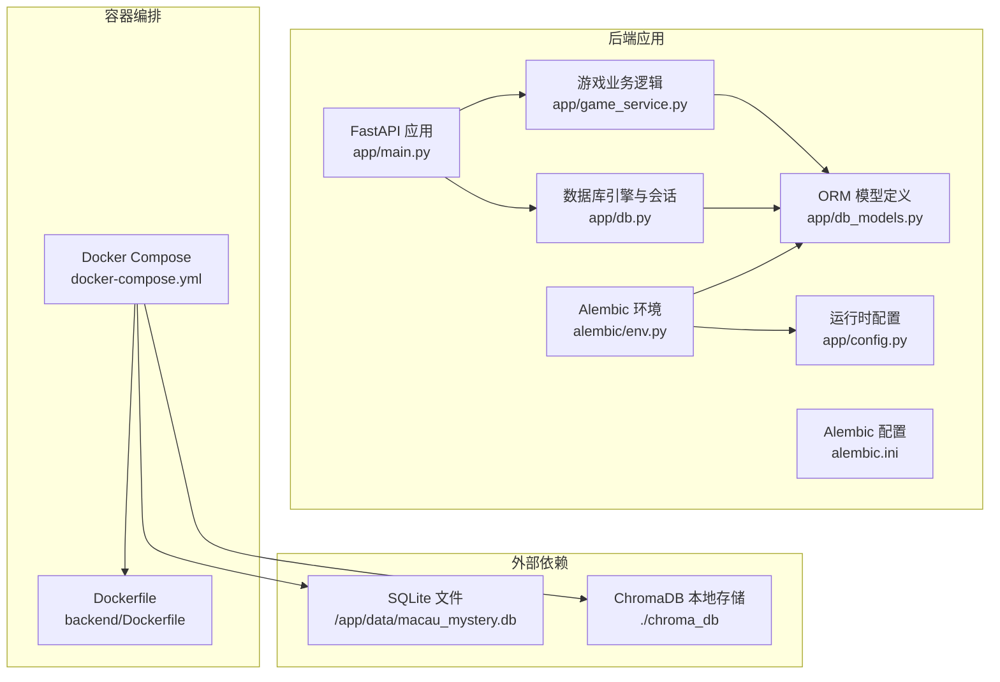
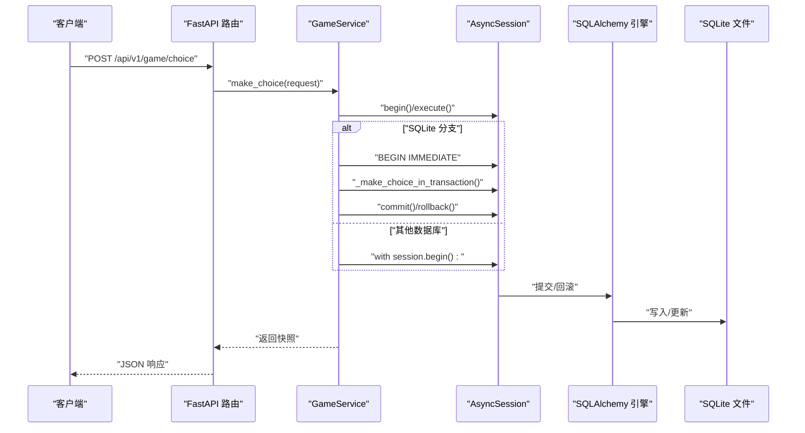
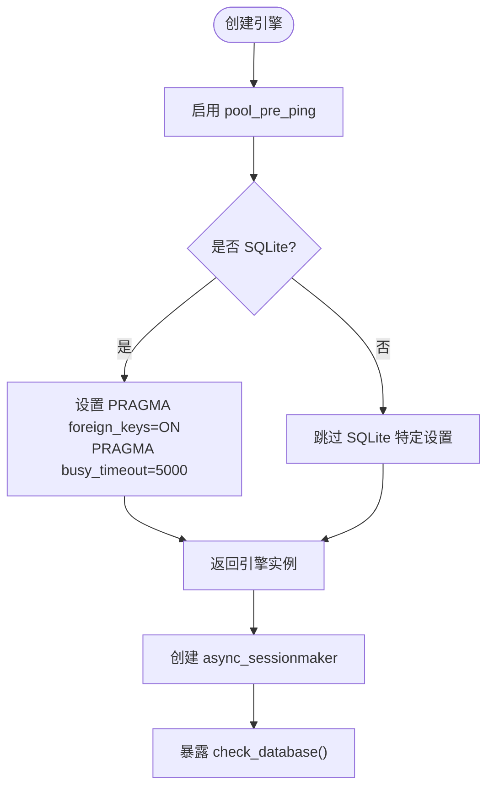
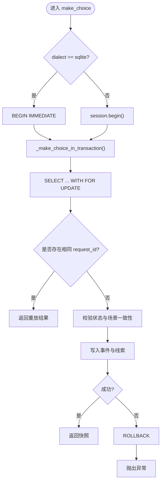
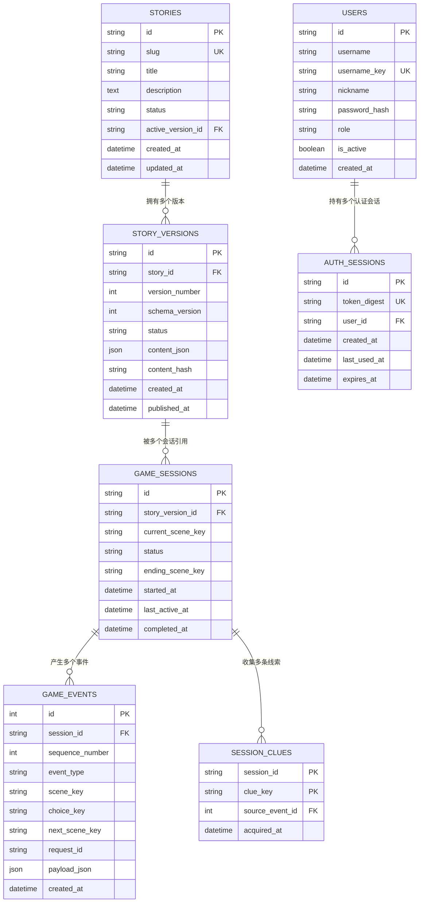
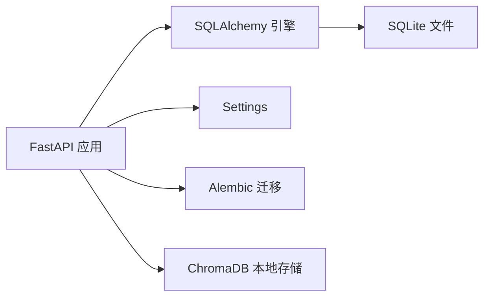

# 数据持久化策略

<cite>
**本文引用的文件**   
- [backend/app/db.py](file://backend/app/db.py)
- [backend/app/db_models.py](file://backend/app/db_models.py)
- [backend/app/config.py](file://backend/app/config.py)
- [backend/app/main.py](file://backend/app/main.py)
- [backend/alembic.ini](file://backend/alembic.ini)
- [backend/alembic/env.py](file://backend/alembic/env.py)
- [backend/alembic/versions/20260803_0001_game_persistence.py](file://backend/alembic/versions/20260803_0001_game_persistence.py)
- [backend/alembic/versions/20260804_0002_auth_persistence.py](file://backend/alembic/versions/20260804_0002_auth_persistence.py)
- [backend/app/game_service.py](file://backend/app/game_service.py)
- [docker-compose.yml](file://docker-compose.yml)
- [backend/Dockerfile](file://backend/Dockerfile)
- [backend/requirements.txt](file://backend/requirements.txt)
- [backend/app/knowledge/chroma_client.py](file://backend/app/knowledge/chroma_client.py)
</cite>

## 目录
1. [简介](#简介)
2. [项目结构](#项目结构)
3. [核心组件](#核心组件)
4. [架构总览](#架构总览)
5. [详细组件分析](#详细组件分析)
6. [依赖关系分析](#依赖关系分析)
7. [性能考量](#性能考量)
8. [故障排查指南](#故障排查指南)
9. [结论](#结论)
10. [附录](#附录)

## 简介
本文件为澳秘 Macau Mystery 的数据持久化策略提供完整设计说明，覆盖 SQLite 数据库配置与优化、连接池与事务处理、并发控制、Docker 容器化部署中的数据卷挂载与持久化、备份恢复策略（含自动备份计划、增量备份与灾难恢复）、缓存层设计（Redis 集成与失效策略）、性能监控方案（慢查询分析、资源使用监控、容量规划）以及安全考虑（数据加密、访问控制、审计日志）。目标读者为系统架构师与运维工程师。

## 项目结构
后端采用 FastAPI + SQLAlchemy 异步驱动（aiosqlite），通过 Alembic 进行数据库迁移；Docker Compose 编排服务并挂载命名卷以持久化 SQLite 文件。核心持久化相关代码集中在 db.py、db_models.py、config.py、game_service.py 与 alembic 相关文件。

**图表来源** 
- [backend/app/main.py:17-111](file://backend/app/main.py#L17-L111)
- [backend/app/db.py:12-27](file://backend/app/db.py#L12-L27)
- [backend/app/db_models.py:20-160](file://backend/app/db_models.py#L20-L160)
- [backend/app/game_service.py:31-100](file://backend/app/game_service.py#L31-L100)
- [backend/app/config.py:38-77](file://backend/app/config.py#L38-L77)
- [backend/alembic/env.py:15-51](file://backend/alembic/env.py#L15-L51)
- [backend/alembic.ini:1-37](file://backend/alembic.ini#L1-L37)
- [docker-compose.yml:1-21](file://docker-compose.yml#L1-L21)
- [backend/Dockerfile:1-13](file://backend/Dockerfile#L1-L13)

**章节来源**
- [backend/app/main.py:17-111](file://backend/app/main.py#L17-L111)
- [backend/app/db.py:12-27](file://backend/app/db.py#L12-L27)
- [backend/app/db_models.py:20-160](file://backend/app/db_models.py#L20-L160)
- [backend/app/config.py:38-77](file://backend/app/config.py#L38-L77)
- [backend/alembic/env.py:15-51](file://backend/alembic/env.py#L15-L51)
- [backend/alembic.ini:1-37](file://backend/alembic.ini#L1-L37)
- [docker-compose.yml:1-21](file://docker-compose.yml#L1-L21)
- [backend/Dockerfile:1-13](file://backend/Dockerfile#L1-L13)

## 核心组件
- 数据库引擎与会话：基于 SQLAlchemy 异步引擎与 async_sessionmaker，针对 SQLite 启用外键约束与忙超时，暴露健康检查接口。
- ORM 模型：故事版本、游戏会话、事件流、线索集合、用户与认证会话等实体，包含完整性约束与索引。
- 配置管理：从环境变量读取数据库 URL、CORS、运行环境与演示数据开关，支持生产/开发差异化。
- 迁移工具：Alembic 环境适配异步 SQLite/PostgreSQL，支持离线与在线模式执行迁移。
- 业务持久化：GameService 实现带事务的游戏推进流程，SQLite 下使用立即事务保证并发安全。
- 容器化：Docker Compose 启动前执行迁移，将 SQLite 文件挂载到命名卷，确保数据持久化。

**章节来源**
- [backend/app/db.py:12-42](file://backend/app/db.py#L12-L42)
- [backend/app/db_models.py:24-160](file://backend/app/db_models.py#L24-L160)
- [backend/app/config.py:38-77](file://backend/app/config.py#L38-L77)
- [backend/alembic/env.py:15-51](file://backend/alembic/env.py#L15-L51)
- [backend/app/game_service.py:70-100](file://backend/app/game_service.py#L70-L100)
- [docker-compose.yml:1-21](file://docker-compose.yml#L1-L21)

## 架构总览
整体架构围绕“请求 → 路由 → 服务 → 会话 → 引擎”的链路展开，SQLite 作为单机持久化存储，通过 Docker 卷保障数据不随容器销毁而丢失。

**图表来源** 
- [backend/app/game_service.py:70-100](file://backend/app/game_service.py#L70-L100)
- [backend/app/db.py:26-27](file://backend/app/db.py#L26-L27)

**章节来源**
- [backend/app/game_service.py:70-100](file://backend/app/game_service.py#L70-L100)
- [backend/app/db.py:26-27](file://backend/app/db.py#L26-L27)

## 详细组件分析

### SQLite 引擎与连接池管理
- 引擎创建：使用 create_async_engine 并开启 pool_pre_ping，提升连接可用性检测能力。
- SQLite 特性：在连接建立时启用 PRAGMA foreign_keys=ON 与 PRAGMA busy_timeout=5000，确保外键约束生效与并发写冲突时的等待策略。
- 会话工厂：async_sessionmaker 配置 expire_on_commit=False 以减少不必要的刷新开销。
- 健康检查：check_database 通过 SELECT 1 验证连接可用性，供 /health 端点使用。

**图表来源** 
- [backend/app/db.py:12-27](file://backend/app/db.py#L12-L27)
- [backend/app/main.py:98-107](file://backend/app/main.py#L98-L107)

**章节来源**
- [backend/app/db.py:12-27](file://backend/app/db.py#L12-L27)
- [backend/app/main.py:98-107](file://backend/app/main.py#L98-L107)

### 事务处理与并发控制
- SQLite 事务：在 make_choice 中显式 BEGIN IMMEDIATE，避免共享锁导致的写冲突，异常时回滚。
- 通用事务：非 SQLite 使用 session.begin() 包裹事务块。
- 行级锁定：通过 with_for_update() 对 GameSession 加锁，防止并发选择导致的状态不一致。
- 幂等性：通过 request_id 唯一约束避免重复提交。

**图表来源** 
- [backend/app/game_service.py:70-100](file://backend/app/game_service.py#L70-L100)
- [backend/app/game_service.py:84-100](file://backend/app/game_service.py#L84-L100)

**章节来源**
- [backend/app/game_service.py:70-100](file://backend/app/game_service.py#L70-L100)
- [backend/app/game_service.py:84-100](file://backend/app/game_service.py#L84-L100)

### 数据模型与约束
- 故事与版本：stories 与 story_versions 通过 active_version_id 关联，限制状态枚举值，确保内容哈希唯一性。
- 游戏会话与事件：game_sessions 记录当前场景与状态；game_events 按 sequence_number 有序记录事件，具备唯一约束。
- 线索集合：session_clues 以 session_id + clue_key 为主键，避免重复获取。
- 用户与认证：users 与 auth_sessions 通过 token_digest 唯一索引，支持过期时间与活跃标记。

**图表来源** 
- [backend/app/db_models.py:24-160](file://backend/app/db_models.py#L24-L160)
- [backend/alembic/versions/20260803_0001_game_persistence.py:17-112](file://backend/alembic/versions/20260803_0001_game_persistence.py#L17-L112)
- [backend/alembic/versions/20260804_0002_auth_persistence.py:17-54](file://backend/alembic/versions/20260804_0002_auth_persistence.py#L17-L54)

**章节来源**
- [backend/app/db_models.py:24-160](file://backend/app/db_models.py#L24-L160)
- [backend/alembic/versions/20260803_0001_game_persistence.py:17-112](file://backend/alembic/versions/20260803_0001_game_persistence.py#L17-L112)
- [backend/alembic/versions/20260804_0002_auth_persistence.py:17-54](file://backend/alembic/versions/20260804_0002_auth_persistence.py#L17-L54)

### 迁移与环境
- Alembic 配置：默认指向 SQLite 文件路径，日志级别与处理器配置清晰。
- 环境脚本：根据运行模式选择离线或在线迁移，使用 NullPool 避免连接池干扰。
- 迁移历史：包含游戏持久化与认证持久化的两次迁移，确保表结构与索引一致。

**章节来源**
- [backend/alembic.ini:1-37](file://backend/alembic.ini#L1-L37)
- [backend/alembic/env.py:15-51](file://backend/alembic/env.py#L15-L51)
- [backend/alembic/versions/20260803_0001_game_persistence.py:17-112](file://backend/alembic/versions/20260803_0001_game_persistence.py#L17-L112)
- [backend/alembic/versions/20260804_0002_auth_persistence.py:17-54](file://backend/alembic/versions/20260804_0002_auth_persistence.py#L17-L54)

### Docker 容器化与数据持久化
- 镜像构建：基于 python:3.11-slim，安装依赖并暴露端口。
- 编排配置：DATABASE_URL 指向容器内 /app/data/macau_mystery.db，命令先执行 alembic upgrade head，再启动 uvicorn。
- 数据卷：backend_sqlite_data 命名卷挂载至 /app/data，确保数据跨容器重启持久化。

**章节来源**
- [backend/Dockerfile:1-13](file://backend/Dockerfile#L1-L13)
- [docker-compose.yml:1-21](file://docker-compose.yml#L1-L21)

## 依赖关系分析
- 运行时依赖：FastAPI、uvicorn、sqlalchemy、aiosqlite、alembic 等。
- 外部存储：SQLite 文件位于持久卷；ChromaDB 本地持久化用于知识库向量检索。
- 配置依赖：环境变量 DATABASE_URL、APP_ENV、CORS_ORIGINS 等决定行为。

**图表来源** 
- [backend/requirements.txt:1-17](file://backend/requirements.txt#L1-L17)
- [backend/app/knowledge/chroma_client.py:1-18](file://backend/app/knowledge/chroma_client.py#L1-L18)
- [docker-compose.yml:1-21](file://docker-compose.yml#L1-L21)

**章节来源**
- [backend/requirements.txt:1-17](file://backend/requirements.txt#L1-L17)
- [backend/app/knowledge/chroma_client.py:1-18](file://backend/app/knowledge/chroma_client.py#L1-L18)
- [docker-compose.yml:1-21](file://docker-compose.yml#L1-L21)

## 性能考量
- 连接池与健康检查：pool_pre_ping 减少无效连接；SQLite busy_timeout 降低写冲突失败率。
- 事务粒度：选择最小必要的事务范围，避免长事务阻塞；SQLite 使用 IMMEDIATE 事务提高并发写稳定性。
- 索引与查询：关键列添加索引（如 session_id、token_digest、username_key），减少全表扫描。
- JSON 字段：payload_json 与 content_json 适合灵活扩展，但应避免过大负载影响序列化性能。
- 健康端点：/health 快速判断数据库可用性，便于负载均衡与健康探针。

[本节为通用指导，不直接分析具体文件]

## 故障排查指南
- 数据库不可用：/health 返回 degraded 且 database=unavailable，检查 DATABASE_URL 与卷挂载路径。
- 迁移未执行：启动时报错提示需执行 alembic upgrade head，确认 docker-compose 命令或本地手动执行。
- 并发冲突：SQLite 写冲突导致异常，检查是否正确使用 BEGIN IMMEDIATE 与事务回滚。
- 认证失败：token 过期或无效，检查 auth_sessions 过期时间与用户状态。

**章节来源**
- [backend/app/main.py:98-107](file://backend/app/main.py#L98-L107)
- [backend/app/game_service.py:70-100](file://backend/app/game_service.py#L70-L100)
- [backend/app/auth_service.py:104-130](file://backend/app/auth_service.py#L104-L130)

## 结论
本项目以 SQLite 为核心持久化存储，结合 SQLAlchemy 异步驱动与 Alembic 迁移，实现了稳定可靠的故事版本管理与游戏会话推进。通过 Docker 卷确保数据持久化，并在 SQLite 下采用 IMMEDIATE 事务与行级锁定保障并发安全。建议在生产环境中评估 PostgreSQL 替代方案以获得更强的并发与高可用能力，同时引入 Redis 缓存与完善的监控、备份与安全机制。

[本节为总结性内容，不直接分析具体文件]

## 附录

### SQLite 配置与优化清单
- 启用外键约束与忙超时：已在连接事件中设置。
- 连接池健康检查：pool_pre_ping 已启用。
- 会话配置：expire_on_commit=False 减少刷新开销。
- 健康检查：/health 端点验证数据库可用性。

**章节来源**
- [backend/app/db.py:12-27](file://backend/app/db.py#L12-L27)
- [backend/app/main.py:98-107](file://backend/app/main.py#L98-L107)

### Docker 部署与数据卷
- 镜像构建：python:3.11-slim，安装依赖，暴露 8000 端口。
- 编排命令：先执行 alembic upgrade head，再启动 uvicorn。
- 数据卷：backend_sqlite_data 挂载至 /app/data，确保数据持久化。

**章节来源**
- [backend/Dockerfile:1-13](file://backend/Dockerfile#L1-L13)
- [docker-compose.yml:1-21](file://docker-compose.yml#L1-L21)

### 备份恢复策略（建议）
- 自动备份计划：使用 cron 定时复制 SQLite 文件至备份目录或对象存储。
- 增量备份：基于 WAL 模式与时间点恢复，定期归档增量日志。
- 灾难恢复：从最新全量备份恢复，再回放增量日志至目标时间点。
- 验证恢复：在隔离环境执行恢复演练，验证数据完整性与业务可用性。

[本节为通用指导，不直接分析具体文件]

### 缓存层设计（建议）
- Redis 集成：缓存热点剧情片段、用户会话摘要与计算结果。
- 缓存失效策略：基于版本号与时间 TTL 双重失效，确保数据一致性。
- 降级策略：缓存不可用时回退至数据库直读。

[本节为通用指导，不直接分析具体文件]

### 性能监控方案（建议）
- 慢查询分析：启用 SQLAlchemy 日志与数据库慢查询日志，定期分析。
- 资源使用监控：CPU、内存、磁盘 IO、连接数与队列长度监控。
- 容量规划：评估数据增长趋势，预留扩容空间与分库分表预案。

[本节为通用指导，不直接分析具体文件]

### 安全考虑（建议）
- 数据加密：敏感字段（如密码哈希）已使用强哈希算法；传输层启用 TLS。
- 访问控制：基于角色的权限校验，管理员接口增加额外鉴权。
- 审计日志：记录关键操作（登录、选择、发布）与异常事件，便于追溯。

[本节为通用指导，不直接分析具体文件]