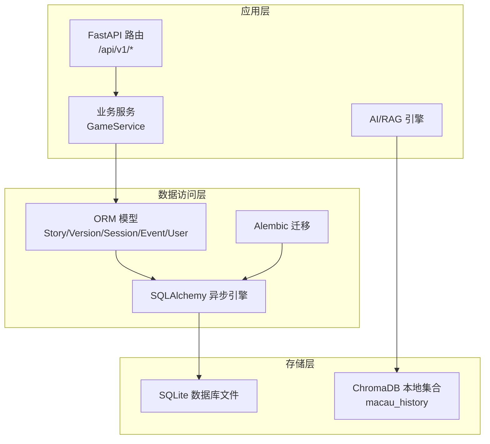
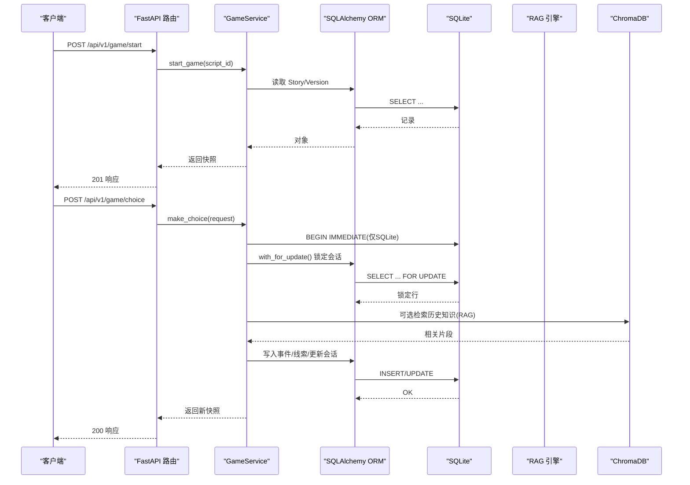
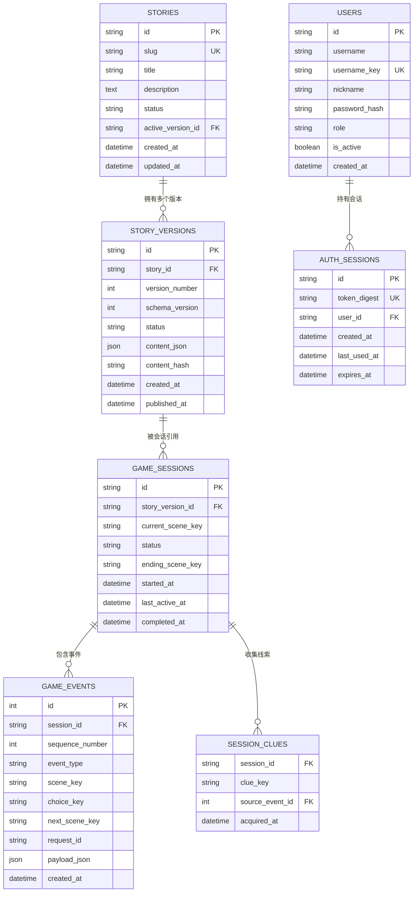
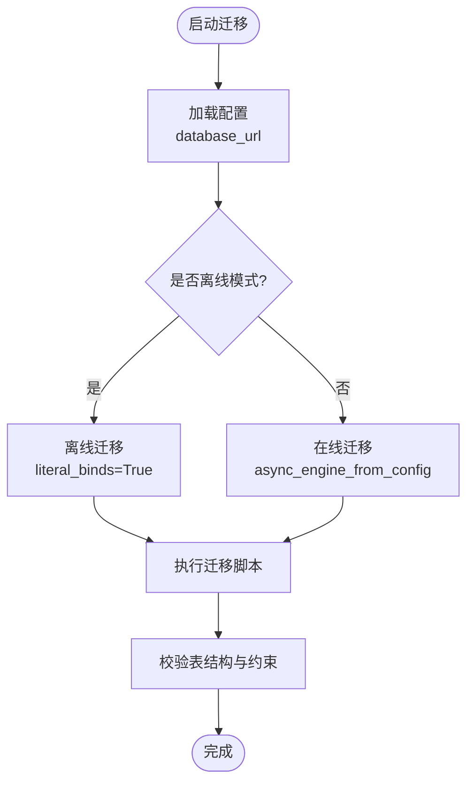
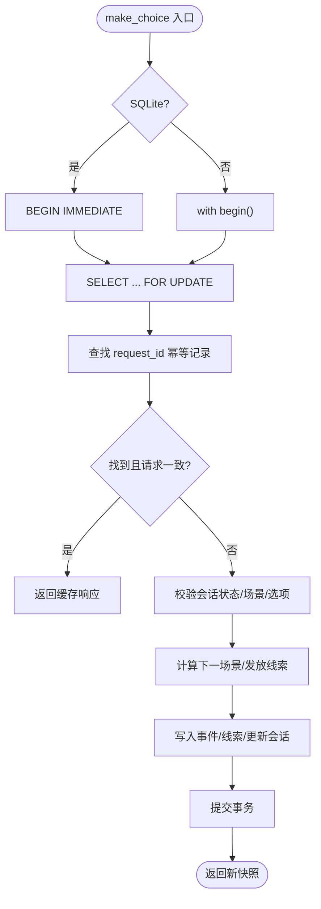
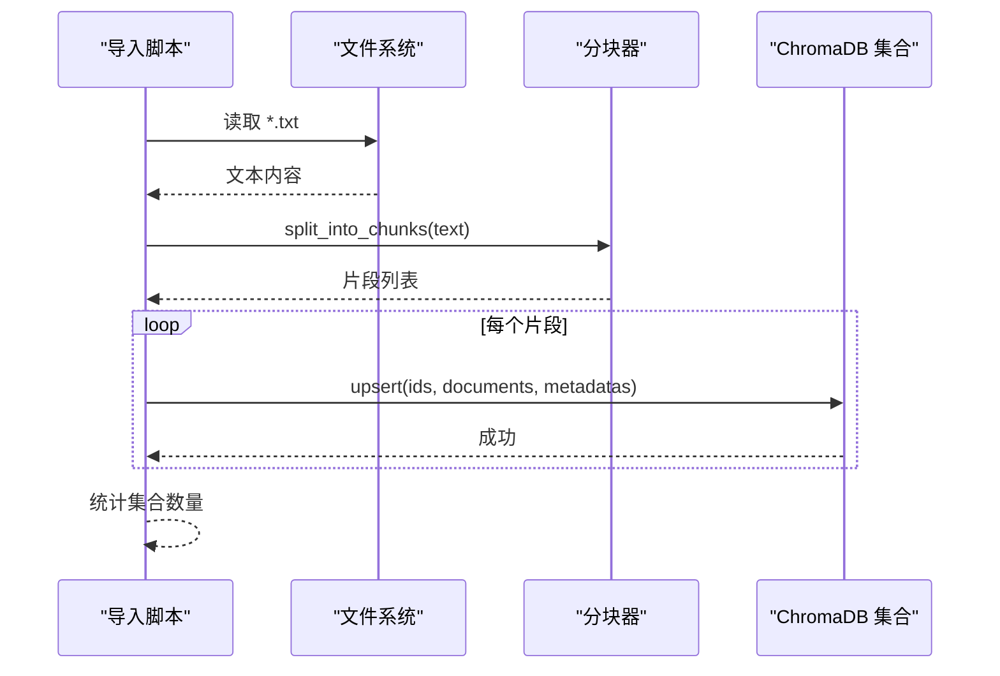
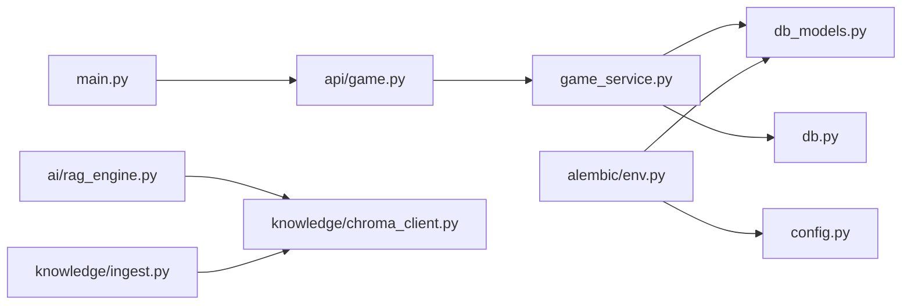

# 数据架构

<cite>
**本文引用的文件**   
- [backend/app/db.py](file://backend/app/db.py)
- [backend/app/db_models.py](file://backend/app/db_models.py)
- [backend/alembic/env.py](file://backend/alembic/env.py)
- [backend/alembic/versions/20260803_0001_game_persistence.py](file://backend/alembic/versions/20260803_0001_game_persistence.py)
- [backend/alembic/versions/20260804_0002_auth_persistence.py](file://backend/alembic/versions/20260804_0002_auth_persistence.py)
- [backend/app/config.py](file://backend/app/config.py)
- [backend/app/main.py](file://backend/app/main.py)
- [backend/app/game_service.py](file://backend/app/game_service.py)
- [backend/app/api/game.py](file://backend/app/api/game.py)
- [backend/app/knowledge/chroma_client.py](file://backend/app/knowledge/chroma_client.py)
- [backend/app/knowledge/ingest.py](file://backend/app/knowledge/ingest.py)
- [backend/app/ai/rag_engine.py](file://backend/app/ai/rag_engine.py)
- [backend/tests/test_migrations.py](file://backend/tests/test_migrations.py)
- [backend/tests/test_health.py](file://backend/tests/test_health.py)
- [backend/requirements.txt](file://backend/requirements.txt)
</cite>

## 目录
1. [简介](#简介)
2. [项目结构](#项目结构)
3. [核心组件](#核心组件)
4. [架构总览](#架构总览)
5. [详细组件分析](#详细组件分析)
6. [依赖关系分析](#依赖关系分析)
7. [性能与容量规划](#性能与容量规划)
8. [故障排查指南](#故障排查指南)
9. [结论](#结论)
10. [附录](#附录)

## 简介
本文件面向数据工程师与DBA，系统化阐述澳秘 Macau Mystery 的数据架构设计：以 SQLite 为关系型持久化存储、ChromaDB 作为向量知识库，结合 SQLAlchemy ORM 与 Alembic 迁移管理，提供版本化剧情、游戏会话与事件审计、用户认证等能力。文档覆盖数据模型、事务与并发控制、索引优化、一致性保证、备份恢复、监控与容量规划，以及向量检索与语义索引构建流程。

## 项目结构
后端采用 FastAPI + SQLAlchemy 异步引擎 + Alembic 迁移的架构；知识检索通过 ChromaDB 本地持久化集合实现；AI 模块当前使用占位 RAG 接口，预留接入向量库。

**图表来源** 
- [backend/app/main.py:17-111](file://backend/app/main.py#L17-L111)
- [backend/app/game_service.py:31-386](file://backend/app/game_service.py#L31-L386)
- [backend/app/db.py:12-27](file://backend/app/db.py#L12-L27)
- [backend/app/db_models.py:24-160](file://backend/app/db_models.py#L24-L160)
- [backend/alembic/env.py:15-51](file://backend/alembic/env.py#L15-L51)
- [backend/app/knowledge/chroma_client.py:7-18](file://backend/app/knowledge/chroma_client.py#L7-L18)

**章节来源**
- [backend/app/main.py:17-111](file://backend/app/main.py#L17-L111)
- [backend/app/config.py:38-77](file://backend/app/config.py#L38-L77)

## 核心组件
- 数据库连接与引擎：异步引擎创建、SQLite PRAGMA 配置（外键、忙超时）、健康检查。
- ORM 模型：故事与版本、游戏会话与事件、线索、用户与认证会话。
- 迁移系统：Alembic 环境配置、在线/离线模式、表结构与约束定义。
- 业务服务：游戏开始、选择推进、状态查询、幂等与并发控制。
- 向量知识库：ChromaDB 客户端与集合、文档分块与入库。
- 配置与环境：数据库 URL、CORS、运行环境、演示数据开关、令牌 TTL。

**章节来源**
- [backend/app/db.py:12-42](file://backend/app/db.py#L12-L42)
- [backend/app/db_models.py:24-160](file://backend/app/db_models.py#L24-L160)
- [backend/alembic/env.py:15-51](file://backend/alembic/env.py#L15-L51)
- [backend/app/game_service.py:31-386](file://backend/app/game_service.py#L31-L386)
- [backend/app/knowledge/chroma_client.py:7-18](file://backend/app/knowledge/chroma_client.py#L7-L18)
- [backend/app/knowledge/ingest.py:1-36](file://backend/app/knowledge/ingest.py#L1-L36)
- [backend/app/config.py:38-77](file://backend/app/config.py#L38-L77)

## 架构总览
整体数据流从 API 路由进入 GameService，通过 SQLAlchemy 异步会话读写 SQLite；选择分支时进行事务与并发锁处理，确保幂等与一致性；向量检索由 AI 模块调用 ChromaDB 集合，用于历史知识增强。

**图表来源** 
- [backend/app/api/game.py:15-37](file://backend/app/api/game.py#L15-L37)
- [backend/app/game_service.py:35-193](file://backend/app/game_service.py#L35-L193)
- [backend/app/db.py:30-42](file://backend/app/db.py#L30-L42)
- [backend/app/ai/rag_engine.py:3-13](file://backend/app/ai/rag_engine.py#L3-L13)
- [backend/app/knowledge/chroma_client.py:7-18](file://backend/app/knowledge/chroma_client.py#L7-L18)

## 详细组件分析

### 关系型数据模型与索引策略
- 故事与版本：stories 与 story_versions 一对多，active_version_id 指向活跃版本；内容哈希去重；状态枚举校验。
- 游戏会话与事件：game_sessions 记录当前场景与状态；game_events 按 session_id 与 sequence_number 有序记录；request_id 唯一性保障幂等。
- 线索：session_clues 复合主键 (session_id, clue_key)，关联 source_event_id。
- 用户与认证：users 角色校验；auth_sessions 存储 token_digest 并建立索引。

**图表来源** 
- [backend/app/db_models.py:24-160](file://backend/app/db_models.py#L24-L160)
- [backend/alembic/versions/20260803_0001_game_persistence.py:17-129](file://backend/alembic/versions/20260803_0001_game_persistence.py#L17-L129)
- [backend/alembic/versions/20260804_0002_auth_persistence.py:17-55](file://backend/alembic/versions/20260804_0002_auth_persistence.py#L17-L55)

**章节来源**
- [backend/app/db_models.py:24-160](file://backend/app/db_models.py#L24-L160)
- [backend/alembic/versions/20260803_0001_game_persistence.py:17-129](file://backend/alembic/versions/20260803_0001_game_persistence.py#L17-L129)
- [backend/alembic/versions/20260804_0002_auth_persistence.py:17-55](file://backend/alembic/versions/20260804_0002_auth_persistence.py#L17-L55)

### 数据库迁移管理与一致性
- Alembic 环境加载 Settings.database_url，绑定 Base.metadata，支持在线/离线迁移。
- 初始迁移创建五张核心表及约束、索引；第二版迁移创建用户与认证会话表。
- 测试验证迁移结果与约束完整性。

**图表来源** 
- [backend/alembic/env.py:15-51](file://backend/alembic/env.py#L15-L51)
- [backend/tests/test_migrations.py:15-61](file://backend/tests/test_migrations.py#L15-L61)

**章节来源**
- [backend/alembic/env.py:15-51](file://backend/alembic/env.py#L15-L51)
- [backend/tests/test_migrations.py:15-61](file://backend/tests/test_migrations.py#L15-L61)

### 事务处理与并发控制机制
- SQLite 专用路径：在 make_choice 中显式 BEGIN IMMEDIATE 获取写锁，避免并发冲突；异常回滚。
- PostgreSQL 兼容路径：使用 with_for_update() 行级锁，二次幂等检查防止重复提交。
- 幂等性：基于 request_id 唯一约束与 payload 比对，返回已缓存响应或拒绝冲突。

**图表来源** 
- [backend/app/game_service.py:70-193](file://backend/app/game_service.py#L70-L193)

**章节来源**
- [backend/app/game_service.py:70-193](file://backend/app/game_service.py#L70-L193)

### 向量数据存储与语义检索
- ChromaDB 客户端单例化，持久化到 ./chroma_db；集合 macau_history 存储澳门历史文本片段。
- 文档分块：按句号切分，控制 chunk_size；每条记录附带 source 与 chunk 元数据。
- RAG 引擎：当前为占位实现，未来可替换为向量相似度检索（如余弦相似度）并结合位置与线索上下文。

**图表来源** 
- [backend/app/knowledge/ingest.py:1-36](file://backend/app/knowledge/ingest.py#L1-L36)
- [backend/app/knowledge/chroma_client.py:7-18](file://backend/app/knowledge/chroma_client.py#L7-L18)

**章节来源**
- [backend/app/knowledge/ingest.py:1-36](file://backend/app/knowledge/ingest.py#L1-L36)
- [backend/app/knowledge/chroma_client.py:7-18](file://backend/app/knowledge/chroma_client.py#L7-L18)
- [backend/app/ai/rag_engine.py:3-13](file://backend/app/ai/rag_engine.py#L3-L13)

### 配置与环境变量
- database_url：默认 SQLite 文件路径，可通过环境变量覆盖。
- CORS_ORIGINS：允许的前端来源。
- APP_ENV：运行环境，影响生产特性开关。
- BOOTSTRAP_DEMO_*：开发环境演示数据初始化开关。
- AUTH_TOKEN_TTL_HOURS：令牌有效期。

**章节来源**
- [backend/app/config.py:38-77](file://backend/app/config.py#L38-L77)

## 依赖关系分析
- FastAPI 路由依赖 GameService，后者依赖 SQLAlchemy 异步会话与 ORM 模型。
- Alembic 依赖 Settings 与 Base.metadata，生成/执行迁移。
- ChromaDB 客户端独立于业务服务，供 AI/RAG 模块调用。
- 测试覆盖迁移与健康检查，确保数据库可用性与结构正确性。

**图表来源** 
- [backend/app/main.py:17-111](file://backend/app/main.py#L17-L111)
- [backend/app/api/game.py:15-37](file://backend/app/api/game.py#L15-L37)
- [backend/app/game_service.py:31-386](file://backend/app/game_service.py#L31-L386)
- [backend/app/db_models.py:24-160](file://backend/app/db_models.py#L24-L160)
- [backend/app/db.py:12-27](file://backend/app/db.py#L12-L27)
- [backend/alembic/env.py:15-51](file://backend/alembic/env.py#L15-L51)
- [backend/app/config.py:38-77](file://backend/app/config.py#L38-L77)
- [backend/app/ai/rag_engine.py:3-13](file://backend/app/ai/rag_engine.py#L3-L13)
- [backend/app/knowledge/chroma_client.py:7-18](file://backend/app/knowledge/chroma_client.py#L7-L18)
- [backend/app/knowledge/ingest.py:1-36](file://backend/app/knowledge/ingest.py#L1-L36)

**章节来源**
- [backend/requirements.txt:1-16](file://backend/requirements.txt#L1-L16)

## 性能与容量规划
- SQLite 优化：启用外键与 busy_timeout；在高并发写入场景建议评估迁移至 PostgreSQL（代码已兼容）。
- 索引策略：对频繁查询字段建立索引（如 game_sessions.story_version_id、game_events.session_id、users.username_key、auth_sessions.token_digest/user_id）。
- 幂等与回放：利用 request_id 与 payload 比对减少重复计算与写入。
- 向量库容量：按文档规模估算片段数量与向量维度，预留磁盘空间与内存；定期归档旧集合或清理过期片段。
- 监控指标：健康端点 /api/v1/health 暴露数据库可用性；建议增加慢查询日志、连接池大小与事务耗时监控。

[本节为通用指导，不直接分析具体文件]

## 故障排查指南
- 数据库不可用：健康端点返回 degraded 状态；检查 DATABASE_URL 与 alembic 迁移是否执行。
- 迁移失败：确认 env.py 配置与 Base.metadata；查看迁移脚本 downgrade/upgrade 逻辑。
- 并发冲突：SQLite 下出现写锁错误；确保 make_choice 使用 BEGIN IMMEDIATE 与回滚逻辑。
- 幂等冲突：request_id 重复但请求不一致；检查 payload 比对逻辑与唯一约束。
- 向量检索无结果：确认 ingesting 是否成功；检查 chroma_db 目录权限与集合名称。

**章节来源**
- [backend/app/main.py:98-106](file://backend/app/main.py#L98-L106)
- [backend/tests/test_health.py:9-22](file://backend/tests/test_health.py#L9-L22)
- [backend/app/game_service.py:70-193](file://backend/app/game_service.py#L70-L193)
- [backend/app/knowledge/ingest.py:17-32](file://backend/app/knowledge/ingest.py#L17-L32)

## 结论
本项目以 SQLite 为核心关系型存储，配合 SQLAlchemy 异步 ORM 与 Alembic 迁移，实现了版本化剧情、会话与事件审计、用户认证等关键能力；ChromaDB 提供向量知识库支撑 RAG 增强。通过严格的约束、幂等与并发控制，保证了数据一致性与高可用。后续可考虑向 PostgreSQL 迁移以提升并发与扩展性，并完善向量检索与监控体系。

[本节为总结性内容，不直接分析具体文件]

## 附录
- 环境变量清单：DATABASE_URL、CORS_ORIGINS、APP_ENV、BOOTSTRAP_DEMO_STORY、BOOTSTRAP_DEMO_USERS、AUTH_TOKEN_TTL_HOURS、DEMO_ADMIN_USERNAME、DEMO_ADMIN_PASSWORD、DEMO_GUEST_USERNAME、DEMO_GUEST_PASSWORD。
- 常用命令：
  - 迁移：alembic upgrade head
  - 健康检查：GET /api/v1/health
  - 向量入库：python -m app.knowledge.ingest

**章节来源**
- [backend/app/config.py:38-77](file://backend/app/config.py#L38-L77)
- [backend/app/main.py:98-106](file://backend/app/main.py#L98-L106)
- [backend/app/knowledge/ingest.py:34-36](file://backend/app/knowledge/ingest.py#L34-L36)