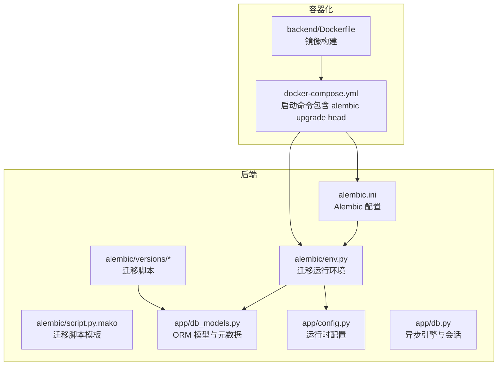
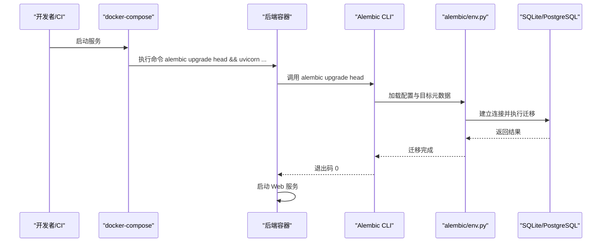
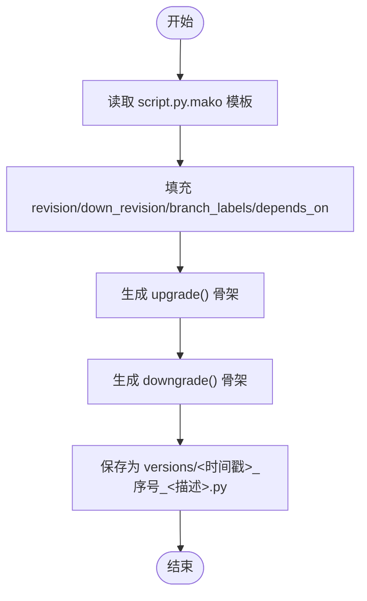
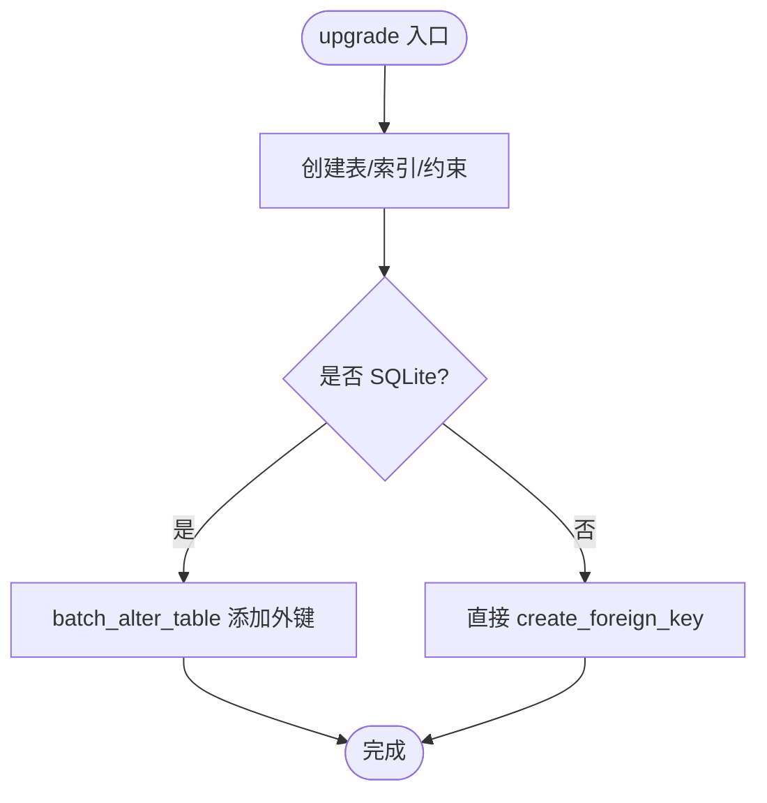
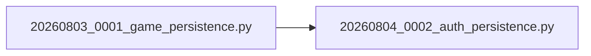
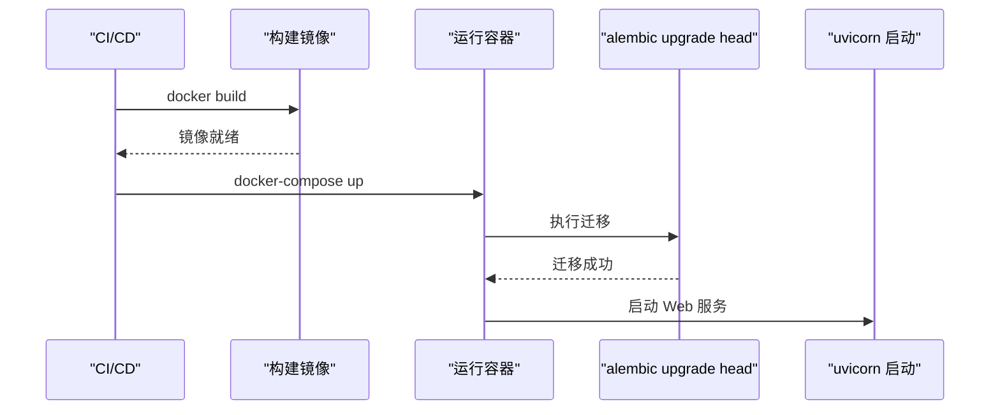
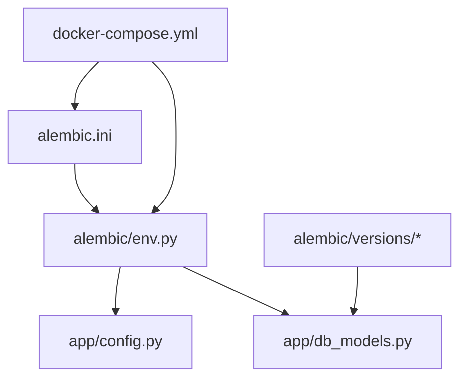

# 数据迁移管理

<cite>
**本文引用的文件**   
- [alembic.ini](file://backend/alembic.ini)
- [env.py](file://backend/alembic/env.py)
- [script.py.mako](file://backend/alembic/script.py.mako)
- [20260803_0001_game_persistence.py](file://backend/alembic/versions/20260803_0001_game_persistence.py)
- [20260804_0002_auth_persistence.py](file://backend/alembic/versions/20260804_0002_auth_persistence.py)
- [db.py](file://backend/app/db.py)
- [db_models.py](file://backend/app/db_models.py)
- [config.py](file://backend/app/config.py)
- [test_migrations.py](file://backend/tests/test_migrations.py)
- [docker-compose.yml](file://docker-compose.yml)
- [Dockerfile](file://backend/Dockerfile)
</cite>

## 目录
1. [简介](#简介)
2. [项目结构](#项目结构)
3. [核心组件](#核心组件)
4. [架构总览](#架构总览)
5. [详细组件分析](#详细组件分析)
6. [依赖关系分析](#依赖关系分析)
7. [性能考虑](#性能考虑)
8. [故障排查指南](#故障排查指南)
9. [结论](#结论)
10. [附录](#附录)

## 简介
本文件为澳秘 Macau Mystery 后端的数据迁移管理提供完整操作与最佳实践指南。内容覆盖 Alembic 迁移框架的配置、环境设置、模板定制、迁移脚本生成与执行；详细说明迁移文件的结构与命名规范，up/down 方法实现要点；阐述数据库版本控制策略、迁移依赖管理与冲突解决机制；给出自动化迁移流程（CI/CD 集成与部署脚本）；并提供数据备份、回滚策略、兼容性测试等最佳实践与常见问题解决方案，帮助团队安全、稳定地演进数据库结构。

## 项目结构
后端使用 Alembic 进行数据库版本化管理，相关配置与脚本集中在 backend/alembic 目录下，模型定义在 app/db_models.py，运行时配置在 app/config.py，异步引擎与会话在 app/db.py，容器化编排通过 docker-compose.yml 完成。

**图示来源** 
- [alembic.ini:1-37](file://backend/alembic.ini#L1-L37)
- [env.py:1-51](file://backend/alembic/env.py#L1-L51)
- [script.py.mako:1-23](file://backend/alembic/script.py.mako#L1-L23)
- [20260803_0001_game_persistence.py:1-129](file://backend/alembic/versions/20260803_0001_game_persistence.py#L1-L129)
- [20260804_0002_auth_persistence.py:1-55](file://backend/alembic/versions/20260804_0002_auth_persistence.py#L1-L55)
- [db_models.py:1-160](file://backend/app/db_models.py#L1-L160)
- [config.py:1-77](file://backend/app/config.py#L1-L77)
- [docker-compose.yml:1-21](file://docker-compose.yml#L1-L21)
- [Dockerfile:1-13](file://backend/Dockerfile#L1-L13)

**章节来源**
- [alembic.ini:1-37](file://backend/alembic.ini#L1-L37)
- [env.py:1-51](file://backend/alembic/env.py#L1-L51)
- [script.py.mako:1-23](file://backend/alembic/script.py.mako#L1-L23)
- [db_models.py:1-160](file://backend/app/db_models.py#L1-L160)
- [config.py:1-77](file://backend/app/config.py#L1-L77)
- [docker-compose.yml:1-21](file://docker-compose.yml#L1-L21)
- [Dockerfile:1-13](file://backend/Dockerfile#L1-L13)

## 核心组件
- Alembic 配置文件：指定脚本位置、系统路径前缀、数据库连接 URL、日志级别等。
- 迁移环境 env.py：从运行时配置读取数据库 URL，注入 ORM 元数据，支持离线与在线模式，基于异步引擎执行迁移。
- 迁移脚本模板 script.py.mako：定义 revision、down_revision、branch_labels、depends_on 以及 upgrade/downgrade 骨架。
- 迁移脚本 versions/*：具体表结构变更，包含 up 与 down 方法，处理 SQLite 与非 SQLite 的差异。
- ORM 模型 db_models.py：声明 Base.metadata，供 Alembic 自动检测差异或用于比较类型。
- 运行时配置 config.py：提供 database_url 等环境变量解析。
- 异步引擎 db.py：创建异步引擎并针对 SQLite 开启外键约束与忙超时。
- 容器编排 docker-compose.yml：启动时执行 alembic upgrade head，确保数据库结构与应用一致。

**章节来源**
- [alembic.ini:1-37](file://backend/alembic.ini#L1-L37)
- [env.py:1-51](file://backend/alembic/env.py#L1-L51)
- [script.py.mako:1-23](file://backend/alembic/script.py.mako#L1-L23)
- [20260803_0001_game_persistence.py:1-129](file://backend/alembic/versions/20260803_0001_game_persistence.py#L1-L129)
- [20260804_0002_auth_persistence.py:1-55](file://backend/alembic/versions/20260804_0002_auth_persistence.py#L1-L55)
- [db_models.py:1-160](file://backend/app/db_models.py#L1-L160)
- [config.py:1-77](file://backend/app/config.py#L1-L77)
- [db.py:1-42](file://backend/app/db.py#L1-L42)
- [docker-compose.yml:1-21](file://docker-compose.yml#L1-L21)

## 架构总览
下图展示应用启动到迁移执行的调用链与环境交互。

**图示来源** 
- [docker-compose.yml:1-21](file://docker-compose.yml#L1-L21)
- [env.py:1-51](file://backend/alembic/env.py#L1-L51)
- [alembic.ini:1-37](file://backend/alembic.ini#L1-L37)

## 详细组件分析

### Alembic 配置与环境设置
- alembic.ini：设置脚本目录、系统路径前缀、默认数据库 URL、日志等级。生产环境建议通过环境变量覆盖 DATABASE_URL。
- env.py：从 app.config.get_settings() 获取 database_url，注入 target_metadata=Base.metadata；支持 offline/online 两种模式；在线模式使用异步引擎与 NullPool，避免阻塞。
- script.py.mako：生成迁移脚本的骨架，包含 revision、down_revision、branch_labels、depends_on 及空实现的 upgrade/downgrade。

**章节来源**
- [alembic.ini:1-37](file://backend/alembic.ini#L1-L37)
- [env.py:1-51](file://backend/alembic/env.py#L1-L51)
- [script.py.mako:1-23](file://backend/alembic/script.py.mako#L1-L23)

### 迁移脚本结构与命名规范
- 命名约定：时间戳_序号_描述.py，例如 20260803_0001_game_persistence.py、20260804_0002_auth_persistence.py。
- 关键字段：revision、down_revision、branch_labels、depends_on。
- 方法：upgrade 正向变更，downgrade 反向回滚。
- 示例说明：
  - 第一个迁移创建故事、版本、游戏会话、事件、线索等表，并处理 SQLite 外键差异。
  - 第二个迁移创建用户与认证会话表，依赖前一迁移。

**图示来源** 
- [script.py.mako:1-23](file://backend/alembic/script.py.mako#L1-L23)

**章节来源**
- [20260803_0001_game_persistence.py:1-129](file://backend/alembic/versions/20260803_0001_game_persistence.py#L1-L129)
- [20260804_0002_auth_persistence.py:1-55](file://backend/alembic/versions/20260804_0002_auth_persistence.py#L1-L55)

### up 与 down 方法实现要点
- 表与索引：使用 op.create_table/op.create_index 创建对象，注意唯一约束与检查约束。
- 外键与方言差异：SQLite 需通过 batch_alter_table 添加外键，非 SQLite 直接 create_foreign_key。
- 回滚顺序：downgrade 中按依赖逆序删除索引与表，确保无循环依赖。
- 事务性：迁移在事务内执行，失败将整体回滚。

**图示来源** 
- [20260803_0001_game_persistence.py:17-68](file://backend/alembic/versions/20260803_0001_game_persistence.py#L17-L68)

**章节来源**
- [20260803_0001_game_persistence.py:17-129](file://backend/alembic/versions/20260803_0001_game_persistence.py#L17-L129)
- [20260804_0002_auth_persistence.py:17-55](file://backend/alembic/versions/20260804_0002_auth_persistence.py#L17-L55)

### 数据库版本控制策略与依赖管理
- 版本链：每个迁移通过 revision 与 down_revision 形成线性版本链。
- 分支与合并：可使用 branch_labels 与 depends_on 表达分支与多依赖场景。
- 当前状态：
  - 20260803_0001_game_persistence.py：down_revision=None，作为根迁移。
  - 20260804_0002_auth_persistence.py：down_revision="20260803_0001"，依赖前者。

**图示来源** 
- [20260803_0001_game_persistence.py:11-14](file://backend/alembic/versions/20260803_0001_game_persistence.py#L11-L14)
- [20260804_0002_auth_persistence.py:11-14](file://backend/alembic/versions/20260804_0002_auth_persistence.py#L11-L14)

**章节来源**
- [20260803_0001_game_persistence.py:11-14](file://backend/alembic/versions/20260803_0001_game_persistence.py#L11-L14)
- [20260804_0002_auth_persistence.py:11-14](file://backend/alembic/versions/20260804_0002_auth_persistence.py#L11-L14)

### 冲突解决机制
- 分支冲突：当存在多条分支时，需明确 head 指向或使用 alembic heads 查看分支头。
- 依赖冲突：修改 down_revision 或 depends_on 时需保证无环依赖。
- SQLite 外键限制：SQLite 不支持在线添加外键，必须使用 batch_alter_table 重建表。

**章节来源**
- [20260803_0001_game_persistence.py:51-68](file://backend/alembic/versions/20260803_0001_game_persistence.py#L51-L68)

### 自动化迁移流程（CI/CD 与部署）
- Docker Compose：启动命令包含 alembic upgrade head，确保每次启动先执行迁移再启动服务。
- 环境变量：DATABASE_URL 由 compose 注入，覆盖 alembic.ini 中的默认值。
- CI 建议：在构建阶段执行 alembic upgrade head 并通过 test_migrations.py 验证结构完整性。

**图示来源** 
- [docker-compose.yml:17](file://docker-compose.yml#L17)
- [Dockerfile:12](file://backend/Dockerfile#L12)

**章节来源**
- [docker-compose.yml:1-21](file://docker-compose.yml#L1-L21)
- [Dockerfile:1-13](file://backend/Dockerfile#L1-L13)

### 最佳实践
- 数据备份：在执行破坏性迁移前对 SQLite 文件进行快照备份；对 PostgreSQL 使用 pg_dump。
- 回滚策略：编写可逆的 downgrade；优先增量变更，避免一次性大改。
- 兼容性测试：在测试环境中执行 alembic upgrade head 与 alembic downgrade base，验证双向一致性。
- 幂等性与校验：使用 check 约束与唯一约束保障数据质量；必要时在迁移中加入数据清洗步骤。
- 日志与审计：提高 alembic 日志级别，记录关键 SQL；对敏感变更增加注释与责任人信息。

[本节为通用指导，不直接分析具体文件]

### 常见问题与调试技巧
- 无法连接数据库：检查 DATABASE_URL 是否正确；确认 alembic.ini 与 env.py 的优先级。
- SQLite 外键错误：确保使用 batch_alter_table 添加外键；避免在非 SQLite 方言下误用。
- 迁移未生效：确认 alembic upgrade head 已执行；检查 alembic_version 表记录。
- 并发写入问题：SQLite 启用 PRAGMA busy_timeout；必要时切换至 PostgreSQL。
- 单元测试迁移：参考 test_migrations.py，使用临时数据库与 subprocess 调用 alembic 验证结构。

**章节来源**
- [db.py:12-23](file://backend/app/db.py#L12-L23)
- [test_migrations.py:15-61](file://backend/tests/test_migrations.py#L15-L61)

## 依赖关系分析
- Alembic 依赖 env.py 提供的配置与元数据；env.py 依赖 app.config.get_settings() 与 app.db_models.Base.metadata。
- 迁移脚本依赖 alembic.op 与 sqlalchemy.types；部分脚本根据 dialect 分支处理 SQLite 差异。
- 容器编排依赖 docker-compose.yml 的命令与环境变量。

**图示来源** 
- [alembic.ini:1-37](file://backend/alembic.ini#L1-L37)
- [env.py:1-51](file://backend/alembic/env.py#L1-L51)
- [config.py:1-77](file://backend/app/config.py#L1-L77)
- [db_models.py:1-160](file://backend/app/db_models.py#L1-L160)
- [docker-compose.yml:1-21](file://docker-compose.yml#L1-L21)

**章节来源**
- [alembic.ini:1-37](file://backend/alembic.ini#L1-L37)
- [env.py:1-51](file://backend/alembic/env.py#L1-L51)
- [config.py:1-77](file://backend/app/config.py#L1-L77)
- [db_models.py:1-160](file://backend/app/db_models.py#L1-L160)
- [docker-compose.yml:1-21](file://docker-compose.yml#L1-L21)

## 性能考虑
- 连接池：在线迁移使用 NullPool 避免连接占用；生产环境建议使用连接池并合理设置 pool_size 与 max_overflow。
- SQLite 特性：启用 PRAGMA foreign_keys=ON 与 busy_timeout 提升稳定性；高并发场景建议迁移至 PostgreSQL。
- 迁移粒度：拆分细粒度迁移减少锁竞争与回滚成本。
- 索引优化：在批量插入前禁用索引，完成后重建以提升导入性能。

[本节为通用指导，不直接分析具体文件]

## 故障排查指南
- 检查迁移状态：使用 alembic current、alembic history 查看当前版本与历史。
- 定位错误：提高 alembic 日志级别，捕获具体 SQL 与堆栈。
- 回滚到上一版本：执行 alembic downgrade -1；如需回到基线，执行 alembic downgrade base。
- 验证结构：运行 test_migrations.py 或手动 inspect 表结构，确保外键与唯一约束符合预期。
- 容器问题：检查 docker-compose 环境变量与卷挂载，确保数据库文件持久化。

**章节来源**
- [test_migrations.py:15-61](file://backend/tests/test_migrations.py#L15-L61)
- [docker-compose.yml:1-21](file://docker-compose.yml#L1-L21)

## 结论
通过 Alembic 与异步 SQLAlchemy 的结合，Macau Mystery 实现了安全、可追溯、可回滚的数据库版本管理。配合容器化编排与自动化测试，可在开发、测试与生产环境保持一致的迁移流程。遵循本文的最佳实践与排障指南，可有效降低迁移风险，提升系统稳定性与可维护性。

[本节为总结性内容，不直接分析具体文件]

## 附录
- 常用命令
  - 生成迁移：alembic revision --autogenerate -m "描述"
  - 执行迁移：alembic upgrade head
  - 回滚迁移：alembic downgrade -1 或 alembic downgrade base
  - 查看状态：alembic current、alembic history
- 环境变量
  - DATABASE_URL：数据库连接字符串，优先级高于 alembic.ini
  - APP_ENV：应用环境，影响默认行为
- 测试建议
  - 在 CI 中执行 alembic upgrade head 与 test_migrations.py，确保结构正确

[本节为补充信息，不直接分析具体文件]