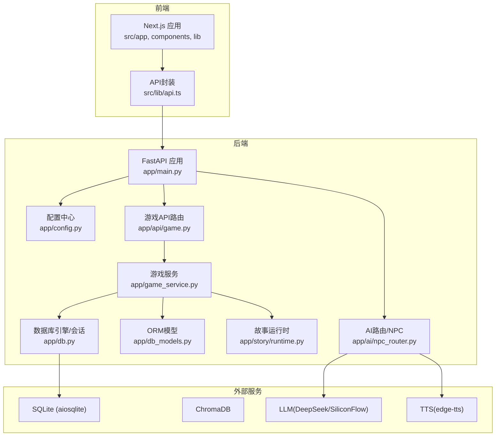
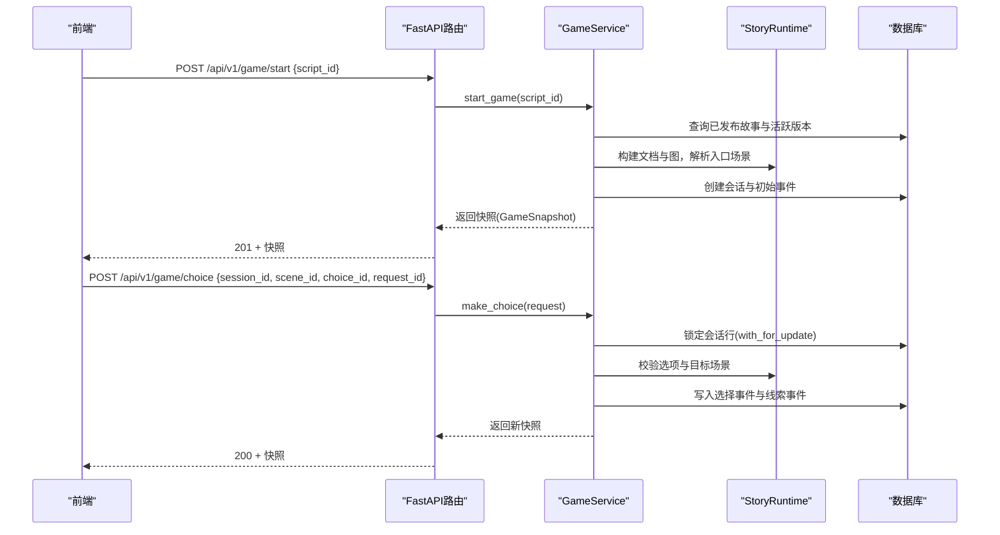
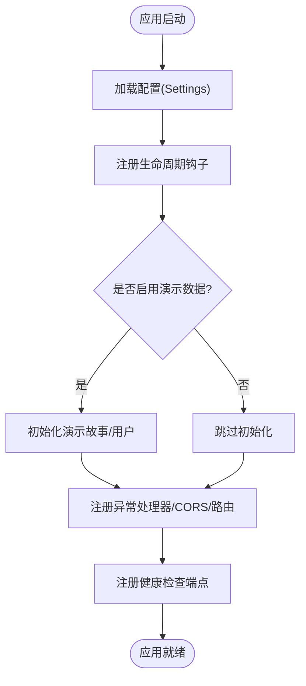
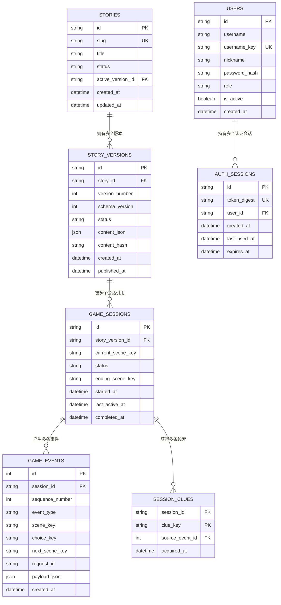
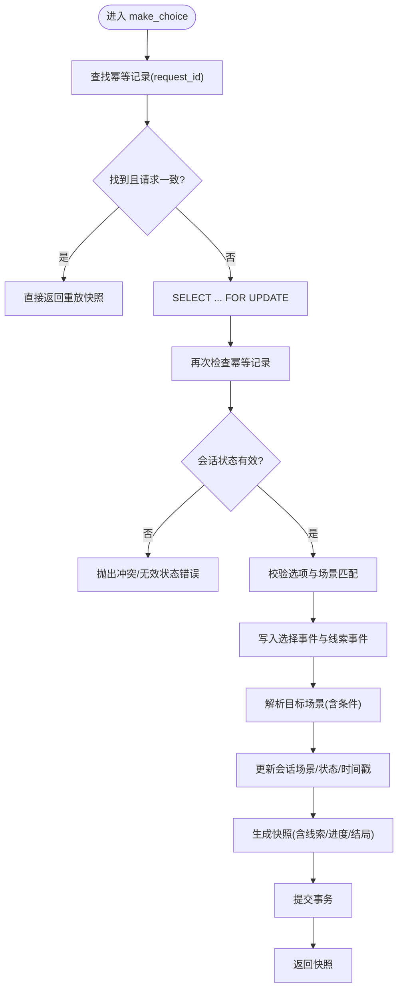
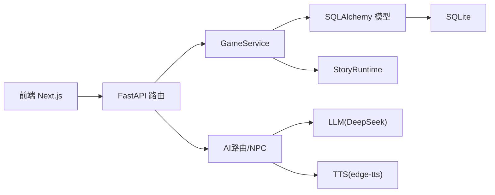

# 系统架构

<cite>
**本文引用的文件**   
- [README.md](file://README.md)
- [docker-compose.yml](file://docker-compose.yml)
- [backend/app/main.py](file://backend/app/main.py)
- [backend/app/config.py](file://backend/app/config.py)
- [backend/app/db.py](file://backend/app/db.py)
- [backend/app/db_models.py](file://backend/app/db_models.py)
- [backend/app/game_service.py](file://backend/app/game_service.py)
- [backend/app/models.py](file://backend/app/models.py)
- [backend/app/api/game.py](file://backend/app/api/game.py)
- [backend/app/ai/npc_router.py](file://backend/app/ai/npc_router.py)
- [backend/app/story/runtime.py](file://backend/app/story/runtime.py)
- [frontend/package.json](file://frontend/package.json)
- [frontend/src/lib/api.ts](file://frontend/src/lib/api.ts)
- [frontend/src/app/layout.tsx](file://frontend/src/app/layout.tsx)
</cite>

## 目录
1. [简介](#简介)
2. [项目结构](#项目结构)
3. [核心组件](#核心组件)
4. [架构总览](#架构总览)
5. [详细组件分析](#详细组件分析)
6. [依赖关系分析](#依赖关系分析)
7. [性能考量](#性能考量)
8. [故障排查指南](#故障排查指南)
9. [结论](#结论)
10. [附录](#附录)

## 简介
澳秘 Macau Mystery 是一个“AI沉浸式剧本杀平台”，沿澳门历史城区步行路线，通过与AI NPC对话破解跨越中葡两个家族的悬案。系统采用前后端分离与模块化微服务风格：前端基于 Next.js 14，后端基于 FastAPI，AI层集成 LLM（DeepSeek via SiliconFlow）与 TTS（edge-tts），知识库使用 ChromaDB，持久化存储使用 SQLite（异步）。整体设计强调版本化的故事数据、事务性的游戏推进、幂等性保障与可扩展的AI能力接入。

## 项目结构
- 前端（Next.js 14 + Tailwind CSS + shadcn/ui + Leaflet.js）
  - 页面路由位于 src/app，通用布局在 layout.tsx，UI组件集中在 components/ui，业务组件如 choice-panel、dialogue-box、map-viewer 等。
  - API封装在 src/lib/api.ts，统一处理鉴权头与错误。
- 后端（FastAPI + SQLAlchemy + Alembic）
  - 应用入口 main.py 负责生命周期、异常处理、CORS、路由挂载与健康检查。
  - 配置中心 config.py 提供 Settings 与缓存读取。
  - 数据库引擎与会话 db.py 提供异步引擎、SQLite PRAGMA优化与健康检查。
  - 领域模型 db_models.py 定义故事、版本、会话、事件、线索、用户与认证会话。
  - 业务服务 game_service.py 实现事务性游戏推进、状态快照、线索发放与幂等重放。
  - API路由 api/game.py 暴露匿名游戏接口。
  - AI层 ai/npc_router.py 管理NPC人设与语音映射；story/runtime.py 提供纯运行时图解析与路由选择。
- 部署 docker-compose.yml 编排后端容器、环境变量与数据卷。

图表来源
- [backend/app/main.py:1-111](file://backend/app/main.py#L1-L111)
- [backend/app/config.py:1-77](file://backend/app/config.py#L1-L77)
- [backend/app/db.py:1-42](file://backend/app/db.py#L1-L42)
- [backend/app/db_models.py:1-160](file://backend/app/db_models.py#L1-L160)
- [backend/app/game_service.py:1-386](file://backend/app/game_service.py#L1-L386)
- [backend/app/api/game.py:1-37](file://backend/app/api/game.py#L1-L37)
- [backend/app/ai/npc_router.py:1-18](file://backend/app/ai/npc_router.py#L1-L18)
- [backend/app/story/runtime.py:1-80](file://backend/app/story/runtime.py#L1-L80)
- [frontend/src/lib/api.ts:1-216](file://frontend/src/lib/api.ts#L1-L216)

章节来源
- [README.md:1-59](file://README.md#L1-L59)
- [docker-compose.yml:1-21](file://docker-compose.yml#L1-L21)

## 核心组件
- FastAPI应用与中间件
  - 生命周期钩子用于演示数据初始化（故事/用户），全局异常处理器统一返回结构化错误，CORS跨域配置，健康检查端点。
- 配置与运行环境
  - Settings 数据类集中管理数据库URL、CORS、演示开关、Token TTL与演示账号，支持生产/开发切换。
- 数据库与ORM
  - 异步引擎创建并针对SQLite设置外键与忙超时PRAGMA；SessionLocal提供异步会话；check_database用于健康检查。
- 领域模型
  - Story/StoryVersion 版本化故事；GameSession/GameEvent 会话与事件流；SessionClue 线索集合；User/AuthSession 用户与认证会话。
- 游戏服务
  - start_game 启动会话并记录初始事件；make_choice 事务性推进、并发保护、线索发放、结局判定；get_state 生成快照；幂等重放通过 request_id 去重。
- API路由
  - /api/v1/game 暴露 start/choice/state 三个匿名接口；/api/v1/ai、/api/v1/create、/api/v1/admin、/api/v1/auth、/api/v1/ugc 分别承载AI、UGC、管理与认证。
- AI服务
  - NPC路由根据位置匹配人设与语音；后续可对接LLM/RAG/TTS。
- 故事运行时
  - StoryGraph 构建场景图，支持路由器跳转、条件分支、最大跳数限制、预览选择结果。

章节来源
- [backend/app/main.py:1-111](file://backend/app/main.py#L1-L111)
- [backend/app/config.py:1-77](file://backend/app/config.py#L1-L77)
- [backend/app/db.py:1-42](file://backend/app/db.py#L1-L42)
- [backend/app/db_models.py:1-160](file://backend/app/db_models.py#L1-L160)
- [backend/app/game_service.py:1-386](file://backend/app/game_service.py#L1-L386)
- [backend/app/api/game.py:1-37](file://backend/app/api/game.py#L1-L37)
- [backend/app/ai/npc_router.py:1-18](file://backend/app/ai/npc_router.py#L1-L18)
- [backend/app/story/runtime.py:1-80](file://backend/app/story/runtime.py#L1-L80)

## 架构总览
系统采用前后端分离与模块化分层：
- 前端：Next.js 页面与组件通过统一的 API 封装调用后端 REST 接口，携带 Bearer Token 进行鉴权。
- 后端：FastAPI 作为网关聚合各模块路由，核心由 GameService 驱动事务性流程，StoryRuntime 提供无状态图解析，AI层按需扩展。
- 数据：SQLite 持久化会话与事件流，ChromaDB 用于RAG检索（当前仓库包含客户端与导入脚本），LLM/TTS 通过HTTP或本地库调用。

图表来源
- [backend/app/api/game.py:1-37](file://backend/app/api/game.py#L1-L37)
- [backend/app/game_service.py:1-386](file://backend/app/game_service.py#L1-L386)
- [backend/app/story/runtime.py:1-80](file://backend/app/story/runtime.py#L1-L80)

## 详细组件分析

### 后端应用与路由装配
- 应用工厂 create_app 注册异常处理器、CORS、路由挂载与健康检查。
- 生命周期 lifespan 在启动时可选地初始化演示数据（故事/用户），失败时提示执行迁移。
- 健康检查 /api/v1/health 调用 check_database 判断数据库可用性。

图表来源
- [backend/app/main.py:1-111](file://backend/app/main.py#L1-L111)
- [backend/app/config.py:1-77](file://backend/app/config.py#L1-L77)

章节来源
- [backend/app/main.py:1-111](file://backend/app/main.py#L1-L111)

### 配置与环境变量
- Settings 提供数据库URL、CORS源、环境标识、演示开关、Token TTL与演示账号。
- get_settings 使用 lru_cache 缓存实例，避免重复解析环境变量。
- 默认值与校验逻辑保证开发/生产一致性。

章节来源
- [backend/app/config.py:1-77](file://backend/app/config.py#L1-L77)

### 数据库与ORM模型
- 引擎创建时对SQLite设置外键约束与忙超时，提升并发稳定性。
- SessionLocal 提供异步会话上下文；check_database 用于健康检查。
- 模型涵盖故事版本化、会话与事件流、线索、用户与认证会话，具备完整性约束与唯一性约束。

图表来源
- [backend/app/db_models.py:1-160](file://backend/app/db_models.py#L1-L160)

章节来源
- [backend/app/db.py:1-42](file://backend/app/db.py#L1-L42)
- [backend/app/db_models.py:1-160](file://backend/app/db_models.py#L1-L160)

### 游戏服务与事务性推进
- start_game：校验已发布故事与活跃版本，构建文档与图，创建会话与初始事件，返回快照。
- make_choice：事务内锁定会话行，防重放（request_id）、并发冲突检测、线索发放、目标场景解析与结局判定，返回快照。
- get_state：按会话ID获取最新快照。
- 幂等性：通过 GameEvent.request_id 唯一约束与响应重放机制确保重复请求安全。

图表来源
- [backend/app/game_service.py:1-386](file://backend/app/game_service.py#L1-L386)

章节来源
- [backend/app/game_service.py:1-386](file://backend/app/game_service.py#L1-L386)

### 故事运行时与图解析
- StoryGraph 维护场景索引，支持路由器跳转、条件匹配（最小线索数、全部/任意线索集）、最大跳数限制。
- preview_choice 允许前端预取下一场景媒体，减少等待。
- resolve 将 RouterScene 逐步解析为 VideoScene 或 EndingScene。

章节来源
- [backend/app/story/runtime.py:1-80](file://backend/app/story/runtime.py#L1-L80)

### AI服务与NPC路由
- npc_router.py 维护NPC人设与语音映射，按场景位置匹配NPC ID，便于后续接入LLM对话与TTS合成。

章节来源
- [backend/app/ai/npc_router.py:1-18](file://backend/app/ai/npc_router.py#L1-L18)

### 前端结构与API封装
- package.json 声明 Next.js、React、Leaflet、Tailwind 等依赖。
- layout.tsx 定义站点元信息、字体、导航与全局提供者。
- api.ts 统一封装 fetch 请求，自动注入 Authorization 头，定义游戏/AI/UGC/Admin/Auth 接口类型与方法。

章节来源
- [frontend/package.json:1-37](file://frontend/package.json#L1-L37)
- [frontend/src/app/layout.tsx:1-62](file://frontend/src/app/layout.tsx#L1-L62)
- [frontend/src/lib/api.ts:1-216](file://frontend/src/lib/api.ts#L1-L216)

## 依赖关系分析
- 前端依赖 Next.js 生态与 UI 库，通过 api.ts 调用后端 REST。
- 后端依赖 FastAPI、SQLAlchemy、Alembic、Pydantic、httpx、OpenAI SDK、ChromaDB、edge-tts。
- 运行时依赖 SQLite（异步）与可选的外部AI服务。

图表来源
- [backend/requirements.txt:1-17](file://backend/requirements.txt#L1-L17)
- [frontend/package.json:1-37](file://frontend/package.json#L1-L37)

章节来源
- [backend/requirements.txt:1-17](file://backend/requirements.txt#L1-L17)

## 性能考量
- 数据库连接池与SQLite优化：启用外键与忙超时，减少锁竞争与阻塞。
- 事务与并发控制：会话行级锁定 with_for_update 防止竞态；幂等记录避免重复计算。
- 预取媒体：preview_choice 提前返回下一场景媒体信息，降低交互延迟。
- 异步IO：全链路异步（FastAPI、SQLAlchemy async、aiosqlite），提高吞吐。
- 配置缓存：Settings 使用 lru_cache，避免频繁解析环境变量。

[本节为通用指导，不直接分析具体文件]

## 故障排查指南
- 健康检查失败
  - 检查 DATABASE_URL 与 Alembic 迁移是否完成；查看 /api/v1/health 返回状态。
- 验证错误
  - 非游戏接口走默认验证器；游戏接口返回统一 VALIDATION_ERROR 结构，定位 path/msg/type。
- 会话冲突
  - 409 状态码可能来自会话已完成、非活动状态、场景不一致或幂等冲突；检查 request_id 与 payload 一致性。
- 故事数据损坏
  - 500 状态码 STORY_DATA_CORRUPTED 表示版本内容或图解析异常；核对 StoryVersion.content_json 与运行时约束。
- 演示数据初始化失败
  - 启动时报错需先执行 alembic upgrade head；确认数据库可用。

章节来源
- [backend/app/main.py:1-111](file://backend/app/main.py#L1-L111)
- [backend/app/game_service.py:1-386](file://backend/app/game_service.py#L1-L386)

## 结论
本系统以版本化故事为核心，结合事务性推进、幂等性与图解析，构建了稳定可扩展的沉浸式剧本杀平台。FastAPI 作为统一网关，GameService 承载关键业务，StoryRuntime 提供无状态图能力，AI层预留LLM/RAG/TTS扩展点。SQLite 满足轻量部署需求，ChromaDB 支撑知识增强。整体架构兼顾性能、可维护性与扩展性，适合快速迭代与多端集成。

[本节为总结性内容，不直接分析具体文件]

## 附录
- 技术选型决策与权衡
  - FastAPI：高性能异步框架，天然OpenAPI文档，易于集成Pydantic模型。
  - SQLite：简化部署与运维，配合aiosqlite与PRAGMA优化满足中等负载。
  - ChromaDB：向量检索与RAG能力，便于引入知识库增强NPC对话与剧情推理。
  - edge-tts：离线/低成本TTS方案，快速落地语音反馈。
- 部署架构
  - docker-compose 编排后端服务，挂载数据卷与配置文件，命令自动执行迁移并启动Uvicorn。
- 监控与可观测性建议
  - 健康检查端点用于探针；日志建议结构化输出；未来可引入指标采集（Prometheus）与分布式追踪。

章节来源
- [docker-compose.yml:1-21](file://docker-compose.yml#L1-L21)
- [backend/app/main.py:1-111](file://backend/app/main.py#L1-L111)