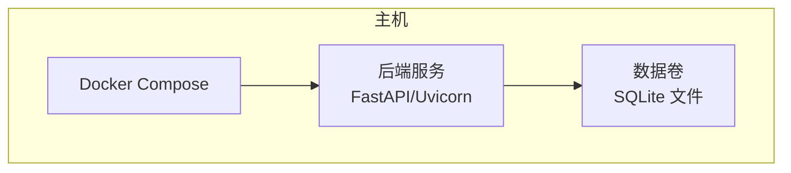
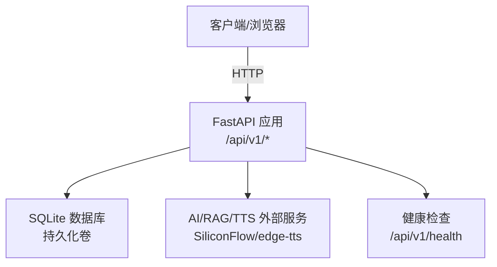
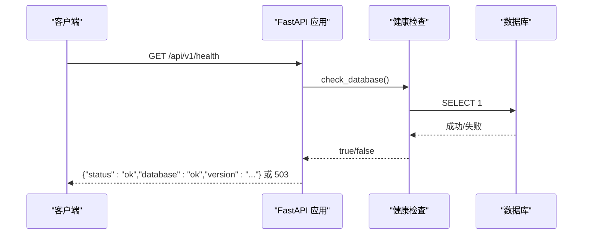
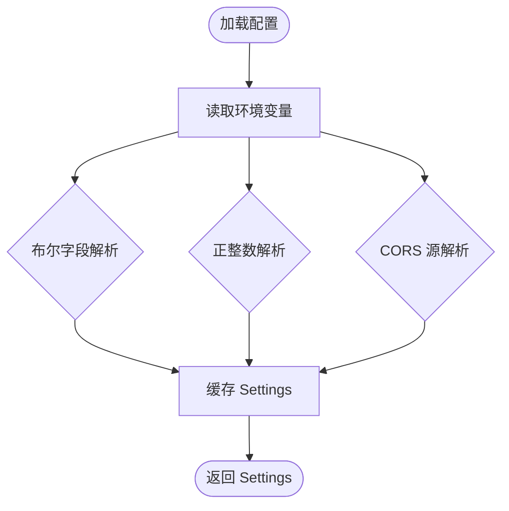
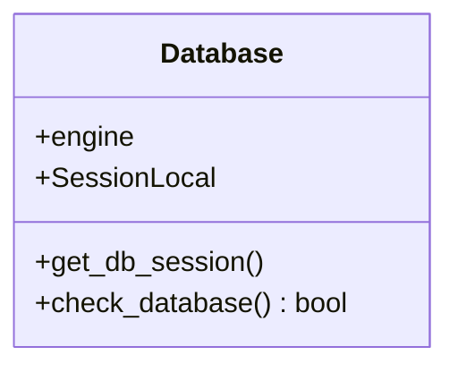
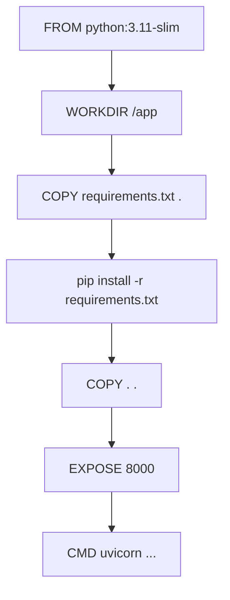
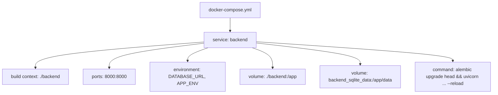
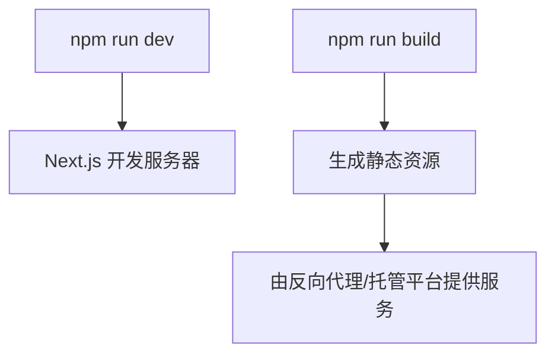
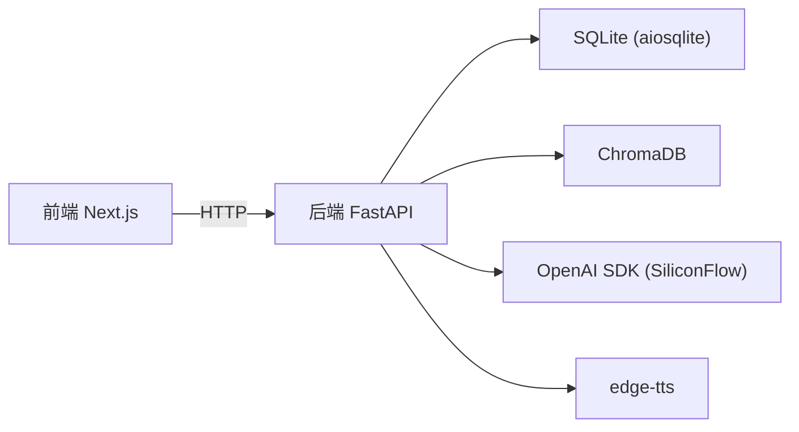

# 部署架构

<cite>
**本文引用的文件**   
- [docker-compose.yml](file://docker-compose.yml)
- [backend/Dockerfile](file://backend/Dockerfile)
- [backend/.dockerignore](file://backend/.dockerignore)
- [backend/requirements.txt](file://backend/requirements.txt)
- [backend/app/main.py](file://backend/app/main.py)
- [backend/app/config.py](file://backend/app/config.py)
- [backend/app/db.py](file://backend/app/db.py)
- [README.md](file://README.md)
- [frontend/package.json](file://frontend/package.json)
</cite>

## 目录
1. [简介](#简介)
2. [项目结构](#项目结构)
3. [核心组件](#核心组件)
4. [架构总览](#架构总览)
5. [详细组件分析](#详细组件分析)
6. [依赖关系分析](#依赖关系分析)
7. [性能与优化](#性能与优化)
8. [故障排查指南](#故障排查指南)
9. [结论](#结论)
10. [附录](#附录)

## 简介
本文件为“澳秘 Macau Mystery”项目的部署架构文档，面向运维工程师与 DevOps 团队。内容涵盖 Docker 容器化策略、多服务编排、镜像构建优化、环境与配置差异（开发/测试/生产）、容器网络与数据卷、环境变量管理、CI/CD 流水线设计、自动化部署与回滚策略、负载均衡与健康检查、监控告警、安全加固、日志收集与故障恢复预案等。当前仓库已提供后端 FastAPI 服务的容器化与编排基础，前端采用 Next.js 静态构建产物配合反向代理部署。

## 项目结构
- 后端：FastAPI + SQLite + ChromaDB，使用 Uvicorn 作为 ASGI 服务器，通过 Alembic 进行数据库迁移。
- 前端：Next.js 应用，本地开发通过 npm scripts 启动；生产环境建议构建静态资源并通过 Nginx 或云托管平台发布。
- 编排：docker-compose 定义后端服务、端口映射、环境变量注入、数据卷持久化与启动命令。

**图表来源** 
- [docker-compose.yml:1-21](file://docker-compose.yml#L1-L21)
- [backend/Dockerfile:1-13](file://backend/Dockerfile#L1-L13)

**章节来源**
- [docker-compose.yml:1-21](file://docker-compose.yml#L1-L21)
- [backend/Dockerfile:1-13](file://backend/Dockerfile#L1-L13)
- [README.md:1-59](file://README.md#L1-L59)

## 核心组件
- 后端应用入口与路由注册：创建 FastAPI 应用、注册路由、统一异常处理、CORS 中间件、健康检查端点。
- 运行时配置：从环境变量加载 Settings，支持不同环境的差异化行为（如演示数据初始化、Token TTL、CORS 源）。
- 数据库连接：异步引擎与会话工厂，SQLite 外键与忙超时设置，健康检查查询。
- 容器镜像：基于 python:3.11-slim，安装依赖并暴露 8000 端口，默认运行 uvicorn。
- 编排：定义后端服务、端口映射、环境变量、数据卷挂载、启动命令（含迁移与热重载）。

**章节来源**
- [backend/app/main.py:17-111](file://backend/app/main.py#L17-L111)
- [backend/app/config.py:38-77](file://backend/app/config.py#L38-L77)
- [backend/app/db.py:12-42](file://backend/app/db.py#L12-L42)
- [backend/Dockerfile:1-13](file://backend/Dockerfile#L1-L13)
- [docker-compose.yml:1-21](file://docker-compose.yml#L1-L21)

## 架构总览
后端以单进程 ASGI 应用运行，通过 Uvicorn 暴露 HTTP API。SQLite 数据文件通过命名卷持久化。Compose 负责服务编排与环境变量注入。前端在开发阶段独立运行，生产环境可构建为静态资源并由反向代理统一接入。

**图表来源** 
- [backend/app/main.py:84-106](file://backend/app/main.py#L84-L106)
- [backend/app/db.py:35-42](file://backend/app/db.py#L35-L42)
- [docker-compose.yml:1-21](file://docker-compose.yml#L1-L21)

## 详细组件分析

### 后端应用与生命周期
- 应用创建：读取配置，注册生命周期钩子用于演示数据引导（故事与用户），注册全局异常处理器（业务错误与请求校验错误），添加 CORS 中间件，挂载各模块路由。
- 健康检查：调用数据库健康检查函数，返回状态码与版本信息。

**图表来源** 
- [backend/app/main.py:98-106](file://backend/app/main.py#L98-L106)
- [backend/app/db.py:35-42](file://backend/app/db.py#L35-L42)

**章节来源**
- [backend/app/main.py:17-111](file://backend/app/main.py#L17-L111)

### 运行时配置与环境变量
- Settings 数据类封装所有配置项，包括数据库 URL、CORS 源、应用环境、演示数据开关、认证 Token TTL、演示账号等。
- get_settings 使用 lru_cache 缓存配置实例，避免重复解析环境变量。
- 布尔值、正整数与 CORS 源解析具备容错与默认值处理。

**图表来源** 
- [backend/app/config.py:13-36](file://backend/app/config.py#L13-L36)
- [backend/app/config.py:56-77](file://backend/app/config.py#L56-L77)

**章节来源**
- [backend/app/config.py:38-77](file://backend/app/config.py#L38-L77)

### 数据库连接与健康检查
- 异步引擎创建时启用 pool_pre_ping，针对 SQLite 设置外键约束与忙超时。
- SessionLocal 提供异步会话工厂，get_db_session 作为依赖注入。
- check_database 执行简单查询验证连通性，供健康检查使用。

**图表来源** 
- [backend/app/db.py:12-42](file://backend/app/db.py#L12-L42)

**章节来源**
- [backend/app/db.py:12-42](file://backend/app/db.py#L12-L42)

### 容器镜像构建
- 基础镜像：python:3.11-slim
- 工作目录：/app
- 依赖安装：复制 requirements.txt 并安装，随后复制源码
- 暴露端口：8000
- 启动命令：uvicorn app.main:app --host 0.0.0.0 --port 8000

**图表来源** 
- [backend/Dockerfile:1-13](file://backend/Dockerfile#L1-L13)

**章节来源**
- [backend/Dockerfile:1-13](file://backend/Dockerfile#L1-L13)
- [backend/.dockerignore:1-5](file://backend/.dockerignore#L1-L5)
- [backend/requirements.txt:1-17](file://backend/requirements.txt#L1-L17)

### 服务编排与数据持久化
- 服务名：backend
- 构建上下文：./backend，Dockerfile 指定
- 端口映射：宿主机 8000 -> 容器 8000
- 环境变量：DATABASE_URL、APP_ENV，以及可选的 env_file
- 数据卷：将宿主 ./backend 目录挂载到 /app（开发调试用），并将命名卷 backend_sqlite_data 挂载到 /app/data 以持久化 SQLite 文件
- 启动命令：先执行 alembic upgrade head，再启动 uvicorn 并开启热重载

**图表来源** 
- [docker-compose.yml:1-21](file://docker-compose.yml#L1-L21)

**章节来源**
- [docker-compose.yml:1-21](file://docker-compose.yml#L1-L21)

### 前端开发与构建
- 开发脚本：next dev
- 构建脚本：next build
- 启动脚本：next start
- 依赖：Next.js 16.x、React 19.x、Tailwind CSS、Leaflet 等

**图表来源** 
- [frontend/package.json:5-10](file://frontend/package.json#L5-L10)

**章节来源**
- [frontend/package.json:1-37](file://frontend/package.json#L1-L37)

## 依赖关系分析
- 后端依赖：FastAPI、Uvicorn、SQLAlchemy、Alembic、ChromaDB、OpenAI SDK、edge-tts、Pydantic、httpx、pytest 等。
- 前端依赖：Next.js、React、Tailwind、Leaflet 等。
- 运行时依赖：SQLite（通过 aiosqlite）、外部 AI 服务（SiliconFlow）与 TTS（edge-tts）。

**图表来源** 
- [backend/requirements.txt:1-17](file://backend/requirements.txt#L1-L17)
- [frontend/package.json:11-25](file://frontend/package.json#L11-L25)

**章节来源**
- [backend/requirements.txt:1-17](file://backend/requirements.txt#L1-L17)
- [frontend/package.json:11-25](file://frontend/package.json#L11-L25)

## 性能与优化
- 镜像构建优化
  - 分层缓存：先复制 requirements.txt 安装依赖，再复制源码，提升缓存命中率。
  - 精简基础镜像：使用 slim 变体减少体积。
  - 忽略无关文件：通过 .dockerignore 排除虚拟环境、缓存与数据库文件。
- 运行时优化
  - 数据库连接池：启用 pool_pre_ping，SQLite 设置外键与忙超时。
  - 健康检查：轻量查询快速判断可用性。
  - 热重载：开发环境使用 --reload 加速迭代（生产禁用）。
- 前端构建优化
  - 使用 next build 生成静态资源，结合 CDN/反向代理分发。
  - 按需引入第三方库，控制包体积。

[本节为通用指导，不直接分析具体文件]

## 故障排查指南
- 健康检查失败
  - 现象：/api/v1/health 返回 503，数据库不可用。
  - 排查：确认 DATABASE_URL 指向正确的 SQLite 路径且可写；检查数据卷挂载是否生效；确认 alembic 迁移已执行。
- 数据库迁移问题
  - 现象：启动时报错提示未迁移。
  - 排查：确保启动命令包含 alembic upgrade head；检查 alembic 配置与迁移脚本是否存在。
- CORS 跨域错误
  - 现象：前端无法访问后端接口。
  - 排查：检查 CORS_ORIGINS 是否包含前端地址；确认 APP_ENV 与演示数据开关是否符合预期。
- 端口冲突
  - 现象：8000 端口被占用。
  - 排查：修改 docker-compose 端口映射或释放占用端口。
- 环境变量缺失
  - 现象：配置解析错误或默认值不符合预期。
  - 排查：核对 .env 或 environment 字段是否包含必需变量（如 DATABASE_URL、APP_ENV）。

**章节来源**
- [backend/app/main.py:98-106](file://backend/app/main.py#L98-L106)
- [backend/app/db.py:35-42](file://backend/app/db.py#L35-L42)
- [docker-compose.yml:1-21](file://docker-compose.yml#L1-L21)

## 结论
本项目已具备后端容器化与编排的基础能力，可通过扩展 compose 文件与 CI/CD 流程完善多环境部署、负载均衡、监控告警与安全加固。建议在生产环境中：
- 分离前后端镜像与服务，使用反向代理统一入口。
- 引入外部数据库与对象存储，替换 SQLite 以提升可扩展性与可靠性。
- 建立完善的健康检查、指标采集与日志聚合方案。
- 制定严格的权限控制、密钥管理与审计策略。

[本节为总结性内容，不直接分析具体文件]

## 附录

### 多环境差异化配置建议
- 开发环境
  - APP_ENV=development，启用演示数据与热重载，SQLite 本地文件。
- 测试环境
  - APP_ENV=testing，关闭演示数据，使用隔离数据库，启用更严格的校验与测试套件。
- 生产环境
  - APP_ENV=production，关闭演示数据与热重载，使用稳定数据库与只读副本，限制 CORS 源，启用 HTTPS 与鉴权。

[本节为通用指导，不直接分析具体文件]

### 容器网络通信与数据卷持久化
- 网络通信
  - 容器内服务通过端口映射对外暴露；若引入更多服务（如 Redis、PostgreSQL），建议使用 Docker 内部网络与 service name 解析。
- 数据卷
  - 使用命名卷持久化关键数据（SQLite、向量库索引、上传文件等）；避免将数据写入容器层。

[本节为通用指导，不直接分析具体文件]

### 环境变量管理
- 推荐方式
  - 使用 .env 文件与 docker-compose env_file 注入敏感配置。
  - 在生产环境通过平台密钥管理服务注入环境变量。
- 关键变量
  - DATABASE_URL、APP_ENV、CORS_ORIGINS、AUTH_TOKEN_TTL_HOURS、演示账号相关变量。

**章节来源**
- [backend/app/config.py:56-77](file://backend/app/config.py#L56-L77)
- [docker-compose.yml:8-17](file://docker-compose.yml#L8-L17)

### CI/CD 流水线设计与自动化部署
- 建议流水线
  - 代码提交触发构建与单元测试。
  - 构建镜像并推送至镜像仓库。
  - 部署到目标环境（开发/测试/生产），执行迁移与健康检查。
- 回滚策略
  - 保留最近 N 个镜像版本，失败自动回滚到上一稳定版本。
  - 数据库迁移需具备向下兼容或可回滚脚本。

[本节为通用指导，不直接分析具体文件]

### 负载均衡与健康检查
- 负载均衡
  - 使用反向代理（Nginx/云 LB）对后端多实例进行轮询或加权分配。
- 健康检查
  - 基于 /api/v1/health 实现探针；结合数据库连通性判定服务状态。

**章节来源**
- [backend/app/main.py:98-106](file://backend/app/main.py#L98-L106)

### 监控告警与日志收集
- 指标采集
  - 暴露 Prometheus 指标端点，采集 QPS、延迟、错误率、数据库连接数等。
- 日志收集
  - 统一输出结构化日志（JSON），由日志采集器汇聚至集中式存储与分析平台。
- 告警规则
  - 基于阈值与趋势设置告警（错误率、延迟、资源使用率）。

[本节为通用指导，不直接分析具体文件]

### 安全加固措施
- 最小权限原则：容器以非 root 用户运行，限制文件系统与网络权限。
- 密钥管理：使用密钥管理服务，禁止硬编码敏感信息。
- 网络安全：仅开放必要端口，启用 TLS 终止于反向代理。
- 依赖安全：定期扫描镜像与依赖漏洞。

[本节为通用指导，不直接分析具体文件]

### 故障恢复预案
- 服务降级：当外部 AI 服务不可用时，返回友好错误与重试策略。
- 数据备份：定时备份 SQLite 与向量库索引，支持快速恢复。
- 灾难恢复：多可用区部署与异地备份，明确 RTO/RPO 目标。

[本节为通用指导，不直接分析具体文件]