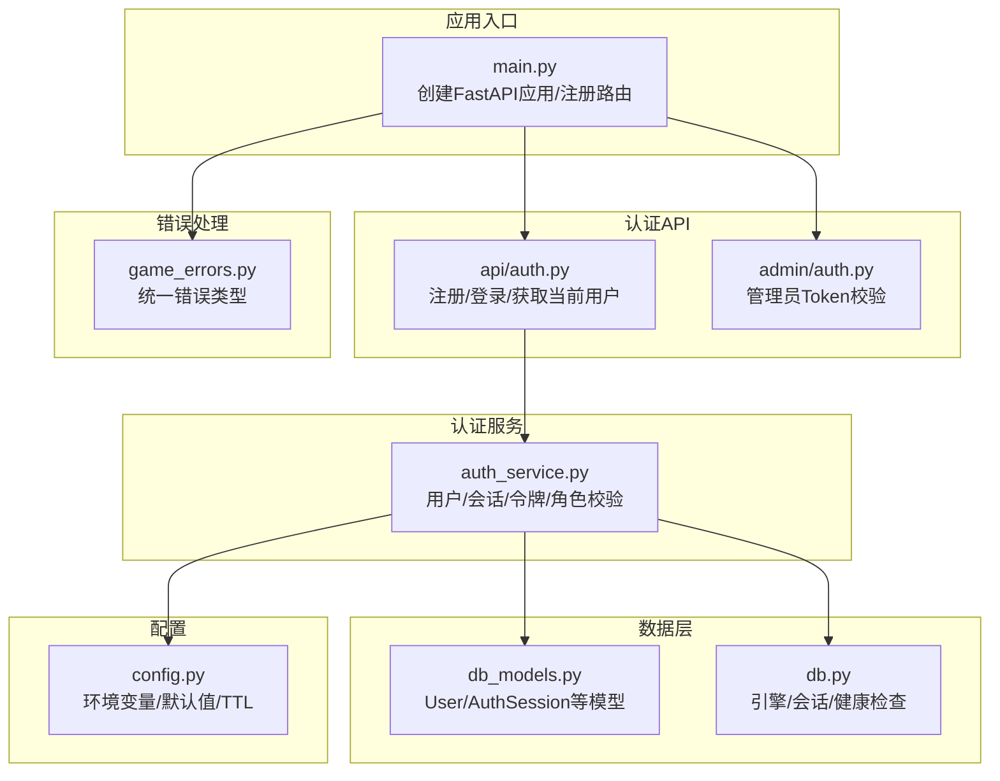
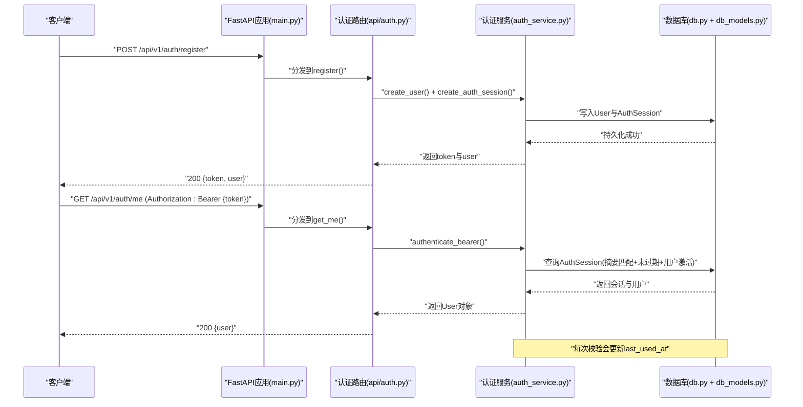
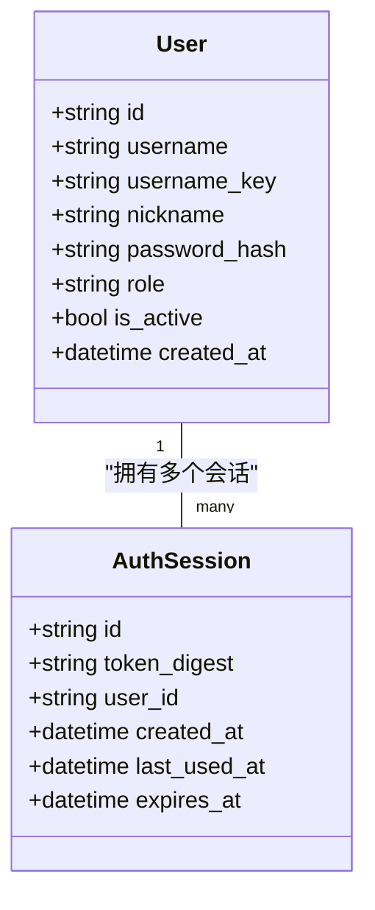
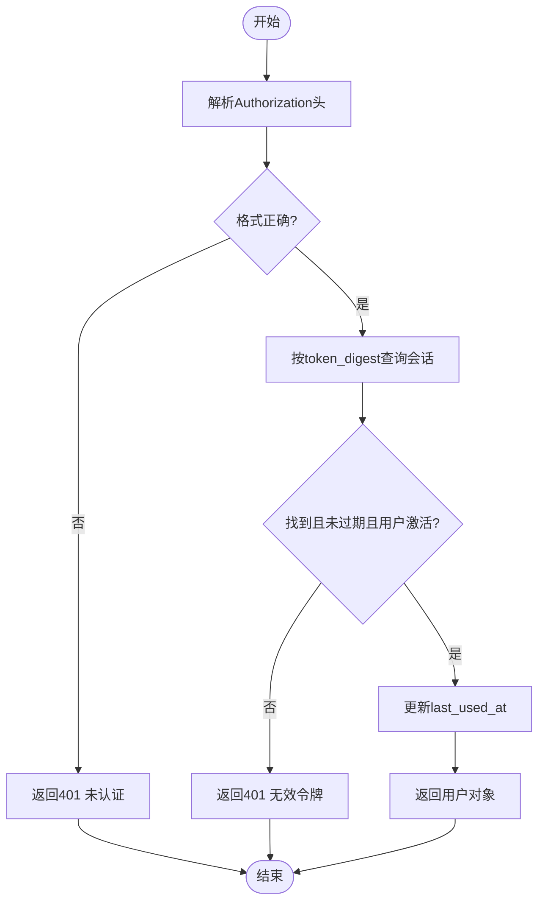
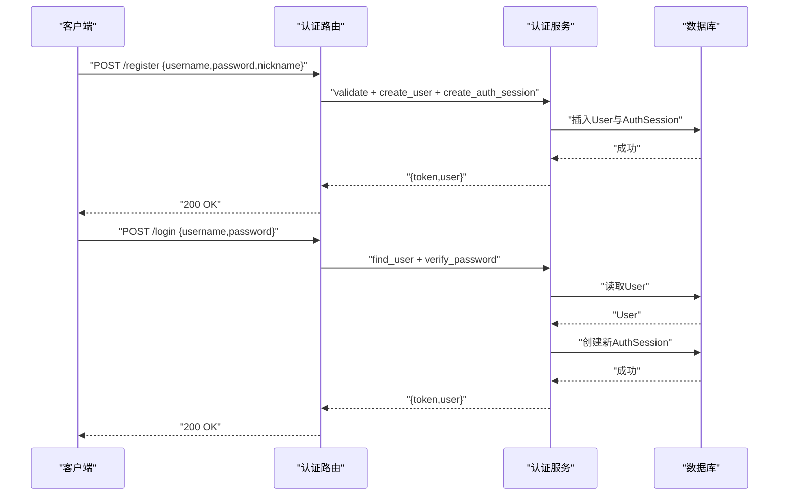
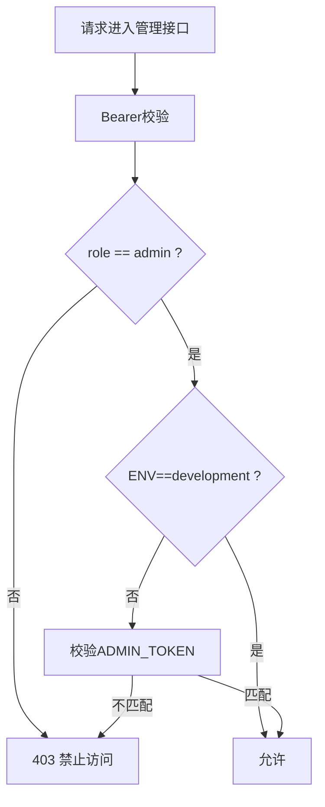
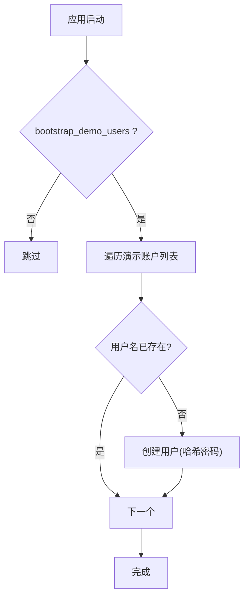
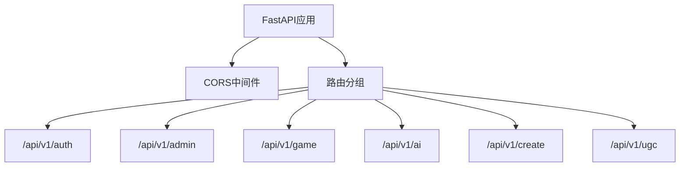
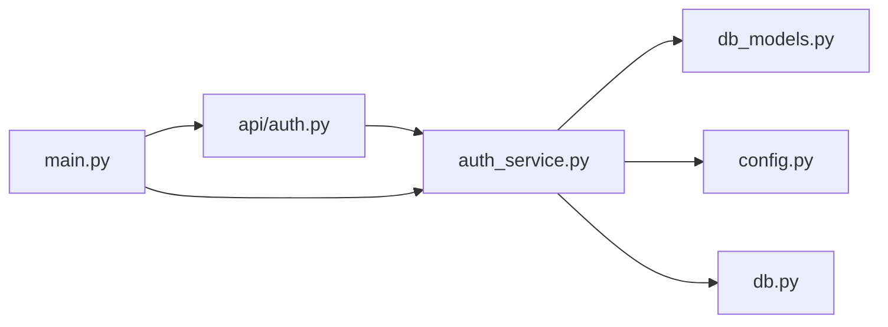

# 认证授权系统

<cite>
**本文引用的文件**   
- [backend/app/auth_service.py](file://backend/app/auth_service.py)
- [backend/app/api/auth.py](file://backend/app/api/auth.py)
- [backend/app/admin/auth.py](file://backend/app/admin/auth.py)
- [backend/app/db_models.py](file://backend/app/db_models.py)
- [backend/app/config.py](file://backend/app/config.py)
- [backend/app/main.py](file://backend/app/main.py)
- [backend/app/db.py](file://backend/app/db.py)
- [backend/app/game_errors.py](file://backend/app/game_errors.py)
- [backend/tests/test_auth_api.py](file://backend/tests/test_auth_api.py)
</cite>

## 目录
1. [简介](#简介)
2. [项目结构](#项目结构)
3. [核心组件](#核心组件)
4. [架构总览](#架构总览)
5. [详细组件分析](#详细组件分析)
6. [依赖关系分析](#依赖关系分析)
7. [性能与安全考量](#性能与安全考量)
8. [故障排查指南](#故障排查指南)
9. [结论](#结论)
10. [附录](#附录)

## 简介
本技术文档围绕澳秘 Macau Mystery 的认证与授权体系，系统性阐述以下主题：
- 基于持久化会话令牌（Bearer Token）的鉴权机制与刷新策略
- 用户模型、密码安全加密与角色权限控制
- 演示账户自动创建、登录状态维护与令牌生命周期管理
- API 接口鉴权、中间件实现与安全最佳实践
- 认证流程图解、错误处理方案与调试技巧

该体系以 FastAPI 为核心，使用 SQLAlchemy 异步 ORM 进行数据持久化，采用强哈希算法对密码进行安全存储，并通过数据库中的会话表承载令牌有效性校验。

## 项目结构
后端认证相关代码主要分布在以下模块：
- 认证服务层：auth_service.py
- 认证 API：api/auth.py
- 管理员鉴权：admin/auth.py
- 数据模型：db_models.py
- 配置与环境：config.py
- 应用启动与路由挂载：main.py
- 数据库连接与会话：db.py
- 统一错误模型：game_errors.py
- 集成测试：tests/test_auth_api.py

**图表来源** 
- [backend/app/main.py:17-96](file://backend/app/main.py#L17-L96)
- [backend/app/api/auth.py:24-97](file://backend/app/api/auth.py#L24-L97)
- [backend/app/admin/auth.py:1-17](file://backend/app/admin/auth.py#L1-L17)
- [backend/app/auth_service.py:1-153](file://backend/app/auth_service.py#L1-L153)
- [backend/app/db_models.py:128-160](file://backend/app/db_models.py#L128-L160)
- [backend/app/db.py:12-42](file://backend/app/db.py#L12-L42)
- [backend/app/config.py:38-77](file://backend/app/config.py#L38-L77)
- [backend/app/game_errors.py:1-20](file://backend/app/game_errors.py#L1-20)

**章节来源**
- [backend/app/main.py:17-96](file://backend/app/main.py#L17-L96)
- [backend/app/api/auth.py:24-97](file://backend/app/api/auth.py#L24-L97)
- [backend/app/admin/auth.py:1-17](file://backend/app/admin/auth.py#L1-L17)
- [backend/app/auth_service.py:1-153](file://backend/app/auth_service.py#L1-L153)
- [backend/app/db_models.py:128-160](file://backend/app/db_models.py#L128-L160)
- [backend/app/db.py:12-42](file://backend/app/db.py#L12-L42)
- [backend/app/config.py:38-77](file://backend/app/config.py#L38-L77)
- [backend/app/game_errors.py:1-20](file://backend/app/game_errors.py#L1-20)

## 核心组件
- 认证服务（auth_service.py）
  - 用户名/昵称/密码校验与规范化
  - 用户创建与会话令牌生成
  - Bearer 令牌验证与会话续期（last_used_at）
  - 管理员角色校验
  - 演示账户初始化（幂等）
- 认证 API（api/auth.py）
  - POST /api/v1/auth/register：注册并返回令牌与用户信息
  - POST /api/v1/auth/login：登录校验并返回新令牌
  - GET /api/v1/auth/me：携带 Authorization 头获取当前用户
- 管理员鉴权（admin/auth.py）
  - verify_token：开发环境跳过校验；生产环境要求固定 ADMIN_TOKEN
- 数据模型（db_models.py）
  - User：用户基本信息、角色、激活状态、时间戳
  - AuthSession：令牌摘要、关联用户、创建/最后使用/过期时间
- 配置（config.py）
  - 环境变量：数据库URL、CORS、是否引导演示数据、令牌TTL、演示账号凭据
- 应用入口（main.py）
  - 生命周期中根据配置执行演示数据初始化
  - 全局异常处理器（含请求校验与业务错误）
  - 挂载各路由前缀
- 数据库（db.py）
  - 异步引擎与会话工厂
  - SQLite 外键与忙超时设置
  - 健康检查

**章节来源**
- [backend/app/auth_service.py:20-153](file://backend/app/auth_service.py#L20-L153)
- [backend/app/api/auth.py:24-97](file://backend/app/api/auth.py#L24-L97)
- [backend/app/admin/auth.py:1-17](file://backend/app/admin/auth.py#L1-L17)
- [backend/app/db_models.py:128-160](file://backend/app/db_models.py#L128-L160)
- [backend/app/config.py:38-77](file://backend/app/config.py#L38-L77)
- [backend/app/main.py:17-106](file://backend/app/main.py#L17-L106)
- [backend/app/db.py:12-42](file://backend/app/db.py#L12-L42)

## 架构总览
下图展示从客户端发起认证到服务端鉴权的端到端流程，包括注册、登录、会话存储、令牌校验与管理员权限控制。

**图表来源** 
- [backend/app/main.py:84-96](file://backend/app/main.py#L84-L96)
- [backend/app/api/auth.py:64-97](file://backend/app/api/auth.py#L64-L97)
- [backend/app/auth_service.py:83-123](file://backend/app/auth_service.py#L83-L123)
- [backend/app/db.py:30-42](file://backend/app/db.py#L30-L42)
- [backend/app/db_models.py:128-160](file://backend/app/db_models.py#L128-L160)

## 详细组件分析

### 用户模型与密码安全
- 用户模型字段
  - id、username、username_key（大小写归一化）、nickname、password_hash、role、is_active、created_at
  - 角色约束为 admin/user；唯一索引在 username_key
- 密码安全
  - 使用 pwdlib 的推荐哈希器对用户密码进行不可逆哈希存储
  - 登录时通过 verify 比对明文与哈希
- 会话模型字段
  - id、token_digest（令牌的SHA-256摘要）、user_id、created_at、last_used_at、expires_at
  - 唯一索引在 token_digest，便于快速查找与去重

**图表来源** 
- [backend/app/db_models.py:128-160](file://backend/app/db_models.py#L128-L160)

**章节来源**
- [backend/app/db_models.py:128-160](file://backend/app/db_models.py#L128-L160)
- [backend/app/auth_service.py:20-48](file://backend/app/auth_service.py#L20-L48)

### 令牌生成与验证机制
- 令牌生成
  - 使用 secrets.token_urlsafe(32) 生成高熵随机字符串
  - 计算 SHA-256 摘要存入 token_digest
  - 设置 expires_at = now + TTL（小时），TTL 由配置项 auth_token_ttl_hours 决定
- 令牌验证
  - 解析 Authorization 头，要求以 Bearer 开头且非空
  - 查询 AuthSession：摘要匹配、未过期、用户处于激活状态
  - 命中后更新 last_used_at 作为活跃标记
- 刷新策略
  - 当前实现每次登录都会生成新令牌，旧令牌仍有效直至过期
  - 如需强制单点登录或主动失效，可在会话表中增加版本号或黑名单机制

**图表来源** 
- [backend/app/auth_service.py:100-123](file://backend/app/auth_service.py#L100-L123)

**章节来源**
- [backend/app/auth_service.py:51-97](file://backend/app/auth_service.py#L51-L97)
- [backend/app/auth_service.py:100-123](file://backend/app/auth_service.py#L100-L123)
- [backend/app/config.py:69-71](file://backend/app/config.py#L69-L71)

### 用户注册与登录流程
- 注册
  - 校验用户名格式、昵称长度限制
  - 创建用户并哈希密码
  - 生成首个会话令牌并返回
- 登录
  - 按用户名查找用户，校验 is_active 与密码哈希
  - 成功后生成新会话令牌并返回
- 获取当前用户
  - 需要携带 Authorization: Bearer {token}
  - 校验通过后返回用户信息

**图表来源** 
- [backend/app/api/auth.py:64-87](file://backend/app/api/auth.py#L64-L87)
- [backend/app/auth_service.py:63-97](file://backend/app/auth_service.py#L63-L97)

**章节来源**
- [backend/app/api/auth.py:28-87](file://backend/app/api/auth.py#L28-L87)
- [backend/app/auth_service.py:63-97](file://backend/app/auth_service.py#L63-L97)

### 角色权限控制策略
- 用户角色
  - 支持 admin 与 user 两种角色，通过 CheckConstraint 约束
- 权限校验
  - require_admin：先完成 Bearer 校验，再判断 role == "admin"
  - 非管理员访问管理接口将返回 403
- 管理员接口额外鉴权
  - admin/auth.verify_token：开发环境直接放行；生产环境要求 Authorization 头等于 ADMIN_TOKEN

**图表来源** 
- [backend/app/auth_service.py:126-130](file://backend/app/auth_service.py#L126-L130)
- [backend/app/admin/auth.py:8-16](file://backend/app/admin/auth.py#L8-L16)

**章节来源**
- [backend/app/db_models.py:142-144](file://backend/app/db_models.py#L142-L144)
- [backend/app/auth_service.py:126-130](file://backend/app/auth_service.py#L126-L130)
- [backend/app/admin/auth.py:8-16](file://backend/app/admin/auth.py#L8-L16)

### 演示账户自动创建
- 触发时机
  - 应用生命周期内，若配置 bootstrap_demo_users=true，则调用 bootstrap_demo_users()
- 行为特性
  - 幂等：仅当目标用户名不存在时才创建
  - 默认创建 admin 与 guest 两个账户，角色分别为 admin 与 user
  - 用户名与密码来自配置项 DEMO_ADMIN_USERNAME/PASSWORD 与 DEMO_GUEST_USERNAME/PASSWORD

**图表来源** 
- [backend/app/main.py:22-33](file://backend/app/main.py#L22-L33)
- [backend/app/auth_service.py:133-153](file://backend/app/auth_service.py#L133-L153)
- [backend/app/config.py:63-76](file://backend/app/config.py#L63-L76)

**章节来源**
- [backend/app/main.py:22-33](file://backend/app/main.py#L22-L33)
- [backend/app/auth_service.py:133-153](file://backend/app/auth_service.py#L133-L153)
- [backend/app/config.py:63-76](file://backend/app/config.py#L63-L76)

### API 接口鉴权与中间件
- 全局中间件
  - CORS 中间件：允许指定源、携带凭证、方法与头部
- 路由挂载
  - /api/v1/auth、/api/v1/admin、/api/v1/game、/api/v1/ai、/api/v1/create、/api/v1/ugc
- 认证方式
  - 用户态接口：Authorization: Bearer {token}
  - 管理态接口：除 Bearer 校验外，生产环境需 ADMIN_TOKEN

**图表来源** 
- [backend/app/main.py:76-96](file://backend/app/main.py#L76-L96)

**章节来源**
- [backend/app/main.py:76-96](file://backend/app/main.py#L76-L96)

## 依赖关系分析
- 模块耦合
  - api/auth 依赖 auth_service 与 db_models
  - auth_service 依赖 config、db、db_models
  - main 负责组装路由与生命周期，注入依赖
- 外部依赖
  - FastAPI、SQLAlchemy 异步、pwdlib（密码哈希）、secrets（令牌生成）、hashlib（摘要）
- 潜在循环依赖
  - 当前未发现循环导入；认证逻辑集中在 service 层，API 层保持薄封装

**图表来源** 
- [backend/app/api/auth.py:11-21](file://backend/app/api/auth.py#L11-L21)
- [backend/app/auth_service.py:15-17](file://backend/app/auth_service.py#L15-L17)
- [backend/app/main.py:84-96](file://backend/app/main.py#L84-L96)

**章节来源**
- [backend/app/api/auth.py:11-21](file://backend/app/api/auth.py#L11-L21)
- [backend/app/auth_service.py:15-17](file://backend/app/auth_service.py#L15-L17)
- [backend/app/main.py:84-96](file://backend/app/main.py#L84-L96)

## 性能与安全考量
- 性能
  - 令牌校验为单次数据库查询，建议对 token_digest 建立索引（已定义）
  - last_used_at 更新频率较高，注意写入热点；可考虑异步批处理或缓存最近活跃会话
  - SQLite 下启用 PRAGMA foreign_keys=ON 与 busy_timeout，提升并发稳定性
- 安全
  - 密码使用强哈希存储，避免明文泄露
  - 令牌为随机高熵字符串，仅存摘要，降低泄露风险
  - 管理员接口在生产环境强制 ADMIN_TOKEN，避免越权
  - CORS 严格限定来源，避免跨站滥用
- 可扩展性
  - 令牌刷新：可增加短期 Access Token + 长期 Refresh Token 模式
  - 单点登录：引入会话版本或黑名单，使旧令牌失效
  - 审计：记录登录失败、令牌异常事件

[本节为通用指导，无需特定文件引用]

## 故障排查指南
- 常见问题
  - 401 未认证：Authorization 缺失或格式不正确、令牌无效或已过期、用户被禁用
  - 403 禁止访问：非管理员访问管理接口、生产环境 ADMIN_TOKEN 不匹配
  - 409 冲突：用户名重复
  - 422 校验错误：请求体字段不符合约束（如密码长度不足）
- 定位步骤
  - 检查 Authorization 头是否正确携带 Bearer 令牌
  - 确认数据库中是否存在对应 token_digest 且未过期
  - 核对用户 is_active 状态与角色
  - 查看健康检查 /api/v1/health 确认数据库可用性
- 调试技巧
  - 使用 TestClient 复现实例化数据库与生命周期
  - 打印/记录关键路径的输入输出（用户名规范化、哈希结果、令牌摘要）
  - 在开发环境关闭 ADMIN_TOKEN 校验，逐步定位问题

**章节来源**
- [backend/app/api/auth.py:64-97](file://backend/app/api/auth.py#L64-L97)
- [backend/app/auth_service.py:100-130](file://backend/app/auth_service.py#L100-L130)
- [backend/app/main.py:98-106](file://backend/app/main.py#L98-L106)
- [backend/tests/test_auth_api.py:83-115](file://backend/tests/test_auth_api.py#L83-L115)

## 结论
本认证授权系统以“用户-会话”模型为核心，结合强哈希密码存储与严格的角色权限控制，提供了稳定可靠的鉴权能力。通过配置化的令牌 TTL 与演示账户初始化，兼顾了开发与生产环境的易用性与安全性。建议在后续迭代中引入更完善的令牌刷新与单点登录机制，并增强审计与监控能力，以满足更高安全等级需求。

[本节为总结性内容，无需特定文件引用]

## 附录
- 环境变量参考
  - DATABASE_URL：数据库连接串
  - CORS_ORIGINS：允许的跨域来源
  - APP_ENV：运行环境（development/production）
  - BOOTSTRAP_DEMO_STORY、BOOTSTRAP_DEMO_USERS：是否引导演示数据
  - AUTH_TOKEN_TTL_HOURS：令牌有效期（小时）
  - DEMO_ADMIN_USERNAME/PASSWORD、DEMO_GUEST_USERNAME/PASSWORD：演示账户凭据
  - ADMIN_TOKEN：生产环境管理员接口令牌
- 关键接口
  - POST /api/v1/auth/register
  - POST /api/v1/auth/login
  - GET /api/v1/auth/me
  - 管理接口（示例：/api/v1/admin/scripts）需管理员权限

**章节来源**
- [backend/app/config.py:38-77](file://backend/app/config.py#L38-L77)
- [backend/app/api/auth.py:64-97](file://backend/app/api/auth.py#L64-L97)
- [backend/app/admin/auth.py:8-16](file://backend/app/admin/auth.py#L8-L16)