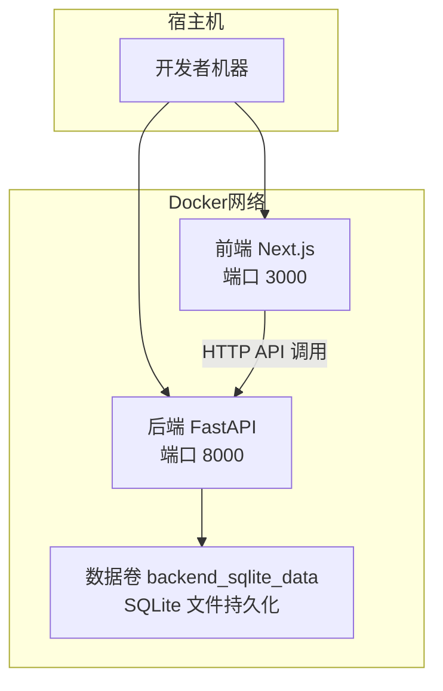
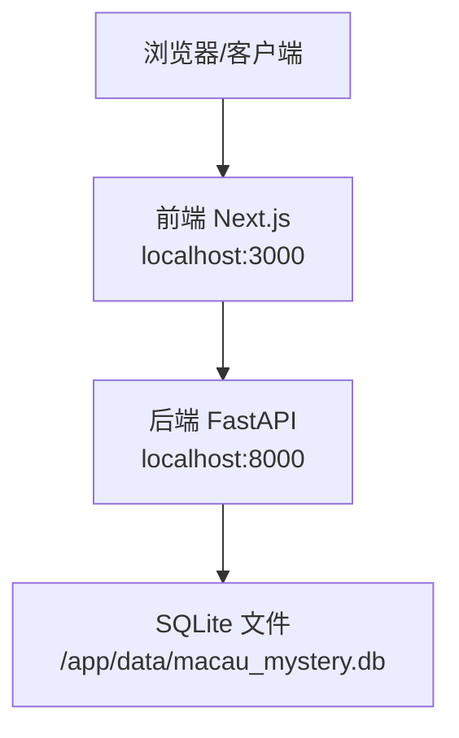
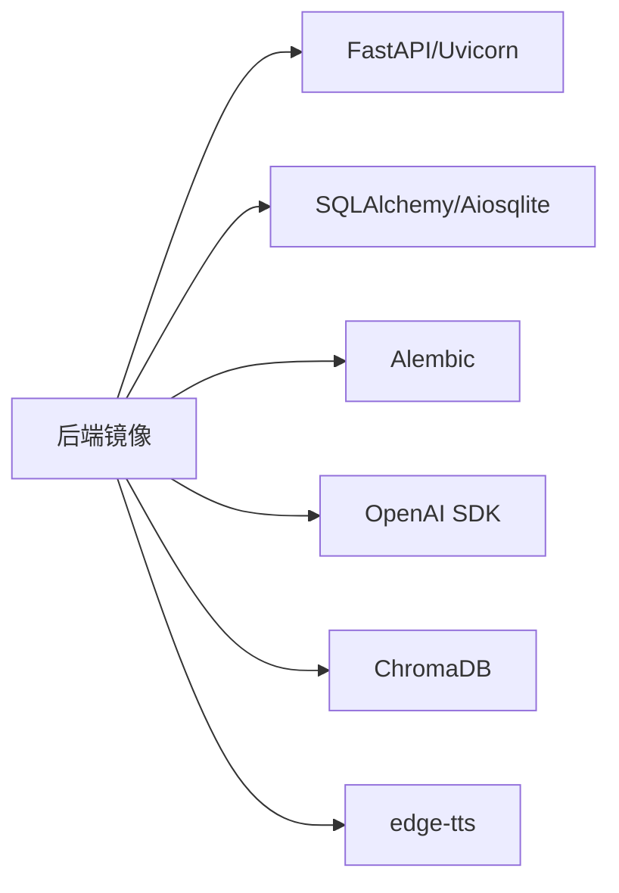
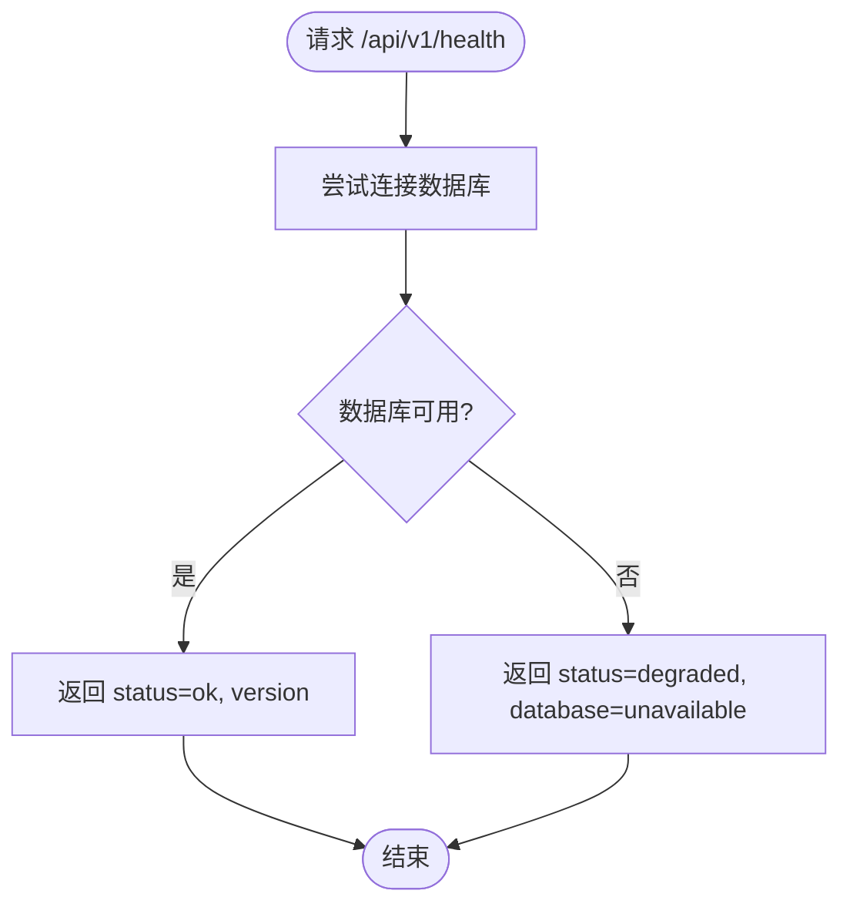

# Docker容器化部署

<cite>
**本文引用的文件**   
- [docker-compose.yml](file://docker-compose.yml)
- [backend/Dockerfile](file://backend/Dockerfile)
- [backend/.dockerignore](file://backend/.dockerignore)
- [backend/requirements.txt](file://backend/requirements.txt)
- [backend/app/main.py](file://backend/app/main.py)
- [backend/app/config.py](file://backend/app/config.py)
- [backend/app/db.py](file://backend/app/db.py)
- [backend/alembic.ini](file://backend/alembic.ini)
- [README.md](file://README.md)
- [frontend/package.json](file://frontend/package.json)
</cite>

## 目录
1. [简介](#简介)
2. [项目结构](#项目结构)
3. [核心组件](#核心组件)
4. [架构总览](#架构总览)
5. [详细组件分析](#详细组件分析)
6. [依赖关系分析](#依赖关系分析)
7. [性能考量](#性能考量)
8. [故障排查指南](#故障排查指南)
9. [结论](#结论)
10. [附录](#附录)

## 简介
本文件为澳秘 Macau Mystery 项目的Docker容器化部署指南，覆盖镜像构建、Dockerfile优化、容器编排（docker-compose）、环境变量与端口映射、服务依赖、健康检查、日志收集与故障排查。同时提供开发环境与生产环境的差异化配置建议，帮助开发者快速、稳定地部署前后端服务。

## 项目结构
- 后端：FastAPI + SQLite（异步）+ Alembic迁移 + ChromaDB（本地向量库）+ OpenAI客户端 + edge-tts语音合成
- 前端：Next.js 14（独立运行，默认3000端口）
- 容器编排：docker-compose.yml 管理后端服务，包含数据库持久化卷、环境变量注入、命令启动流程

[此图为概念性架构图，不直接映射具体源码文件]

**章节来源**
- [README.md:1-59](file://README.md#L1-L59)
- [docker-compose.yml:1-21](file://docker-compose.yml#L1-L21)

## 核心组件
- 后端镜像构建：基于 python:3.11-slim，安装Python依赖，暴露8000端口，使用uvicorn启动FastAPI应用
- 容器编排：docker-compose定义后端服务、端口映射、环境变量、数据卷、启动命令（先执行Alembic迁移再启动服务）
- 运行时配置：Settings通过环境变量加载，支持CORS、数据库URL、演示数据开关、Token TTL等
- 健康检查：/api/v1/health 返回数据库状态与应用版本

**章节来源**
- [backend/Dockerfile:1-13](file://backend/Dockerfile#L1-L13)
- [docker-compose.yml:1-21](file://docker-compose.yml#L1-L21)
- [backend/app/config.py:1-77](file://backend/app/config.py#L1-L77)
- [backend/app/main.py:1-111](file://backend/app/main.py#L1-L111)

## 架构总览
后端服务在容器中运行，通过端口映射对外暴露API；SQLite数据通过命名卷持久化；前端可独立运行或通过反向代理访问后端API。

**图示来源**
- [docker-compose.yml:1-21](file://docker-compose.yml#L1-L21)
- [backend/app/main.py:98-106](file://backend/app/main.py#L98-L106)
- [backend/app/db.py:12-27](file://backend/app/db.py#L12-L27)

**章节来源**
- [docker-compose.yml:1-21](file://docker-compose.yml#L1-L21)
- [backend/app/main.py:1-111](file://backend/app/main.py#L1-L111)

## 详细组件分析

### 后端镜像构建与Dockerfile优化
- 基础镜像：python:3.11-slim，体积小、适合生产
- 依赖安装：先复制requirements.txt并安装依赖，利用Docker缓存层加速构建
- 代码复制：随后复制整个后端代码到工作目录
- 端口暴露：EXPOSE 8000
- 启动命令：默认使用uvicorn启动FastAPI应用

优化建议：
- 多阶段构建：将构建依赖与运行环境分离，进一步减小镜像体积
- 非root用户运行：提升安全性
- .dockerignore：已排除虚拟环境、缓存与数据库文件，减少上下文大小

**章节来源**
- [backend/Dockerfile:1-13](file://backend/Dockerfile#L1-L13)
- [backend/.dockerignore:1-5](file://backend/.dockerignore#L1-L5)
- [backend/requirements.txt:1-17](file://backend/requirements.txt#L1-L17)

### docker-compose服务定义与编排策略
- 服务名：backend
- 构建上下文：./backend，Dockerfile：Dockerfile
- 端口映射：宿主机8000 -> 容器8000
- 环境变量：DATABASE_URL、APP_ENV；可选.env文件注入
- 数据卷：后端代码热重载挂载；SQLite数据持久化到命名卷
- 启动命令：先执行alembic升级至最新版本，再启动uvicorn并监听0.0.0.0:8000

编排要点：
- 开发环境：使用--reload实现代码热重载
- 生产环境：移除--reload，增加gunicorn或systemd进程守护，配合反向代理（Nginx/Caddy）

**章节来源**
- [docker-compose.yml:1-21](file://docker-compose.yml#L1-L21)
- [backend/alembic.ini:1-37](file://backend/alembic.ini#L1-L37)

### 环境变量与配置管理
- APP_ENV：区分development/production，影响演示数据初始化与行为
- DATABASE_URL：SQLite连接字符串，容器内路径需指向持久化卷
- CORS_ORIGINS：允许的前端域名列表，逗号分隔
- BOOTSTRAP_DEMO_STORY / BOOTSTRAP_DEMO_USERS：是否初始化演示故事与用户
- AUTH_TOKEN_TTL_HOURS：认证令牌有效期（小时）
- DEMO_*：演示账号用户名与密码

配置读取机制：
- Settings类通过get_settings()从环境变量加载，带类型校验与默认值
- is_production属性用于判断运行环境

**章节来源**
- [backend/app/config.py:1-77](file://backend/app/config.py#L1-L77)
- [docker-compose.yml:11-13](file://docker-compose.yml#L11-L13)

### 健康检查与数据库连通性
- 健康接口：GET /api/v1/health
- 行为：尝试查询数据库，成功返回status=ok与版本信息；失败返回status=degraded与database=unavailable
- 测试用例：验证健康接口返回预期状态码与内容

健康检查集成建议：
- docker-compose healthcheck：定期调用/api/v1/health
- 探针超时与重试：合理设置initialDelaySeconds、periodSeconds、timeoutSeconds

**章节来源**
- [backend/app/main.py:98-106](file://backend/app/main.py#L98-L106)
- [backend/app/db.py:35-42](file://backend/app/db.py#L35-L42)
- [backend/tests/test_health.py:1-23](file://backend/tests/test_health.py#L1-23)

### 数据库与迁移
- 引擎创建：使用SQLAlchemy异步引擎，针对SQLite启用外键约束与忙超时
- Session管理：async_sessionmaker提供异步会话
- 迁移工具：Alembic通过alembic.ini配置脚本位置与数据库URL
- 启动流程：容器启动时先执行alembic upgrade head确保表结构最新

迁移注意事项：
- 生产环境建议使用PostgreSQL/MySQL等强一致性数据库
- 迁移脚本应纳入版本控制并在CI中自动执行

**章节来源**
- [backend/app/db.py:12-27](file://backend/app/db.py#L12-L27)
- [backend/alembic.ini:1-37](file://backend/alembic.ini#L1-L37)
- [docker-compose.yml:17](file://docker-compose.yml#L17)

### 前端容器化（可选）
- 前端使用Next.js，默认端口3000
- 可通过独立Dockerfile构建镜像，或使用Node官方镜像进行开发/构建
- 生产构建产物静态化后由Nginx/Caddy托管

前端包管理：
- package.json定义了依赖与脚本（dev/build/start/lint）

**章节来源**
- [frontend/package.json:1-37](file://frontend/package.json#L1-L37)
- [README.md:12-28](file://README.md#L12-L28)

## 依赖关系分析
后端依赖包括FastAPI、Uvicorn、SQLAlchemy、Alembic、OpenAI客户端、ChromaDB、edge-tts等。容器内通过requirements.txt锁定版本，保证可重复构建。

**图示来源**
- [backend/requirements.txt:1-17](file://backend/requirements.txt#L1-L17)

**章节来源**
- [backend/requirements.txt:1-17](file://backend/requirements.txt#L1-L17)

## 性能考量
- 镜像体积：使用slim基础镜像，分层缓存依赖安装，避免重复下载
- 启动速度：预热依赖与数据库连接池，减少冷启动延迟
- I/O性能：SQLite文件I/O受限于磁盘，生产环境建议迁移至关系型数据库
- 并发模型：Uvicorn基于异步IO，适合高并发请求；可根据CPU核数调整workers数量
- 资源限制：在docker-compose中设置mem_limit/cpus限制，防止资源争用

[本节为通用指导，不直接分析具体文件]

## 故障排查指南
常见问题与解决步骤：
- 端口冲突：确认宿主机8000未被占用，必要时修改docker-compose端口映射
- 数据库未迁移：启动时报错提示需执行alembic upgrade head，检查启动命令是否正确
- 健康检查失败：/api/v1/health返回degraded，检查DATABASE_URL与数据卷挂载路径
- CORS错误：配置CORS_ORIGINS包含前端域名
- 依赖缺失：确保requirements.txt完整且构建上下文正确
- 日志查看：docker logs <container_id> 查看后端输出；结合--log-level调整日志级别

健康检查与健康探针：
- 使用curl http://localhost:8000/api/v1/health验证服务状态
- 在编排平台（K8s/Docker Swarm）中配置liveness/readiness探针

**章节来源**
- [backend/app/main.py:98-106](file://backend/app/main.py#L98-L106)
- [backend/app/db.py:35-42](file://backend/app/db.py#L35-L42)
- [docker-compose.yml:1-21](file://docker-compose.yml#L1-L21)

## 结论
通过Docker与docker-compose，Macau Mystery项目实现了后端服务的标准化容器化部署。结合环境变量、数据卷与迁移脚本，可在开发与生产环境中保持一致的部署体验。建议在生产环境引入反向代理、进程守护、监控告警与日志聚合，进一步提升稳定性与可观测性。

[本节为总结性内容，不直接分析具体文件]

## 附录

### 开发环境与生产环境差异化配置
- 开发环境：
  - APP_ENV=development
  - 启用--reload热重载
  - 允许演示数据初始化
  - 本地端口映射便于调试
- 生产环境：
  - APP_ENV=production
  - 禁用--reload，使用gunicorn或多进程模式
  - 关闭演示数据初始化
  - 配置反向代理与HTTPS
  - 使用外部数据库替代SQLite
  - 设置资源限制与安全策略

**章节来源**
- [backend/app/config.py:52-54](file://backend/app/config.py#L52-L54)
- [docker-compose.yml:11-17](file://docker-compose.yml#L11-L17)

### 健康检查流程图

**图示来源**
- [backend/app/main.py:98-106](file://backend/app/main.py#L98-L106)
- [backend/app/db.py:35-42](file://backend/app/db.py#L35-L42)