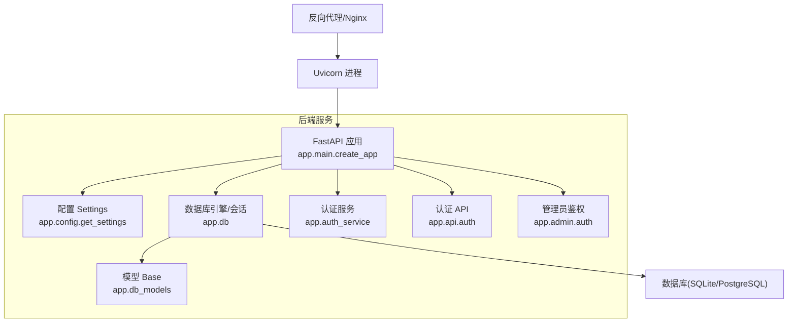
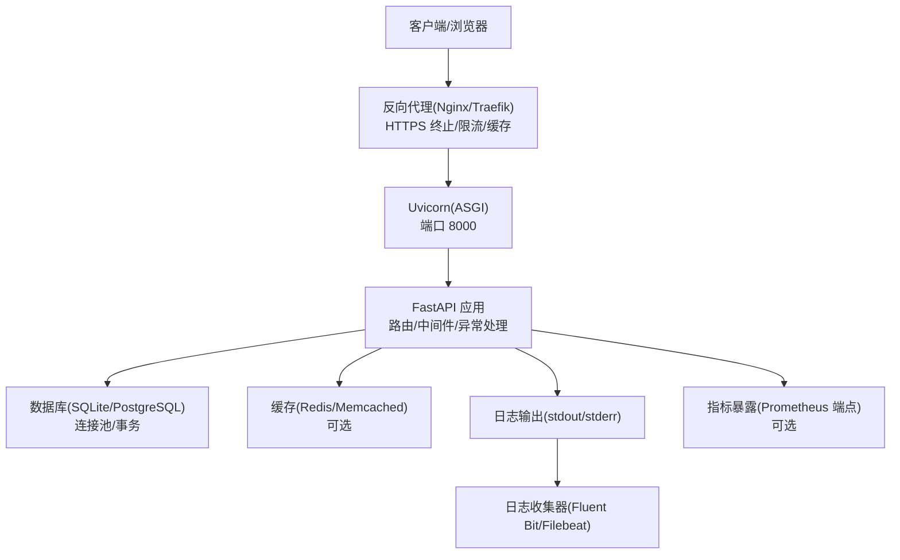
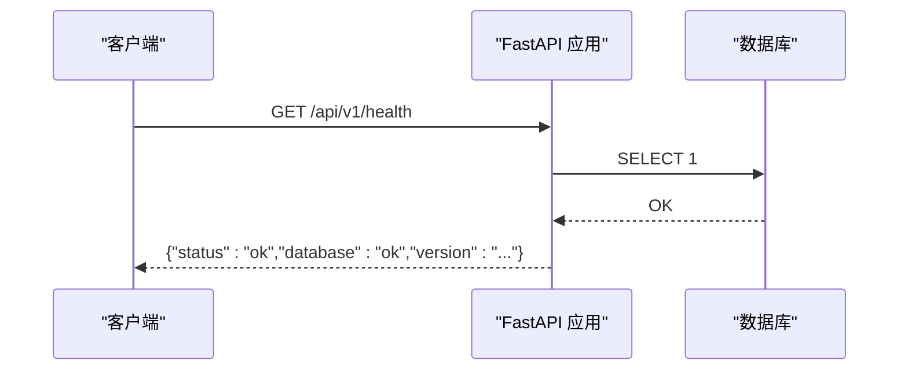
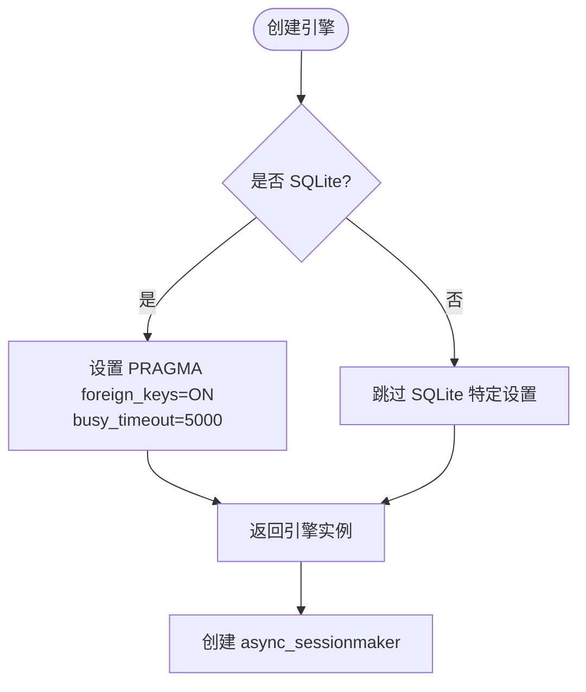
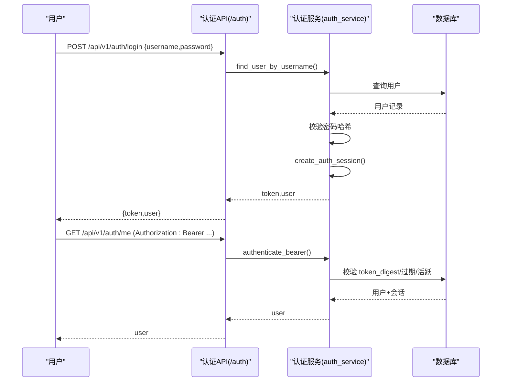
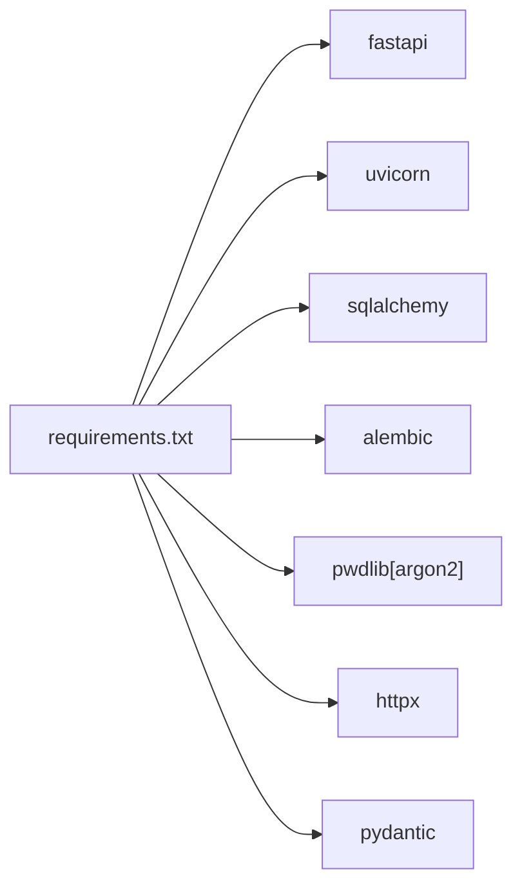

# 生产环境部署

<cite>
**本文引用的文件**   
- [backend/app/config.py](file://backend/app/config.py)
- [backend/app/main.py](file://backend/app/main.py)
- [backend/app/db.py](file://backend/app/db.py)
- [backend/app/auth_service.py](file://backend/app/auth_service.py)
- [backend/app/api/auth.py](file://backend/app/api/auth.py)
- [backend/app/admin/auth.py](file://backend/app/admin/auth.py)
- [backend/app/db_models.py](file://backend/app/db_models.py)
- [backend/alembic.ini](file://backend/alembic.ini)
- [backend/alembic/env.py](file://backend/alembic/env.py)
- [backend/Dockerfile](file://backend/Dockerfile)
- [docker-compose.yml](file://docker-compose.yml)
- [backend/requirements.txt](file://backend/requirements.txt)
</cite>

## 目录
1. [简介](#简介)
2. [项目结构](#项目结构)
3. [核心组件](#核心组件)
4. [架构总览](#架构总览)
5. [详细组件分析](#详细组件分析)
6. [依赖关系分析](#依赖关系分析)
7. [性能考虑](#性能考虑)
8. [故障排查指南](#故障排查指南)
9. [结论](#结论)
10. [附录](#附录)

## 简介
本指南面向运维与平台工程团队，提供澳秘 Macau Mystery 项目在“生产环境”的权威部署与运维手册。内容覆盖：
- 配置管理（环境变量、数据库连接、CORS、演示数据开关）
- 安全加固（认证鉴权、令牌生命周期、管理员访问控制、敏感信息保护）
- 性能优化（数据库引擎与连接池、异步 I/O、静态资源与缓存策略建议）
- 反向代理与负载均衡（Nginx/Traefik 思路）、SSL 证书部署
- 监控指标、日志聚合与错误追踪集成方案
- 容器化与编排（Dockerfile、docker-compose 的生产化改造建议）

说明：当前仓库默认使用 SQLite，生产环境建议迁移至 PostgreSQL；同时需通过反向代理统一入口、启用 HTTPS、集中化日志与可观测性。

## 项目结构
后端采用 FastAPI + SQLAlchemy 异步 ORM，Alembic 做迁移，Uvicorn 作为 ASGI 服务器。前端为 Next.js 应用（不在本次生产部署文档范围内）。关键路径：
- 应用入口与中间件：backend/app/main.py
- 配置中心：backend/app/config.py
- 数据库引擎与会话：backend/app/db.py
- 模型定义：backend/app/db_models.py
- 认证服务与 API：backend/app/auth_service.py, backend/app/api/auth.py
- 管理员鉴权：backend/app/admin/auth.py
- 迁移与环境：backend/alembic.ini, backend/alembic/env.py
- 容器镜像与编排：backend/Dockerfile, docker-compose.yml

**图表来源** 
- [backend/app/main.py:17-107](file://backend/app/main.py#L17-L107)
- [backend/app/config.py:38-76](file://backend/app/config.py#L38-L76)
- [backend/app/db.py:12-27](file://backend/app/db.py#L12-L27)
- [backend/app/db_models.py:20-21](file://backend/app/db_models.py#L20-L21)
- [backend/app/auth_service.py:83-97](file://backend/app/auth_service.py#L83-L97)
- [backend/app/api/auth.py:64-96](file://backend/app/api/auth.py#L64-L96)
- [backend/app/admin/auth.py:8-16](file://backend/app/admin/auth.py#L8-L16)

**章节来源**
- [backend/app/main.py:17-107](file://backend/app/main.py#L17-L107)
- [backend/app/config.py:38-76](file://backend/app/config.py#L38-L76)
- [backend/app/db.py:12-27](file://backend/app/db.py#L12-L27)
- [backend/app/db_models.py:20-21](file://backend/app/db_models.py#L20-L21)
- [backend/Dockerfile:1-13](file://backend/Dockerfile#L1-L13)
- [docker-compose.yml:1-21](file://docker-compose.yml#L1-L21)

## 核心组件
- 配置系统（Settings）
  - 从环境变量读取数据库 URL、CORS 白名单、运行环境、演示数据开关、令牌 TTL、演示账号等。
  - 提供 is_production 判断，用于差异化行为。
- 应用启动与中间件
  - lifespan 钩子在启动时可选执行演示数据初始化（受配置控制）。
  - 注册全局异常处理器（业务错误、请求校验错误），统一返回格式。
  - 挂载 CORS 中间件，允许凭据与指定来源。
- 数据库层
  - 异步引擎创建，SQLite 下开启外键与忙超时；通用 pool_pre_ping 保活。
  - 健康检查接口 /api/v1/health 基于 SELECT 1 探测。
- 认证与授权
  - 用户密码哈希存储、Bearer Token 持久化会话、过期时间由配置控制。
  - 管理员接口额外使用 ADMIN_TOKEN 进行鉴权（开发环境可跳过）。

**章节来源**
- [backend/app/config.py:38-76](file://backend/app/config.py#L38-L76)
- [backend/app/main.py:17-107](file://backend/app/main.py#L17-L107)
- [backend/app/db.py:12-41](file://backend/app/db.py#L12-L41)
- [backend/app/auth_service.py:83-130](file://backend/app/auth_service.py#L83-L130)
- [backend/app/api/auth.py:64-96](file://backend/app/api/auth.py#L64-L96)
- [backend/app/admin/auth.py:8-16](file://backend/app/admin/auth.py#L8-L16)

## 架构总览
下图展示生产环境下典型部署拓扑：外部流量经反向代理（Nginx/Traefik）进入 Uvicorn 进程，再路由到 FastAPI 应用，最终访问数据库。

[本图为概念性架构图，不直接映射具体源码文件]

## 详细组件分析

### 配置与运行时设置（Settings）
- 关键字段
  - database_url：数据库连接串（默认 SQLite）
  - cors_origins：跨域来源列表（逗号分隔）
  - app_env：运行环境（development/production）
  - bootstrap_demo_story / bootstrap_demo_users：是否初始化演示数据
  - auth_token_ttl_hours：令牌有效期（小时）
  - demo_*：演示账号用户名与密码
- 生产建议
  - APP_ENV=production
  - DATABASE_URL 指向高可用数据库（推荐 PostgreSQL）
  - CORS_ORIGINS 仅包含实际域名
  - 关闭演示数据初始化
  - 合理设置 AUTH_TOKEN_TTL_HOURS（如 24~168）

**章节来源**
- [backend/app/config.py:38-76](file://backend/app/config.py#L38-L76)

### 应用启动与中间件
- lifespan：在启动阶段根据配置决定是否导入并执行演示数据初始化（故事与用户）。
- 异常处理：GameError 与 RequestValidationError 统一封装为 error.code/message/details 结构。
- CORS：allow_credentials=True，allow_methods/headers 全放开（生产应收紧）。
- 健康检查：/api/v1/health 返回数据库状态与应用版本。

**图表来源** 
- [backend/app/main.py:98-105](file://backend/app/main.py#L98-L105)
- [backend/app/db.py:35-41](file://backend/app/db.py#L35-L41)

**章节来源**
- [backend/app/main.py:17-107](file://backend/app/main.py#L17-L107)

### 数据库引擎与连接池
- 引擎创建：create_async_engine(database_url, pool_pre_ping=True)
- SQLite 特殊配置：连接事件开启外键约束与 busy_timeout
- 会话工厂：expire_on_commit=False，减少重复加载开销
- 健康检查：check_database() 通过 SELECT 1 验证连通性

**图表来源** 
- [backend/app/db.py:12-27](file://backend/app/db.py#L12-L27)

**章节来源**
- [backend/app/db.py:12-41](file://backend/app/db.py#L12-L41)

### 认证与授权流程
- 登录/注册：校验用户名/密码规则，密码以强哈希存储，成功后生成持久化会话令牌。
- 鉴权：请求头 Authorization: Bearer <token>，服务端校验 token 摘要、过期时间与用户状态。
- 管理员：admin 路由额外校验 ADMIN_TOKEN（开发环境可绕过）。

**图表来源** 
- [backend/app/api/auth.py:64-96](file://backend/app/api/auth.py#L64-L96)
- [backend/app/auth_service.py:83-130](file://backend/app/auth_service.py#L83-L130)

**章节来源**
- [backend/app/api/auth.py:64-96](file://backend/app/api/auth.py#L64-L96)
- [backend/app/auth_service.py:83-130](file://backend/app/auth_service.py#L83-L130)
- [backend/app/admin/auth.py:8-16](file://backend/app/admin/auth.py#L8-L16)

### 模型与迁移
- 模型：Story、StoryVersion、GameSession、GameEvent、SessionClue、User、AuthSession
- 迁移：Alembic 通过 env.py 动态注入 sqlalchemy.url，支持离线/在线模式
- 生产注意：确保 alembic upgrade head 在启动前执行；数据库 URL 与运行环境一致

**章节来源**
- [backend/app/db_models.py:24-160](file://backend/app/db_models.py#L24-L160)
- [backend/alembic/env.py:15-50](file://backend/alembic/env.py#L15-L50)
- [backend/alembic.ini:1-36](file://backend/alembic.ini#L1-L36)

### 容器化与编排
- Dockerfile：基础镜像 python:3.11-slim，安装依赖，暴露 8000，CMD 启动 Uvicorn
- docker-compose：示例中为 development 模式（含 --reload 与 SQLite 卷）
- 生产改造要点：
  - 移除 --reload
  - 使用只读镜像层与最小化依赖
  - 将 .env 或密钥管理接入（Kubernetes Secrets/HashiCorp Vault）
  - 持久化数据卷改为云盘或外部数据库

**章节来源**
- [backend/Dockerfile:1-13](file://backend/Dockerfile#L1-L13)
- [docker-compose.yml:1-21](file://docker-compose.yml#L1-L21)

## 依赖关系分析
- 运行时依赖：FastAPI、Uvicorn、SQLAlchemy、Alembic、OpenAI/ChromaDB/Edge-TTS 等（按需）
- 安全相关：pwdlib（Argon2）、httpx、pydantic
- 测试：pytest、pytest-asyncio

**图表来源** 
- [backend/requirements.txt:1-17](file://backend/requirements.txt#L1-L17)

**章节来源**
- [backend/requirements.txt:1-17](file://backend/requirements.txt#L1-L17)

## 性能考虑
- 数据库
  - 生产建议切换至 PostgreSQL，并配置连接池大小、超时、预编译语句
  - SQLite 仅适合小规模或临时环境；若继续使用，确保并发写入限制与备份策略
- 应用
  - 保持异步 I/O（已使用 aiosqlite/asyncpg）
  - 减少不必要的序列化与对象重建
  - 对热点数据引入缓存（Redis/Memcached），遵循失效策略
- 静态资源
  - 前端构建产物通过 CDN/边缘缓存分发
  - 后端静态音频/图片走对象存储（OSS/S3）+ CDN
- 反向代理
  - Nginx/Traefik 开启 gzip/brotli、HTTP/2、Keep-Alive、连接复用
  - 针对大响应体启用分块传输与限速

[本节为通用指导，不直接分析具体文件]

## 故障排查指南
- 健康检查失败
  - 检查 /api/v1/health 返回 status/degraded 与 database/unavailable
  - 确认数据库连接串、网络可达、权限正确
- 认证失败
  - 检查 Authorization 头格式（Bearer <token>）
  - 核对令牌是否过期、用户是否激活
- 演示数据未初始化
  - 确认 BOOTSTRAP_DEMO_STORY/BOOTSTRAP_DEMO_USERS 与 APP_ENV
  - 查看启动日志是否有迁移错误（alembic upgrade head）
- 管理员接口 401/403
  - 检查 ADMIN_TOKEN 环境变量与请求头
  - 开发环境会跳过校验，生产必须严格校验

**章节来源**
- [backend/app/main.py:98-105](file://backend/app/main.py#L98-L105)
- [backend/app/auth_service.py:100-130](file://backend/app/auth_service.py#L100-L130)
- [backend/app/admin/auth.py:8-16](file://backend/app/admin/auth.py#L8-L16)

## 结论
本指南基于仓库现有实现，给出了生产环境的配置、安全、性能与可观测性的落地建议。建议在上线前完成以下关键项：
- 迁移至 PostgreSQL，完善连接池与备份恢复
- 通过反向代理统一入口，启用 HTTPS 与访问控制
- 集中化日志与指标采集，建立告警与排障流程
- 严格的环境变量与密钥管理，最小权限原则

[本节为总结性内容，不直接分析具体文件]

## 附录

### 环境变量清单（生产）
- APP_ENV：production
- DATABASE_URL：生产数据库连接串（推荐 PostgreSQL）
- CORS_ORIGINS：允许的源（逗号分隔）
- AUTH_TOKEN_TTL_HOURS：令牌有效期（小时）
- BOOTSTRAP_DEMO_STORY：false
- BOOTSTRAP_DEMO_USERS：false
- ADMIN_TOKEN：管理员访问令牌（生产必填）

**章节来源**
- [backend/app/config.py:58-76](file://backend/app/config.py#L58-L76)
- [backend/app/admin/auth.py:6-16](file://backend/app/admin/auth.py#L6-L16)

### 反向代理与 SSL（建议）
- Nginx/Traefik 监听 443，终止 TLS，转发至 8000
- 开启 HTTP/2、Gzip/Brotli、缓存策略
- 限制请求体大小、速率限制、IP 白名单（按业务需要）

[本节为通用指导，不直接分析具体文件]

### 监控与日志（建议）
- 指标：暴露 Prometheus 端点（自定义指标），采集 QPS、延迟、错误率、数据库连接数
- 日志：stdout/stderr 结构化 JSON 输出，使用 Fluent Bit/Filebeat 收集至 ELK/Loki
- 错误追踪：集成 Sentry/开源替代，捕获异常堆栈与上下文

[本节为通用指导，不直接分析具体文件]