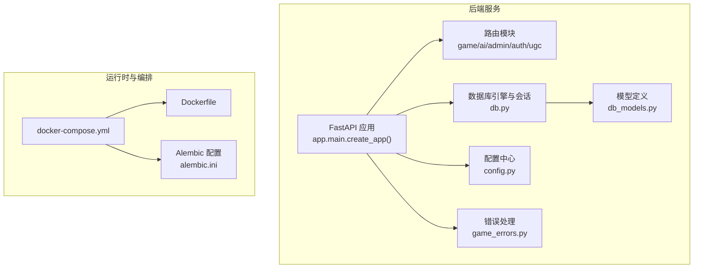
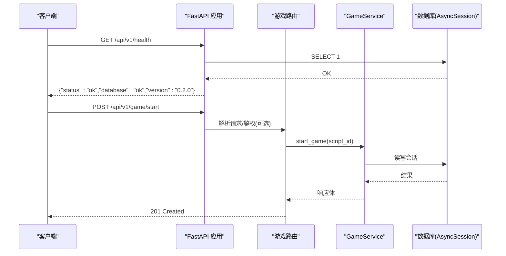
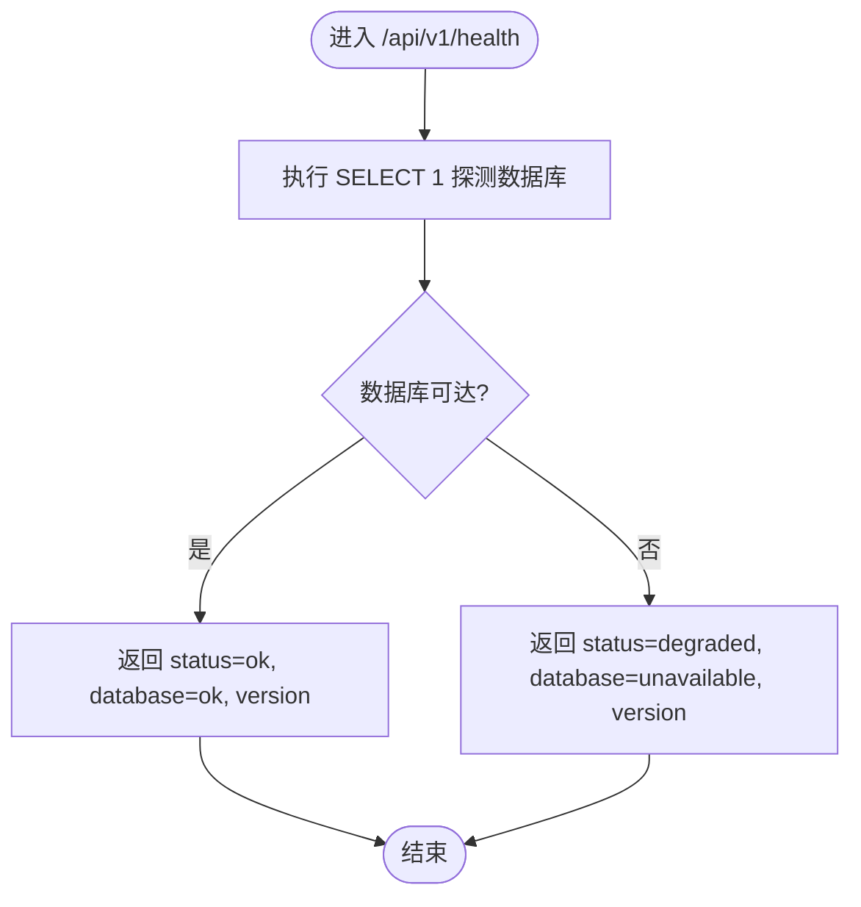
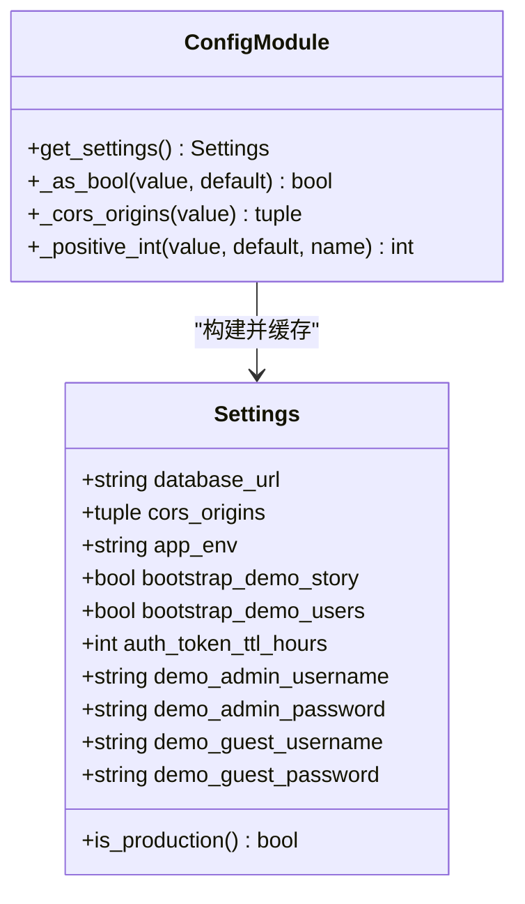
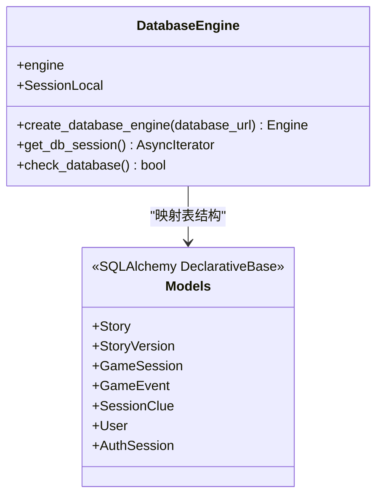
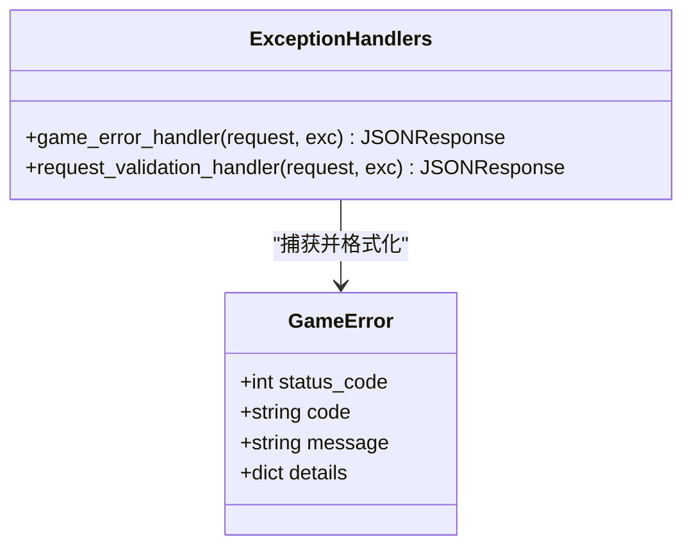
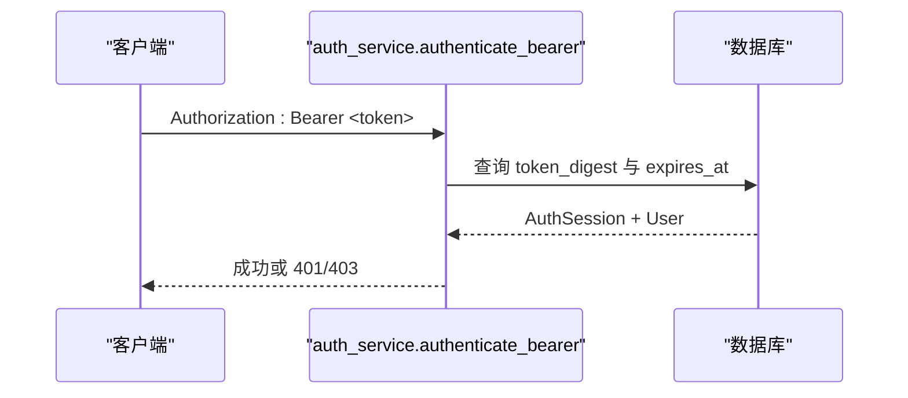
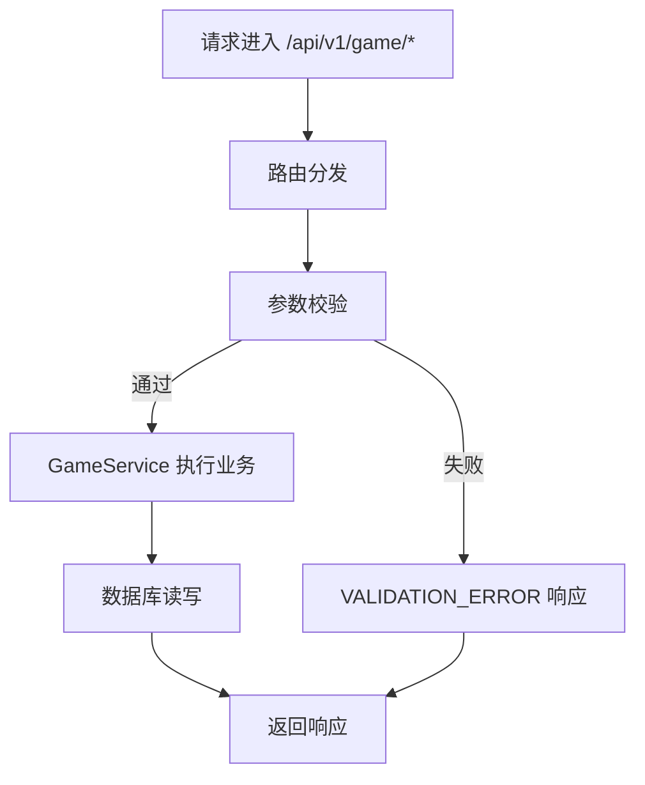
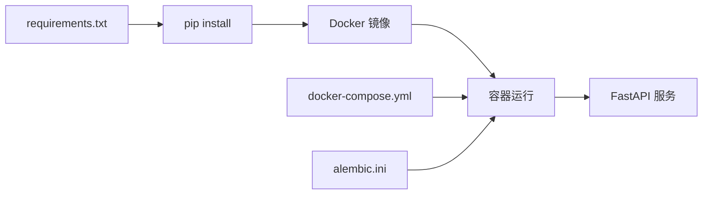

# 监控与运维

<cite>
**本文引用的文件**   
- [backend/app/main.py](file://backend/app/main.py)
- [backend/app/config.py](file://backend/app/config.py)
- [backend/app/db.py](file://backend/app/db.py)
- [backend/app/game_errors.py](file://backend/app/game_errors.py)
- [backend/app/api/game.py](file://backend/app/api/game.py)
- [backend/app/auth_service.py](file://backend/app/auth_service.py)
- [backend/app/db_models.py](file://backend/app/db_models.py)
- [backend/requirements.txt](file://backend/requirements.txt)
- [backend/Dockerfile](file://backend/Dockerfile)
- [docker-compose.yml](file://docker-compose.yml)
- [backend/tests/test_health.py](file://backend/tests/test_health.py)
- [backend/alembic.ini](file://backend/alembic.ini)
</cite>

## 目录
1. [简介](#简介)
2. [项目结构](#项目结构)
3. [核心组件](#核心组件)
4. [架构总览](#架构总览)
5. [详细组件分析](#详细组件分析)
6. [依赖关系分析](#依赖关系分析)
7. [性能考量](#性能考量)
8. [故障排查指南](#故障排查指南)
9. [结论](#结论)
10. [附录](#附录)

## 简介
本指南面向澳秘 Macau Mystery 项目的运维工程师，提供覆盖应用性能监控、系统资源监控、业务指标收集、日志管理、错误追踪与告警、健康检查与服务状态监控、自动恢复机制、数据库备份与迁移、灾难恢复、容量规划与性能调优、常见问题排查的完整方案。文档基于仓库现有代码与配置进行解读，并给出可落地的最佳实践建议。

## 项目结构
后端采用 FastAPI + SQLAlchemy 异步驱动，使用 Alembic 做数据库迁移；通过 Docker 容器化运行，由 docker-compose 编排启动并执行迁移后启动服务。前端为 Next.js 应用（不在本次监控运维范围）。

**图表来源** 
- [backend/app/main.py:17-107](file://backend/app/main.py#L17-L107)
- [backend/app/db.py:12-42](file://backend/app/db.py#L12-L42)
- [backend/app/config.py:38-77](file://backend/app/config.py#L38-L77)
- [backend/app/db_models.py:20-160](file://backend/app/db_models.py#L20-L160)
- [backend/Dockerfile:1-13](file://backend/Dockerfile#L1-L13)
- [docker-compose.yml:1-21](file://docker-compose.yml#L1-L21)
- [backend/alembic.ini:1-37](file://backend/alembic.ini#L1-L37)

**章节来源**
- [backend/app/main.py:17-107](file://backend/app/main.py#L17-L107)
- [docker-compose.yml:1-21](file://docker-compose.yml#L1-L21)

## 核心组件
- 应用入口与健康检查：创建 FastAPI 应用、注册异常处理器、CORS、路由挂载、暴露 /api/v1/health 健康端点，内部调用数据库连通性检查。
- 配置管理：集中读取环境变量，提供 Settings 数据类与缓存访问器，支持 CORS、数据库 URL、演示数据开关、Token TTL 等。
- 数据库层：异步引擎创建、连接池与 SQLite 特殊设置、会话工厂、健康检查 SQL 探测。
- 错误体系：统一的 GameError 异常类型，配合全局异常处理器输出稳定错误结构。
- API 路由：游戏相关接口（开始、选择、查询状态）挂载于 /api/v1/game。
- 认证与会话：用户、密码哈希、Bearer Token 校验、管理员权限校验、演示账号初始化。
- 数据模型：故事、版本、游戏会话、事件、线索、用户与认证会话等持久化实体。

**章节来源**
- [backend/app/main.py:17-107](file://backend/app/main.py#L17-L107)
- [backend/app/config.py:38-77](file://backend/app/config.py#L38-L77)
- [backend/app/db.py:12-42](file://backend/app/db.py#L12-L42)
- [backend/app/game_errors.py:7-20](file://backend/app/game_errors.py#L7-L20)
- [backend/app/api/game.py:12-37](file://backend/app/api/game.py#L12-L37)
- [backend/app/auth_service.py:100-131](file://backend/app/auth_service.py#L100-L131)
- [backend/app/db_models.py:24-160](file://backend/app/db_models.py#L24-L160)

## 架构总览
下图展示请求从客户端进入 FastAPI，经路由到业务服务，再到数据库层的整体流程，以及健康检查路径。

**图表来源** 
- [backend/app/main.py:98-107](file://backend/app/main.py#L98-L107)
- [backend/app/db.py:35-42](file://backend/app/db.py#L35-L42)
- [backend/app/api/game.py:15-21](file://backend/app/api/game.py#L15-L21)

## 详细组件分析

### 健康检查与可用性监控
- 健康端点 /api/v1/health 返回应用版本与数据库状态。当数据库不可用时返回 503 与 degraded 状态，便于负载均衡或探针判定。
- 健康检查通过执行 SELECT 1 验证连接可用性与迁移完整性。
- 测试用例覆盖了健康端点的预期行为，确保在关闭演示数据注入时仍能正确返回。

**图表来源** 
- [backend/app/main.py:98-107](file://backend/app/main.py#L98-L107)
- [backend/app/db.py:35-42](file://backend/app/db.py#L35-L42)
- [backend/tests/test_health.py:9-23](file://backend/tests/test_health.py#L9-L23)

**章节来源**
- [backend/app/main.py:98-107](file://backend/app/main.py#L98-L107)
- [backend/app/db.py:35-42](file://backend/app/db.py#L35-L42)
- [backend/tests/test_health.py:9-23](file://backend/tests/test_health.py#L9-L23)

### 配置与环境变量
- Settings 数据类集中管理数据库 URL、CORS 源、环境标识、演示数据开关、Token TTL、演示账号等。
- get_settings 使用 lru_cache 缓存配置实例，避免重复解析环境变量。
- 默认值与校验逻辑保证开发/生产环境差异可控。

**图表来源** 
- [backend/app/config.py:38-77](file://backend/app/config.py#L38-L77)

**章节来源**
- [backend/app/config.py:38-77](file://backend/app/config.py#L38-L77)

### 数据库与连接管理
- 使用 asyncpg/aiosqlite 异步引擎，启用 pool_pre_ping 提升连接健壮性。
- SQLite 模式下开启外键约束与 busy_timeout，降低并发写入冲突风险。
- SessionLocal 提供异步会话工厂，check_database 用于健康探测。

**图表来源** 
- [backend/app/db.py:12-42](file://backend/app/db.py#L12-L42)
- [backend/app/db_models.py:20-160](file://backend/app/db_models.py#L20-L160)

**章节来源**
- [backend/app/db.py:12-42](file://backend/app/db.py#L12-L42)
- [backend/app/db_models.py:20-160](file://backend/app/db_models.py#L20-L160)

### 错误处理与追踪
- GameError 统一封装状态码、错误码、消息与详情，便于前端与监控系统消费。
- 全局异常处理器将 GameError 与请求校验错误转换为一致的 JSON 结构。
- 建议在外部监控系统中按 error.code 分类统计，结合 request_id 进行链路追踪。

**图表来源** 
- [backend/app/game_errors.py:7-20](file://backend/app/game_errors.py#L7-L20)
- [backend/app/main.py:38-74](file://backend/app/main.py#L38-L74)

**章节来源**
- [backend/app/game_errors.py:7-20](file://backend/app/game_errors.py#L7-L20)
- [backend/app/main.py:38-74](file://backend/app/main.py#L38-L74)

### 认证与会话监控
- Bearer Token 校验包含格式、有效性、过期时间、用户激活状态检查。
- 管理员权限校验通过 require_admin 实现。
- 演示账号初始化在启动阶段按需执行，便于本地调试。

**图表来源** 
- [backend/app/auth_service.py:100-131](file://backend/app/auth_service.py#L100-L131)

**章节来源**
- [backend/app/auth_service.py:100-131](file://backend/app/auth_service.py#L100-L131)

### API 路由与业务指标采集点
- 游戏接口包括开始、选择、查询状态，适合埋点记录 QPS、延迟、错误率、会话生命周期等指标。
- 建议在中间件或路由层增加结构化日志与指标上报（如 Prometheus metrics），以 request_id 关联全链路。

**图表来源** 
- [backend/app/api/game.py:15-37](file://backend/app/api/game.py#L15-L37)

**章节来源**
- [backend/app/api/game.py:15-37](file://backend/app/api/game.py#L15-L37)

## 依赖关系分析
- 运行时依赖：FastAPI、Uvicorn、SQLAlchemy、异步驱动、Alembic、Pydantic、HTTP 客户端等。
- 容器化：Python 3.11 slim 镜像，安装依赖并暴露 8000 端口。
- 编排：docker-compose 指定环境变量、卷挂载、命令执行迁移后启动 Uvicorn。

**图表来源** 
- [backend/requirements.txt:1-17](file://backend/requirements.txt#L1-L17)
- [backend/Dockerfile:1-13](file://backend/Dockerfile#L1-L13)
- [docker-compose.yml:1-21](file://docker-compose.yml#L1-L21)
- [backend/alembic.ini:1-37](file://backend/alembic.ini#L1-L37)

**章节来源**
- [backend/requirements.txt:1-17](file://backend/requirements.txt#L1-L17)
- [backend/Dockerfile:1-13](file://backend/Dockerfile#L1-L13)
- [docker-compose.yml:1-21](file://docker-compose.yml#L1-L21)
- [backend/alembic.ini:1-37](file://backend/alembic.ini#L1-L37)

## 性能考量
- 数据库连接池：启用 pool_pre_ping，SQLite 下设置 busy_timeout，减少锁等待与连接失效问题。
- 配置缓存：get_settings 使用 lru_cache，避免频繁解析环境变量。
- 异步 IO：全程使用异步引擎与会话，提高并发处理能力。
- 建议扩展：
  - 引入 Prometheus 指标导出（QPS、P95/P99 延迟、错误率、连接池使用率）。
  - 接入结构化日志（JSON 格式）并集中收集（如 ELK/Loki）。
  - 对热点接口增加限流与熔断策略。
  - 针对 SQLite 的生产场景评估迁移至 PostgreSQL/MySQL，以获得更好的并发与可靠性。

[本节为通用指导，不直接分析具体文件]

## 故障排查指南
- 健康检查失败：
  - 检查 /api/v1/health 返回是否 503 且 database=unavailable。
  - 确认数据库连接字符串与网络可达性，查看 alembic 迁移是否执行成功。
- 认证失败：
  - 检查 Authorization 头格式是否为 Bearer <token>。
  - 确认 token 未过期且用户处于激活状态。
- 请求校验错误：
  - 关注 VALIDATION_ERROR 的 details 字段，定位 path、message、type。
- 日志与指标：
  - 当前无内置日志框架，建议添加结构化日志与指标上报，便于快速定位问题。
  - 利用 request_id 串联请求链路。

**章节来源**
- [backend/app/main.py:98-107](file://backend/app/main.py#L98-L107)
- [backend/app/auth_service.py:100-131](file://backend/app/auth_service.py#L100-L131)
- [backend/app/main.py:51-74](file://backend/app/main.py#L51-L74)

## 结论
本项目已具备基础的健康检查、错误处理与配置管理能力。为达到生产级监控与运维要求，建议补充结构化日志、指标采集、告警规则、自动化备份与恢复、容量规划与压测流程。通过上述改进，可显著提升系统的可观测性、稳定性与可维护性。

[本节为总结性内容，不直接分析具体文件]

## 附录

### 监控与告警建议清单
- 应用层
  - 健康检查：/api/v1/health 定时探测，失败触发告警。
  - 接口指标：QPS、延迟分位、错误率、超时率。
  - 业务指标：游戏会话创建数、选择次数、完成/放弃率。
- 系统层
  - CPU、内存、磁盘、网络、容器重启次数。
- 数据库层
  - 连接池使用率、慢查询、事务时长、锁等待。
- 告警规则
  - 健康检查连续失败 N 次。
  - 错误率超过阈值。
  - 延迟 P99 超过阈值。
  - 数据库连接池耗尽。

[本节为通用建议，不直接分析具体文件]

### 数据库备份与迁移策略
- 备份策略
  - SQLite：定期拷贝 .db 文件，或使用 WAL 模式与快照工具；生产建议迁移至主备数据库。
  - 备份频率：每日全量 + 每小时增量（WAL 归档）。
- 迁移管理
  - 使用 Alembic 管理版本演进，发布前执行升级脚本并回滚演练。
  - 变更需幂等，避免破坏已有数据。
- 灾难恢复
  - 制定恢复演练计划，明确 RTO/RPO。
  - 准备回滚脚本与数据一致性校验步骤。

**章节来源**
- [backend/alembic.ini:1-37](file://backend/alembic.ini#L1-L37)
- [docker-compose.yml:17-17](file://docker-compose.yml#L17-L17)

### 容量规划与性能调优
- 容量规划
  - 根据峰值 QPS 与平均响应时间估算 CPU/内存需求。
  - 数据库连接池大小与最大并发会话匹配。
- 性能调优
  - 调整 Uvicorn worker 数量与线程数。
  - 数据库索引优化与查询审计。
  - 缓存热点数据（如静态配置、字典表）。

[本节为通用指导，不直接分析具体文件]

### 常见问题排查方法
- 无法连接数据库
  - 检查 DATABASE_URL、网络连通性、权限与迁移状态。
- 认证失败
  - 检查 Token 生成与存储、过期时间、用户状态。
- 接口报错
  - 查看 VALIDATION_ERROR 详情与业务错误码。
- 性能抖动
  - 观察连接池、慢查询、GC 与外部依赖延迟。

**章节来源**
- [backend/app/db.py:35-42](file://backend/app/db.py#L35-L42)
- [backend/app/auth_service.py:100-131](file://backend/app/auth_service.py#L100-L131)
- [backend/app/main.py:51-74](file://backend/app/main.py#L51-L74)