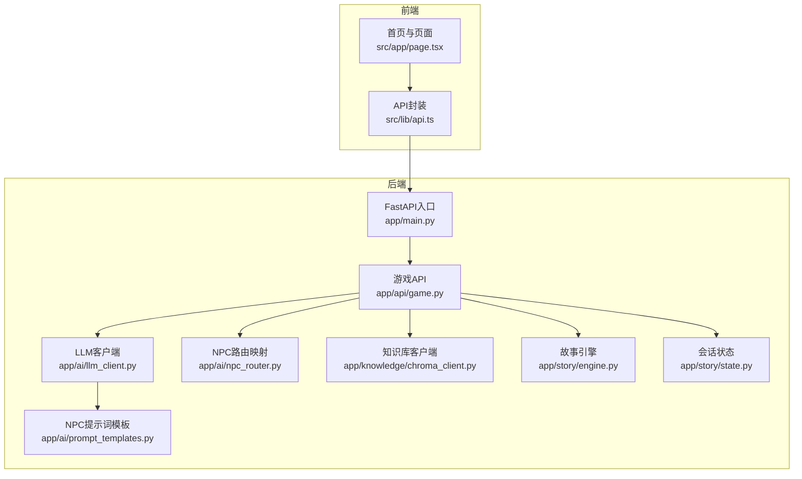
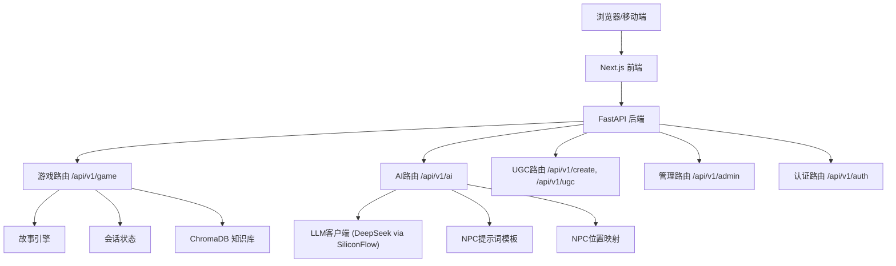
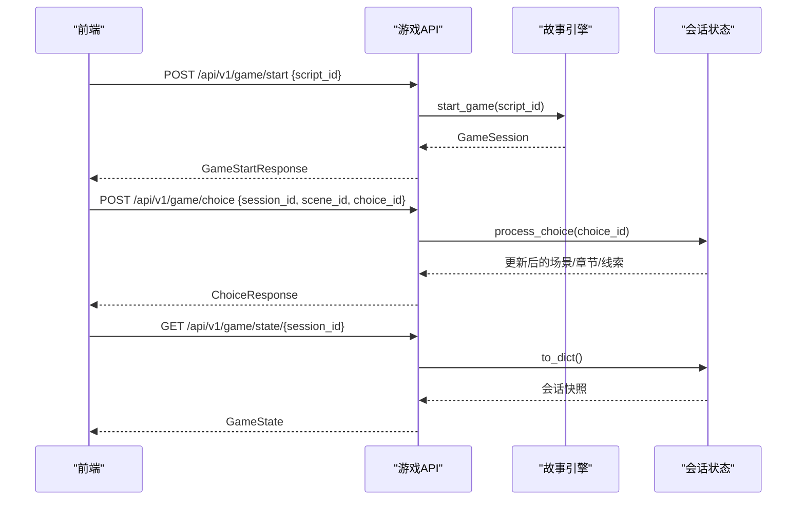
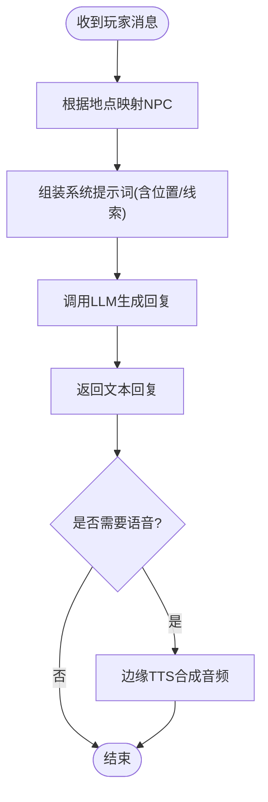
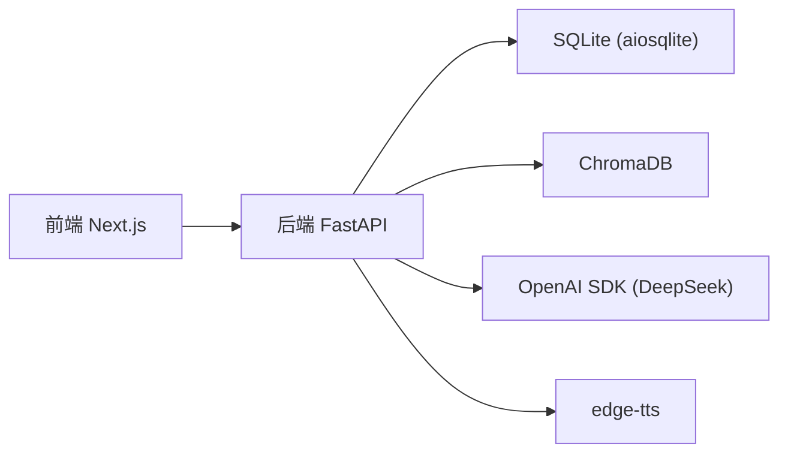

# 项目概述

<cite>
**本文引用的文件**   
- [README.md](file://README.md)
- [docker-compose.yml](file://docker-compose.yml)
- [requirements.txt](file://backend/requirements.txt)
- [main.py](file://backend/app/main.py)
- [config.py](file://backend/app/config.py)
- [game.py](file://backend/app/api/game.py)
- [llm_client.py](file://backend/app/ai/llm_client.py)
- [prompt_templates.py](file://backend/app/ai/prompt_templates.py)
- [npc_router.py](file://backend/app/ai/npc_router.py)
- [chroma_client.py](file://backend/app/knowledge/chroma_client.py)
- [engine.py](file://backend/app/story/engine.py)
- [state.py](file://backend/app/story/state.py)
- [page.tsx](file://frontend/src/app/page.tsx)
- [api.ts](file://frontend/src/lib/api.ts)
</cite>

## 目录
1. [简介](#简介)
2. [项目结构](#项目结构)
3. [核心组件](#核心组件)
4. [架构总览](#架构总览)
5. [详细组件分析](#详细组件分析)
6. [依赖关系分析](#依赖关系分析)
7. [性能考量](#性能考量)
8. [故障排查指南](#故障排查指南)
9. [结论](#结论)
10. [附录：快速开始](#附录快速开始)

## 简介
澳秘 Macau Mystery AI沉浸式剧本杀平台，以“AI NPC对话 + 澳门历史城区探索 + 多结局剧本杀”为核心体验，将传统文化教育与互动叙事深度融合。用户沿澳门历史城区步行路线，通过与不同NPC的对话与选择推进剧情，收集线索、解锁分支，最终走向多种结局。平台同时提供UGC短剧生成与管理后台能力，支持创作者参与内容生产与审核发布。

核心价值主张
- 文化沉浸：以真实历史地标为场景，结合AI NPC讲述与演绎，增强文化感知与学习动机。
- 交互叙事：通过选择驱动的多分支剧情与线索系统，提升参与感与重玩价值。
- 技术赋能：LLM+RAG+TTS构建智能对话与语音反馈，降低内容创作门槛，提高体验质量。
- 开放生态：UGC工具链与审核流程，鼓励社区共创与传播。

目标用户群体
- 游客与本地居民：在游览中获取沉浸式文化体验。
- 学校与教育机构：作为历史文化课程的互动教学工具。
- 内容创作者：使用AI辅助生成剧本与短剧，参与社区分享。

使用场景
- 线下导览：按推荐路线边走边聊边解谜。
- 线上体验：居家或移动设备沉浸式游玩。
- 课堂活动：分组协作完成剧情任务与知识问答。

## 项目结构
项目采用前后端分离架构：
- 前端 Next.js 应用负责页面路由、UI组件、API封装与交互逻辑。
- 后端 FastAPI 应用提供游戏、AI、UGC、认证与管理接口，集成SQLite、ChromaDB与LLM/TTS服务。
- Docker Compose 统一编排后端服务与数据库持久化。

图表来源 
- [main.py:1-111](file://backend/app/main.py#L1-L111)
- [game.py:1-37](file://backend/app/api/game.py#L1-L37)
- [llm_client.py:1-32](file://backend/app/ai/llm_client.py#L1-L32)
- [prompt_templates.py:1-37](file://backend/app/ai/prompt_templates.py#L1-L37)
- [npc_router.py:1-18](file://backend/app/ai/npc_router.py#L1-L18)
- [chroma_client.py:1-19](file://backend/app/knowledge/chroma_client.py#L1-L19)
- [engine.py:1-37](file://backend/app/story/engine.py#L1-L37)
- [state.py:1-54](file://backend/app/story/state.py#L1-L54)
- [page.tsx:1-453](file://frontend/src/app/page.tsx#L1-L453)
- [api.ts:1-216](file://frontend/src/lib/api.ts#L1-L216)

章节来源
- [README.md:1-59](file://README.md#L1-L59)
- [docker-compose.yml:1-21](file://docker-compose.yml#L1-L21)

## 核心组件
- 后端主应用：初始化FastAPI、注册中间件（CORS）、异常处理器（业务错误与请求校验）、挂载各模块路由与健康检查。
- 配置管理：集中读取环境变量，提供数据库URL、CORS源、演示数据开关、Token TTL等设置。
- 游戏API：提供匿名游戏接口，包括开始游戏、做出选择、查询状态。
- AI服务：通过OpenAI兼容接口调用DeepSeek模型，结合NPC提示词模板生成回复；可选TTS语音合成。
- 知识库：基于ChromaDB的向量检索，存储澳门历史文档片段，支撑RAG增强回答。
- 故事引擎：加载JSON剧本，维护会话状态机，处理选择推进与线索奖励。
- 前端页面：展示首页、路线时间线、功能特性，并调用后端API进行游戏与AI交互。

章节来源
- [main.py:1-111](file://backend/app/main.py#L1-L111)
- [config.py:1-77](file://backend/app/config.py#L1-L77)
- [game.py:1-37](file://backend/app/api/game.py#L1-L37)
- [llm_client.py:1-32](file://backend/app/ai/llm_client.py#L1-L32)
- [prompt_templates.py:1-37](file://backend/app/ai/prompt_templates.py#L1-L37)
- [chroma_client.py:1-19](file://backend/app/knowledge/chroma_client.py#L1-L19)
- [engine.py:1-37](file://backend/app/story/engine.py#L1-L37)
- [state.py:1-54](file://backend/app/story/state.py#L1-L54)
- [page.tsx:1-453](file://frontend/src/app/page.tsx#L1-L453)
- [api.ts:1-216](file://frontend/src/lib/api.ts#L1-L216)

## 架构总览
系统由前端Next.js与后端FastAPI组成，后端通过模块化路由组织游戏、AI、UGC、认证与管理功能。AI层整合LLM与RAG，故事引擎驱动剧情推进，知识库提供历史背景增强。Docker Compose统一管理后端运行环境与数据库持久化。

图表来源 
- [main.py:84-96](file://backend/app/main.py#L84-L96)
- [game.py:1-37](file://backend/app/api/game.py#L1-L37)
- [llm_client.py:1-32](file://backend/app/ai/llm_client.py#L1-L32)
- [prompt_templates.py:1-37](file://backend/app/ai/prompt_templates.py#L1-L37)
- [npc_router.py:1-18](file://backend/app/ai/npc_router.py#L1-L18)
- [chroma_client.py:1-19](file://backend/app/knowledge/chroma_client.py#L1-L19)
- [engine.py:1-37](file://backend/app/story/engine.py#L1-L37)
- [state.py:1-54](file://backend/app/story/state.py#L1-L54)

## 详细组件分析

### 后端主应用与配置
- 启动生命周期：根据配置决定是否引导演示数据（剧本与用户），并在数据库未迁移时抛出明确错误。
- 异常处理：自定义GameError与请求校验异常，返回统一错误结构，便于前端解析。
- CORS中间件：允许前端跨域访问，默认包含开发环境地址。
- 健康检查：/api/v1/health返回数据库状态与服务版本。

章节来源
- [main.py:17-106](file://backend/app/main.py#L17-L106)
- [config.py:38-77](file://backend/app/config.py#L38-L77)

### 游戏API与故事引擎
- 游戏API提供三个核心接口：开始游戏、做出选择、查询状态。
- 故事引擎加载JSON剧本，创建会话并维护当前章节与场景索引。
- 会话状态记录已选路径、收集线索与起始时间，支持序列化输出。

图表来源 
- [game.py:15-36](file://backend/app/api/game.py#L15-L36)
- [engine.py:20-36](file://backend/app/story/engine.py#L20-L36)
- [state.py:37-53](file://backend/app/story/state.py#L37-L53)

章节来源
- [game.py:1-37](file://backend/app/api/game.py#L1-L37)
- [engine.py:1-37](file://backend/app/story/engine.py#L1-L37)
- [state.py:1-54](file://backend/app/story/state.py#L1-L54)

### AI服务与NPC对话
- LLM客户端：通过OpenAI兼容接口调用DeepSeek模型，支持温度与最大令牌数控制。
- NPC提示词模板：为每个NPC定义角色设定、说话风格与上下文注入（位置、线索）。
- NPC路由映射：根据地点匹配对应NPC身份与语音音色。

图表来源 
- [llm_client.py:12-31](file://backend/app/ai/llm_client.py#L12-L31)
- [prompt_templates.py:3-36](file://backend/app/ai/prompt_templates.py#L3-L36)
- [npc_router.py:10-17](file://backend/app/ai/npc_router.py#L10-L17)

章节来源
- [llm_client.py:1-32](file://backend/app/ai/llm_client.py#L1-L32)
- [prompt_templates.py:1-37](file://backend/app/ai/prompt_templates.py#L1-L37)
- [npc_router.py:1-18](file://backend/app/ai/npc_router.py#L1-L18)

### 知识库与RAG
- ChromaDB客户端：单例模式维护持久化客户端与集合，用于存储澳门历史文档片段。
- 入库流程：将历史文本切片并嵌入，存入集合以便后续语义检索。
- 使用方式：在游戏或对话中根据上下文检索相关历史片段，增强回答准确性与文化深度。

章节来源
- [chroma_client.py:1-19](file://backend/app/knowledge/chroma_client.py#L1-L19)

### 前端页面与API封装
- 首页：展示标题、标语、功能特性与路线时间线，动态从管理接口获取路线信息。
- API封装：统一请求头（含Authorization）、错误处理与类型定义，覆盖游戏、AI、UGC、管理与认证接口。

章节来源
- [page.tsx:204-453](file://frontend/src/app/page.tsx#L204-L453)
- [api.ts:1-216](file://frontend/src/lib/api.ts#L1-L216)

## 依赖关系分析
- 后端依赖：FastAPI、Uvicorn、SQLAlchemy、Alembic、OpenAI兼容SDK、ChromaDB、edge-tts、Pydantic、HTTPX、测试框架等。
- 前端依赖：Next.js 14、Tailwind CSS、shadcn/ui、Leaflet.js（地图渲染）。
- 运行时：Docker Compose编排后端容器，自动执行数据库迁移并启动服务。

图表来源 
- [requirements.txt:1-17](file://backend/requirements.txt#L1-L17)
- [docker-compose.yml:1-21](file://docker-compose.yml#L1-L21)

章节来源
- [requirements.txt:1-17](file://backend/requirements.txt#L1-L17)
- [docker-compose.yml:1-21](file://docker-compose.yml#L1-L21)

## 性能考量
- 异步I/O：后端使用FastAPI与异步数据库客户端，提升并发处理能力。
- 缓存策略：ChromaDB集合单例减少连接开销；可考虑对热门NPC提示词与知识库结果做内存缓存。
- 流式响应：未来可为LLM与TTS引入流式传输，降低首屏延迟。
- 资源限制：合理设置max_tokens与temperature，避免过长响应与过度随机性。
- 前端优化：按需加载组件与媒体资源，使用懒加载与预取策略提升用户体验。

## 故障排查指南
- 数据库未迁移：启动时报错需先执行alembic升级；健康检查会返回degraded状态。
- 请求校验失败：统一返回VALIDATION_ERROR结构，检查字段类型与必填项。
- LLM调用失败：捕获异常并返回友好提示，检查API Key与网络连通性。
- CORS问题：确认前端域名在白名单内，必要时调整CORS_ORIGINS。
- 演示数据未加载：检查BOOTSTRAP_DEMO_STORY与BOOTSTRAP_DEMO_USERS环境变量。

章节来源
- [main.py:22-34](file://backend/app/main.py#L22-L34)
- [main.py:51-74](file://backend/app/main.py#L51-L74)
- [main.py:98-105](file://backend/app/main.py#L98-L105)
- [config.py:63-68](file://backend/app/config.py#L63-L68)

## 结论
澳秘 Macau Mystery 平台以AI技术与传统文化教育为核心，构建了沉浸式互动叙事体验。通过模块化后端、智能对话与RAG增强、以及丰富的前端交互，实现了从历史探索到多结局剧情的完整闭环。项目具备良好的扩展性与社区共创能力，适合旅游、教育与内容创作等多场景应用。

## 附录：快速开始
环境要求
- Node.js（用于前端）
- Python 3.11（用于后端）
- Docker（可选，用于容器化运行）

安装与启动
- 前端
  - 进入 frontend 目录，安装依赖并启动开发服务器。
  - 访问 http://localhost:3000。
- 后端
  - 进入 backend 目录，创建Python虚拟环境并安装依赖。
  - 启动Uvicorn服务，访问 http://localhost:8000/docs 查看API文档。
- 环境变量
  - 复制 backend/.env.example 为 backend/.env，填入 SiliconFlow API Key。
  - 前端已配置API代理，无需额外配置。

Docker Compose
- 使用 docker-compose.yml 一键启动后端服务，自动执行数据库迁移并监听8000端口。

章节来源
- [README.md:10-34](file://README.md#L10-L34)
- [docker-compose.yml:1-21](file://docker-compose.yml#L1-L21)