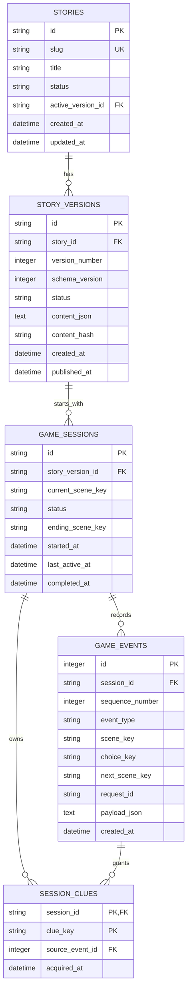

# 沉浸式短剧游戏数据库设计草案

- 文档状态：已确认
- 版本：1.0
- 更新日期：2026-08-03
- 对应需求：`00-requirements-baseline.md` 1.0
- 本阶段只提交设计，不创建数据表或修改业务代码。

## 1. 设计结论

首版采用“版本化剧情 JSON + 关系型游戏进度”的混合存储方式：

- 剧本编写人员继续使用 JSON 描述章节、视频节点、选项、线索和结局规则。
- 后端在发布剧情前验证完整 JSON，并将验证通过的内容保存为不可变版本。
- 玩家会话、选择事件和已获得线索使用关系型数据表持久化。
- 游戏会话始终绑定开始时的剧情版本。即使内容人员后来发布新版本，进行中的游戏也不会突然改变分支。
- 视频文件不写入数据库；剧情 JSON 只保存视频 URL、海报 URL 和必要媒体元数据。

该方案比把每个剧情字段拆成大量数据表更适合当前原型：内容团队已经使用 JSON，没有后台内容编辑器需求，而游戏进度仍然可以可靠查询和恢复。

## 2. 数据关系



## 3. 表结构

### 3.1 `stories`：故事入口

每条记录代表一个独立短剧产品，而不是一次修改版本。

| 字段                  | 类型          | 约束    | 用途                            |
| ------------------- | ----------- | ----- | ----------------------------- |
| `id`                | string/UUID | 主键    | 内部故事标识                        |
| `slug`              | string      | 唯一、非空 | 稳定外部标识，例如 `macau_mystery_01`  |
| `title`             | string      | 非空    | 剧名                            |
| `description`       | text        | 可空    | 简介                            |
| `status`            | string      | 非空    | `draft`、`published`、`retired` |
| `active_version_id` | string/UUID | 可空、外键 | 当前允许新游戏使用的已发布版本               |
| `created_at`        | datetime    | 非空    | 创建时间                          |
| `updated_at`        | datetime    | 非空    | 最近修改时间                        |

约束：只有 `published` 状态的故事可以开始新游戏；`active_version_id` 必须属于当前故事。

### 3.2 `story_versions`：不可变剧情版本

每次正式发布剧情都新增版本，已经发布的版本不原地修改。

| 字段               | 类型          | 约束    | 用途                            |
| ---------------- | ----------- | ----- | ----------------------------- |
| `id`             | string/UUID | 主键    | 版本内部标识                        |
| `story_id`       | string/UUID | 外键、非空 | 所属故事                          |
| `version_number` | integer     | 非空    | 从 1 递增的版本号                    |
| `schema_version` | integer     | 非空    | JSON 数据格式版本，首版为 1             |
| `status`         | string      | 非空    | `draft`、`published`、`retired` |
| `content_json`   | JSON/text   | 非空    | 通过校验的完整剧情图                    |
| `content_hash`   | string      | 非空    | 内容摘要，用于识别重复导入                 |
| `created_at`     | datetime    | 非空    | 导入时间                          |
| `published_at`   | datetime    | 可空    | 发布时间                          |

唯一约束：`(story_id, version_number)` 唯一；同一故事不重复导入相同 `content_hash`。

### 3.3 `game_sessions`：匿名游戏会话

首版不关联用户表。随机 UUID 会话标识由浏览器保存，用于同一浏览器恢复。

| 字段                  | 类型          | 约束    | 用途                               |
| ------------------- | ----------- | ----- | -------------------------------- |
| `id`                | string/UUID | 主键    | 会话标识                             |
| `story_version_id`  | string/UUID | 外键、非空 | 开局时绑定的剧情版本                       |
| `current_scene_key` | string      | 非空    | 当前客户端可播放节点                       |
| `status`            | string      | 非空    | `active`、`completed`、`abandoned` |
| `ending_scene_key`  | string      | 可空    | 最终到达的结局节点                        |
| `started_at`        | datetime    | 非空    | 开局时间                             |
| `last_active_at`    | datetime    | 非空    | 最近操作时间                           |
| `completed_at`      | datetime    | 可空    | 完成时间                             |

章节和景点可以根据 `current_scene_key` 从当前剧情版本解析，不重复写入会话表，避免数据不一致。

### 3.4 `game_events`：选择与状态事件

使用追加式事件记录保留完整路线，首版主要记录 `game_started`、`choice_made`、`clue_granted` 和 `game_completed`。

| 字段                | 类型             | 约束    | 用途                    |
| ----------------- | -------------- | ----- | --------------------- |
| `id`              | integer/bigint | 主键、自增 | 事件标识                  |
| `session_id`      | string/UUID    | 外键、非空 | 所属会话                  |
| `sequence_number` | integer        | 非空    | 会话内严格递增序号             |
| `event_type`      | string         | 非空    | 事件类型                  |
| `scene_key`       | string         | 可空    | 操作发生时的节点              |
| `choice_key`      | string         | 可空    | 用户选择                  |
| `next_scene_key`  | string         | 可空    | 规则解析后的下一可播放节点         |
| `request_id`      | string/UUID    | 可空    | 前端请求幂等标识，防止重复点击产生两次推进 |
| `payload_json`    | JSON/text      | 可空    | 少量扩展信息，不保存完整剧情        |
| `created_at`      | datetime       | 非空    | 事件时间                  |

唯一约束：`(session_id, sequence_number)` 唯一；提供 `request_id` 时，`(session_id, request_id)` 唯一。

### 3.5 `session_clues`：会话已获得线索

线索的标题和说明保存在剧情版本中，此表只记录玩家是否获得。

| 字段                | 类型             | 约束      | 用途             |
| ----------------- | -------------- | ------- | -------------- |
| `session_id`      | string/UUID    | 联合主键、外键 | 所属会话           |
| `clue_key`        | string         | 联合主键    | 剧情 JSON 中的线索标识 |
| `source_event_id` | integer/bigint | 可空、外键   | 发放该线索的事件       |
| `acquired_at`     | datetime       | 非空      | 获得时间           |

联合主键 `(session_id, clue_key)` 保证同一局游戏不会重复获得同一线索。

## 4. 剧情 JSON 运行时结构

数据库中的 `content_json` 仍以 `chapters -> scenes -> choices` 为主要编写结构，但首版需要补齐媒体、入口节点和可校验条件。

```json
{
  "schema_version": 1,
  "story_id": "macau_mystery_01",
  "entry_scene": "prologue_01",
  "chapters": [
    {
      "id": "prologue",
      "title": "第一章",
      "location": "妈阁庙",
      "gps": { "lat": 22.1867, "lng": 113.5318 },
      "scenes": [
        {
          "id": "prologue_01",
          "type": "video",
          "media": {
            "video_url": "https://media.example.com/prologue_01.mp4",
            "poster_url": "https://media.example.com/prologue_01.jpg",
            "mime_type": "video/mp4",
            "duration_ms": 42000
          },
          "choices": [
            {
              "id": "inspect_letter",
              "text": "仔细检查旧信",
              "next_scene": "prologue_02b",
              "grant_clues": ["letter_fragment"]
            }
          ]
        }
      ]
    }
  ],
  "clues": {
    "letter_fragment": {
      "title": "信封内页残字",
      "description": "某年春，自妈阁启程"
    }
  }
}
```

正式数据契约将在下一份交付物中完整定义。首版原则如下：

- `video` 节点供前端播放并包含选项。
- `ending` 节点可以包含结局视频，但不能再包含选项。
- `router` 是后端内部条件路由节点，不返回前端；它可以依据已获得线索选择下一节点。
- 选择可以直接跳转，也可以发放一个或多个线索。
- 条件使用结构化字段，例如 `min_clue_count`、`all_clues`，禁止继续使用 `"clues >= 5"` 这类需要解释执行的字符串表达式。
- 后端解析 `router` 时必须限制最大跳转次数并检测循环，最终只向前端返回 `video` 或 `ending` 节点。

## 5. 发布前校验规则

剧情版本只有通过以下校验才能发布：

1. `story_id`、章节 ID、场景 ID、选项 ID 和线索 ID 符合命名规范。
2. 所有场景 ID 在整个故事内唯一。
3. `entry_scene` 存在且是可播放节点。
4. 每个 `next_scene` 和条件路由目标都真实存在。
5. 每个 `grant_clues` 引用的线索都已定义。
6. `video` 节点包含有效媒体 URL；开发模式可以允许明确标记的占位媒体。
7. `ending` 节点没有选项。
8. 从入口至少可以到达一个结局。
9. 条件路由不存在无法终止的循环。
10. 无法从入口到达的节点作为错误或警告报告给内容人员。
11. 普通视频节点建议提供 2 至 3 个选项，但只作为内容警告，不作为数据库硬约束。

现有 `macau_mystery_01.json` 无法通过第 4、6、8 项校验，因此只能作为初稿参考。

## 6. 一致性与重复请求处理

提交选择时在一个数据库事务中完成：

1. 读取并锁定当前会话状态。
2. 确认会话仍为 `active`。
3. 确认提交的场景就是 `current_scene_key`，防止使用旧页面重复推进。
4. 确认选项属于当前场景且满足线索条件。
5. 写入选择事件和新增线索。
6. 解析条件路由并更新 `current_scene_key`。
7. 如果下一节点是结局，更新会话为 `completed`。
8. 提交事务后返回下一可播放节点。

前端每次选择携带唯一 `request_id`。网络重试相同请求时，后端返回第一次的推进结果，不重复发放线索或推进剧情。

## 7. 暂不建表的内容

第一阶段不创建以下表：

- 用户、密码、登录令牌和跨设备进度表。
- 社区、点赞、投稿、评论和作品审核表。
- AI 生成任务、提示词和模型调用记录表。
- GPS 打卡和实时位置表。
- 视频二进制、视频上传任务和转码任务表。

这些内容不能继续使用新的内存字典伪装成持久化；进入对应阶段时再正式扩展数据库。

## 8. 数据库与部署选择

- 本地开发默认使用 SQLite，匹配现有 `DATABASE_URL` 和依赖。
- SQLAlchemy 模型避免依赖 SQLite 专有语法，为未来切换 PostgreSQL 保留空间。
- 部署环境如果继续使用 SQLite，数据库文件必须放在持久化卷中；否则服务重启或重新部署可能丢失会话。
- 正式视频存放在对象存储或 CDN，数据库和剧情 JSON 仅保存可访问 URL。
- 数据库迁移应使用版本化迁移工具执行，不能在应用启动时反复删除或重建已有表。

## 9. 本阶段评审点

请在进入接口设计和编码前确认：

1. 是否同意剧情仍由 JSON 编写，数据库保存完整的不可变剧情版本，而不把章节、场景和选项全部拆表。
2. 是否同意首版只持久化匿名会话、选择事件和线索，不接入现有登录用户。
3. 是否同意以 `router` 条件节点处理“线索数量或指定线索影响结局”，且该节点不会显示给玩家。
4. 是否同意视频只保存 URL 和元数据，视频文件本身不进入数据库。
